<properties 
	pageTitle="Tutorial do ASP.NET MVC usando o Banco de Dados de Documentos: desenvolvimento de aplicativo Web | Microsoft Azure" 
	description="Tutorial do ASP.NET MVC para criar um aplicativo Web MVC usando o Banco de Dados de Documentos. Você armazenará o JSON e acessará dados de um aplicativo de lista de tarefas pendentes hospedado em sites do Azure ‒ tutorial passo a passo do ASP NET MVC." 
	keywords="tutorial do asp.net mvc, desenvolvimento de aplicativos web, aplicativo web mvc, passo a passo do tutorial do asp net mvc"
	services="documentdb" 
	documentationCenter=".net" 
	authors="ryancrawcour" 
	manager="jhubbard" 
	editor="cgronlun"/>

<tags 
	ms.service="documentdb" 
	ms.workload="data-services" 
	ms.tgt_pltfrm="na" 
	ms.devlang="dotnet" 
	ms.topic="hero-article" 
	ms.date="03/30/2016" 
	ms.author="ryancraw"/>

#Tutorial do ASP.NET MVC: desenvolvimento de aplicativos Web com o Banco de Dados de Documentos

> [AZURE.SELECTOR]
- [.NET](documentdb-dotnet-application.md)
- [Node.js](documentdb-nodejs-application.md)
- [Java](documentdb-java-application.md)
- [Python](documentdb-python-application.md) 

Para destacar como você pode aproveitar com eficiência o Banco de Dados de Documentos do Azure para armazenar e consultar documentos JSON, este artigo fornece um passo a passo completo que mostra como compilar um aplicativo de lista de tarefas pendentes usando o Banco de Dados de Documentos do Azure. As tarefas serão armazenadas como documentos JSON no Banco de Dados de Documentos do Azure.

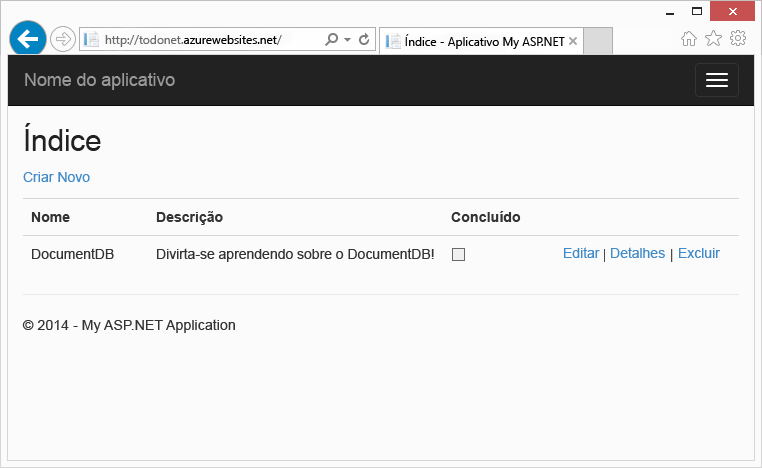

Este passo a passo mostra como usar o serviço Banco de Dados de Documentos fornecido pelo Azure para armazenar e acessar dados por meio de um aplicativo Web ASP.NET MVC hospedado no Azure.

> [AZURE.TIP] Este tutorial pressupõe que você tem experiência anterior com o ASP.NET MVC e com os Sites do Azure. Se estiver começando a usar o ASP.NET ou as [ferramentas que são pré-requisitos](#_Toc395637760), recomendamos baixar o [projeto de exemplo completo do GitHub][] e seguir as instruções nesse exemplo. Depois de compilá-lo, você poderá consultar esse artigo para obter informações sobre o código no contexto do projeto.

## Pré-requisitos para este tutorial de banco de dados

Antes de seguir as instruções deste artigo, verifique se você possui o seguinte:

- Uma conta ativa do Azure. Se você não tiver uma conta, poderá criar uma conta de avaliação gratuita em apenas alguns minutos. Para obter detalhes, consulte [Avaliação gratuita do Azure](https://azure.microsoft.com/pricing/free-trial/).
- [Visual Studio 2013](http://www.visualstudio.com/) Atualização 4 ou mais recente.
- SDK do Azure para .NET versão 2.5.1 ou superior, disponível pelo [Microsoft Web Platform Installer][].

Todas as capturas de tela neste artigo foram feitas usando o Visual Studio 2013 com Atualização 4 aplicada e o SDK do Azure para .NET versão 2.5.1. Se o seu sistema estiver configurado com versões diferentes, será possível que suas telas e opções não correspondam totalmente, mas se você cumprir os pré-requisitos acima, esta solução deverá funcionar.

## Etapa 1: criar uma conta de banco de dados do Banco de Dados de Documentos

Vamos iniciar pela criação de uma conta do Banco de Dados de Documentos. Se você já tiver uma conta, poderá pular para [Criar um novo aplicativo ASP.NET MVC](#_Toc395637762).

[AZURE.INCLUDE [documentdb-create-dbaccount](../../includes/documentdb-create-dbaccount.md)]

[AZURE.INCLUDE [documentdb-keys](../../includes/documentdb-keys.md)]

  Agora vamos abordar como criar um novo aplicativo ASP.NET MVC desde o início.

## Etapa 2: criar um novo aplicativo ASP.NET MVC

Agora que você tem uma conta, vamos criar nosso novo projeto ASP.NET.

1. No Visual Studio, no menu **Arquivo**, aponte para **Novo** e clique em **Projeto**.

   	A caixa de diálogo **Novo Projeto** aparecerá.
2. No painel **Tipos de projeto**, expanda **Modelos**, **Visual C#**, **Web** e selecione **Aplicativo Web ASP.NET**.

  	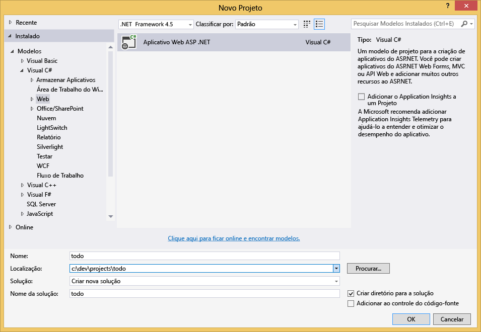

3. Na caixa **Nome**, digite o nome do projeto. Este tutorial usará o nome "todo". Se você optar por usar algum outro nome, sempre que este tutorial falar do namespace todo, será preciso ajustar os exemplos de código fornecidos para usar o nome de seu aplicativo.

4. Clique em **Procurar** para navegar até a pasta na qual você deseja criar o projeto e, em seguida, clique em **OK**.

  	A caixa de diálogo **Novo Projeto ASP.NET** aparecerá.

  	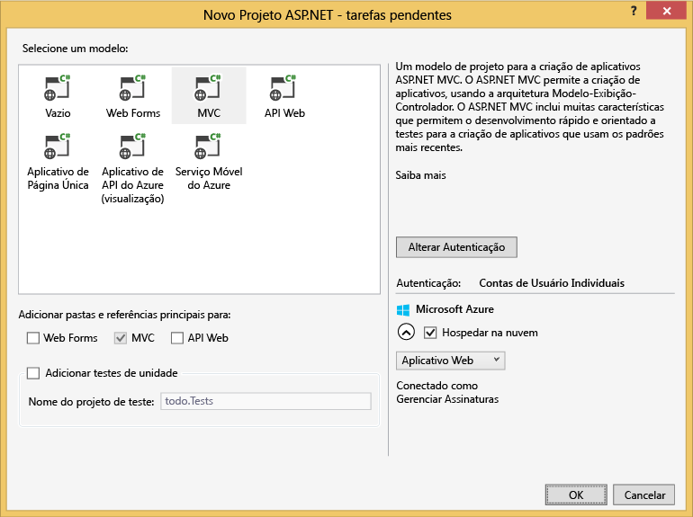

5. No painel de modelos, selecione **MVC**.

6. Se você planeja hospedar seu aplicativo no Azure, selecione **Hospedar na nuvem** na parte inferior direita para que o Azure hospede o aplicativo. Selecionamos hospedar na nuvem e executar o aplicativo hospedado em um Site do Azure. Selecionar essa opção provisionará previamente um Site do Azure para você e tornará muito mais fácil a implantação do aplicativo de trabalho final. Se desejar hospedá-lo em outro local ou não desejar configurar o Azure com antecedência, apenas desmarque **Hospedar na Nuvem**.

7. Clique em **OK** e deixe o Visual Studio fazer isso realizando scaffolding do modelo ASP.NET MVC vazio.

8. Se você optar por hospedá-lo na nuvem, verá pelo menos uma tela adicional pedindo para você fazer logon na conta do Azure e fornecer alguns valores do novo site. Forneça os valores adicionais e continue.

  	Não escolhi "Servidor de banco de dados" aqui porque não estamos usando o Servidor do Banco de Dados SQL do Azure; vamos criar uma nova Conta de Banco de Dados de Documentos do Azure posteriormente no Portal do Azure.

	Para obter mais informações sobre como escolher um **plano do Serviço de Aplicativo** e um **grupo de Recursos**, consulte [Visão geral dos planos de Serviço de Aplicativo do Azure](../app-service/azure-web-sites-web-hosting-plans-in-depth-overview.md).

  	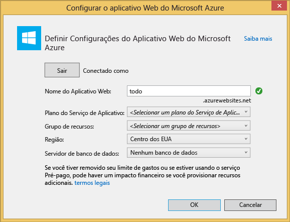

9. Depois que o Visual Studio concluir a criação do aplicativo MVC de texto clichê, você terá um aplicativo ASP.NET vazio que poderá ser executado localmente.

	Vamos ignorar a execução local do projeto porque tenho certeza de que vimos o aplicativo "Hello World" do ASP.NET. Vamos passar direto para a adição do Banco de Dados de Documentos a este projeto e a criação de nosso aplicativo.

## Etapa 3: Adicionar o Banco de Dados de Documentos ao seu projeto de aplicativo Web MVC

Agora que cuidamos da maioria dos detalhes técnicos do ASP.NET MVC necessários para esta solução, vamos para o verdadeiro propósito deste tutorial, que é adicionar o Banco de Dados de Documentos do Azure ao nosso aplicativo Web MVC.

1. O SDK .NET do Banco de Dados de Documentos é distribuído como um pacote NuGet. Para obter o pacote NuGet no Visual Studio, use o gerenciador de pacotes NuGet no Visual Studio ao clicar com o botão direito do mouse no projeto no **Gerenciador de Soluções** e clicar em **Gerenciar Pacotes NuGet**.

  	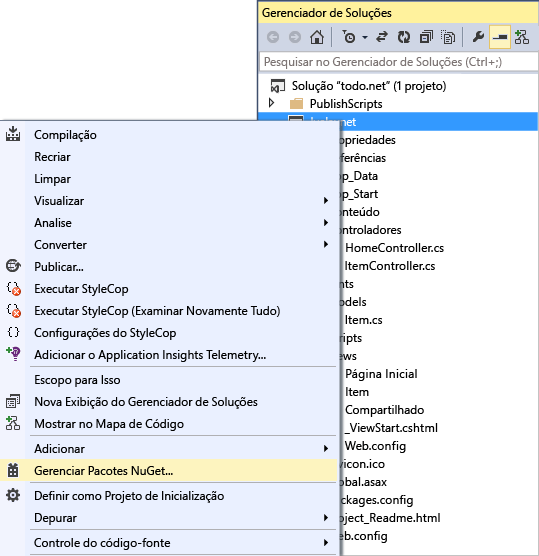

	A caixa de diálogo **Gerenciar Pacotes NuGet** será exibida.

2. Na caixa **Pesquisar Online**, digite ***Banco de Dados de Documentos do Azure***.
	
	Com base nos resultados, instale o pacote da **Biblioteca de Clientes do Banco de Dados de Documentos do Microsoft Azure**. Essa ação baixará e instalará o pacote do Banco de Dados de Documentos, bem como todas as dependências, como Newtonsoft.Json.

  	

  	Como alternativa, você pode usar o Console do Gerenciador de Pacotes para instalar o pacote. Para fazer isso, no menu **Ferramentas**, clique em **Gerenciador de Pacotes NuGet** e em **Console do Gerenciador de Pacotes**. No prompt, digite o seguinte.

		Install-Package Microsoft.Azure.DocumentDB

3. Após o pacote ser instalado, sua solução do Visual Studio deverá se parecer com a seguinte, com duas novas referências adicionadas, Microsoft.Azure.Documents.Client e Newtonsoft.Json.

  	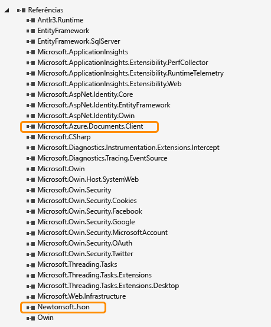

##Etapa 4: configurar o aplicativo ASP.NET MVC
 
Agora vamos adicionar os modelos, as exibições e os controladores a este aplicativo MVC:

- [Adicionar um modelo](#_Toc395637764).
- [Adicionar um controlador](#_Toc395637765).
- [Adicionar exibições](#_Toc395637766).

### Adicionar um modelo de dados JSON

Vamos começar criando o **M** no MVC, o modelo.

1. No **Gerenciador de Soluções**, clique com o botão direito do mouse na pasta **Modelos**, clique em **Adicionar** e em **Classe**.

  	A caixa de diálogo **Adicionar Novo Item** aparecerá.

2. Nomeie a nova classe **Item.cs** e clique em **Adicionar**.

3. Nesse novo arquivo **Item.cs**, adicione o seguinte depois da última *instrução using*.
		
		using Newtonsoft.Json;
	
4. Agora substitua este código
		
		public class Item
		{
		}

	pelo código a seguir.

		public class Item
		{
			[JsonProperty(PropertyName = "id")]
			public string Id { get; set; }
			 
			[JsonProperty(PropertyName = "name")]
			public string Name { get; set; }

			[JsonProperty(PropertyName = "description")]
			public string Description { get; set; }

			[JsonProperty(PropertyName = "isComplete")]
			public bool Completed { get; set; }
		}

	Todos os dados no Banco de Dados de Documentos são transferidos e armazenados como JSON. Para controlar a forma como seus objetos são serializados/desserializados pelo JSON.NET, você pode usar o atributo **JsonProperty**, como demonstrado na classe **Item** criada há pouco. Você não é **obrigado** a fazer isso, mas quero garantir que minhas propriedades sigam as convenções de nomenclatura camelCase de JSON.
	
	Além de poder controlar o formato do nome da propriedade quando ele entra no JSON, você também pode renomear totalmente as propriedades .NET, como fiz com a propriedade **Descrição**.
	

### Adicionar um controlador

Isso cuida do **M**. Agora vamos criar o **C** no MVC, uma classe de controlador.

1. No **Gerenciador de Soluções**, clique com o botão direito do mouse na pasta **Controladores**, clique em **Adicionar** e em **Controlador**.

	A caixa de diálogo **Adicionar Scaffold** aparecerá.

2. Selecione **Controlador MVC 5 - Vazio** e clique em **Adicionar**.

	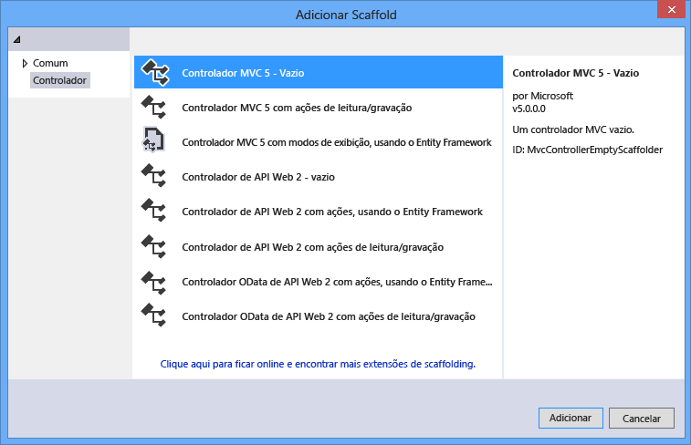

3. Nomeie o novo Controlador, **ItemController.**

	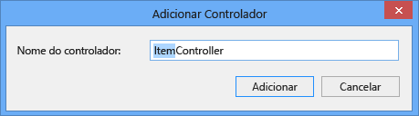

	Após o arquivo ser criado, sua solução do Visual Studio deverá se parecer com a seguinte, com o novo arquivo ItemController.cs no **Gerenciador de Soluções**. O novo arquivo Item.cs criado anteriormente também é mostrado.

	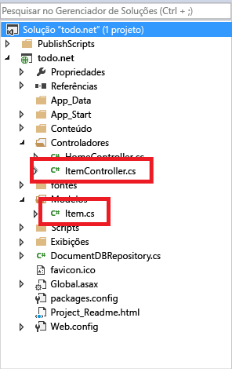

	Você pode fechar ItemController.cs, pois voltaremos a ele mais tarde.

### Adicionar exibições

Agora vamos criar o **V** no MVC, as exibições:

- [Adicionar uma exibição Índice de Itens](#AddItemIndexView).
- [Adicionar uma exibição Novo Item](#AddNewIndexView).
- [Adicionar uma exibição Editar Item](#_Toc395888515).

#### Adicionar uma exibição Índice de Itens

1. No **Gerenciador de Soluções**, expanda a pasta **Exibições**, clique com o botão direito do mouse na pasta vazia **Item** que o Visual criou quando você adicionou **ItemController** anteriormente, clique em **Adicionar** e em **Exibição**.

	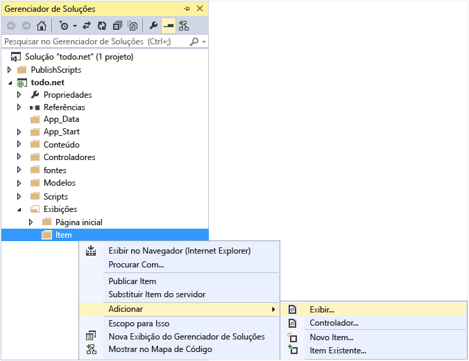

2. Na caixa de diálogo **Adicionar Exibição**, faça o seguinte:
	- Na caixa **Nome da exibição**, digite ***Índice***.
	- Na caixa **Modelo**, selecione ***Lista***.
	- Na caixa **Classe de modelo**, selecione ***Item (todo.Models)***.
	- Deixe a caixa **Classe de contexto de dados** vazia. 
	- Na caixa da página de layout, digite ***~/Views/Shared/\_Layout.cshtml***.
	
	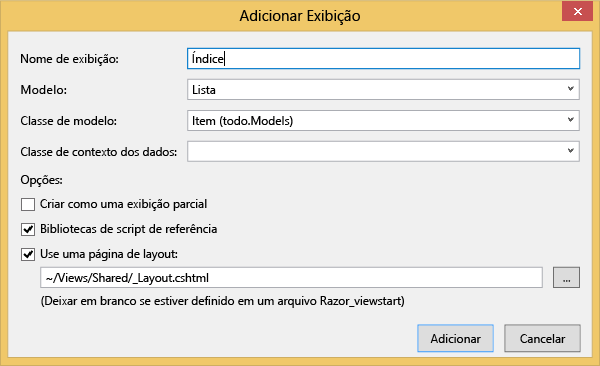

3. Depois de definir todos esses valores, clique em **Adicionar** e deixe o Visual Studio criar uma nova exibição de modelo. Feito isso, o arquivo cshtml criado abrirá. Podemos fechar esse arquivo no Visual Studio, pois voltaremos a ele mais tarde.

#### Adicionar uma exibição Novo Item

Semelhante à criação de uma exibição **Índice de Itens**, criaremos agora uma nova exibição para criar novos **Itens**.

1. No **Gerenciador de Soluções**, clique com o botão direito do mouse novamente na pasta **Item**, clique em **Adicionar** e em **Exibição**.

2. Na caixa de diálogo **Adicionar Exibição**, faça o seguinte:
	- Na caixa **Nome da exibição**, digite ***Criar***.
	- Na caixa **Modelo**, selecione ***Criar***.
	- Na caixa **Classe de modelo**, selecione ***Item (todo.Models)***.
	- Deixe a caixa **Classe de contexto de dados** vazia.
	- Na caixa da página de layout, digite ***~/Views/Shared/\_Layout.cshtml***.
	- Clique em **Adicionar**.

#### Adicionar uma exibição Editar Item

E, por fim, adicione uma última exibição para editar um **Item** da mesma maneira que foi feita antes.

1. No **Gerenciador de Soluções**, clique com o botão direito do mouse novamente na pasta **Item**, clique em **Adicionar** e em **Exibição**.

2. Na caixa de diálogo **Adicionar Exibição**, faça o seguinte:
	- Na caixa **Nome da exibição**, digite ***Editar***.
	- Na caixa **Modelo**, selecione ***Editar***.
	- Na caixa **Classe de modelo**, selecione ***Item (todo.Models)***.
	- Deixe a caixa **Classe de contexto de dados** vazia. 
	- Na caixa da página de layout, digite ***~/Views/Shared/\_Layout.cshtml***.
	- Clique em **Adicionar**.

Feito isso, feche todos os documentos cshtml no Visual Studio, pois voltaremos a essas exibições mais tarde.

## Etapa 5: conectando o Banco de Dados de Documentos

Agora que cuidamos das coisas padrão do MVC, vamos adicionar o código do Banco de Dados de Documentos.

Nesta seção, vamos adicionar código para tratar do seguinte:

- [Listando itens incompletos](#_Toc395637770).
- [Adicionando itens](#_Toc395637771).
- [Editando itens](#_Toc395637772).

### Listando itens incompletos no seu aplicativo Web MVC

A primeira coisa a fazer aqui é adicionar uma classe que contenha toda a lógica para conectar e usar o Banco de Dados de Documentos. Para este tutorial, vamos encapsular toda essa lógica em uma classe de repositório chamada DocumentDBRepository.

1. No **Gerenciador de Soluções**, clique com o botão direito do mouse no projeto, clique em **Adicionar** e em **Classe**. Nomeie a nova classe **DocumentDBRepository** e clique em **Adicionar**.
 
2. Na classe **DocumentDBRepository** recém-criada, adicione as seguintes *instruções using* acima da declaração de *namespace*
		
		using Microsoft.Azure.Documents; 
		using Microsoft.Azure.Documents.Client; 
		using Microsoft.Azure.Documents.Linq; 
		using System.Configuration;
		using System.Linq.Expressions;
		using System.Threading.Tasks;

	Agora substitua este código

		public class DocumentDBRepository
		{
		}

	pelo código a seguir.

		public static class DocumentDBRepository<T> where T : class
		{
			private static readonly string DatabaseId = ConfigurationManager.AppSettings["database"];
			private static readonly string CollectionId = ConfigurationManager.AppSettings["collection"];
			private static DocumentClient client;
	
			public static void Initialize()
			{
				client = new DocumentClient(new Uri(ConfigurationManager.AppSettings["endpoint"]), ConfigurationManager.AppSettings["authKey"]);
				CreateDatabaseIfNotExistsAsync().Wait();
				CreateCollectionIfNotExistsAsync().Wait();
			}
	
			private static async Task CreateDatabaseIfNotExistsAsync()
			{
				try
				{
					await client.ReadDatabaseAsync(UriFactory.CreateDatabaseUri(DatabaseId));
				}
				catch (DocumentClientException e)
				{
					if (e.StatusCode == System.Net.HttpStatusCode.NotFound)
					{
						await client.CreateDatabaseAsync(new Database { Id = DatabaseId });
					}
					else
					{
						throw;
					}
				}
			}
	
			private static async Task CreateCollectionIfNotExistsAsync()
			{
				try
				{
					await client.ReadDocumentCollectionAsync(UriFactory.CreateDocumentCollectionUri(DatabaseId, CollectionId));
				}
				catch (DocumentClientException e)
				{
					if (e.StatusCode == System.Net.HttpStatusCode.NotFound)
					{
						await client.CreateDocumentCollectionAsync(
							UriFactory.CreateDatabaseUri(DatabaseId),
							new DocumentCollection { Id = CollectionId },
							new RequestOptions { OfferThroughput = 1000 });
					}
					else
					{
						throw;
					}
				}
			}
		}

		> [AZURE.TIP] When creating a new DocumentCollection you can supply an optional RequestOptions parameter of OfferType, which allows you to specify the performance level of the new collection. If this parameter is not passed the default offer type will be used. For more on DocumentDB offer types please refer to [DocumentDB Performance Levels](documentdb-performance-levels.md)

3. Estamos lendo alguns valores da configuração, por isso, abra o arquivo **Web.config** de seu aplicativo e adicione as linhas a seguir sob a seção `<AppSettings>`.
	
		<add key="endpoint" value="enter the URI from the Keys blade of the Azure Portal"/>
		<add key="authKey" value="enter the PRIMARY KEY, or the SECONDARY KEY, from the Keys blade of the Azure  Portal"/>
		<add key="database" value="ToDoList"/>
		<add key="collection" value="Items"/>
	
4. Agora atualize os valores de *endpoint* e *authKey* usando a folha Chaves do Portal do Azure. Use o **URI** da folha Chaves como o valor da configuração endpoint e use a **CHAVE PRIMÁRIA** ou a **CHAVE SECUNDÁRIA** da folha Chaves como o valor da configuração authKey.

	Isso trata de conectar o repositório do Banco de Dados de Documentos. Agora, vamos adicionar nossa lógica do aplicativo.

5. A primeira coisa que desejamos fazer com um aplicativo de lista de tarefas é exibir os itens incompletos. Copie e cole o seguinte trecho de código em qualquer lugar na classe **DocumentDBRepository**.

		public static async Task<IEnumerable<T>> GetItemsAsync(Expression<Func<T, bool>> predicate)
		{
			IDocumentQuery<T> query = client.CreateDocumentQuery<T>(
				UriFactory.CreateDocumentCollectionUri(DatabaseId, CollectionId))
				.Where(predicate)
				.AsDocumentQuery();

			List<T> results = new List<T>();
			while (query.HasMoreResults)
			{
				results.AddRange(await query.ExecuteNextAsync<T>());
			}

			return results;
		}

6. Abra o **ItemController** que adicionamos anteriormente e adicione as seguintes *instruções using* acima a declaração de namespace.

		using System.Net;
		using System.Threading.Tasks;
		using todo.Models;

	Se o nome de seu projeto não for "todo", você precisará atualizar usando "todo.Models" de modo a refletir o nome do seu projeto.

	Agora substitua este código

		//GET: Item
		public ActionResult Index()
		{
			return View();
		}

	pelo código a seguir.

		[ActionName("Index")]
		public async Task<ActionResult> IndexAsync()
		{
			var items = await DocumentDBRepository<Item>.GetItemsAsync(d => !d.Completed);
			return View(items);
		}
	
Neste ponto, sua solução deve ser capaz de compilar sem erros.

Se você executou o aplicativo agora, deverá ir para o **HomeController** e para a exibição **Índice** desse controlador. Esse é o comportamento padrão para o projeto do modelo MVC que escolhemos no início, mas não queremos isso! Vamos alterar o roteamento neste aplicativo MVC para alterar seu comportamento.

Abra ***App\_Start\\RouteConfig.cs***, encontre a linha que começa com "defaults:" e altere-a para que se pareça com o seguinte.

		defaults: new { controller = "Item", action = "Index", id = UrlParameter.Optional }

Agora isso informa ao ASP.NET MVC que se você não especificou um valor na URL para controlar o comportamento de roteamento que, em vez de **Home**, usa **Item** como controlador e o usuário **Índice** como exibição.

Agora, se você executar o aplicativo, ele chamará o **ItemController** que chamará a classe de repositório e usará o método GetItems para retornar todos os itens incompletos para a exibição **Exibições**\**Item**\**Índice**.

Se você compilar e executar esse projeto agora, deverá ver algo parecido com isto.

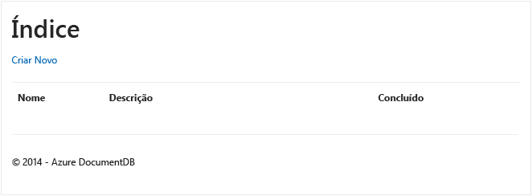

### Adicionando itens

Vamos colocar alguns itens em nosso banco de dados; assim, temos alguma coisa além de uma grade vazia para observar.

Vamos adicionar algum código a DocumentDBRepository e a ItemController para persistir o registro no Banco de Dados de Documentos.

1.  Adicione o seguinte método à classe **DocumentDBRepository**.

		public static async Task<Document> CreateItemAsync(T item)
		{
			return await client.CreateDocumentAsync(UriFactory.CreateDocumentCollectionUri(DatabaseId, CollectionId), item);
		}

	Este método simplesmente pega algum objeto passado para ele e persiste-o no Banco de Dados de Documentos.

2. Abra o arquivo ItemController.cs e adicione o seguinte trecho de código à classe. É assim que o ASP.NET MVC passa a saber o que fazer para a ação **Criar**. Nesse caso, basta renderizar a exibição de Create.cshtml associada criada anteriormente.

		[ActionName("Create")]
		public async Task<ActionResult> CreateAsync()
		{
			return View();
		}

	Agora precisamos colocar mais alguns códigos neste controlador, os quais aceitarão o envio pela exibição **Criar**.

2. Adicione o próximo bloco de código à classe ItemController.cs que diz ao ASP.NET MVC o que fazer com um formulário POST para esse controlador.
	
		[HttpPost]
		[ActionName("Create")]
		[ValidateAntiForgeryToken]
		public async Task<ActionResult> CreateAsync([Bind(Include = "Id,Name,Description,Completed")] Item item)
		{
			if (ModelState.IsValid)
			{
				await DocumentDBRepository<Item>.CreateItemAsync(item);
				return RedirectToAction("Index");
			}

			return View(item);
		}

	Esse código chama o DocumentDBRepository e usa o método CreateItemAsync para manter o novo item de todo no banco de dados.
 
	**Nota de segurança**: O atributo **ValidateAntiForgeryToken** é usado aqui para ajudar a proteger esse aplicativo contra ataques de solicitação entre sites forjada. Há mais do que apenas adicionar esse atributo, as exibições precisam trabalhar com esse token antifalsificação também. Para saber mais sobre o assunto e ver exemplos de como implementar isso corretamente, consulte [Prevenindo solicitação intersite forjada][]. O código-fonte fornecido no [GitHub][] tem a implementação completa estabelecida.

	**Nota de segurança**: Também usamos o atributo **Bind** no parâmetro de método para ajudar na proteção contra ataques de overposting. Para obter mais detalhes, consulte [Basic CRUD Operations in ASP.NET MVC (Operações CRUD básicas no ASP.NET MVC)][].

Isso conclui o código exigido para adicionar novos itens ao nosso banco de dados.

### Editando itens

Existe uma última ação para realizarmos, que é adicionar a capacidade de editar **Itens** no banco de dados e marcá-los como concluídos. A exibição para edição já foi adicionada ao projeto, desse modo, basta adicionar algum código ao nosso Controlador e à classe **DocumentDBRepository** novamente.

1. Adicione o seguinte à classe **DocumentDBRepository**.

		public static async Task<Document> UpdateItemAsync(string id, T item)
		{
			return await client.ReplaceDocumentAsync(UriFactory.CreateDocumentUri(DatabaseId, CollectionId, id), item);
		}

		public static async Task<T> GetItemAsync(string id)
		{
			try
			{
				Document document = await client.ReadDocumentAsync(UriFactory.CreateDocumentUri(DatabaseId, CollectionId, id));
				return (T)(dynamic)document;
			}
			catch (DocumentClientException e)
			{
				if (e.StatusCode == HttpStatusCode.NotFound)
				{
					return null;
				}
				else
				{
					throw;
				}
			}
		}
	
	O primeiro desses métodos, **GetItem**, busca um Item do Banco de Dados de Documentos que é transferido de volta para o **ItemController** e, em seguida, para a exibição **Editar**.
	
	O segundo dos métodos que acabamos de adicionar substitui o **Documento** no Banco de Dados de Documentos pela versão do **Documento** transferido do **ItemController**.

2. Adicione o seguinte à classe **ItemController**.

		[HttpPost]
		[ActionName("Edit")]
		[ValidateAntiForgeryToken]
		public async Task<ActionResult> EditAsync([Bind(Include = "Id,Name,Description,Completed")] Item item)
		{
			if (ModelState.IsValid)
			{
				await DocumentDBRepository<Item>.UpdateItemAsync(item.Id, item);
				return RedirectToAction("Index");
			}

			return View(item);
		}

		[ActionName("Edit")]
		public async Task<ActionResult> EditAsync(string id)
		{
			if (id == null)
			{
				return new HttpStatusCodeResult(HttpStatusCode.BadRequest);
			}

			Item item = await DocumentDBRepository<Item>.GetItemAsync(id);
			if (item == null)
			{
				return HttpNotFound();
			}

			return View(item);
		}
	
	O primeiro método lida com o Http GET que ocorrerá quando o usuário clicar no link **Editar** na exibição **Índice**. Esse método busca um [**Documento**](http://msdn.microsoft.com/library/azure/microsoft.azure.documents.document.aspx) do Banco de Dados de Documentos e o transfere para a exibição **Editar**.

	Em seguida, a exibição **Editar** fará um Http POST para o **IndexController**.
	
	O segundo método que adicionamos lida com isso transferindo objeto atualizado por meio do Banco de Dados de Documentos para que seja persistido no banco de dados.

Ou seja, isso é tudo que precisamos para executar nosso aplicativo, listar **Itens** incompletos, adicionar novos **Itens** e editar **Itens**.

## Etapa 6: executar o aplicativo localmente

Para testar o aplicativo em seu computador local, faça o seguinte:

1. Pressione F5 no Visual Studio para compilar o aplicativo no modo de depuração. Ele deve compilar o aplicativo e iniciar um navegador com a página de grade vazia que vimos anteriormente:

	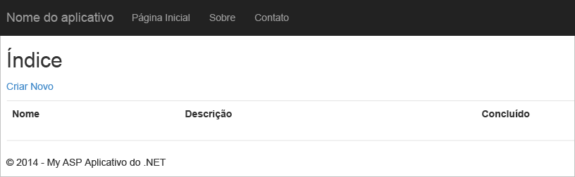

	Se encontrar erros neste ponto, você poderá comparar seu código ao projeto de exemplo no [GitHub][].

2. Clique no link **Criar Novo** e adicione valores ao campos **Nome** e **Descrição**. Deixe a caixa de seleção **Concluído** desmarcada, caso contrário, o novo **Item** será adicionado em um estado concluído e não aparecerá na lista inicial.

	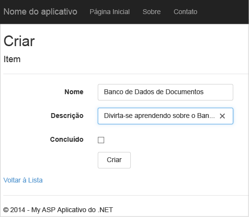

3. Clique em **Criar** e você será redirecionado de volta à exibição **Índice** e seu **Item** aparecerá na lista.

	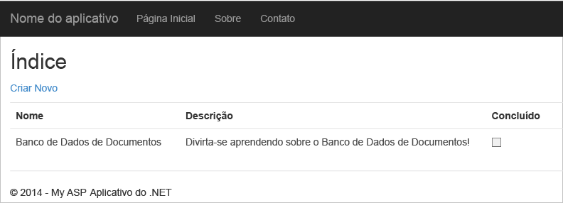

	Fique à vontade para adicionar mais alguns **Itens** à sua lista de tarefas pendentes.

3. Clique em **Editar** perto de um **Item** na lista e você será levado para a exibição **Editar**, na qual poderá atualizar qualquer propriedade do objeto, incluindo o sinalizador **Concluído**. Se você marcar o sinalizador **Concluir** e clicar em **Salvar**, o **Item** será removido da lista de tarefas incompletas.

	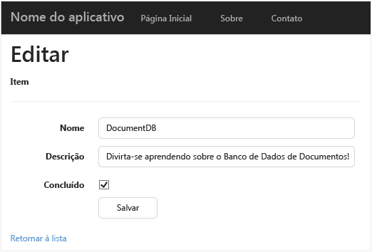

4. Depois de testar o aplicativo, pressione Ctrl + F5 para parar a depuração do aplicativo. Você está pronto para implantar!

##Etapa 7: implantar o aplicativo nos Sites do Azure

Agora que você tem o aplicativo completo funcionando corretamente no Banco de Dados de Documentos, vamos implantar esse aplicativo Web nos Sites do Azure. Se você selecionou **Hospedar na nuvem** ao criar o projeto ASP.NET MVC vazio, o Visual Studio tornará essa ação muito fácil e fará a maior parte do trabalho.

1. Para publicar esse aplicativo, basta clicar com o botão direito do mouse no projeto no **Gerenciador de Soluções** e clicar em **Publicar**.

	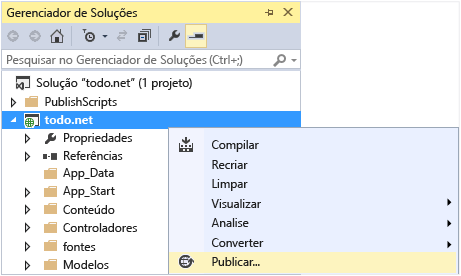

2. Tudo já deve estar configurado de acordo com suas credenciais; na verdade, o site já foi criado no Azure para você na **URL de Destino** mostrada. Basta clicar em **Publicar**.

	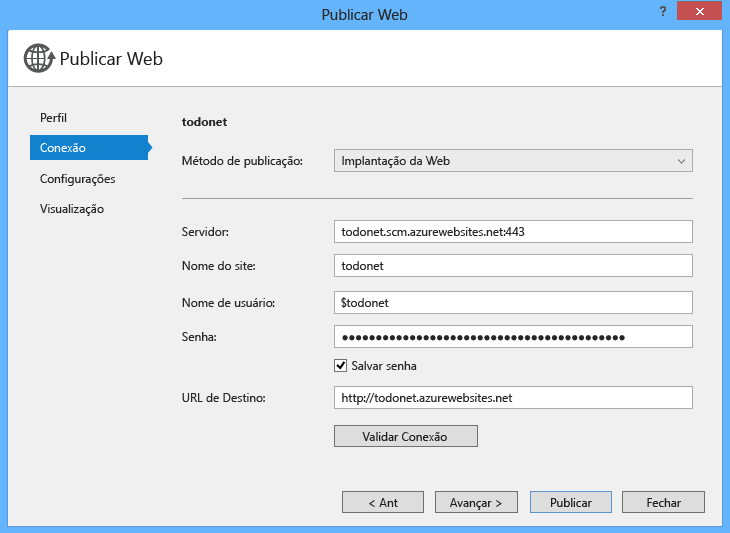

Em poucos segundos, o Visual Studio terminará de publicar seu aplicativo Web e iniciará um navegador no qual você poderá ver seu trabalho sendo executado no Azure!

##Próximas etapas

Parabéns! Você acabou de compilar seu primeiro aplicativo Web ASP.NET MVC usando o Banco de Dados de Documentos do Azure e o publicou nos Sites do Azure. O código-fonte do aplicativo completo, incluindo as funcionalidades de detalhes e de exclusão que não foram incluídas neste tutorial, pode ser baixado ou clonado do [GitHub][]. Portanto, se você estiver interessado em adicioná-las ao seu aplicativo, obtenha o código e adicione-o a esse aplicativo.

Para adicionar outras funcionalidades a seu aplicativo, consulte as APIs disponíveis na [Biblioteca .NET do Banco de Dados de Documentos](https://msdn.microsoft.com/library/azure/dn948556.aspx) e fique à vontade para contribuir com essa biblioteca no [GitHub][].

[*]: https://microsoft.sharepoint.com/teams/DocDB/Shared%20Documents/Documentation/Docs.LatestVersions/PicExportError
[Visual Studio Express]: http://www.visualstudio.com/products/visual-studio-express-vs.aspx
[Microsoft Web Platform Installer]: http://www.microsoft.com/web/downloads/platform.aspx
[Prevenindo solicitação intersite forjada]: http://go.microsoft.com/fwlink/?LinkID=517254
[Basic CRUD Operations in ASP.NET MVC (Operações CRUD básicas no ASP.NET MVC)]: http://go.microsoft.com/fwlink/?LinkId=317598
[GitHub]: https://github.com/Azure-Samples/documentdb-net-todo-app
[projeto de exemplo completo do GitHub]: https://github.com/Azure-Samples/documentdb-net-todo-app

<!---HONumber=AcomDC_0330_2016-->