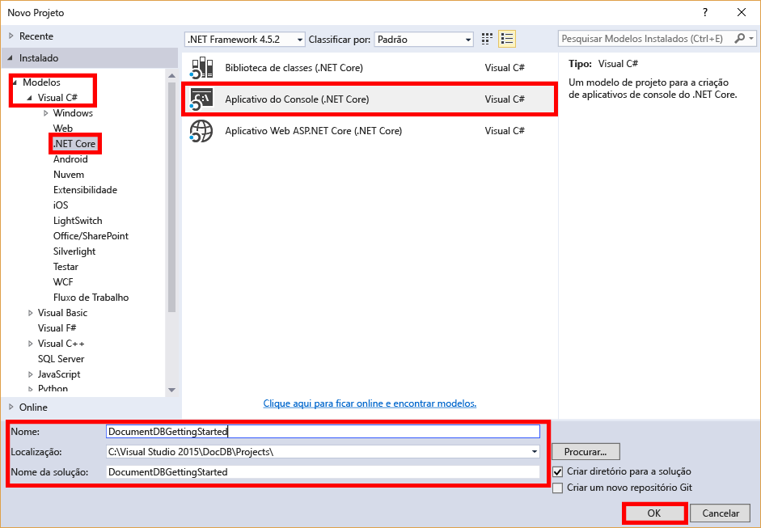
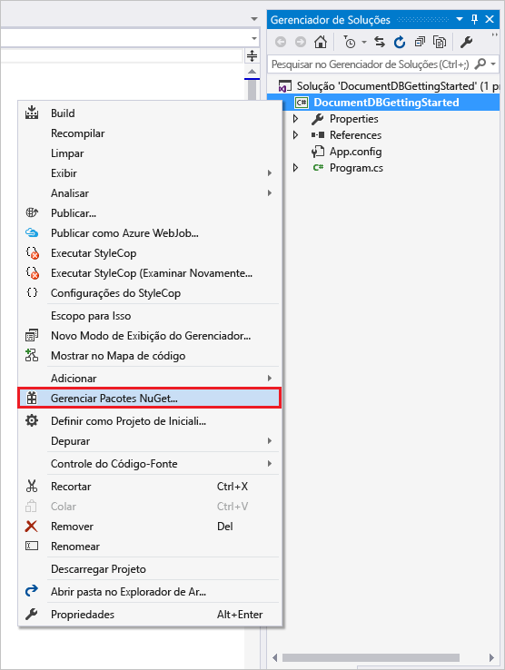
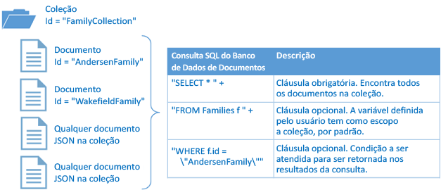

# <a name="azure-cosmos-db-getting-started-with-the-documentdb-api-and-net-core"></a>Azure Cosmos DB: Introdução à API do DocumentDB e ao .NET Core
> [!div class="op_single_selector"]
> * [.NET](documentdb-get-started.md)
> * [.NET Core](documentdb-dotnetcore-get-started.md)
> * [Node.js para MongoDB](documentdb-mongodb-samples.md)
> * [Node.js](documentdb-nodejs-get-started.md)
> * [Java](documentdb-java-get-started.md)
> * [C++](documentdb-cpp-get-started.md)
>  
> 

Bem-vindo(a) ao tutorial de introdução ao Azure Cosmos DB! Após seguir este tutorial, você terá um aplicativo de console que cria e consulta recursos de Banco de Dados de Documentos.

Abordaremos:

* Criar e conectar-se a uma conta do Azure Cosmos DB
* Configurar a sua Solução do Visual Studio
* Criando um banco de dados online
* Criar uma coleção
* Criando documentos JSON
* Consultar a coleção
* Substituição de um documento
* Exclusão de um documento
* Excluir o banco de dados

Você não tem tempo? Não se preocupe! A solução completa está disponível em [GitHub](https://github.com/Azure-Samples/documentdb-dotnet-core-getting-started). Vá para a [seção Obter a solução completa](#GetSolution) a fim de ver as instruções rápidas.

Deseja criar um aplicativo Xamarin iOS, Android ou Forms usando o SDK do .NET Core do DocumentDB? Consulte [Desenvolvendo aplicativos móveis Xamarin com DocumentDB](documentdb-mobile-apps-with-xamarin.md).

Em seguida, use os botões de votação na parte superior ou inferior desta página para nos enviar comentários. Se quiser que entremos em contato com você diretamente, inclua seu endereço de email em seu comentário.

> [!NOTE]
> O SDK do .NET Core do DocumentDB usado neste tutorial ainda não é compatível com aplicativos da Plataforma Universal do Windows (UWP). Para obter uma versão de visualização do SDK do .NET Core que dê suporte a aplicativos UWP, envie um email para [askdocdb@microsoft.com](mailto:askdocdb@microsoft.com).

Agora vamos começar!

## <a name="prerequisites"></a>Pré-requisitos
Certifique-se que você tem o seguinte:

* Uma conta ativa do Azure. Se não tiver uma, você poderá se inscrever em uma [conta gratuita](https://azure.microsoft.com/free/). 
    * Como alternativa, você pode usar o [Emulador do Azure Cosmos DB](documentdb-nosql-local-emulator.md) neste tutorial.
* [Visual Studio 2017](https://www.visualstudio.com/vs/) 
    * Se estiver trabalhando no MacOS ou Linux, você poderá desenvolver aplicativos .NET Core na linha de comando instalando o [SDK .NET Core](https://www.microsoft.com/net/core#macos) para a plataforma de sua escolha. 
    * Se estiver trabalhando no Windows, você poderá desenvolver aplicativos .NET Core na linha de comando instalando o [SDK .NET Core](https://www.microsoft.com/net/core#windows). 
    * Você pode usar seu próprio editor ou baixar o [Visual Studio Code](https://code.visualstudio.com/), que é gratuito e funciona no Windows, Linux e MacOS. 

## <a name="step-1-create-a-documentdb-account"></a>Etapa 1: Criar uma conta do Banco de Dados de Documentos
Vamos criar uma conta do Azure Cosmos DB. Se você já tem uma conta que deseja usar, você pode pular para [Configurar sua solução do Visual Studio](#SetupVS). Se estiver usando o Emulador do Azure Cosmos DB, execute as etapas em [Emulador do Azure Cosmos DB](documentdb-nosql-local-emulator.md) para configurar o emulador e pule para [Configurar sua solução do Visual Studio](#SetupVS).

[!INCLUDE [documentdb-create-dbaccount](../../includes/documentdb-create-dbaccount.md)]

## <a id="SetupVS"></a>Etapa 2: configurar a sua solução do Visual Studio
1. Abra o **Visual Studio 2017** em seu computador.
2. No menu **Arquivo**, selecione **Novo** e depois **Projeto**.
3. Na caixa de diálogo **Novo Projeto**, selecione **Modelos** / **Visual C#** / **.NET Core**/**Aplicativo de Console (.NET Core)**, nomeie o projeto **DocumentDBGettingStarted** e clique em **OK**.

   
4. No **Gerenciador de Solução**, clique com o botão direito em **DocumentDBGettingStarted**.
5. Sem sair do menu, clique em **Gerenciar Pacotes NuGet...**.

   
6. Na guia **Nuget**, clique em **Procurar** na parte superior da janela e digite **azure documentdb** na caixa de pesquisa.
7. Nos resultados, encontre **Microsoft.Azure.DocumentDB.Core** e clique em **Instalar**.
   A ID do pacote para a Biblioteca de Cliente do DocumentDB para .NET Core é [Microsoft.Azure.DocumentDB.Core](https://www.nuget.org/packages/Microsoft.Azure.DocumentDB.Core). Se você estiver visando uma versão do .NET Framework (como net461) que não tem suporte deste pacote do NuGet do .NET Core, use [Microsoft.Azure.DocumentDB](https://www.nuget.org/packages/Microsoft.Azure.DocumentDB), que dá suporte a todas as versões do .NET Framework, a partir do .NET Framework 4.5.
8. Nos prompts, aceite as instalações de pacote do NuGet e o contrato de licença.

Ótimo! Agora que a instalação está concluída, vamos começar a escrever algum código. Você pode encontrar um projeto de código completo deste tutorial no [GitHub](https://github.com/Azure-Samples/documentdb-dotnet-core-getting-started).

## <a id="Connect"></a>Etapa 3: Conectar-se a uma conta do Azure Cosmos DB
Primeiro, adicione essas referências para o início de seu aplicativo C#, no arquivo Program.cs:

```csharp
using System;

// ADD THIS PART TO YOUR CODE
using System.Linq;
using System.Threading.Tasks;
using System.Net;
using Microsoft.Azure.Documents;
using Microsoft.Azure.Documents.Client;
using Newtonsoft.Json;
```

> [!IMPORTANT]
> Para concluir este tutorial, adicione as dependências acima.

Agora, adicione essas duas constantes e sua variável *client* sob sua classe pública *Program*.

```csharp
class Program
{
    // ADD THIS PART TO YOUR CODE
    private const string EndpointUri = "<your endpoint URI>";
    private const string PrimaryKey = "<your key>";
    private DocumentClient client;
```

Em seguida, vá para o [Portal do Azure](https://portal.azure.com) para recuperar o URI e a chave primária. O URI do Banco de Dados de Documentos e a chave primária são necessárias para que seu aplicativo entenda onde deve se conectar e para que o Banco de Dados de Documentos confie na conexão do seu aplicativo.

No Portal do Azure, navegue até sua conta do Azure Cosmos DB e clique em **Chaves**.

Copie o URI do portal e cole-o em `<your endpoint URI>` no arquivo program.cs. Em seguida, copie a CHAVE PRIMÁRIA do portal e cole-a em `<your key>`. Se estiver usando o Emulador do Azure Cosmos DB, use `https://localhost:8081` como o ponto de extremidade e a chave de autorização bem definida de [Como desenvolver usando o Emulador do Azure Cosmos DB](documentdb-nosql-local-emulator.md). Lembre-se de remover o < e > , mas deixe as aspas duplas ao redor do ponto de extremidade e da chave.

![Captura de tela do Portal do Azure usado pelo tutorial do NoSQL para criar um aplicativo de console em C#. Mostra uma conta do Banco de Dados de Documentos com o hub ATIVO realçado, o botão CHAVES realçado na folha da conta do Banco de Dados de Documentos e os valores de URI, de CHAVE PRIMÁRIA e de CHAVE SECUNDÁRIA realçados na folha Chaves][keys]

Iniciaremos o aplicativo de introdução criando uma nova instância de **DocumentClient**.

Abaixo do método **Main**, adicione esta nova tarefa assíncrona denominada **GetStartedDemo**, que criará uma instância do nosso novo **DocumentClient**.

```csharp
static void Main(string[] args)
{
}

// ADD THIS PART TO YOUR CODE
private async Task GetStartedDemo()
{
    this.client = new DocumentClient(new Uri(EndpointUri), PrimaryKey);
}
```

Adicione o código a seguir para executar a tarefa assíncrona a partir do seu método **Main** . O método **Main** capturará as exceções e as gravará no console.

```csharp
static void Main(string[] args)
{
        // ADD THIS PART TO YOUR CODE
        try
        {
                Program p = new Program();
                p.GetStartedDemo().Wait();
        }
        catch (DocumentClientException de)
        {
                Exception baseException = de.GetBaseException();
                Console.WriteLine("{0} error occurred: {1}, Message: {2}", de.StatusCode, de.Message, baseException.Message);
        }
        catch (Exception e)
        {
                Exception baseException = e.GetBaseException();
                Console.WriteLine("Error: {0}, Message: {1}", e.Message, baseException.Message);
        }
        finally
        {
                Console.WriteLine("End of demo, press any key to exit.");
                Console.ReadKey();
        }
```

Pressione o botão **DocumentDBGettingStarted** para compilar e executar o aplicativo.

Parabéns! Você se conectou a uma conta do Azure Cosmos DB. Agora, vamos conferir como trabalhar com recursos do Azure Cosmos DB.  

## <a name="step-4-create-a-database"></a>Etapa 4: criar um banco de dados
Antes de adicionar o código para criar um banco de dados, adicione um método auxiliar para gravar no console.

Copie e cole o método **WriteToConsoleAndPromptToContinue** sob o método **GetStartedDemo**.

```csharp
// ADD THIS PART TO YOUR CODE
private void WriteToConsoleAndPromptToContinue(string format, params object[] args)
{
        Console.WriteLine(format, args);
        Console.WriteLine("Press any key to continue ...");
        Console.ReadKey();
}
```

Seu [banco de dados](documentdb-resources.md#databases) do DocumentDB pode ser criado usando o método [CreateDatabaseAsync](https://msdn.microsoft.com/library/microsoft.azure.documents.client.documentclient.createdatabaseasync.aspx) da classe **DocumentClient**. Um banco de dados é o contêiner lógico de armazenamento de documentos JSON particionado em coleções.

Copie e cole o código a seguir no seu método **GetStartedDemo** embaixo da criação do cliente. Isso criará um banco de dados denominado *FamilyDB*.

```csharp
private async Task GetStartedDemo()
{
    this.client = new DocumentClient(new Uri(EndpointUri), PrimaryKey);

    // ADD THIS PART TO YOUR CODE
    await this.client.CreateDatabaseIfNotExistsAsync(new Database { Id = "FamilyDB_oa" });
```

Pressione o botão **DocumentDBGettingStarted** para executar seu aplicativo.

Parabéns! Você criou um banco de dados do Azure Cosmos DB com êxito.  

## <a id="CreateColl"></a>Etapa 5: Criar uma coleção
> [!WARNING]
> **CreateDocumentCollectionAsync** criará uma nova coleção com uma taxa de transferência reservada, que tem implicações de preço. Para obter mais detalhes, visite a nossa [página de preços](https://azure.microsoft.com/pricing/details/documentdb/).

É possível criar uma [coleção](documentdb-resources.md#collections) usando o método [CreateDocumentCollectionAsync](https://msdn.microsoft.com/library/microsoft.azure.documents.client.documentclient.createdocumentcollectionasync.aspx) da classe **DocumentClient**. Uma coleção é um contêiner de documentos JSON e uma lógica de aplicativo JavaScript associada.

Copie e cole o código a seguir no seu método **GetStartedDemo** sob a criação do banco de dados. Isso criará uma coleção de documentos denominada *FamilyCollection_oa*.

```csharp
    this.client = new DocumentClient(new Uri(EndpointUri), PrimaryKey);

    await this.CreateDatabaseIfNotExists("FamilyDB_oa");

    // ADD THIS PART TO YOUR CODE
    await this.client.CreateDocumentCollectionIfNotExistsAsync(UriFactory.CreateDatabaseUri("FamilyDB_oa"), new DocumentCollection { Id = "FamilyCollection_oa" });
```

Pressione o botão **DocumentDBGettingStarted** para executar seu aplicativo.

Parabéns! Você criou uma coleção de documentos do Azure Cosmos DB com êxito.  

## <a id="CreateDoc"></a>Etapa 6: Criar documentos JSON
Um [documento](documentdb-resources.md#documents) pode ser criado usando o método [CreateDocumentAsync](https://msdn.microsoft.com/library/microsoft.azure.documents.client.documentclient.createdocumentasync.aspx) da classe **DocumentClient**. Os documentos são conteúdo JSON (arbitrário) definido pelo usuário. Agora podemos inserir um ou mais documentos. Se já tiver dados que gostaria de armazenar em seu banco de dados, você pode usar a [ferramenta de Migração de Dados](documentdb-import-data.md)do Banco de Dados de Documentos.

Primeiro, precisamos criar uma classe **Family** que representará os objetos armazenados no Azure Cosmos DB neste exemplo. Também criaremos as subclasses **Parent**, **Child**, **Pet** e **Address** que são usadas em **Family**. Observe que os documentos devem ter uma propriedade **Id** serializada como **id** em JSON. Crie essas classes, adicionando as seguintes subclasses internas após o método **GetStartedDemo** .

Copie e cole as classes **Family**, **Parent**, **Child**, **Pet** e **Address** sob o método **WriteToConsoleAndPromptToContinue**.

```csharp
private void WriteToConsoleAndPromptToContinue(string format, params object[] args)
{
    Console.WriteLine(format, args);
    Console.WriteLine("Press any key to continue ...");
    Console.ReadKey();
}

// ADD THIS PART TO YOUR CODE
public class Family
{
    [JsonProperty(PropertyName = "id")]
    public string Id { get; set; }
    public string LastName { get; set; }
    public Parent[] Parents { get; set; }
    public Child[] Children { get; set; }
    public Address Address { get; set; }
    public bool IsRegistered { get; set; }
    public override string ToString()
    {
            return JsonConvert.SerializeObject(this);
    }
}

public class Parent
{
    public string FamilyName { get; set; }
    public string FirstName { get; set; }
}

public class Child
{
    public string FamilyName { get; set; }
    public string FirstName { get; set; }
    public string Gender { get; set; }
    public int Grade { get; set; }
    public Pet[] Pets { get; set; }
}

public class Pet
{
    public string GivenName { get; set; }
}

public class Address
{
    public string State { get; set; }
    public string County { get; set; }
    public string City { get; set; }
}
```

Copie e cole o método **CreateFamilyDocumentIfNotExists** sob o método **CreateDocumentCollectionIfNotExists**.

```csharp
// ADD THIS PART TO YOUR CODE
private async Task CreateFamilyDocumentIfNotExists(string databaseName, string collectionName, Family family)
{
    try
    {
        await this.client.ReadDocumentAsync(UriFactory.CreateDocumentUri(databaseName, collectionName, family.Id));
        this.WriteToConsoleAndPromptToContinue("Found {0}", family.Id);
    }
    catch (DocumentClientException de)
    {
        if (de.StatusCode == HttpStatusCode.NotFound)
        {
            await this.client.CreateDocumentAsync(UriFactory.CreateDocumentCollectionUri(databaseName, collectionName), family);
            this.WriteToConsoleAndPromptToContinue("Created Family {0}", family.Id);
        }
        else
        {
            throw;
        }
    }
}
```

Insira dois documentos, um para a Família Martins e um para a Família Barros.

Copie e cole o código a seguir `// ADD THIS PART TO YOUR CODE` em seu método **GetStartedDemo** embaixo da criação da coleção de documentos.

```csharp
await this.CreateDatabaseIfNotExists("FamilyDB_oa");

await this.CreateDocumentCollectionIfNotExists("FamilyDB_oa", "FamilyCollection_oa");

// ADD THIS PART TO YOUR CODE
Family andersenFamily = new Family
{
        Id = "Andersen.1",
        LastName = "Andersen",
        Parents = new Parent[]
        {
                new Parent { FirstName = "Thomas" },
                new Parent { FirstName = "Mary Kay" }
        },
        Children = new Child[]
        {
                new Child
                {
                        FirstName = "Henriette Thaulow",
                        Gender = "female",
                        Grade = 5,
                        Pets = new Pet[]
                        {
                                new Pet { GivenName = "Fluffy" }
                        }
                }
        },
        Address = new Address { State = "WA", County = "King", City = "Seattle" },
        IsRegistered = true
};

await this.CreateFamilyDocumentIfNotExists("FamilyDB_oa", "FamilyCollection_oa", andersenFamily);

Family wakefieldFamily = new Family
{
        Id = "Wakefield.7",
        LastName = "Wakefield",
        Parents = new Parent[]
        {
                new Parent { FamilyName = "Wakefield", FirstName = "Robin" },
                new Parent { FamilyName = "Miller", FirstName = "Ben" }
        },
        Children = new Child[]
        {
                new Child
                {
                        FamilyName = "Merriam",
                        FirstName = "Jesse",
                        Gender = "female",
                        Grade = 8,
                        Pets = new Pet[]
                        {
                                new Pet { GivenName = "Goofy" },
                                new Pet { GivenName = "Shadow" }
                        }
                },
                new Child
                {
                        FamilyName = "Miller",
                        FirstName = "Lisa",
                        Gender = "female",
                        Grade = 1
                }
        },
        Address = new Address { State = "NY", County = "Manhattan", City = "NY" },
        IsRegistered = false
};

await this.CreateFamilyDocumentIfNotExists("FamilyDB_oa", "FamilyCollection_oa", wakefieldFamily);
```

Pressione o botão **DocumentDBGettingStarted** para executar seu aplicativo.

Parabéns! Você criou dois documentos do Azure Cosmos DB com êxito.  


## <a id="Query"></a>Etapa 7: Consultar recursos do Azure Cosmos DB
O Azure Cosmos DB tem suporte para [consultas](documentdb-sql-query.md) avançadas de documentos JSON armazenados em cada coleção.  O exemplo de código a seguir mostra diversas consultas - usando a sintaxe SQL do Azure Cosmos DB bem como o LINQ - que podem ser realizadas nos documentos que inserimos na etapa anterior.

Copie e cole o método **ExecuteSimpleQuery** sob seu método **CreateFamilyDocumentIfNotExists**.

```csharp
// ADD THIS PART TO YOUR CODE
private void ExecuteSimpleQuery(string databaseName, string collectionName)
{
    // Set some common query options
    FeedOptions queryOptions = new FeedOptions { MaxItemCount = -1 };

        // Here we find the Andersen family via its LastName
        IQueryable<Family> familyQuery = this.client.CreateDocumentQuery<Family>(
                UriFactory.CreateDocumentCollectionUri(databaseName, collectionName), queryOptions)
                .Where(f => f.LastName == "Andersen");

        // The query is executed synchronously here, but can also be executed asynchronously via the IDocumentQuery<T> interface
        Console.WriteLine("Running LINQ query...");
        foreach (Family family in familyQuery)
        {
            Console.WriteLine("\tRead {0}", family);
        }

        // Now execute the same query via direct SQL
        IQueryable<Family> familyQueryInSql = this.client.CreateDocumentQuery<Family>(
                UriFactory.CreateDocumentCollectionUri(databaseName, collectionName),
                "SELECT * FROM Family WHERE Family.LastName = 'Andersen'",
                queryOptions);

        Console.WriteLine("Running direct SQL query...");
        foreach (Family family in familyQueryInSql)
        {
                Console.WriteLine("\tRead {0}", family);
        }

        Console.WriteLine("Press any key to continue ...");
        Console.ReadKey();
}
```

Copie e cole o código a seguir no seu método **GetStartedDemo** embaixo da segunda criação de documento.

```csharp
await this.CreateFamilyDocumentIfNotExists("FamilyDB_oa", "FamilyCollection_oa", wakefieldFamily);

// ADD THIS PART TO YOUR CODE
this.ExecuteSimpleQuery("FamilyDB_oa", "FamilyCollection_oa");
```

Pressione o botão **DocumentDBGettingStarted** para executar seu aplicativo.

Parabéns! Você consultou uma coleção do Azure Cosmos DB com êxito.

O diagrama a seguir ilustra como a sintaxe da consulta SQL do Azure Cosmos DB é chamada em relação à coleção que você criou, e a mesma lógica se aplica à consulta LINQ.



A palavra-chave [FROM](documentdb-sql-query.md#FromClause) é opcional na consulta, pois as consultas do Banco de Dados de Documentos já têm o escopo para uma única coleção. Portanto, "FROM Families f" pode ser trocado por "FROM root r" ou qualquer outra variável de nome que você escolher. O Banco de Dados de Documentos fará com que Families, root ou o nome de variável escolhido por você faça referência à coleção atual, por padrão.

## <a id="ReplaceDocument"></a>Etapa 8: substituir o documento JSON
O Azure Cosmos DB dá suporte à substituição de documentos JSON.  

Copie e cole o método **ReplaceFamilyDocument** sob seu método **ExecuteSimpleQuery**.

```csharp
// ADD THIS PART TO YOUR CODE
private async Task ReplaceFamilyDocument(string databaseName, string collectionName, string familyName, Family updatedFamily)
{
    try
    {
        await this.client.ReplaceDocumentAsync(UriFactory.CreateDocumentUri(databaseName, collectionName, familyName), updatedFamily);
        this.WriteToConsoleAndPromptToContinue("Replaced Family {0}", familyName);
    }
    catch (DocumentClientException de)
    {
        throw;
    }
}
```

Copie e cole o código a seguir de seu método **GetStartedDemo** embaixo da execução da consulta. Depois de substituir o documento, isso executará a mesma consulta novamente para exibir o documento alterado.

```csharp
await this.CreateFamilyDocumentIfNotExists("FamilyDB_oa", "FamilyCollection_oa", wakefieldFamily);

this.ExecuteSimpleQuery("FamilyDB_oa", "FamilyCollection_oa");

// ADD THIS PART TO YOUR CODE
// Update the Grade of the Andersen Family child
andersenFamily.Children[0].Grade = 6;

await this.ReplaceFamilyDocument("FamilyDB_oa", "FamilyCollection_oa", "Andersen.1", andersenFamily);

this.ExecuteSimpleQuery("FamilyDB_oa", "FamilyCollection_oa");
```

Pressione o botão **DocumentDBGettingStarted** para executar seu aplicativo.

Parabéns! Você substituiu um documento do Banco de Dados de Documentos com sucesso!

## <a id="DeleteDocument"></a>Etapa 9: excluir o documento JSON
O Azure Cosmos DB dá suporte à exclusão de documentos JSON.  

Copie e cole o método **DeleteFamilyDocument** sob seu método **ReplaceFamilyDocument**.

```csharp
// ADD THIS PART TO YOUR CODE
private async Task DeleteFamilyDocument(string databaseName, string collectionName, string documentName)
{
    try
    {
        await this.client.DeleteDocumentAsync(UriFactory.CreateDocumentUri(databaseName, collectionName, documentName));
        Console.WriteLine("Deleted Family {0}", documentName);
    }
    catch (DocumentClientException de)
    {
        throw;
    }
}
```

Copie e cole o código a seguir de seu método **GetStartedDemo** embaixo da segunda execução da consulta.

```csharp
await this.ReplaceFamilyDocument("FamilyDB_oa", "FamilyCollection_oa", "Andersen.1", andersenFamily);

this.ExecuteSimpleQuery("FamilyDB_oa", "FamilyCollection_oa");

// ADD THIS PART TO CODE
await this.DeleteFamilyDocument("FamilyDB_oa", "FamilyCollection_oa", "Andersen.1");
```

Pressione o botão **DocumentDBGettingStarted** para executar seu aplicativo.

Parabéns! Você excluiu um documento do Azure Cosmos DB com êxito.

## <a id="DeleteDatabase"></a>Etapa 10: excluir o banco de dados
Excluir o banco de dados criado removerá o banco de dados e todos os recursos filhos (coleções, documentos, etc.).

Copie e cole o código a seguir de seu método **GetStartedDemo** embaixo da exclusão de documento para excluir o banco de dados inteiro e todos os recursos-filhos.

```csharp
this.ExecuteSimpleQuery("FamilyDB_oa", "FamilyCollection_oa");

await this.DeleteFamilyDocument("FamilyDB_oa", "FamilyCollection_oa", "Andersen.1");

// ADD THIS PART TO CODE
// Clean up/delete the database
await this.client.DeleteDatabaseAsync(UriFactory.CreateDatabaseUri("FamilyDB_oa"));
```

Pressione o botão **DocumentDBGettingStarted** para executar seu aplicativo.

Parabéns! Você excluiu um banco de dados do Azure Cosmos DB com êxito.

## <a id="Run"></a>Etapa 11: executar o aplicativo de console C# inteiro!
Pressione o botão **DocumentDBGettingStarted** no Visual Studio para compilar o aplicativo no modo de depuração.

Você deverá ver a saída do aplicativo iniciado. A saída mostrará os resultados das consultas que adicionamos e deverá coincidir com o texto de exemplo abaixo.

```
Created FamilyDB_oa
Press any key to continue ...
Created FamilyCollection_oa
Press any key to continue ...
Created Family Andersen.1
Press any key to continue ...
Created Family Wakefield.7
Press any key to continue ...
Running LINQ query...
    Read {"id":"Andersen.1","LastName":"Andersen","District":"WA5","Parents":[{"FamilyName":null,"FirstName":"Thomas"},{"FamilyName":null,"FirstName":"Mary Kay"}],"Children":[{"FamilyName":null,"FirstName":"Henriette Thaulow","Gender":"female","Grade":5,"Pets":[{"GivenName":"Fluffy"}]}],"Address":{"State":"WA","County":"King","City":"Seattle"},"IsRegistered":true}
Running direct SQL query...
    Read {"id":"Andersen.1","LastName":"Andersen","District":"WA5","Parents":[{"FamilyName":null,"FirstName":"Thomas"},{"FamilyName":null,"FirstName":"Mary Kay"}],"Children":[{"FamilyName":null,"FirstName":"Henriette Thaulow","Gender":"female","Grade":5,"Pets":[{"GivenName":"Fluffy"}]}],"Address":{"State":"WA","County":"King","City":"Seattle"},"IsRegistered":true}
Replaced Family Andersen.1
Press any key to continue ...
Running LINQ query...
    Read {"id":"Andersen.1","LastName":"Andersen","District":"WA5","Parents":[{"FamilyName":null,"FirstName":"Thomas"},{"FamilyName":null,"FirstName":"Mary Kay"}],"Children":[{"FamilyName":null,"FirstName":"Henriette Thaulow","Gender":"female","Grade":6,"Pets":[{"GivenName":"Fluffy"}]}],"Address":{"State":"WA","County":"King","City":"Seattle"},"IsRegistered":true}
Running direct SQL query...
    Read {"id":"Andersen.1","LastName":"Andersen","District":"WA5","Parents":[{"FamilyName":null,"FirstName":"Thomas"},{"FamilyName":null,"FirstName":"Mary Kay"}],"Children":[{"FamilyName":null,"FirstName":"Henriette Thaulow","Gender":"female","Grade":6,"Pets":[{"GivenName":"Fluffy"}]}],"Address":{"State":"WA","County":"King","City":"Seattle"},"IsRegistered":true}
Deleted Family Andersen.1
End of demo, press any key to exit.
```

Parabéns! Você concluiu este tutorial e tem um aplicativo de console em C# funcional!

## <a id="GetSolution"></a> Obter a solução completa do tutorial
Para criar a solução de Introdução que contém todos os exemplos neste artigo, você precisará do seguinte:

* Uma conta ativa do Azure. Se não tiver uma, você poderá se inscrever em uma [conta gratuita](https://azure.microsoft.com/free/).
* Uma [conta do Azure Cosmos DB][documentdb-create-account].
* A solução [GetStarted](https://github.com/Azure-Samples/documentdb-dotnet-core-getting-started) disponível no GitHub.

Para restaurar as referências do DocumentDB do SDK do .NET Core no Visual Studio, clique com o botão direito do mouse na solução **GetStarted** no Gerenciador de Soluções e clique em **Habilitar Pacote de Restauração NuGet**. Em seguida, no arquivo Program.cs, atualize os valores EndpointUrl e AuthorizationKey conforme descrito em [Conectar-se a uma conta do DocumentDB](#Connect).

## <a name="next-steps"></a>Próximas etapas
* Quer um tutorial mais complexo do ASP.NET MVC? Consulte [Criar um aplicativo Web com ASP.NET MVC usando o Banco de Dados de Documentos](documentdb-dotnet-application.md).
* Deseja desenvolver um aplicativo Xamarin iOS, Android ou Forms usando o SDK do .NET Core do DocumentDB? Consulte [Desenvolvendo aplicativos móveis Xamarin com DocumentDB](documentdb-mobile-apps-with-xamarin.md).
* Quer executar testes de desempenho e escala com o Azure Cosmos DB? Confira [teste de desempenho e escalabilidade com o Azure Cosmos DB](documentdb-performance-testing.md)
* Saiba como [monitorar uma conta do Azure Cosmos DB](documentdb-monitor-accounts.md).
* Executar consultas em nosso conjunto de dados de exemplo no [Query Playground](https://www.documentdb.com/sql/demo).
* Saiba mais sobre o modelo de programação na seção Desenvolvimento da [Página de documentação do Banco de Dados de Documentos](https://azure.microsoft.com/documentation/services/documentdb/).

[documentdb-create-account]: documentdb-create-account.md
[keys]: media/documentdb-dotnetcore-get-started/nosql-tutorial-keys.png

