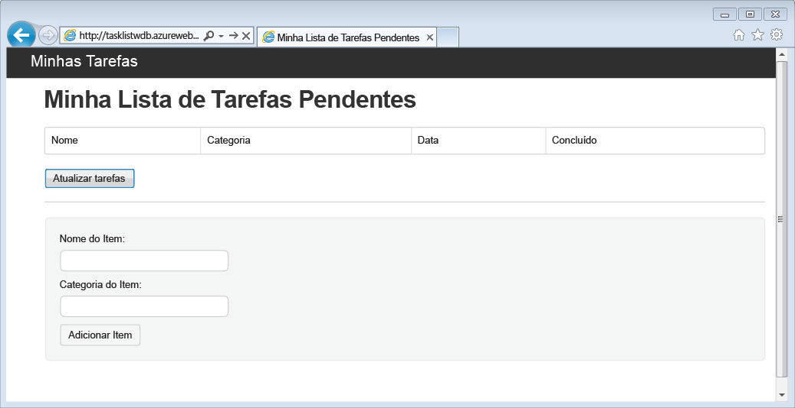
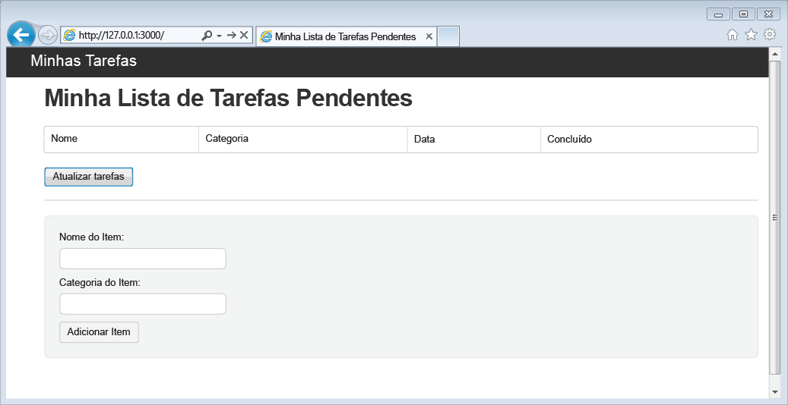
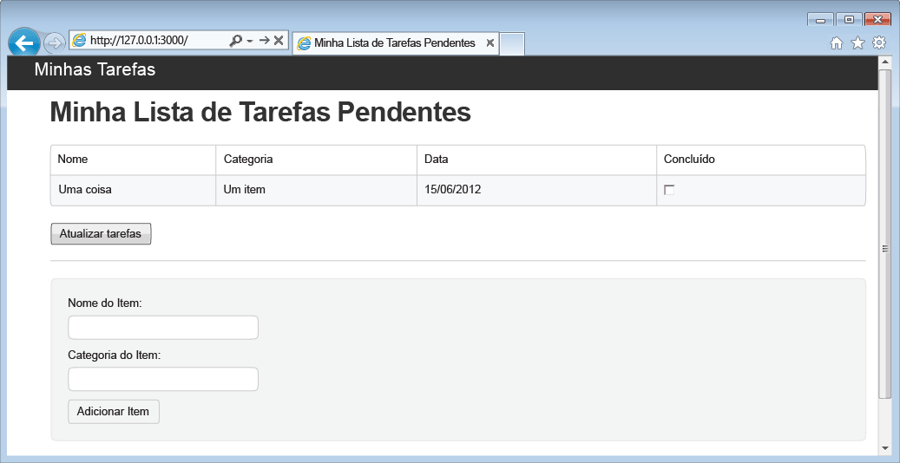

<properties 
	pageTitle="Saiba mais sobre o Node.js — tutorial do Node.js para Banco de Dados de Documentos | Microsoft Azure" 
	description="Saiba mais sobre o Node.js! O tutorial explica como usar o Banco de Dados de Documentos do Microsoft Azure para armazenar e acessar dados de um aplicativo Web do Node.js Express hospedado em sites do Azure." 
	keywords="Application development, database tutorial, learn node.js, node.js tutorial, documentdb, azure, Microsoft azure"
	services="documentdb" 
	documentationCenter="nodejs" 
	authors="ryancrawcour" 
	manager="jhubbard" 
	editor="cgronlun"/>

<tags 
	ms.service="documentdb" 
	ms.workload="data-services" 
	ms.tgt_pltfrm="na" 
	ms.devlang="nodejs" 
	ms.topic="hero-article" 
	ms.date="07/24/2015" 
	ms.author="ryancraw"/>

# Criar um aplicativo Web Node.js usando o Banco de Dados de Documentos

Este tutorial do Node.js mostra a você como usar o serviço do Banco de Dados de Documentos do Azure para armazenar e acessar dados de um aplicativo Express do Node.js hospedado nos Sites do Azure.

É recomendável começar assistindo ao vídeo a seguir, no qual você aprenderá a provisionar uma conta de banco de dados do Banco de Dados de Documentos do Azure e armazenar documentos JSON no seu aplicativo Node.js.

> [AZURE.VIDEO azure-demo-getting-started-with-azure-documentdb-on-nodejs-in-linux]

Em seguida, retorne a este tutorial do Node.js, em você aprenderá as respostas para as seguintes perguntas:

- Como trabalhar com o Banco de Dados de Documentos usando o módulo de npm documentdb?
- Como implantar o aplicativo Web para sites do Azure?

Seguindo este tutorial de banco de dados, você criará um aplicativo simples de gerenciamento de tarefas baseado na Web que permite criar, recuperar e concluir tarefas. As tarefas serão armazenadas como documentos JSON no Banco de Dados de Documentos do Azure.

Não há tempo para concluir o tutorial e deseja apenas a solução completa? Não é um problema, você pode obter a solução de exemplo completo da [GitHub][].

## Pré-requisitos

> [AZURE.TIP]Este tutorial do Node.js presume que você tenha alguma experiência anterior com o Node.js e sites do Azure.

Antes de seguir as instruções deste artigo, verifique se você possui o seguinte:

- Uma conta ativa do Azure. Se você não tiver uma conta, poderá criar uma conta de avaliação gratuita em apenas alguns minutos. Para obter detalhes, consulte [Avaliação gratuita do Azure](../../pricing/free-trial/).
- [Node.js][] versão v0.10.29 ou superior.
- [Gerador Expresso](http://www.expressjs.com/starter/generator.html) (você pode instalá-lo por meio de `npm install express-generator -g`)
- [Git][].

## Etapa 1: Criar uma conta de banco de dados do Banco de Dados de Documentos

Vamos iniciar pela criação de uma conta do Banco de Dados de Documentos. Se já tiver uma conta, você pode pular para [Etapa 2: criar um novo aplicativo do Node. js](#_Toc395783178).

[AZURE.INCLUDE [documentdb-create-dbaccount](../../includes/documentdb-create-dbaccount.md)]

[AZURE.INCLUDE [documentdb-keys](../../includes/documentdb-keys.md)]

## Etapa 2: aprender a criar um novo aplicativo Node.js

Agora vamos aprender a criar um projeto Hello World Node.js básico usando a estrutura [Express](http://expressjs.com/).

1. Abra seu terminal favorito.

2. Use o gerador expresso para gerar um novo aplicativo chamado **tarefas**.

		express todo

3. Abra o novo diretório **tarefas** e instale as dependências.

		cd todo
		npm install

4. Execute seu novo aplicativo.

		npm start

5. Você pode exibir seu novo aplicativo navegando em seu navegador para [http://localhost:3000/](http://localhost:3000).

	

## Etapa 3: Instalar módulos adicionais

O arquivo **package.json** é um dos arquivos criados na raiz do projeto. Esse arquivo contém uma lista dos módulos adicionais que são necessários para seu aplicativo do Node.js. Posteriormente, ao implantar esse aplicativo em um site do Azure, esse arquivo será usado para determinar quais módulos precisam ser instalados no Azure para dar suporte ao seu aplicativo. Ainda precisamos instalar mais dois pacotes para este tutorial.

1. De volta ao terminal, instale o módulo **async** via npm.

		npm install async --save

1. Instale o módulo **documentdb** via npm. Esse é o módulo em que toda a mágica do Banco de Dados de Documentos acontece.

		npm install documentdb --save

3. Uma verificação rápida do arquivo **package.json** do aplicativo deve mostrar os módulos adicionais. Esse arquivo informará ao Azure quais pacotes para baixar e instalar ao executar seu aplicativo. Ele deve se parecer com o exemplo a seguir.

	

       Isso informa ao Nó (e ao Azure mais tarde) que seu aplicativo depende desses módulos adicionais.

## Etapa 4: Usando o serviço do Banco de Dados de Documento em um aplicativo de nó

Isso cuida de toda a instalação e configuração inicial. Agora vamos ao motivo de estarmos aqui, ou seja, para gravar algum código usando o Banco de Dados de Documentos do Azure.

### Criar o modelo

1. No diretório do projeto, crie um novo diretório chamado **modelos**.
2. No diretório **modelos**, criar um novo arquivo chamado **taskDao.js**. Esse arquivo conterá o modelo para as tarefas criadas pelo seu aplicativo.
3. No mesmo diretório **modelos**, crie um novo arquivo chamado **docdbUtils.js**. Esse arquivo conterá algum código útil e reutilizável, que será usado em todo o nosso aplicativo. 
4. Copie o seguinte código para **docdbUtils.js**

		var DocumentDBClient = require('documentdb').DocumentClient;
			
		var DocDBUtils = {
		    getOrCreateDatabase: function (client, databaseId, callback) {
		        var querySpec = {
		            query: 'SELECT * FROM root r WHERE r.id=@id',
		            parameters: [{
		                name: '@id',
		                value: databaseId
		            }]
		        };
		
		        client.queryDatabases(querySpec).toArray(function (err, results) {
		            if (err) {
		                callback(err);
		
		            } else {
		                if (results.length === 0) {
		                    var databaseSpec = {
		                        id: databaseId
		                    };
		
		                    client.createDatabase(databaseSpec, function (err, created) {
		                        callback(null, created);
		                    });
		
		                } else {
		                    callback(null, results[0]);
		                }
		            }
		        });
		    },
		
		    getOrCreateCollection: function (client, databaseLink, collectionId, callback) {
		        var querySpec = {
		            query: 'SELECT * FROM root r WHERE r.id=@id',
		            parameters: [{
		                name: '@id',
		                value: collectionId
		            }]
		        };		       
				
		        client.queryCollections(databaseLink, querySpec).toArray(function (err, results) {
		            if (err) {
		                callback(err);
		
		            } else {		
		                if (results.length === 0) {
		                    var collectionSpec = {
		                        id: collectionId
		                    };
							
				 			var requestOptions = {
								offerType: 'S1'
							};
							
		                    client.createCollection(databaseLink, collectionSpec, requestOptions, function (err, created) {
		                        callback(null, created);
		                    });
		
		                } else {
		                    callback(null, results[0]);
		                }
		            }
		        });
		    }
		};
				
		module.exports = DocDBUtils;

> [AZURE.TIP]createCollection aceita um parâmetro de requestOptions opcional que pode ser usado para especificar o Tipo de Oferta para a Coleção. Se nenhum valor de requestOptions.offerType for fornecido, a coleção será criada usando o Tipo de Oferta padrão. Para obter mais informações sobre os Tipos de Oferta do Banco de Dados de Documentos, consulte [Níveis de Desempenho no Banco de Dados de Documentos](documentdb-performance-levels.md)
		
3. Salve e feche o arquivo **docdbUtils.js**.

4. No início do arquivo **taskDao.js**, adicione o seguinte código para fazer referência a **DocumentDBClient** e **docdbUtils.js** criados anteriormente:

        var DocumentDBClient = require('documentdb').DocumentClient;
		var docdbUtils = require('./docdbUtils');

4. Em seguida, você adicionará o código para definir e exportar o objeto da tarefa. Ele é responsável pela inicialização do nosso objeto de Tarefa e por configurar o Banco de Dados e o Conjunto de Documentos que usaremos.

		function TaskDao(documentDBClient, databaseId, collectionId) {
		  this.client = documentDBClient;
		  this.databaseId = databaseId;
		  this.collectionId = collectionId;
		
		  this.database = null;
		  this.collection = null;
		}
		
		module.exports = TaskDao;

5. Em seguida, adicione o seguinte código para definir métodos adicionais no objeto da Tarefa, que permitem interações com os dados armazenados no Banco de Dados de Documentos.

		TaskDao.prototype = {
		    init: function (callback) {
		        var self = this;
		
		        docdbUtils.getOrCreateDatabase(self.client, self.databaseId, function (err, db) {
		            if (err) {
		                callback(err);

		            } else {
		                self.database = db;
		                docdbUtils.getOrCreateCollection(self.client, self.database._self, self.collectionId, function (err, coll) {
		                    if (err) {
		                        callback(err);
		
		                    } else {
		                        self.collection = coll;
		                    }
		                });
		            }
		        });
		    },
		
		    find: function (querySpec, callback) {
		        var self = this;
		
		        self.client.queryDocuments(self.collection._self, querySpec).toArray(function (err, results) {
		            if (err) {
		                callback(err);
		
		            } else {
		                callback(null, results);
		            }
		        });
		    },
		
		    addItem: function (item, callback) {
		        var self = this;
		
		        item.date = Date.now();
		        item.completed = false;
		
		        self.client.createDocument(self.collection._self, item, function (err, doc) {
		            if (err) {
		                callback(err);
		
		            } else {
		                callback(null, doc);
		            }
		        });
		    },
		
		    updateItem: function (itemId, callback) {
		        var self = this;
		
		        self.getItem(itemId, function (err, doc) {
		            if (err) {
		                callback(err);
		
		            } else {
		                doc.completed = true;
		
		                self.client.replaceDocument(doc._self, doc, function (err, replaced) {
		                    if (err) {
		                        callback(err);
		
		                    } else {
		                        callback(null, replaced);
		                    }
		                });
		            }
		        });
		    },
		
		    getItem: function (itemId, callback) {
		        var self = this;
		
		        var querySpec = {
		            query: 'SELECT * FROM root r WHERE r.id=@id',
		            parameters: [{
		                name: '@id',
		                value: itemId
		            }]
		        };
		
		        self.client.queryDocuments(self.collection._self, querySpec).toArray(function (err, results) {
		            if (err) {
		                callback(err);
		
		            } else {
		                callback(null, results[0]);
		            }
		        });
		    }
		};

6. Salve e feche o arquivo **taskDao.js**.

### Criar o controlador

1. No diretório **rotas** do projeto, crie um novo arquivo chamado **tasklist.js**. 
2. Adicione os seguintes códigos ao **tasklist.js**. Ele carrega os módulos DocumentDBClient e assíncrono, que são usados pelo **tasklist.js**. Isso também definiu a função de **TaskList**, que é transmitida a uma instância do objeto da **Tarefa** definido anteriormente:

		var DocumentDBClient = require('documentdb').DocumentClient;
		var async = require('async');
		
		function TaskList(taskDao) {
		  this.taskDao = taskDao;
		}
		
		module.exports = TaskList;

3. Continue adicionando ao arquivo **tasklist.js**, adicionando os métodos usados para **showTasks, addTask** e **completeTasks**:
		
		TaskList.prototype = {
		    showTasks: function (req, res) {
		        var self = this;
		
		        var querySpec = {
		            query: 'SELECT * FROM root r WHERE r.completed=@completed',
		            parameters: [{
		                name: '@completed',
		                value: false
		            }]
		        };
		
		        self.taskDao.find(querySpec, function (err, items) {
		            if (err) {
		                throw (err);
		            }
		
		            res.render('index', {
		                title: 'My ToDo List ',
		                tasks: items
		            });
		        });
		    },
		
		    addTask: function (req, res) {
		        var self = this;
		        var item = req.body;
		
		        self.taskDao.addItem(item, function (err) {
		            if (err) {
		                throw (err);
		            }
		
		            res.redirect('/');
		        });
		    },
		
		    completeTask: function (req, res) {
		        var self = this;
		        var completedTasks = Object.keys(req.body);
		
		        async.forEach(completedTasks, function taskIterator(completedTask, callback) {
		            self.taskDao.updateItem(completedTask, function (err) {
		                if (err) {
		                    callback(err);
		                } else {
		                    callback(null);
		                }
		            });
		        }, function goHome(err) {
		            if (err) {
		                throw err;
		            } else {
		                res.redirect('/');
		            }
		        });
		    }
		};

4. Salve e feche o arquivo **tasklist.js**.
 
### Adicionar config.js

1. No diretório do projeto, crie um novo arquivo chamado **config.js**.
2. Adicione o seguinte ao **config.js**. Isso define as configurações e valores necessários para nosso aplicativo.

		var config = {}
		
		config.host = process.env.HOST || "[the URI value from the DocumentDB Keys blade on http://portal.azure.com]";
		config.authKey = process.env.AUTH_KEY || "[the PRIMARY KEY value from the DocumentDB Keys blade on http://portal.azure.com]";
		config.databaseId = "ToDoList";
		config.collectionId = "Items";
		
		module.exports = config;

3. No arquivo **config.js**, atualize os valores de HOST e AUTH\_KEY usando os valores encontrados na lâmina Chaves de sua conta do Banco de Dados de Documentos no [portal de visualização do Microsoft Azure](http://portal.azure.com):

4. Salve e feche o arquivo **config.js**.
 
### Modificar app.js

1. No diretório do projeto, abra o arquivo **app.js**. Esse arquivo foi criado anteriormente, quando o aplicativo Web Express foi criado.
2. Adicione o seguinte código à parte superior do **app.js**
	
		var DocumentDBClient = require('documentdb').DocumentClient;
		var config = require('./config');
		var TaskList = require('./routes/tasklist');
		var TaskDao = require('./models/taskDao');

3. Esse código define o arquivo de configuração a ser usado e continua a ler valores desse arquivo em algumas variáveis que usaremos em breve.
4. Substitua as duas linhas seguintes no arquivo **app.js**:

		app.use('/', routes);
		app.use('/users', users); 

      pelo trecho a seguir:

		var docDbClient = new DocumentDBClient(config.host, {
		    masterKey: config.authKey
		});
		var taskDao = new TaskDao(docDbClient, config.databaseId, config.collectionId);
		var taskList = new TaskList(taskDao);
		taskDao.init();
		
		app.get('/', taskList.showTasks.bind(taskList));
		app.post('/addtask', taskList.addTask.bind(taskList));
		app.post('/completetask', taskList.completeTask.bind(taskList));

6. Essas linhas definem uma nova instância do nosso objeto **TaskDao**, com uma nova conexão ao Banco de Dados de Documentos (usando os valores lidos a partir de **config.js**), inicialize o objeto de tarefa e, em seguida, associe ações do formulário aos métodos no nosso controlador **TaskList**.

7. Por fim, salve e feche o arquivo **app.js**; está praticamente pronto.
 
## Etapa 5: Criar uma interface do usuário

Agora vamos voltar a atenção para criar a interface do usuário, desse modo, um usuário pode realmente interagir com nosso aplicativo. O aplicativo Express que criamos usa **Jade** como mecanismo de exibição. Para obter mais informações sobre o Jade, consulte [http://jade-lang.com/](http://jade-lang.com/).

1. O arquivo **layout.jade** no diretório **views** é usado como um modelo global para outros arquivos **.jade**. Nesta etapa, você o modificará para usar a [Twitter Bootstrap](https://github.com/twbs/bootstrap), que é um kit de ferramentas que facilita a criação de um site com uma aparência interessante. 
2. Abra o arquivo **layout.jade **encontrado na pasta **exibições** e substitua o conteúdo pelo seguinte:
	
		doctype html
		html
		  head
		    title= title
		    link(rel='stylesheet', href='//ajax.aspnetcdn.com/ajax/bootstrap/3.3.2/css/bootstrap.min.css')
		    link(rel='stylesheet', href='/stylesheets/style.css')
		  body
		    nav.navbar.navbar-inverse.navbar-fixed-top
		      div.navbar-header
		        a.navbar-brand(href='#') My Tasks
		    block content
		    script(src='//ajax.aspnetcdn.com/ajax/jQuery/jquery-1.11.2.min.js')
		    script(src='//ajax.aspnetcdn.com/ajax/bootstrap/3.3.2/bootstrap.min.js')

	Isso instrui o mecanismo **Jade** a renderizar um HTML para nosso aplicativo e cria um **bloco** chamado **content**, em que podemos fornecer o layout para nossas páginas de conteúdo. Salve e feche o arquivo **layout.jade**.

4. Agora, abra o arquivo **index.jade**, o modo de exibição que será usado pelo nosso aplicativo, e substitua o conteúdo do arquivo pelo seguinte:

		extends layout
		
		block content
		  h1 #{title}
		  br
		
		  form(action="/completetask", method="post")
		    table.table.table-striped.table-bordered
		      tr
		        td Name
		        td Category
		        td Date
		        td Complete
		      if (typeof tasks === "undefined")
		        tr
		          td
		      else
		        each task in tasks
		          tr
		            td #{task.name}
		            td #{task.category}
		            - var date  = new Date(task.date);
		            - var day   = date.getDate();
		            - var month = date.getMonth() + 1;
		            - var year  = date.getFullYear();
		            td #{month + "/" + day + "/" + year}
		            td
		              input(type="checkbox", name="#{task.id}", value="#{!task.completed}", checked=task.completed)
		    button.btn(type="submit") Update tasks
		  hr
		  form.well(action="/addtask", method="post")
		    label Item Name:
		    input(name="name", type="textbox")
		    label Item Category:
		    input(name="category", type="textbox")
		    br
		    button.btn(type="submit") Add item

	Isso estende o layout e fornece conteúdo para o espaço reservado **content** que vimos no arquivo **layout.jade** anteriormente.
	
	Nesse layout criamos dois formulários HTML. O primeiro formulário contém uma tabela para nossos dados e um botão que permite atualizar itens pelo lançamento do método **/completetask** de nosso controlador. O segundo formulário contém dois campos de entrada e um botão que nos permite criar um novo item ao ser lançado o método **/addtask** do nosso controlador.
	
	Isso deve ser tudo o que precisamos para que nosso aplicativo funcione.

5. Abra o arquivo **style.css** no diretório **public\\stylesheets** e substitua o código pelo seguinte:

		body {
		  padding: 50px;
		  font: 14px "Lucida Grande", Helvetica, Arial, sans-serif;
		}
		a {
		  color: #00B7FF;
		}
		.well label {
		  display: block;
		}
		.well input {
		  margin-bottom: 5px;
		}
		.btn {
		  margin-top: 5px;
		  border: outset 1px #C8C8C8;
		}

	Salve e feche esse arquivo **style.css**.

## Etapa 6: Execute o seu aplicativo localmente

1. Para testar o aplicativo no computador local, execute `npm start` em um terminal para iniciar o aplicativo e iniciar um navegador com uma página semelhante à imagem a seguir:

	

2. Use os campos fornecidos para Item, Nome do Item e Categoria para inserir informações e clique em **Adicionar Item**.

3. A página deverá ser atualizada para exibir o item recém-criado na lista de Tarefas Pendentes.

	

4. Para concluir uma tarefa, basta marcar a caixa de seleção na coluna Concluir e clicar em **Atualizar tarefas**.

## Etapa 7: implantar seu projeto de desenvolvimento de aplicativo nos sites do Azure

1. Se ainda não o fez, habilite um repositório git do seu site do Azure. Você poderá encontrar instruções sobre como fazer isso [aqui](../web-sites-publish-source-control-git.md#step4).

2. Adicione seu site do Azure como um git remoto.

		git remote add azure https://username@your-azure-website.scm.azurewebsites.net:443/your-azure-website.git

3. Implante o envio por push para o computador remoto.

		git push azure master

4. Em poucos segundos, o git terminará de publicar seu aplicativo Web e iniciará um navegador onde você poderá ver seu trabalho sendo executado no Azure!

## Próximas etapas

Parabéns! Você acabou de criar seu primeiro Aplicativo Web Express do Node.js usando o Banco de Dados de Documentos do Azure e o publicou nos sites do Azure.

O código-fonte para o aplicativo de referência completo pode ser baixado no [GitHub][].

Para obter mais informações, consulte o [Centro de desenvolvedores do Node.js](/develop/nodejs/).

[Node.js]: http://nodejs.org/
[Git]: http://git-scm.com/
[Github]: https://github.com/Azure-Samples/documentdb-node-todo-app
 

<!---HONumber=Sept15_HO4-->