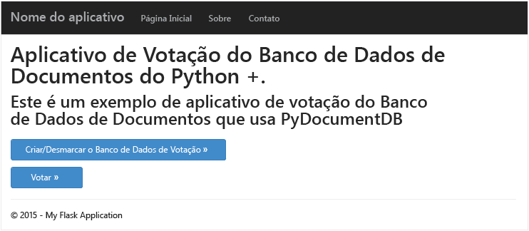
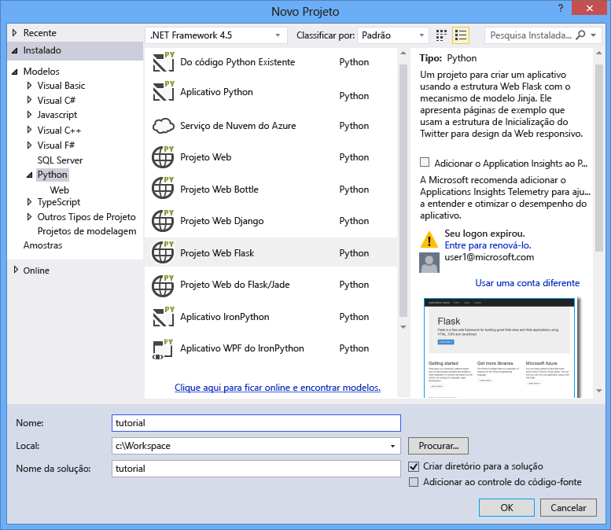
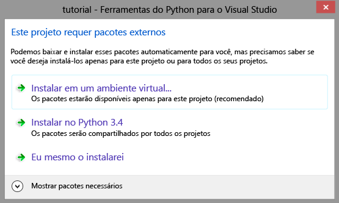
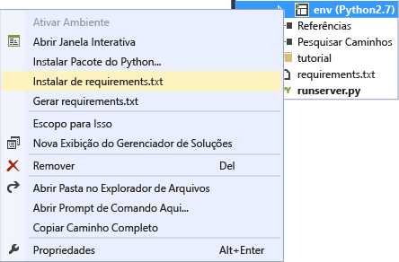
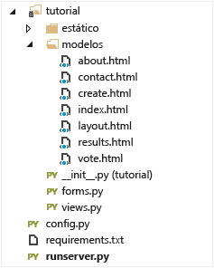
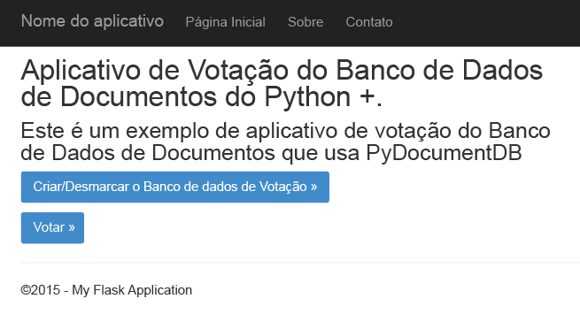
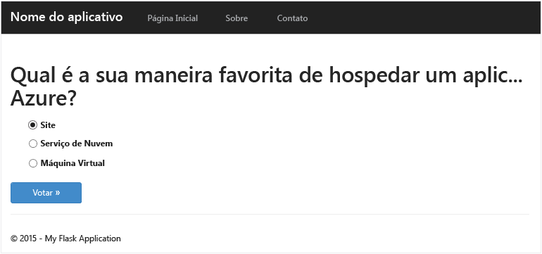
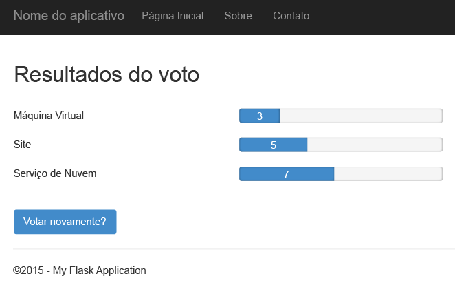
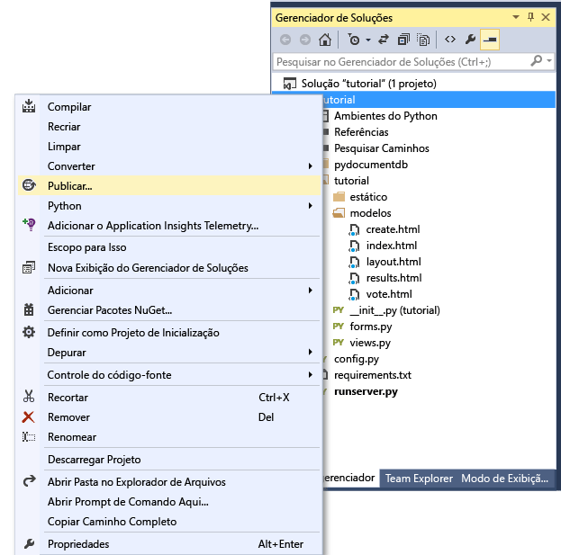
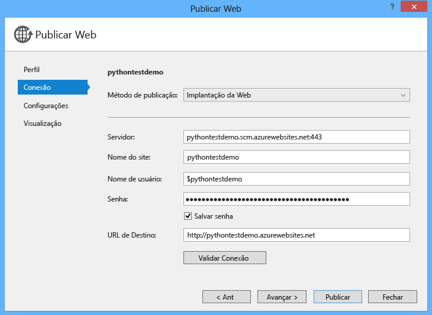

<properties
    pageTitle="Desenvolvimento de aplicativo Web Python Flask com Banco de Dados de Documentos | Microsoft Azure"
    description="Analise um tutorial de banco de dados sobre como usar o Banco de Dados de Documentos para armazenar e acessar dados de um aplicativo Web Python Flask hospedado no Azure. Encontre soluções de desenvolvimento de aplicativo." 
	keywords="Desenvolvimento de aplicativos, tutorial de banco de dados, python flask, aplicativo web python, desenvolvimento web python, banco de dados de documentos, azure, Microsoft azure"
    services="documentdb"
    documentationCenter="python"
    authors="AndrewHoh"
    manager="jhubbard"
    editor="cgronlun"/>

<tags
    ms.service="documentdb"
    ms.workload="data-management"
    ms.tgt_pltfrm="na"
    ms.devlang="python"
    ms.topic="hero-article"
    ms.date="04/18/2016"
    ms.author="anhoh"/>

# Desenvolvimento de aplicativo Web Python Flask com Banco de Dados de Documentos

> [AZURE.SELECTOR]
- [.NET](documentdb-dotnet-application.md)
- [Node.js](documentdb-nodejs-application.md)
- [Java](documentdb-java-application.md)
- [Python](documentdb-python-application.md)

Este tutorial mostra como usar o serviço do Banco de Dados de Documentos do Azure para armazenar e acessar dados de um aplicativo Web Python hospedado no Azure e supõe que você tenha experiência prévia com o uso do Python e os sites do Azure.

Este tutorial de banco de dados aborda:

1. Criar e provisionar uma conta de Banco de Dados de Documentos
2. Criar um aplicativo Python MVC
3. Conectar-se a e usar o Banco de Dados de Documento do Azure do aplicativo Web.
4. Implantar o aplicativo Web nos sites do Azure.

Seguindo este tutorial, você criará um aplicativo simples de votação que permite que você vote em uma votação.




## Pré-requisitos do tutorial de banco de dados

Antes de seguir as instruções deste artigo, verifique se você tem os seguintes itens instalados:

- Uma conta ativa do Azure. Se você não tiver uma conta, poderá criar uma conta de avaliação gratuita em apenas alguns minutos. Para obter detalhes, consulte [Avaliação gratuita do Azure](https://azure.microsoft.com/pricing/free-trial/).
- [Visual Studio 2013](http://www.visualstudio.com/) ou superior, ou [Visual Studio Express](), que é a versão gratuita. As instruções neste tutorial foram escritas especificamente para o Visual Studio 2015.
- Ferramentas Python para o Visual Studio do [GitHub](http://microsoft.github.io/PTVS/). Este tutorial usa as Ferramentas Python para o VS 2015.
- SDK do Azure Python para o Visual Studio, versão 2.4 ou superior disponível em [azure.com](https://azure.microsoft.com/downloads/). Nós usamos o SDK do Microsoft Azure para Python 2.7.
- Python 2.7 de [python.org][2]. Usamos o Python 2.7.11.

> [AZURE.IMPORTANT] Se você estiver instalando o Python 2.7 pela primeira vez, escolha **Adicionar python.exe ao Caminho** na tela Personalizar o Python 2.7.11.
> 
>    

- Compilador do Microsoft Visual C++ para Python 2.7 do [Centro de Download da Microsoft][3].

## Etapa 1: criar uma conta de banco de dados do Banco de Dados de Documentos

Vamos iniciar pela criação de uma conta do Banco de Dados de Documentos. Se já tiver uma conta, você poderá pular para a [Etapa 2: Criar um novo aplicativo Web Python Flask](#step-2:-create-a-new-python-flask-web-application).

[AZURE.INCLUDE [documentdb-create-dbaccount](../../includes/documentdb-create-dbaccount.md)]

<br/> Agora vamos mostrar como criar um novo aplicativo Web Python Flask desde o início.

## Etapa 2: Criar um novo aplicativo Web Python Flask

1. No Visual Studio, no menu **Arquivo**, aponte para **Novo** e clique em **Projeto**.

    A caixa de diálogo **Novo Projeto** aparecerá.

2. No painel esquerdo, expanda **Modelos** e **Python** e clique em **Web**.

3. Selecione **Projeto Web Flask** no painel central, digite **tutorial** em **Nome** e clique em **OK**. Lembre-se de que os nomes de pacote do Python devem ser escritos em letras minúsculas, como descrito no [Guia de estilo do Código Python](https://www.python.org/dev/peps/pep-0008/#package-and-module-names).

	Para aqueles que não estejam familiarizados com o Python Flask, trata-se de uma estrutura de desenvolvimento de aplicativos Web que ajuda você a compilar aplicativos Web no Python mais rapidamente.

	

4. Na janela **Ferramentas Python para Visual Studio**, clique em **Instalar em um ambiente virtual**.

	

5. Na janela **Adicionar Ambiente Virtual**, você pode aceitar os padrões e usar o Python 2.7 como o ambiente base, pois o PyDocumentDB no momento não oferece suporte ao Python 3. x, e depois clicar em **Criar**. Isso configura o ambiente virtual do Python necessário ao seu projeto.

	

    A janela de saída exibe `Successfully installed Flask-0.10.1 Jinja2-2.8 MarkupSafe-0.23 Werkzeug-0.11.5 itsdangerous-0.24 'requirements.txt' was installed successfully.` quando o ambiente é instalado com êxito.

## Etapa 3: Modificar o aplicativo Web Python Flask

### Adicionar pacotes do Python Flask ao seu projeto

Depois que seu projeto estiver configurado, você precisará adicionar alguns pacotes Flask necessários ao projeto, incluindo pydocumentdb, o pacote do Python para o Banco de Dados de Documentos.

1. No Gerenciador de Soluções, abra o arquivo denominado **requirements.txt** e substitua o conteúdo pelo seguinte:

    	flask==0.9
    	flask-mail==0.7.6
    	sqlalchemy==0.7.9
    	flask-sqlalchemy==0.16
    	sqlalchemy-migrate==0.7.2
    	flask-whooshalchemy==0.55a
    	flask-wtf==0.8.4
    	pytz==2013b
    	flask-babel==0.8
    	flup
    	pydocumentdb>=1.0.0

2. Salve o arquivo **requirements.txt**.
3. No Gerenciador de Soluções, clique com o botão direito do mouse em **env** e clique em **Instalar de requirements.txt**.

	

    Após a instalação bem-sucedida, a janela de saída exibirá o seguinte:

        Successfully installed Babel-2.3.2 Tempita-0.5.2 WTForms-2.1 Whoosh-2.7.4 blinker-1.4 decorator-4.0.9 flask-0.9 flask-babel-0.8 flask-mail-0.7.6 flask-sqlalchemy-0.16 flask-whooshalchemy-0.55a0 flask-wtf-0.8.4 flup-1.0.2 pydocumentdb-1.6.1 pytz-2013b0 speaklater-1.3 sqlalchemy-0.7.9 sqlalchemy-migrate-0.7.2

    > [AZURE.NOTE] Em casos raros, você poderá ver uma falha na janela de saída. Se isso ocorrer, verifique se o erro está relacionado à limpeza. Algumas vezes, há falha na limpeza, mas a instalação ainda será bem-sucedida (role para cima na janela de saída para verificar isso). Você pode verificar a instalação [Como verificar o ambiente virtual](#verify-the-virtual-environment). Se houver falha na instalação, mas se a verificação for bem-sucedida, você poderá prosseguir.

### Verifique o ambiente virtual

Vamos garantir que tudo esteja instalado corretamente.

1. Crie a solução ao pressionar **Ctrl**+**Shift**+**B**.
2. Se a compilação for bem-sucedida, inicie o site pressionando **F5**. Isso iniciará o servidor de desenvolvimento do Flask e iniciará o navegador da Web. Você deve ver a página a seguir.

	

3. Pare a depuração do site pressionando **Shift**+**F5** no Visual Studio.

### Criar definições de banco de dados, de coleção e de documentos

Agora vamos criar seu aplicativo de votação adicionando novos arquivos e enviando atualizações para outras pessoas.

1. No Gerenciador de Soluções, clique com o botão direito do mouse no projeto **tutorial**, clique em **Adicionar** e em **Novo Item**. Escolha **Arquivo Python Vazio** e nomeie o arquivo como **forms.py**.
2. Adicione o código a seguir ao arquivo forms.py e salve o arquivo.

```python
from flask.ext.wtf import Form
from wtforms import RadioField

class VoteForm(Form):
	deploy_preference  = RadioField('Deployment Preference', choices=[
        ('Web Site', 'Web Site'),
        ('Cloud Service', 'Cloud Service'),
        ('Virtual Machine', 'Virtual Machine')], default='Web Site')
```


### Adicione as importações necessárias a views.py

1. No Gerenciador de Soluções, expanda a pasta **tutorial** e abra o arquivo **views.py**.
2. Adicione as seguintes instruções de importação à parte superior do arquivo **views.py**, então salve o arquivo. Elas importarão pacotes PythonSDK do Banco de Dados de Documentos e os pacotes Flask.

	```python
	from forms import VoteForm
	import config
	import pydocumentdb.document_client as document_client
	```


### Criar banco de dados, coleção e documento

- Ainda em **views.py**, adicione o código a seguir ao final do arquivo. Ele se encarrega de criar o banco de dados usado pelo formulário. Não exclua nenhum código existente em **views.py**. Basta acrescentá-lo ao final.

```python
@app.route('/create')
def create():
    """Renders the contact page."""
    client = document_client.DocumentClient(config.DOCUMENTDB_HOST, {'masterKey': config.DOCUMENTDB_KEY})

    # Attempt to delete the database.  This allows this to be used to recreate as well as create
    try:
        db = next((data for data in client.ReadDatabases() if data['id'] == config.DOCUMENTDB_DATABASE))
        client.DeleteDatabase(db['_self'])
    except:
        pass

    # Create database
    db = client.CreateDatabase({ 'id': config.DOCUMENTDB_DATABASE })

    # Create collection
    collection = client.CreateCollection(db['_self'],{ 'id': config.DOCUMENTDB_COLLECTION }, { 'offerType': 'S1' })

    # Create document
    document = client.CreateDocument(collection['_self'],
        { 'id': config.DOCUMENTDB_DOCUMENT,
          'Web Site': 0,
          'Cloud Service': 0,
          'Virtual Machine': 0,
          'name': config.DOCUMENTDB_DOCUMENT 
        })

    return render_template(
       'create.html',
        title='Create Page',
        year=datetime.now().year,
        message='You just created a new database, collection, and document.  Your old votes have been deleted')
```

> [AZURE.TIP] O método **CreateCollection** usa um **RequestOptions** opcional como o terceiro parâmetro. Ele pode ser usado para especificar o Tipo de Oferta da coleção. Se nenhum valor de offerType for fornecido, a coleção será criada usando o Tipo de Oferta padrão. Para obter mais informações sobre os Tipos de Oferta do Banco de Dados de Documentos, consulte [Níveis de desempenho no Banco de Dados de Documentos](documentdb-performance-levels.md).


### Ler o banco de dados, a coleção, o documento e enviar o formulário

- Ainda em **views.py**, adicione o código a seguir ao final do arquivo. Ele cuida da configuração do formulário, da leitura do banco de dados, da coleção e do documento. Não exclua nenhum código existente em **views.py**. Basta acrescentá-lo ao final.

```python
@app.route('/vote', methods=['GET', 'POST'])
def vote(): 
    form = VoteForm()
    replaced_document ={}
    if form.validate_on_submit(): # is user submitted vote  
        client = document_client.DocumentClient(config.DOCUMENTDB_HOST, {'masterKey': config.DOCUMENTDB_KEY})

        # Read databases and take first since id should not be duplicated.
        db = next((data for data in client.ReadDatabases() if data['id'] == config.DOCUMENTDB_DATABASE))

        # Read collections and take first since id should not be duplicated.
        coll = next((coll for coll in client.ReadCollections(db['_self']) if coll['id'] == config.DOCUMENTDB_COLLECTION))

        # Read documents and take first since id should not be duplicated.
        doc = next((doc for doc in client.ReadDocuments(coll['_self']) if doc['id'] == config.DOCUMENTDB_DOCUMENT))

        # Take the data from the deploy_preference and increment our database
        doc[form.deploy_preference.data] = doc[form.deploy_preference.data] + 1
        replaced_document = client.ReplaceDocument(doc['_self'], doc)

        # Create a model to pass to results.html
        class VoteObject:
            choices = dict()
            total_votes = 0

        vote_object = VoteObject()
        vote_object.choices = {
            "Web Site" : doc['Web Site'],
            "Cloud Service" : doc['Cloud Service'],
            "Virtual Machine" : doc['Virtual Machine']
        }
        vote_object.total_votes = sum(vote_object.choices.values())

        return render_template(
            'results.html', 
            year=datetime.now().year, 
            vote_object = vote_object)

    else :
        return render_template(
            'vote.html', 
            title = 'Vote',
            year=datetime.now().year,
            form = form)
```


### Criar os arquivos HTML

1. No Gerenciador de Soluções, na pasta **tutorial**, clique com o botão direito do mouse na pasta **templates**, clique em **Adicionar** e clique em **Novo Item**.
2. Escolha **Página HTML** e, na caixa Nome, digite **create.html**.
3. Repita as etapas 1 e 2 para criar dois arquivos HTML adicionais: results.html e vote.html.
4. Adicione o código a seguir a **create.html** no elemento `<body>`. Ele exibe uma mensagem indicando que um banco de dados, uma coleção e um documento novos foram criados.

	```html
	
	
	<h2>{{ title }}.</h2>
	<h3>{{ message }}</h3>
	<p><a href="{{ url_for('vote') }}" class="btn btn-primary btn-large">Vote &raquo;</a></p>
	
	```

5. Adicione o código a seguir a **results.html** no elemento `<body`. Ele exibe os resultados da votação.

	```html
	
	
	<h2>Results of the vote</h2>
		<br />
		
	
	<div class="row">
		<div class="col-sm-5">{{choice}}</div>
	        <div class="col-sm-5">
	        	<div class="progress">
	        		<div class="progress-bar" role="progressbar" aria-valuenow="{{vote_object.choices[choice]}}" aria-valuemin="0" aria-valuemax="{{vote_object.total_votes}}" style="width: {{(vote_object.choices[choice]/vote_object.total_votes)*100}}%;">
	                    		{{vote_object.choices[choice]}}
				</div>
			</div>
	        </div>
	</div>
	
	
	<br />
	<a class="btn btn-primary" href="{{ url_for('vote') }}">Vote again?</a>
	
	```

6. Adicione o código a seguir a **vote.html** no elemento `<body`. Ele exibe a votação e aceita os votos. Ao registrar os votos, o controle será passado a views.py, onde reconheceremos os votos realizados e atualizaremos o documento de acordo com eles.

	```html
	
	
	<h2>What is your favorite way to host an application on Azure?</h2>
	<form action="" method="post" name="vote">
		{{form.hidden_tag()}}
	        {{form.deploy_preference}}
	        <button class="btn btn-primary" type="submit">Vote</button>
	</form>
	
	```

7. Na pasta **templates**, substitua o conteúdo de **index.html** pelo seguinte. Ele serve como a página de chegada de seu aplicativo.
	
	```html
	
	
	<h2>Python + DocumentDB Voting Application.</h2>
	<h3>This is a sample DocumentDB voting application using PyDocumentDB</h3>
	<p><a href="{{ url_for('create') }}" class="btn btn-primary btn-large">Create/Clear the Voting Database &raquo;</a></p>
	<p><a href="{{ url_for('vote') }}" class="btn btn-primary btn-large">Vote &raquo;</a></p>
	
	```

### Adicione um arquivo de configuração e altere \_\_init\_\_.py

1. No Gerenciador de Soluções, clique com o botão direito do mouse no projeto **tutorial**, clique em **Adicionar**, clique em **Novo Item**, escolha **Arquivo Python Vazio** e nomeie o arquivo como **config.py**. Esse arquivo de configuração é exigido por formulários no flask. Você também pode usá-lo para fornecer uma chave secreta. Essa chave não será necessária neste tutorial.

2. Adicione o código a seguir a config.py. Você precisará alterar os valores de **DOCUMENTDB\_HOST** e de **DOCUMENTDB\_KEY** na próxima etapa.

	```python
	CSRF_ENABLED = True
	SECRET_KEY = 'you-will-never-guess'
	
	DOCUMENTDB_HOST = 'https://YOUR_DOCUMENTDB_NAME.documents.azure.com:443/'
	DOCUMENTDB_KEY = 'YOUR_SECRET_KEY_ENDING_IN_=='
	
	DOCUMENTDB_DATABASE = 'voting database'
	DOCUMENTDB_COLLECTION = 'voting collection'
	DOCUMENTDB_DOCUMENT = 'voting document'
	```

3. No [portal do Azure](https://portal.azure.com/), navegue até a folha **Chaves** clicando em **Procurar**, **Contas do Banco de Dados de Documentos**, clique duas vezes no nome da conta a usar e clique no botão **Chaves** na área **Essenciais**. Na folha **Chaves**, copie o valor de **URI** e cole-o no arquivo **config.py** como o valor da propriedade **DOCUMENTDB\_HOST**.
4. Novamente no portal do Azure, na folha **Chaves**, copie o valor da **Chave Primária** ou da **Chave Secundária** e cole-o no arquivo **config.py** como o valor da propriedade **DOCUMENTDB\_KEY**.
5. No arquivo **\_\_init\_\_.py**, adicione a linha a seguir.

        app.config.from_object('config')

    Portanto, o conteúdo do arquivo deve ser:

	```python
	from flask import Flask
	app = Flask(__name__)
	app.config.from_object('config')
	import tutorial.views
	```

6. Depois de adicionar todos os arquivos, o Gerenciador de Soluções deve ficar assim:

	


## Etapa 4: executar o aplicativo localmente

1. Crie a solução ao pressionar **Ctrl**+**Shift**+**B**.
2. Se a compilação for bem-sucedida, inicie o site pressionando **F5**. Você deverá ver o seguinte na tela.

	

3. Clique em **Criar/limpar o banco de dados de votação** para gerar o banco de dados.

	

4. Em seguida, clique em **Votar** e selecione sua opção.

	

5. Para cada voto enviado, o contador adequado será incrementado.

	

6. Pare a depuração do projeto pressionando Shift+F5.

## Etapa 5: implantar o aplicativo Web nos sites do Azure

Agora que você possui o aplicativo completo funcionando corretamente no Banco de Dados de Documentos, vamos implantá-lo nos sites do Azure.

1. Clique com o botão direito do mouse no projeto no Gerenciador de Soluções (verifique se ele não está sendo executado localmente) e selecione **Publicar**.

 	

2. Na janela **Publicar Web**, escolha **Aplicativos Web do Microsoft Azure** e clique em **Avançar**.

	

3. Na janela **Janela de Aplicativos Web do Microsoft Azure**, clique em **Novo**.

	

4. Na janela **Criar site no Microsoft Azure**, digite um **Nome do aplicativo Web**, **Plano de Serviço de Aplicativo**, **Grupo de recursos** e **Região**, em seguida, clique em **Criar**.

	

5. Na janela **Publicar na Web**, clique em **Publicar**.

	

3. Em poucos segundos, o Visual Studio terminará de publicar seu aplicativo Web e iniciará um navegador onde você poderá ver seu trabalho sendo executado no Azure!

## Solucionar problemas

Se esse for o primeiro aplicativo Python executado em seu computador, verifique se as pastas a seguir (ou os locais de instalação equivalentes) estão incluídos na variável PATH:

    C:\Python27\site-packages;C:\Python27\;C:\Python27\Scripts;

Se receber um erro em sua página de votação, e se tiver nomeado seu projeto com algo diferente de **tutorial**, verifique se **\_\_init\_\_.py** faz referência ao nome de projeto correto na linha: `import tutorial.view`.

## Próximas etapas

Parabéns! Você acabou de concluir seu primeiro aplicativo Web Python usando o Banco de Dados de Documentos do Azure e o publicou nos Sites do Azure.

Atualizamos e aperfeiçoamos este tópico com frequência, de acordo com seus comentários. Depois de concluir o tutorial, use os botões de votação nas partes superior e inferior desta página e lembre-se de incluir seus comentários sobre os aperfeiçoamentos que deseja ver. Se quiser que entremos em contato com você diretamente, inclua seu endereço de email em seu comentário.

Para incluir funcionalidade adicional no aplicativo, examine as APIs disponíveis no [SDK do Python do Banco de Dados de Documentos](documentdb-sdk-python.md).

Para saber mais sobre o Azure, o Visual Studio e o Python, consulte o [Centro de desenvolvedores do Python](https://azure.microsoft.com/develop/python/).

Para obter outros tutoriais do Python Flask, consulte [The Flask Mega-Tutorial, Part I: Hello, World!](http://blog.miguelgrinberg.com/post/the-flask-mega-tutorial-part-i-hello-world).

  [Visual Studio Express]: http://www.visualstudio.com/products/visual-studio-express-vs.aspx
  [2]: https://www.python.org/downloads/windows/
  [3]: https://www.microsoft.com/download/details.aspx?id=44266
  [Microsoft Web Platform Installer]: http://www.microsoft.com/web/downloads/platform.aspx
  [Azure portal]: http://portal.azure.com

<!---HONumber=AcomDC_0810_2016-->