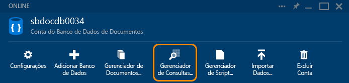
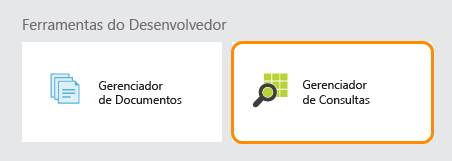
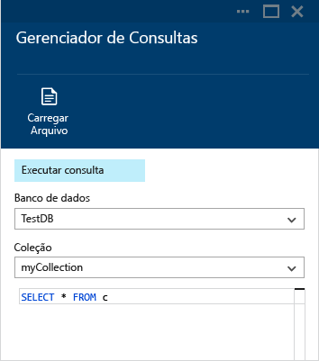
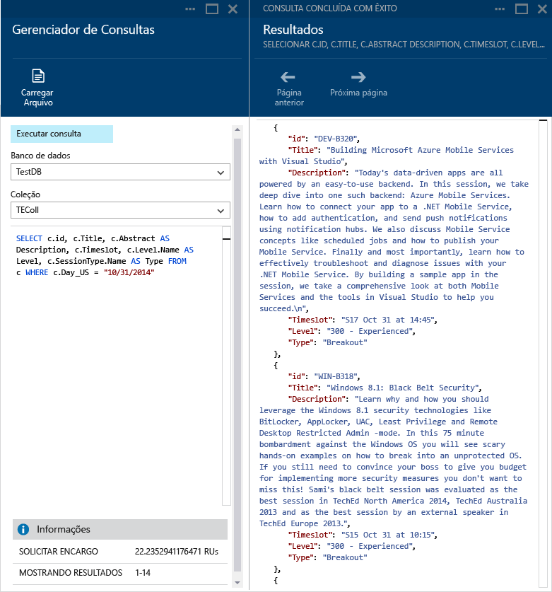
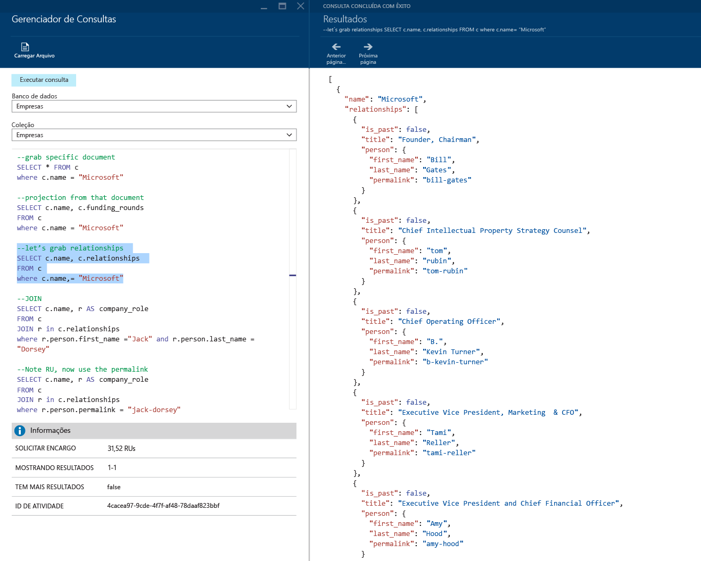
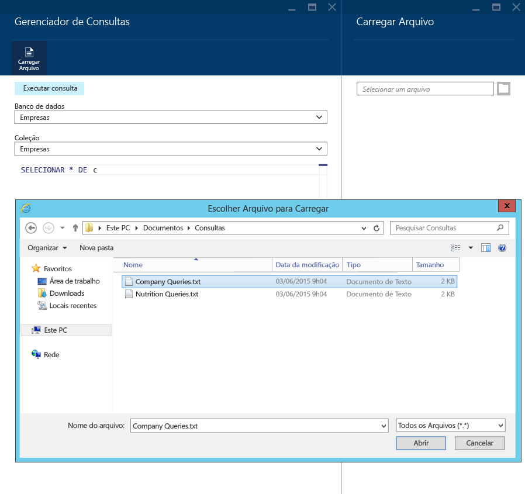
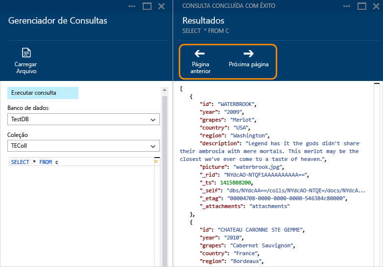
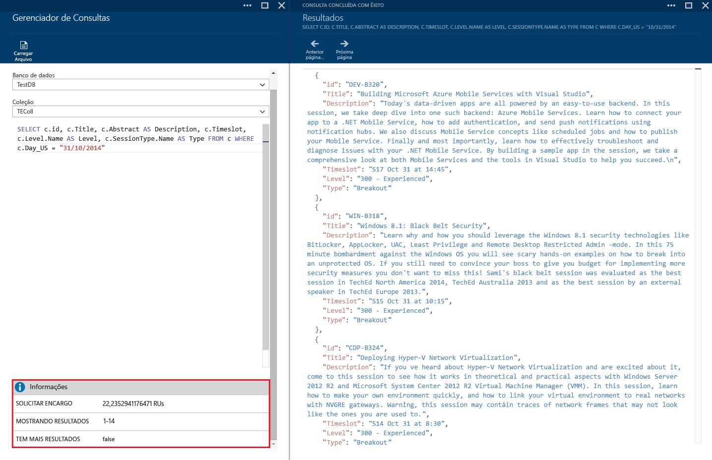
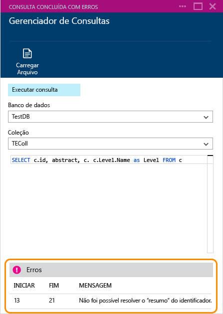

<properties 
	pageTitle="Criar, editar e executar consultas SQL em uma coleção do Banco de Dados de Documentos usando o Gerenciador de Consultas | Microsoft Azure" 
	description="Saiba mais sobre o Gerenciador de Consultas do Banco de Dados de Documentos, uma ferramenta de Portal do Azure para criar, editar e executar consultas SQL em uma coleção do Banco de Dados de Documentos." 
	services="documentdb" 
	authors="AndrewHoh" 
	manager="jhubbard" 
	editor="monicar" 
	documentationCenter=""/>

<tags 
	ms.service="documentdb" 
	ms.workload="data-services" 
	ms.tgt_pltfrm="na" 
	ms.devlang="na" 
	ms.topic="get-started-article"
	ms.date="12/01/2015" 
	ms.author="anhoh"/>

# Criar, editar e executar consultas SQL em uma coleção do Banco de Dados de Documentos usando o Gerenciador de Consultas #

Este artigo fornece uma visão geral do Gerenciador de Consultas do [Banco de Dados de Documentos do Microsoft Azure](http://azure.microsoft.com/services/documentdb/), uma ferramenta do Portal do Microsoft Azure que habilita criar, editar e executar consultas em uma coleção do Banco de Dados de Documentos.

Depois de concluir este tutorial, você poderá responder às seguintes perguntas:

-	Como posso criar, editar e executar facilmente consultas em uma coleção do Banco de Dados de Documentos por meio de um navegador da Web?
-	Como eu posso navegar facilmente entre as páginas de resultados de consultas do Banco de Dados de Documentos por meio de um navegador da Web?
-	Como eu posso solucionar erros de sintaxe com minha consulta do Banco de Dados de Documentos? 

##Iniciar e navegar pelo Gerenciador de Consultas##

O Gerenciador de Consultas pode ser iniciado por meio de qualquer conta, banco de dados ou lâmina de coleção do Banco de Dados de Documentos.
  
1. Na parte superior da conta do Banco de Dados de Documentos ou folha de banco de dados, basta clicar no comando **Gerenciador de Consultas**.

	

2. Como alternativa, na parte inferior de cada folha, há uma lente de **Ferramentas de Desenvolvedor** que contém o bloco do **Gerenciador de Consultas**.
	
	

2. Basta clicar no bloco para iniciar o Gerenciador de Consultas.

	As caixas das listas suspensas **Banco de dados** e **Coleção** são preenchidas previamente dependendo da situação em que você inicia o Gerenciador de Consultas. Por exemplo, se você iniciá-lo por meio de uma lâmina de banco de dados, o banco de dados atual será preenchido. Se iniciá-lo por meio de uma lâmina de coleção, a coleção atual será preenchida.

	

##Criar, editar e executar consultas com o Gerenciador de Consultas##

O Gerenciador de Consultas permite criar, editar e executar consultas facilmente em uma coleção do Banco de Dados de Documentos, e inclui o realce de valores e palavras-chave básicas para aprimorar a experiência de criação de consultas.

- Ao abrir o Gerenciador de Consultas inicialmente, uma consulta padrão SELECT * FROM c é fornecida. Você pode aceitar a consulta padrão ou construir a sua e clicar no botão **Executar consulta** para exibir os resultados. O Gerenciador de Consultas dá suporte à linguagem de consulta SQL do Banco de Dados de Documentos, conforme descrito em [Consultar o Banco de Dados de Documentos](documentdb-sql-query.md).

	

- Você também pode inserir várias consultas, realçar a que você deseja executar e clicar no botão **Executar consulta** para exibir os resultados.

	

- Você pode carregar o conteúdo de um arquivo existente usando o comando **Carregar Arquivo**.

	

- Por padrão, o Gerenciador de Consultas retorna resultados em conjuntos de 100. Se sua consulta produzir mais de 100 resultados, basta usar os comandos **Próxima página** e **Página anterior** para percorrer o conjunto de resultados.

	

- Consultas bem-sucedidas fornecem informações como a carga de solicitação, o conjunto de resultados em exibição e se há mais resultados, que podem ser acessados usando o comando **Próxima página**, como mencionado anteriormente.

	

- Da mesma forma, se uma consulta for concluída com erros, o Gerenciador de Consultas exibe uma lista de erros que podem ajudar em esforços de solução de problemas.

	

##Próximas etapas

- Para saber mais sobre o Banco de Dados de Documentos, clique [aqui](http://azure.com/docdb).
- Para saber mais sobre a gramática SQL do Banco de Dados de Documentos com suporte pelo Gerenciador de Consultas, clique [aqui](documentdb-sql-query.md).
 

<!---HONumber=AcomDC_1203_2015-->