<properties 
	pageTitle="Exibir, editar, criar e carregar documentos JSON usando o Gerenciador de Documentos do Banco de Dados de Documentos | Azure" 
	description="Saiba mais sobre o Gerenciador de Documentos do Banco de Dados de Documentos, uma ferramenta do Portal de Visualização do Azure para exibir, editar, criar e carregar documentos JSON com o Banco de Dados de Documentos." 
	services="documentdb" 
	authors="stephbaron" 
	manager="johnmac" 
	editor="monicar" 
	documentationCenter=""/>

<tags 
	ms.service="documentdb" 
	ms.workload="data-services" 
	ms.tgt_pltfrm="na" 
	ms.devlang="na" 
	ms.topic="article" 
	ms.date="02/13/2015" 
	ms.author="stbaro"/>

# Exibir, editar, criar e carregar documentos JSON usando o Gerenciador de Documentos do Banco de Dados de Documentos #

Este artigo fornece uma visão geral do Gerenciador de Documentos do [Banco de Dados de Documentos do Microsoft Azure](http://azure.microsoft.com/services/documentdb/), uma ferramenta do Portal de Visualização do Azure que habilita exibir, editar, criar e carregar documentos JSON com o Banco de Dados de Documentos. 

Depois de concluir este tutorial, você poderá responder às seguintes perguntas:  

-	Como posso criar, exibir, editar e excluir facilmente documentos individuais do Banco de Dados de Documentos usando um navegador da Web?
-	Como posso exibir facilmente as propriedades do sistema de um documento no Banco de Dados de Documentos usando um navegador da Web?
-	Como posso realizar facilmente a ingestão de documentos em massa no Banco de Dados de Documentos usando um navegador da Web?

##Iniciar e navegar pelo Gerenciador de Documentos##

O Gerenciador de Documentos pode ser iniciado por meio de qualquer conta, banco de dados ou lâmina de coleção do Banco de Dados de Documentos.  

1. Na parte inferior de cada lâmina há uma lente de **Ferramentas do Desenvolvedor** que contém o **Gerenciador de Documentos**.

	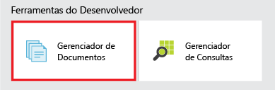 

2. Basta clicar no bloco para iniciar o Gerenciador de Documentos.

	
As caixas das listas suspensas **Banco de dados** e **Coleção** são preenchidas previamente dependendo da situação em que você inicia o Gerenciador de Documentos.  Por exemplo, se você iniciá-lo por meio de uma lâmina de banco de dados, o banco de dados atual será preenchido.  Se iniciá-lo por meio de uma lâmina de coleção, a coleção atual será preenchida.

	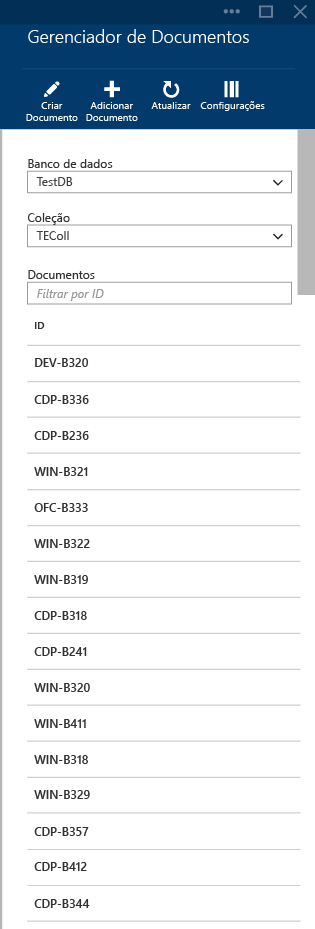

3. O Gerenciador de Documentos carrega até os primeiros 100 documentos da coleção selecionada.  Você pode carregar documentos adicionais (em lotes de 100) selecionando a opção **Carregar mais** na parte inferior da lâmina do Gerenciador de Documentos.  

4. As caixas das listas suspensas **Banco de dados** e **Coleção** podem ser usadas para alterar a coleção cujos documentos estão sendo exibidos sem precisar fechar e iniciar o Gerenciador de Documentos novamente.  

5. O Gerenciador de Documentos também dá suporte à filtragem do conjunto de documentos carregados atualmente segundo a propriedade de ID.  Basta digitar na caixa de filtro.

	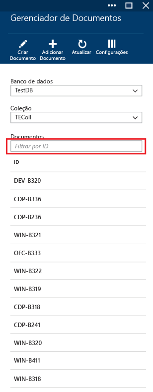 

	E os resultados da lista do Gerenciador de Documentos são filtrados com base nos critérios fornecidos.

	

	> [AZURE.IMPORTANT] A funcionalidade de filtro do Gerenciador de Documentos filtra somente o conjunto de documentos carregado ***atualmente*** e não consulta a coleção selecionada.

6. Para atualizar a lista de documentos carregada pelo Gerenciador de Documentos, basta clicar no comando **Atualizar** no topo da lâmina.

	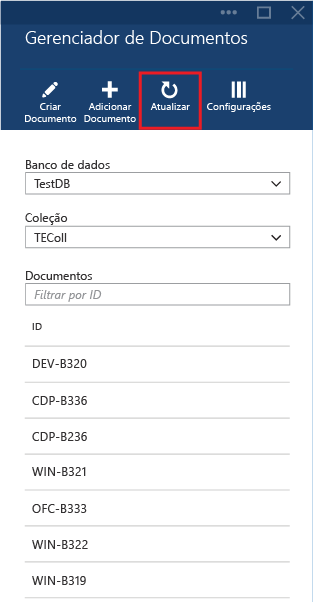

##Exibir, criar e editar documentos com o Gerenciador de Documentos##

O Gerenciador de Documentos permite criar, editar e excluir documentos com facilidade.  

- Para criar um documento, basta clicar no comando **Criar Documento** e um trecho de JSON mínimo é fornecido.

	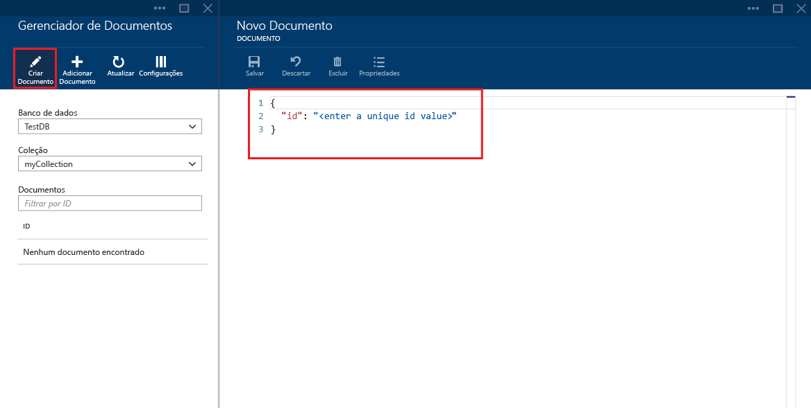 

- Basta digitar ou colar o conteúdo JSON do documento que você deseja criar e clicar no comando **Salvar** para confirmar o documento.

	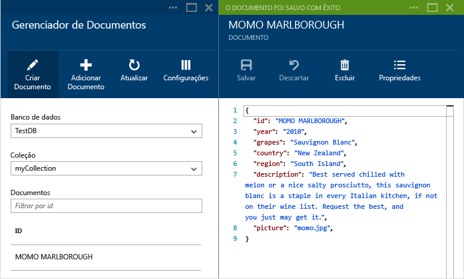

	> [AZURE.NOTE] Se você não fornecer uma propriedade de "id", o Gerenciador de Documentos adiciona automaticamente uma propriedade de ID e gera um GUID como o valor da ID. 

- Para editar um documento existente, basta selecioná-lo no Gerenciador de Documentos, editar o documento como quiser e clicar no comando **Salvar**.

	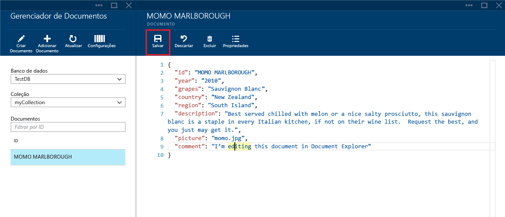

- Se você estiver editando um documento e decidir que quer descartar as edições feitas, basta clicar no comando descartar e confirmar a ação. O documento no estado anterior será carregado novamente.

	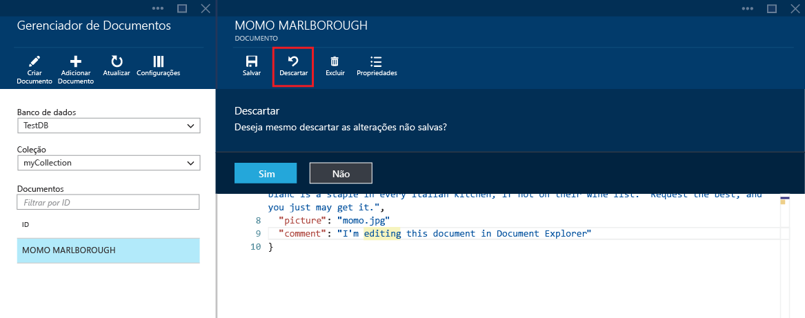

- Você pode excluir um documento selecionando-o, clicando no comando **Excluir** e confirmando a exclusão. Após a confirmação, o documento é removido imediatamente da lista do Gerenciador de Documentos:

	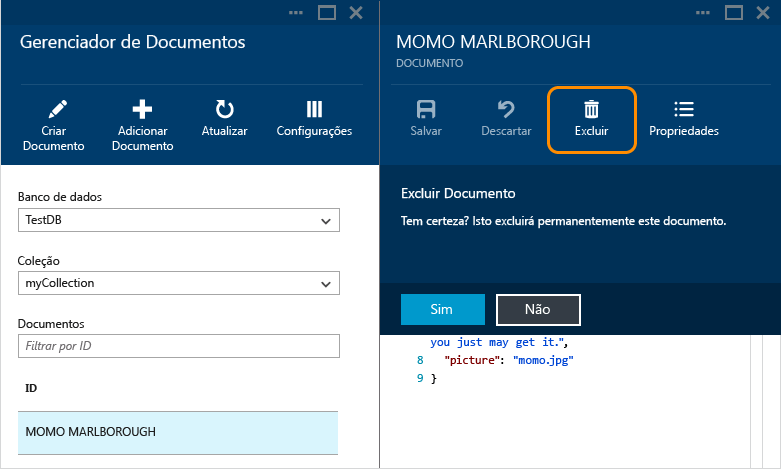

- Observe que o Gerenciador de Documentos valida que qualquer documento novo ou editado contém JSON válido.  Você pode passar o mouse sobre a seção incorreta para ver detalhes sobre o erro de validação.

	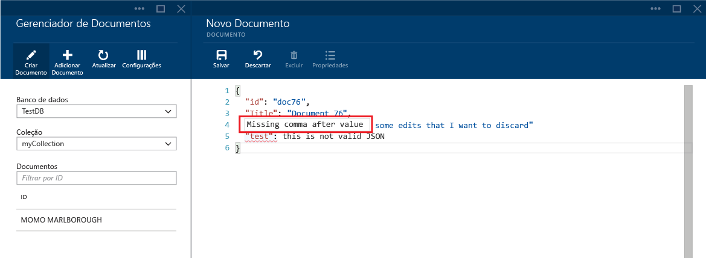

- Além disso, o Gerenciador de Documentos impede que você salve um documento com conteúdo JSON inválido.

	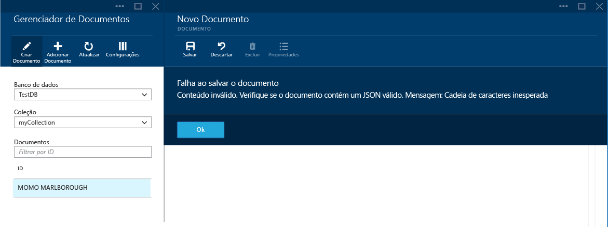

- Por fim, o Gerenciador de Documentos permite que você veja facilmente as propriedades de sistema do documento carregado clicando no comando **Propriedades**.

	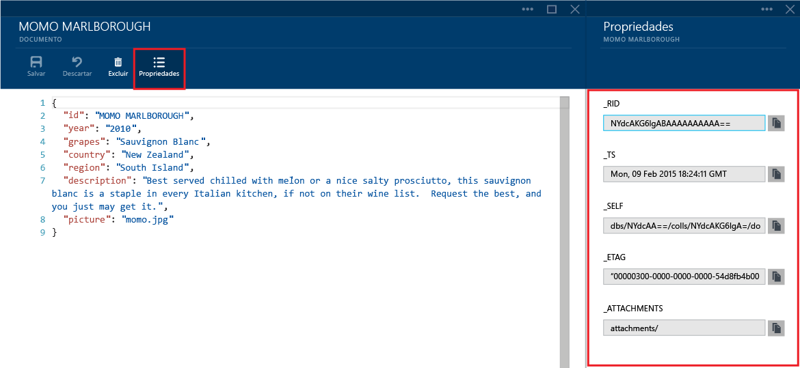

	> [AZURE.NOTE] A propriedade do carimbo de data/hora (_ts) é representada internamente como um tempo de época, mas o Gerenciador de Documentos exibe o valor em um formato GMT legível.

##Adicionar documentos em massa com o Gerenciador de Documentos##

O Gerenciador de Documentos dá suporte à ingestão em massa de um ou mais documentos JSON existentes.  

1. Para iniciar o processo de carregamento, clique no comando **Adicionar Documento**.
	
	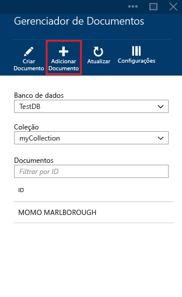

2. Uma nova lâmina é aberta.  Clique no botão Procurar para abrir uma janela do Explorador de Arquivos e selecione um ou mais documentos JSON para carregar.

	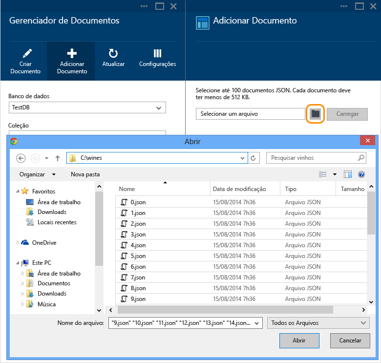

	> [AZURE.NOTE] Atualmente, o Gerenciador de Documentos dá suporte a até 100 documentos JSON por operação de carregamento.

3. Quando estiver satisfeito com sua seleção, clique no botão **Carregar**.  Os documentos são adicionados automaticamente à grade do Gerenciador de Documentos e os resultados do carregamento são exibidos conforme o andamento da operação. Falhas na importação são informadas por arquivo individual.

	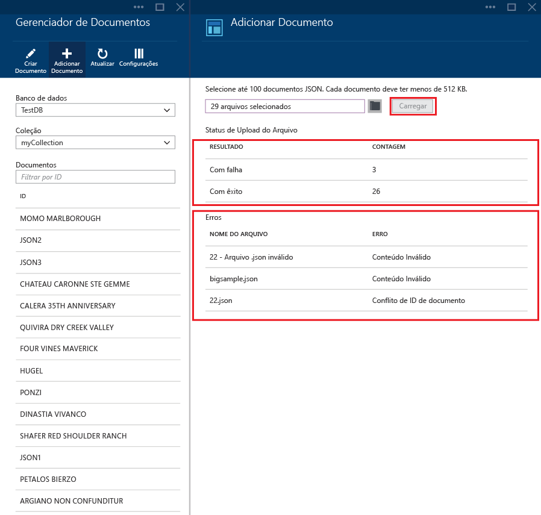

4. Após a conclusão da operação, você pode selecionar até mais 100 documentos para carregar.

##Próximas etapas

Para saber mais sobre o Banco de Dados de Documentos, clique [aqui](http://azure.com/docdb).

<!--HONumber=49--> 