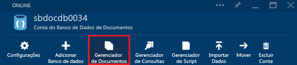
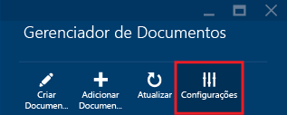
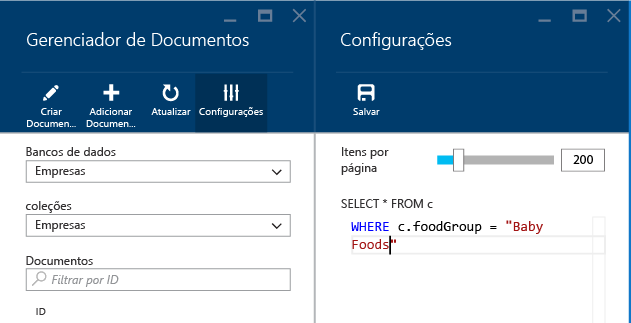

<properties
	pageTitle="Exibir, editar, criar e carregar documentos JSON usando o Gerenciador de Documentos do Banco de Dados de Documentos | Microsoft Azure"
	description="Saiba mais sobre o Gerenciador de Documentos do Banco de Dados de Documentos, uma ferramenta do Portal de Visualização do Azure para exibir, editar, criar e carregar documentos JSON com o Banco de Dados de Documentos."
	services="documentdb"
	authors="AndrewHoh"
	manager="jhubbard"
	editor="monicar"
	documentationCenter=""/>

<tags
	ms.service="documentdb"
	ms.workload="data-services"
	ms.tgt_pltfrm="na"
	ms.devlang="na"
	ms.topic="get-started-article" 
	ms.date="09/09/2015"
	ms.author="anhoh"/>

# Exibir, editar, criar e carregar documentos JSON usando o Gerenciador de Documentos do Banco de Dados de Documentos #

Este artigo fornece uma visão geral do Gerenciador de Documentos do [Banco de Dados de Documentos do Microsoft Azure](http://azure.microsoft.com/services/documentdb/), uma ferramenta do portal de Visualização do Azure que o habilita a exibir, editar, criar e carregar documentos JSON com o Banco de Dados de Documentos.

Depois de concluir este tutorial, você poderá responder às seguintes perguntas:

-	Como posso criar, exibir, editar e excluir facilmente documentos individuais do Banco de Dados de Documentos usando um navegador da Web?
-	Como posso exibir facilmente as propriedades do sistema de um documento no Banco de Dados de Documentos usando um navegador da Web?
-	Como posso realizar facilmente a ingestão de documentos em massa no Banco de Dados de Documentos usando um navegador da Web?

##Iniciar Gerenciador de Documentos##

O Gerenciador de Documentos pode ser iniciado por meio de qualquer conta, banco de dados ou lâmina de coleção do Banco de Dados de Documentos.

1. Na parte superior da folha da conta do Banco de Dados de Documentos ou do banco de dados, basta clicar no comando **Gerenciador de Documentos**.

	
 
2. Como alternativa, na parte inferior de cada folha há uma lente **Ferramentas de Desenvolvedor** que contém a parte do **Gerenciador de Documentos**.

	

2. Basta clicar no bloco para iniciar o Gerenciador de Documentos.

	
As caixas de listagem suspensa **Banco de dados** e **Coleção** são populadas previamente dependendo do contexto em que você inicia o Gerenciador de Documentos. Por exemplo, se você iniciá-lo por meio de uma lâmina de banco de dados, o banco de dados atual será preenchido. Se iniciá-lo por meio de uma lâmina de coleção, a coleção atual será preenchida.

	

##Exibir, criar e editar documentos com o Gerenciador de Documentos##

O Gerenciador de Documentos permite criar, editar e excluir documentos com facilidade.

- Para criar um documento, basta clicar no comando **riar Documento**, e um trecho de JSON mínimo é fornecido.

	

- Basta digitar ou colar o conteúdo JSON do documento que você deseja criar e clicar no comando **Salvar** para confirmar o documento.

	

	> [AZURE.NOTE]Se você não fornecer uma propriedade de "id", o Gerenciador de Documentos adiciona automaticamente uma propriedade de ID e gera um GUID como o valor da ID.

- Se já tiver dados de arquivos JSON, MongoDB, SQL Server, arquivos CSV, armazenamento de Tabela do Azure, Amazon DynamoDB, HBase ou de outras coleções do Banco de Dados de Documentos, você poderá usar a [ferramenta de migração de dados](documentdb-import-data.md) do Banco de Dados de Documentos para importar rapidamente os dados.

- Para editar um documento existente, basta selecioná-lo no Gerenciador de Documentos, editar o documento como quiser e clicar no comando **Salvar**.

	

- Se você estiver editando um documento e decidir que quer descartar as edições feitas, basta clicar no comando descartar e confirmar a ação. O documento no estado anterior será carregado novamente.

	

- Você pode excluir um documento selecionando-o, clicando no comando **Excluir** e confirmando a exclusão. Após a confirmação, o documento é removido imediatamente da lista do Gerenciador de Documentos:

	

- Observe que o Gerenciador de Documentos valida que qualquer documento novo ou editado contém JSON válido. Você pode passar o mouse sobre a seção incorreta para ver detalhes sobre o erro de validação.

	

- Além disso, o Gerenciador de Documentos impede que você salve um documento com conteúdo JSON inválido.

	

- Por fim, o Gerenciador de Documentos permite que você veja facilmente as propriedades de sistema do documento carregado clicando no comando **Propriedades**.

	

	> [AZURE.NOTE]A propriedade do carimbo de data/hora (\_ts) é representada internamente como um tempo de época, mas o Gerenciador de Documentos exibe o valor em um formato GMT legível.

##Opções de navegação e configurações avançadas do Gerenciador de Documentos##

O Gerenciador de Documentos oferece suporte a várias opções de navegação e configurações avançadas

1. Por padrão, o Gerenciador de Documentos carrega os 100 primeiros documentos na coleção selecionada, por sua data de criação, do antigo ao mais recente. Você pode carregar documentos adicionais (em lotes de 100), selecionando a opção **Carregar mais** na parte inferior da folha do Gerenciador de Documentos. Para modificar o comportamento padrão, clique no comando Configurações na parte superior da folha do Gerenciador de Documentos.

	

2. Na folha Configurações, você pode ajustar o número de itens a serem retornados por página, bem como fornecer uma cláusula WHERE para carregar documentos correspondentes na grade do Gerenciador de Documentos. Leia mais sobre a gramática SQL do Banco de Dados de Documentos [aqui](documentdb-sql-query.md).

	

	> [AZURE.NOTE]Depois de modificar as configurações do Gerenciador de Documentos, você deve clicar no comando **Atualizar** para aplicar as novas configurações. As configurações serão mantidas somente na sessão atual do navegador.
	
3. As caixas das listas suspensas **Banco de Dados** e **Coleção** podem ser usadas para alterar a coleção cujos documentos estão sendo exibidos sem precisar fechar e iniciar o Gerenciador de Documentos novamente.

4. O Gerenciador de Documentos também dá suporte à filtragem do conjunto de documentos carregados atualmente segundo a propriedade de ID. Basta digitar na caixa de filtro.

	

	E os resultados da lista do Gerenciador de Documentos são filtrados com base nos critérios fornecidos.

	

	> [AZURE.IMPORTANT]A funcionalidade de filtro do Gerenciador de Documentos filtra somente o conjunto de documentos carregado ***atualmente*** e não consulta a coleção selecionada.

5. Para atualizar a lista de documentos carregada pelo Gerenciador de Documentos, basta clicar no comando **Atualizar** na parte superior da folha.

	

##Adicionar documentos em massa com o Gerenciador de Documentos##

O Gerenciador de Documentos dá suporte à ingestão em massa de um ou mais documentos JSON existentes.

1. Para iniciar o processo de carregamento, clique no comando **Adicionar Documento**.

	

2. Uma nova lâmina é aberta. Clique no botão Procurar para abrir uma janela do Explorador de Arquivos e selecione um ou mais documentos JSON para carregar.

	

	> [AZURE.NOTE]Atualmente, o Gerenciador de Documentos dá suporte a até 100 documentos JSON por operação de carregamento.

3. Quando estiver satisfeito com sua seleção, clique no botão **Carregar**. Os documentos são adicionados automaticamente à grade do Gerenciador de Documentos e os resultados do carregamento são exibidos conforme o andamento da operação. Falhas na importação são informadas por arquivo individual.

	

4. Após a conclusão da operação, você pode selecionar até mais 100 documentos para carregar.

##Próximas etapas

- Para saber mais sobre o Banco de Dados de Documentos, clique [aqui](http://azure.com/docdb).

 

<!---HONumber=Oct15_HO4-->