# <a name="create-and-route-blob-storage-events-with-the-azure-portal-and-event-grid"></a>Criar e rotear eventos personalizados de armazenamento de Blobs com o portal do Azure e a Grade de Eventos

A Grade de Eventos do Azure é um serviço de eventos para a nuvem. Neste artigo, você usa o portal do Azure para criar uma conta de armazenamento de Blobs, faz uma assinatura para os eventos desse mesmo armazenamento de Blobs e dispara um evento para exibir o resultado. Normalmente, você envia eventos para um ponto de extremidade que processa os dados de evento e realiza ações. No entanto, para simplificar este artigo, você enviará os eventos para um aplicativo Web que coleta e exibe as mensagens.

[!INCLUDE [quickstarts-free-trial-note.md](../../includes/quickstarts-free-trial-note.md)]

Ao concluir, você verá que os dados do evento foram enviados para um aplicativo Web.

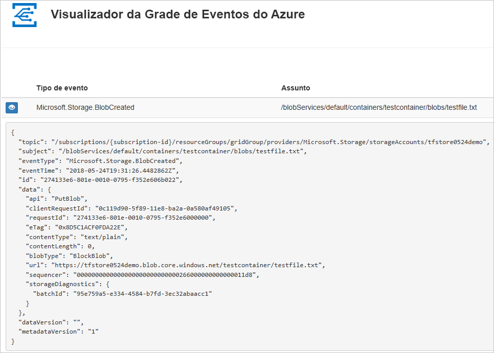

## <a name="create-a-storage-account"></a>Criar uma conta de armazenamento

1. Entre no [Portal do Azure](https://portal.azure.com/).

1. Para criar um armazenamento de Blobs, selecione **Criar um recurso**. 

   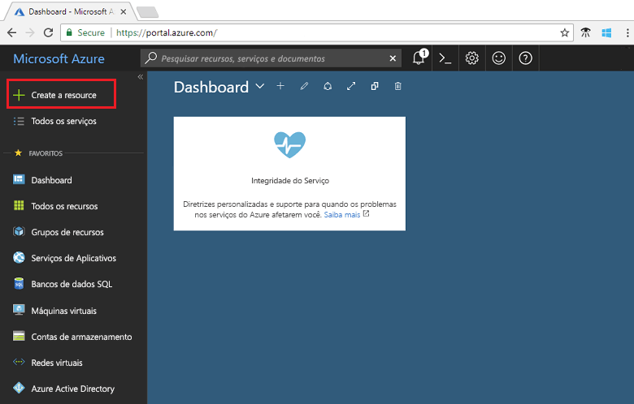

1. Selecione **Armazenamento** para filtrar as opções disponíveis e selecione **Conta de armazenamento - Blobs, arquivos, tabelas, filas**.

   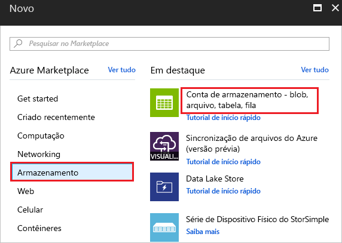

1. Para assinar eventos, crie uma conta de armazenamento v2 para uso geral ou uma conta de armazenamento de blobs. Para obter mais informações, consulte [Criar uma conta de armazenamento](../storage/common/storage-quickstart-create-account.md).

   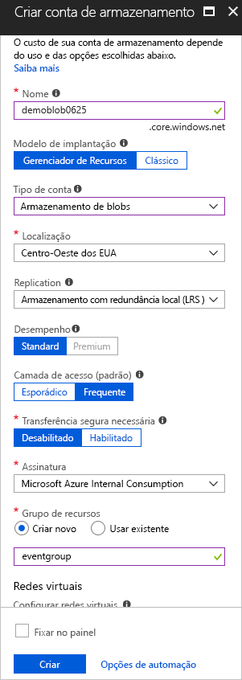

## <a name="create-a-message-endpoint"></a>Criar um ponto de extremidade de mensagem

Antes de assinar eventos para o armazenamento de Blobs, vamos criar o ponto de extremidade para mensagens de evento. Normalmente, o ponto de extremidade executa ações com base nos dados de evento. Para simplificar este início rápido, você implanta um [aplicativo Web criado previamente](https://github.com/Azure-Samples/azure-event-grid-viewer) que exibe as mensagens de eventos. A solução implantada inclui um plano do Serviço de Aplicativo, um aplicativo Web do Aplicativo do Serviço de e o código-fonte do GitHub.

1. Selecione **Implantar no Azure** para implantar a solução na sua assinatura. No portal do Azure, forneça os valores para os parâmetros.

   <a href="https://portal.azure.com/#create/Microsoft.Template/uri/https%3A%2F%2Fraw.githubusercontent.com%2FAzure-Samples%2Fazure-event-grid-viewer%2Fmaster%2Fazuredeploy.json" target="_blank"></a>

1. A implantação pode levar alguns minutos para ser concluída. Depois que a implantação for bem-sucedida, exiba seu aplicativo Web para garantir que ele esteja em execução. Em um navegador da Web, navegue até: `https://<your-site-name>.azurewebsites.net`

1. Você verá o site, mas nenhum evento ainda estará publicado.

   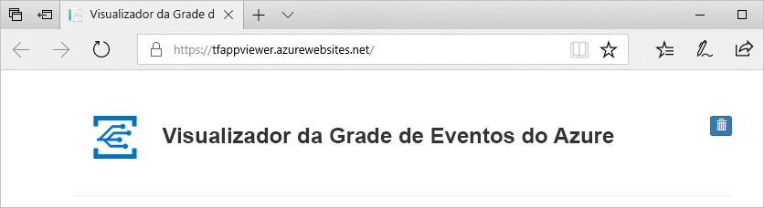

[!INCLUDE [event-grid-register-provider-portal.md](../../includes/event-grid-register-provider-portal.md)]

## <a name="subscribe-to-the-blob-storage"></a>Inscreva-se no armazenamento de Blobs

Assine um tópico para indicar à Grade de Eventos quais eventos você deseja acompanhar e para onde enviar os eventos.

1. No portal, selecione seu armazenamento de Blobs e selecione **Eventos**.

   

1. Para enviar eventos para o seu aplicativo visualizador, use um web hook para o ponto de extremidade. Selecione **Mais opções** e **Web Hook**.

   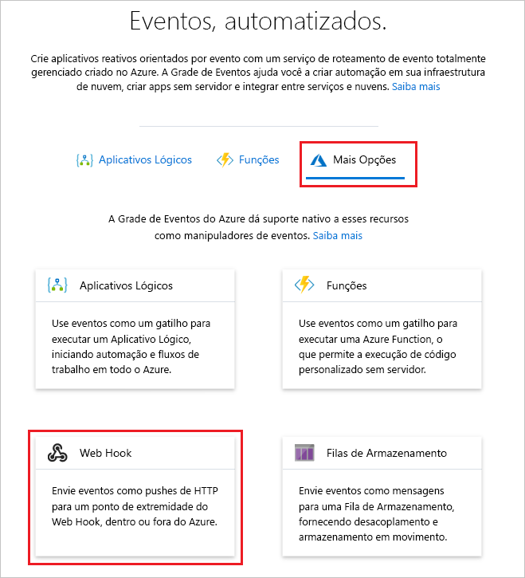

1. A assinatura do evento é previamente preenchida com valores para o armazenamento de Blobs. Para o ponto de extremidade do web hook, forneça a URL do seu aplicativo Web e adicione `api/updates` à URL da página inicial. Dê à sua assinatura um nome. Ao terminar, selecione **Criar**.

   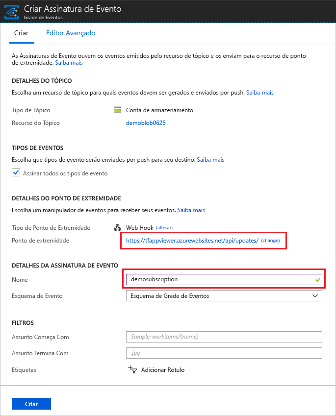

1. Exiba novamente o seu aplicativo Web e observe que um evento de validação de assinatura foi enviado a ele. Selecione o ícone de olho para expandir os dados de evento. A Grade de Eventos envia o evento de validação de modo que o ponto de extremidade possa verificar se ele deseja receber os dados de evento. O aplicativo Web inclui o código para validar a assinatura.

   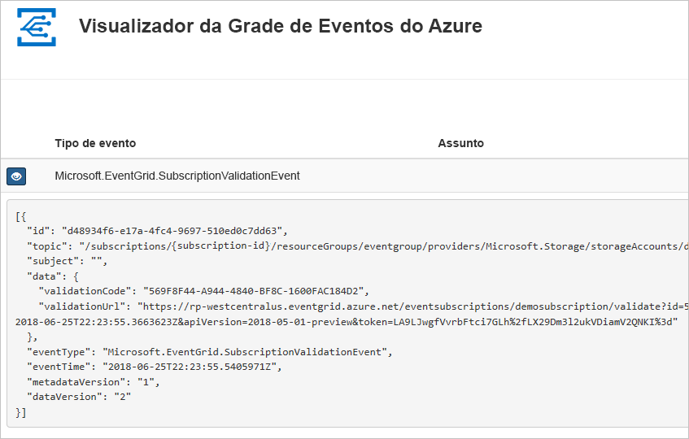

Agora, vamos disparar um evento para ver como a Grade de Eventos distribui a mensagem para o ponto de extremidade.

## <a name="send-an-event-to-your-endpoint"></a>Enviar um evento para o ponto de extremidade

Você pode disparar um evento para o armazenamento de Blobs carregando um arquivo. O arquivo não precisa de um conteúdo específico. Os artigos supõem que você tem um arquivo chamado testfile.txt, mas você pode usar qualquer arquivo.

1. Para o armazenamento de Blobs, selecione **Blobs**.

   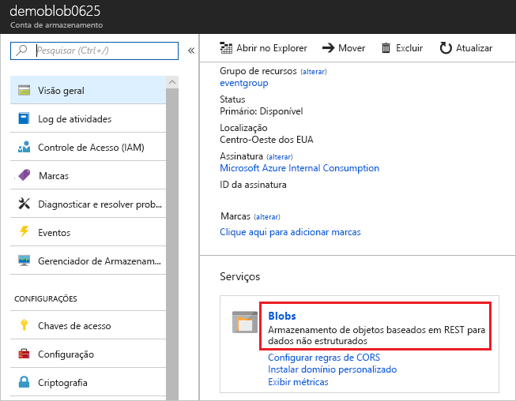

1. Selecionar **+ Contêiner**. Dê um nome ao seu contêiner e use qualquer nível de acesso.

   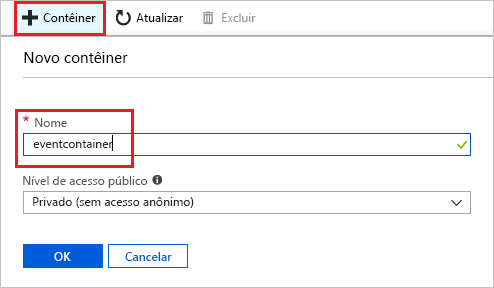

1. Selecione o novo contêiner.

   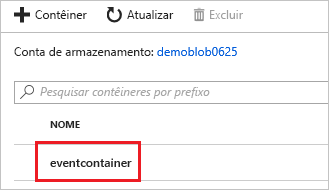

1. Para carregar um arquivo, selecione **Carregar**.

   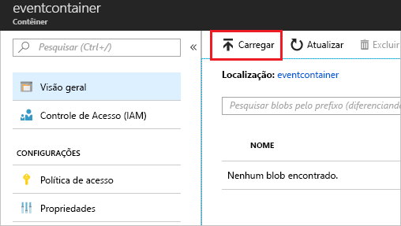

1. Navegue até seu arquivo de teste e carregue-o.

1. Você disparou o evento, e a Grade de Eventos enviou a mensagem para o ponto de extremidade configurado durante a assinatura. Veja seu aplicativo Web e observe que um evento criado por Blob foi recebido. 

  ```json
  {
    "topic": "/subscriptions/{subscription-id}/resourceGroups/eventgroup/providers/Microsoft.Storage/storageAccounts/demoblob0625",
    "subject": "/blobServices/default/containers/eventcontainer/blobs/testfile.txt",
    "eventType": "Microsoft.Storage.BlobCreated",
    "eventTime": "2018-06-25T22:50:41.1823131Z",
    "id": "89a2f9da-c01e-00bb-13d6-0c599506e4e3",
    "data": {
      "api": "PutBlockList",
      "clientRequestId": "41341a9b-e977-4a91-9000-c64125039047",
      "requestId": "89a2f9da-c01e-00bb-13d6-0c5995000000",
      "eTag": "0x8D5DAEE13C8F9ED",
      "contentType": "text/plain",
      "contentLength": 4,
      "blobType": "BlockBlob",
      "url": "https://demoblob0625.blob.core.windows.net/eventcontainer/testfile.txt",
      "sequencer": "00000000000000000000000000001C24000000000004712b",
      "storageDiagnostics": {
        "batchId": "ef633252-32fd-464b-8f5a-0d10d68885e6"
      }
    },
    "dataVersion": "",
    "metadataVersion": "1"
  }
  ```

## <a name="clean-up-resources"></a>Limpar recursos

Caso planeje continuar a trabalhar com esse evento, não limpe os recursos criados neste artigo. Caso contrário, exclua os recursos criados neste artigo.

Selecione o grupo de recursos e selecione **Excluir grupo de recursos**.

## <a name="next-steps"></a>Próximas etapas

Agora que você sabe como criar tópicos e assinaturas de evento personalizados, saiba mais sobre como a Grade de Eventos pode ajudá-lo:

- [Sobre a Grade de Eventos](overview.md)
- [Rotear eventos do Armazenamento de Blobs para um ponto de extremidade da Web personalizado](../storage/blobs/storage-blob-event-quickstart.md?toc=%2fazure%2fevent-grid%2ftoc.json)
- [Monitorar alterações de máquina virtual com a Grade de Eventos do Azure e os Aplicativos Lógicos](monitor-virtual-machine-changes-event-grid-logic-app.md)
- [Transmitir Big Data para um data warehouse](event-grid-event-hubs-integration.md)
