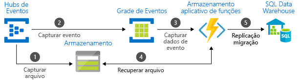

# Escolher entre serviços do Azure que entregam mensagens

O Azure oferece três serviços lhe ajudam na entrega de mensagens de evento ao longo de uma solução. Esses serviços são:

* [Grade de Eventos](/azure/event-grid/)
* [Hubs de Evento](/azure/event-hubs/)
* [Barramento de Serviço](/azure/service-bus-messaging/)

Embora tenham algumas semelhanças, cada serviço é criado para cenários específicos. Este artigo descreve as diferenças entre esses serviços e ajuda a entender qual deles escolher para seu aplicativo. Em muitos casos, os serviços de mensagens são complementares e podem ser usados juntos.

## Serviços de mensagens vs de eventos

Há uma distinção importante a observar entre serviços que entregam um evento e serviços que entregam uma mensagem.

### Evento

Um evento é uma notificação leve de uma ação ou de uma alteração de estado. Os dados do evento contêm informações sobre o que aconteceu, mas não contêm os dados que dispararam o evento. Por exemplo, um evento notifica os assinantes de que um arquivo foi criado. Ele pode conter informações gerais sobre o arquivo, mas não contém o arquivo propriamente dito. Em geral, eventos disparam manipuladores de eventos para atuar em tempo real.

### Mensagem

Uma mensagem é composta de dados brutos produzidos por um serviço para serem consumidos ou armazenados em outro lugar. A mensagem contém os dados que dispararam o pipeline de mensagem. Essa mensagem pode ser qualquer coisa, desde um pedido de comércio eletrônico até telemetria do usuário. Ao contrário do que ocorre em uma notificação de evento, o editor de uma mensagem pode esperar uma resposta. Por exemplo, uma mensagem contém os dados brutos, mas espera a próxima parte do sistema crie um arquivo com base nesses dados.

## Comparação de serviços

| Serviço | Finalidade | type | Quando usar |
| ------- | ------- | ---- | ----------- |
| Grade de Eventos | Programação reativa | Distribuição de eventos | Reagir a alterações de status |
| Hubs de evento | Pipeline de Big Data | Streaming de Eventos | Telemetria e streaming de dados distribuídos |
| Barramento de Serviço | Mensagens corporativas de alto valor | Mensagem | Processamento de pedidos e transações financeiras |

### Grade de Eventos

A Grade de Eventos é um backplane de eventos que permite a programação reativa e controlada por evento. Ele usa um modelo de publicação/assinatura. Editores emitem eventos, mas não têm nenhuma expectativa sobre quais eventos são manipulados. Os assinantes decidem quais eventos desejam manipular.

A Grade de Eventos está profundamente integrada aos serviços do Azure e pode ser integrada aos serviços de terceiros. Ele simplifica o consumo de eventos e reduz os custos, eliminando a necessidade de sondagem de constante. A Grade de Eventos faz o roteamento de eventos eficiente e confiável e encaminha eventos de recursos do Azure e não Azure. Ela distribui os eventos para os pontos de extremidade do assinante registrado. A mensagem de evento contém as informações necessárias para reagir a alterações em serviços e aplicativos. A Grade de Eventos não é um pipeline de dados e não entrega o objeto real atualizado.

Ele tem as seguintes características:

* dinamicamente escalonável
* baixo custo
* sem servidor

### Hubs de evento

O Hubs de Eventos do Azure é um pipeline de Big Data. Ele facilita a captura, a retenção e a reprodução de telemetria e dados de fluxo de eventos. Os dados podem vir de várias fontes simultâneas. O Hubs de Eventos permite que os dados de telemetria e eventos sejam disponibilizados para uma variedade de infraestruturas de processamento de fluxo e serviços de análise. Ele está disponível como fluxos de dados ou lotes de eventos em pacote. Esse serviço fornece uma solução única que permite a recuperação rápida de dados para processamento em tempo real, bem como reprodução repetida de dados brutos armazenados. Ele pode capturar os dados de streaming em um arquivo para processamento e análise.

Ele tem as seguintes características:

* baixa latência
* capaz de receber e processar milhões de eventos por segundo

### Barramento de Serviço

O Barramento de Serviço destina-se a aplicativos empresariais tradicionais. Esses aplicativos empresariais tradicionais exigem transações, ordenação, detecção de duplicidades e consistência instantânea. O Barramento de Serviço permite que os aplicativos nativos de nuvem forneçam gerenciamento de transição de estado confiável para os processos empresariais. Ao manipular mensagens de alto valor que não podem ser perdidas ou duplicadas, use o Barramento de Serviço do Azure. O Barramento de Serviço também facilita a comunicação altamente segura em soluções de nuvem híbrida e pode se conectar a sistemas locais existentes para soluções de nuvem.

O Barramento de Serviço é um sistema de mensagens agenciado. Ele armazena mensagens de maneira confiável em um "agente" (por exemplo, uma fila) até que a parte consumidora esteja pronta para recebê-las.

Ele tem as seguintes características:

* entrega confiável de mensagens assíncronas (sistema de mensagens empresarial como um serviço) que requer sondagem
* recursos de sistema de mensagens avançados como PEPS, envio em lote/sessões, transações, colocação de mensagens mortas em fila, controle temporal, roteamento e filtragem e detecção de duplicatas

## Usar os serviços juntos

Em alguns casos, você usa os serviços lado a lado para cumprir funções distintas. Por exemplo, um site de comércio eletrônico pode usar o Barramento de Serviço para processar o pedido, o Hubs de Eventos para capturar a telemetria de site e a Grade de Eventos para responder a eventos como o envio de um item.

Em outros casos, você os vincula juntos para formar um pipeline de dados e eventos. Você usa a Grade de Eventos para responder a eventos nos outros serviços. Para obter um exemplo de como usar a Grade de Eventos com o Hubs de Eventos para migrar dados para um data warehouse, consulte [Transmitir Big Data para um data warehouse](event-grid-event-hubs-integration.md). A imagem a seguir mostra o fluxo de trabalho para transmitir os dados.

## Próximas etapas

* Para obter mais informações sobre os serviços de mensagens do Azure, consulte a postagem de blog [Eventos, pontos de dados e mensagens – escolhendo o serviço de mensagens do Azure certo para seus dados](https://azure.microsoft.com/blog/events-data-points-and-messages-choosing-the-right-azure-messaging-service-for-your-data/).
* Para ver uma introdução à Grade de Eventos, confira [About Event Grid](overview.md) (Sobre a Grade de Eventos).
* Para começar a usar a Grade de Eventos, confira [Criar e rotear eventos personalizados com a Grade de Eventos do Azure](custom-event-quickstart.md).
* Para começar a usar o Hubs de Eventos, consulte [Criar um namespace do Hubs de Eventos e um hub de eventos usando o Portal do Azure](../event-hubs/event-hubs-create.md).
* Para começar a usar o Barramento de Serviço, consulte [Criar um namespace do Barramento de Serviço usando o Portal do Azure](../service-bus-messaging/service-bus-create-namespace-portal.md).