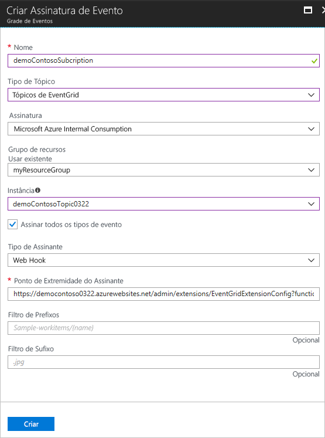

# <a name="create-and-route-custom-events-with-the-azure-portal-and-event-grid"></a>Criar e rotear eventos personalizados com o portal do Azure e a Grade de Eventos

A Grade de Eventos do Azure é um serviço de eventos para a nuvem. Neste artigo, você pode usar o portal do Azure para criar um tópico personalizado, assinar o tópico e disparar o evento para exibir o resultado. Normalmente, você envia eventos para um ponto de extremidade que responde ao evento, como um webhook ou uma Função do Azure. No entanto, para simplificar este artigo, você envia os eventos para uma URL que apenas coleta as mensagens. Você cria essa URL usando ferramentas de terceiros do [RequestBin](https://requestb.in/) ou [Hookbin](https://hookbin.com/).

>[!NOTE]
>**RequestBin** e **Hookbin** não servem para um uso de alta taxa de transferência. O uso dessas ferramentas é meramente demonstrativo. Se você efetuar push de mais de um evento por vez, talvez não veja todos os eventos na ferramenta.

Quando tiver concluído, você verá que os dados do evento foram enviados para um ponto de extremidade.


[!INCLUDE [quickstarts-free-trial-note.md](../../includes/quickstarts-free-trial-note.md)]

## <a name="create-a-resource-group"></a>Criar um grupo de recursos

Os tópicos de Grade de Eventos são recursos do Azure e devem ser colocados em um grupo de recursos do Azure. O grupo de recursos do Azure é uma coleção lógica na qual os recursos do Azure são implantados e gerenciados.

1. No painel de navegação esquerdo, selecione **Grupos de Recursos**. Em seguida, selecione **Adicionar**.

   

1. Defina o nome do grupo de recursos como *gridResourceGroup* e o local como *westus2*. Selecione **Criar**.

   

## <a name="create-a-custom-topic"></a>Criar um tópico personalizado

Um tópico fornece um ponto de extremidade definido pelo usuário aonde você posta seus eventos. 

1. Para criar um tópico no seu grupo de recursos, selecione **Mais serviços** e procure *grade de eventos*. Selecione **Tópicos de Grade de Eventos** entre as opções disponíveis.

   

1. Selecione **Adicionar**.

   

1. Forneça um nome para o tópico. O nome do tópico deve ser exclusivo, pois é representado por uma entrada DNS. Selecione uma das [regiões com suporte](overview.md). Selecione o grupo de recursos criado anteriormente. Selecione **Criar**.

   

1. Depois que o tópico tiver sido criado, selecione **Atualizar** para ver o tópico.

   

## <a name="create-a-message-endpoint"></a>Criar um ponto de extremidade de mensagem

Antes de assinar o tópico, vamos criar o ponto de extremidade para a mensagem do evento. Em vez de escrever código para responder ao evento, vamos criar um ponto de extremidade que coleta as mensagens, para que você possa exibi-las. RequestBin e Hookbin são ferramentas de terceiros que permitem criar um ponto de extremidade e exibir solicitações que são enviadas a ele. Acesse [RequestBin](https://requestb.in/) e clique em **Criar um RequestBin** ou acesse [Hookbin](https://hookbin.com/) e clique em **Cria novo ponto de extremidade**.  Copie a URL do compartimento, pois você precisará dela para assinar o tópico.

## <a name="subscribe-to-a-topic"></a>Assinar um tópico

Assine um tópico para indicar à Grade de Eventos quais eventos você deseja acompanhar. 

1. Para criar uma assinatura de Grade de Eventos, selecione novamente **Mais Serviços** e procure *grade de eventos*. Selecione **Assinaturas de Grade de Eventos** entre as opções disponíveis.

   

1. Selecione **+ Assinatura de Evento**.

   

1. Forneça um nome exclusivo para a assinatura de evento. Como o tipo de tópico, selecione **Tópicos de Grade de Eventos**. Para a instância, selecione o tópico personalizado que você criou. Forneça a URL de RequestBin ou Hookbin como o ponto de extremidade para notificação de eventos. Ao terminar de fornecer valores, selecione **Criar**.

   

Agora, vamos disparar um evento para ver como a Grade de Eventos distribui a mensagem para o ponto de extremidade. Para simplificar este artigo, use o Cloud Shell para enviar dados de evento de exemplo para o tópico. Normalmente, um aplicativo ou serviço do Azure enviaria os dados de evento.

[!INCLUDE [cloud-shell-try-it.md](../../includes/cloud-shell-try-it.md)]

## <a name="send-an-event-to-your-topic"></a>Enviar um evento para o tópico

Primeiro, vamos obter a URL e a chave para o tópico. Use o nome do tópico em `<topic_name>`.

```azurecli-interactive
endpoint=$(az eventgrid topic show --name <topic_name> -g gridResourceGroup --query "endpoint" --output tsv)
key=$(az eventgrid topic key list --name <topic_name> -g gridResourceGroup --query "key1" --output tsv)
```

O exemplo a seguir obtém os dados de exemplo de evento:

```azurecli-interactive
body=$(eval echo "'$(curl https://raw.githubusercontent.com/Azure/azure-docs-json-samples/master/event-grid/customevent.json)'")
```

Se você `echo "$body"`, pode ver o evento completo. O elemento `data` do JSON é a carga do evento. Qualquer JSON bem formado pode ficar nesse campo. Você também pode usar o campo de assunto para roteamento e filtragem avançados.

CURL é um utilitário que executa solicitações HTTP. Neste artigo, usamos o CURL para enviar um evento ao tópico. 

```azurecli-interactive
curl -X POST -H "aeg-sas-key: $key" -d "$body" $endpoint
```

Você disparou o evento e a Grade de Eventos enviou a mensagem para o ponto de extremidade configurado durante a assinatura. Navegue até a URL do ponto de extremidade que você criou anteriormente. Ou clique em Atualizar no navegador. Você verá o evento que acabou de ser enviado.

```json
[{
  "id": "1807",
  "eventType": "recordInserted",
  "subject": "myapp/vehicles/motorcycles",
  "eventTime": "2017-08-10T21:03:07+00:00",
  "data": {
    "make": "Ducati",
    "model": "Monster"
  },
  "dataVersion": "1.0",
  "metadataVersion": "1",
  "topic": "/subscriptions/{subscription-id}/resourceGroups/{resource-group}/providers/Microsoft.EventGrid/topics/{topic}"
}]
```

## <a name="clean-up-resources"></a>Limpar recursos

Se você planeja continuar a trabalhar com esse evento, não limpe os recursos criados neste artigo. Se você não planeja continuar, exclua os recursos criados neste artigo.

Selecione o grupo de recursos e selecione **Excluir grupo de recursos**.

## <a name="next-steps"></a>Próximas etapas

Agora que você sabe como criar tópicos e assinaturas de evento, saiba mais sobre como a Grade de Eventos pode ajudá-lo:

- [Sobre a Grade de Eventos](overview.md)
- [Rotear eventos do Armazenamento de Blobs para um ponto de extremidade da Web personalizado](../storage/blobs/storage-blob-event-quickstart.md?toc=%2fazure%2fevent-grid%2ftoc.json)
- [Monitorar alterações de máquina virtual com a Grade de Eventos do Azure e os Aplicativos Lógicos](monitor-virtual-machine-changes-event-grid-logic-app.md)
- [Transmitir Big Data para um data warehouse](event-grid-event-hubs-integration.md)
