# <a name="create-and-route-custom-events-with-the-azure-portal-and-event-grid"></a>Criar e rotear eventos personalizados com o portal do Azure e a Grade de Eventos

A Grade de Eventos do Azure é um serviço de eventos para a nuvem. Neste artigo, você pode usar o portal do Azure para criar um tópico personalizado, assinar o tópico e disparar o evento para exibir o resultado. Você pode enviar o evento para uma Função do Azure que registra os dados do evento. Ao concluir, você verá que os dados do evento foram enviados e registrados para um ponto de extremidade.

[!INCLUDE [quickstarts-free-trial-note.md](../../includes/quickstarts-free-trial-note.md)]

[!INCLUDE [event-grid-register-provider-portal.md](../../includes/event-grid-register-provider-portal.md)]

## <a name="create-a-custom-topic"></a>Criar um tópico personalizado

Um tópico de grade de evento fornece um ponto de extremidade definido pelo usuário no qual você posta seus eventos. 

1. Faça logon no [portal do Azure](https://portal.azure.com/).

1. Para criar um tópico personalizado, selecione **Criar um recurso**. 

   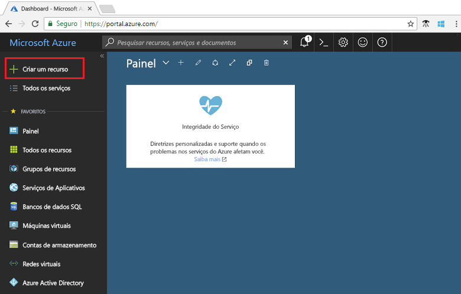

1. Pesquise *Tópico de Grade de Eventos* e selecione a partir das opções disponíveis.

   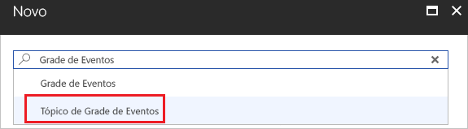

1. Selecione **Criar**.

   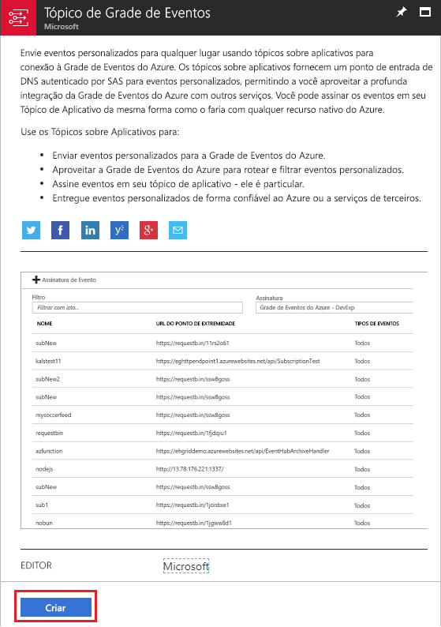

1. Forneça um nome exclusivo para o tópico personalizado. O nome do tópico deve ser exclusivo, pois é representado por uma entrada DNS. Não use o nome mostrado na imagem. Em vez disso, crie seu próprio nome. Selecione uma das [regiões com suporte](overview.md). Forneça um nome para um novo grupo de recursos. Selecione **Criar**.

   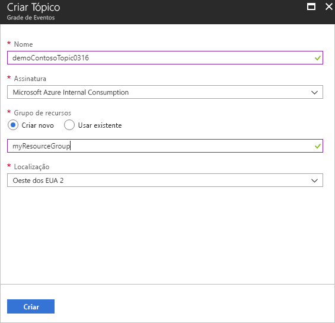

1. Depois que o tópico personalizado tiver sido criado, você verá a notificação de êxito.

   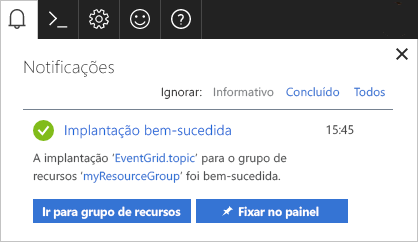

   Se a implantação não obteve êxito, descubra o que causou o erro. Selecione a **Implantação com falha**.

   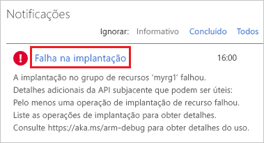

   Selecione a mensagem de erro.

   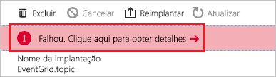

   A imagem a seguir mostra uma implantação que falhou porque o nome do tópico personalizado já está em uso. Se você vir esse erro, repita a implantação com um nome diferente.

   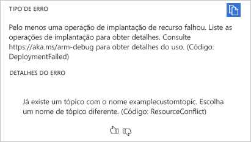

## <a name="create-an-azure-function"></a>Criar uma Função do Azure

Antes de assinar o tópico, vamos criar o ponto de extremidade para a mensagem do evento. Neste artigo, você pode usar o Azure Functions para criar um aplicativo de função para o ponto de extremidade.

1. Para criar uma função, selecione **Criar um recurso**.

   

1. Selecione **Computação** e **Aplicativo de funções**.

   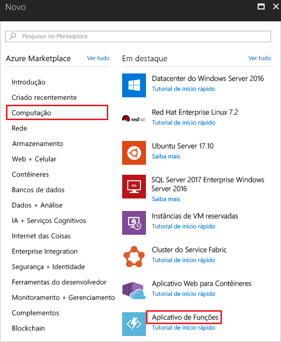

1. Forneça um nome exclusivo para o Azure Functions. Não use o nome mostrado na imagem. Selecione o grupo de recursos criado neste artigo. Para o plano de hospedagem, use **Plano de Consumo**. Use a nova conta de armazenamento sugerida. você pode desativar o Application Insights. Depois de definir os valores, selecione **Criar**.

   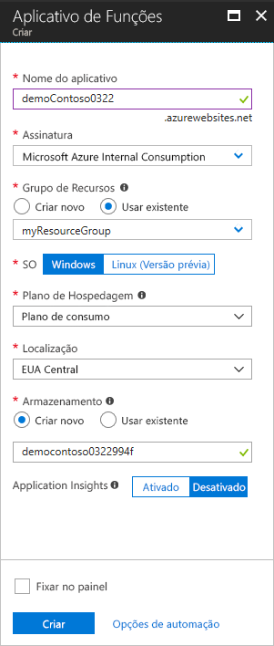

1. Quando a implantação for concluída, selecione **Ir para o recurso**.

   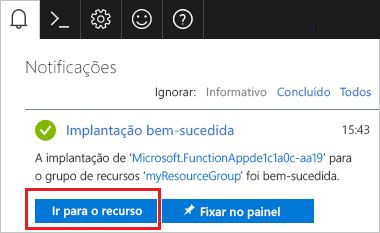

1. Ao lado de **Funções**, selecione **+**.

   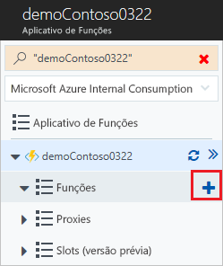

1. Entre as opções disponíveis, selecione **Função personalizada**.

   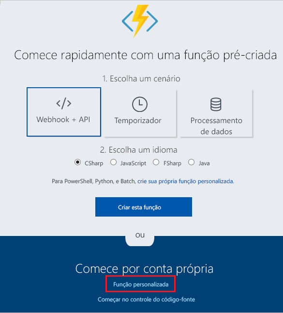

1. Role para baixo até encontrar **Gatilho de Grade de Eventos**. Selecione **C#**.

   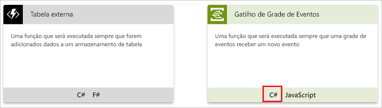

1. Aceite os valores padrão e selecione **Criar**.

   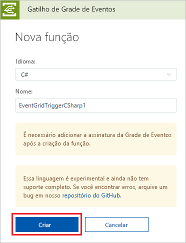

Sua função agora está pronta para receber eventos.

## <a name="subscribe-to-a-topic"></a>Assinar um tópico

Assine um tópico para indicar à Grade de Eventos quais eventos você deseja acompanhar e para onde enviar os eventos.

1. Em sua função do Azure, selecione **Adicionar Assinatura de Grade de Eventos**.

   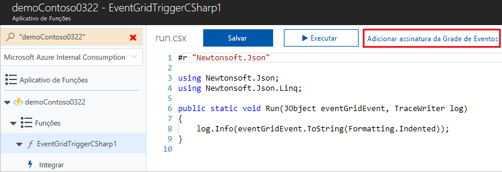

1. Forneça valores para a assinatura. Selecione **Tópicos de Grade de Eventos** para o tipo de tópico. Para assinatura e grupo de recursos, selecione a assinatura e o grupo de recursos em que você criou seu tópico personalizado. Por exemplo, selecione o nome do seu tópico personalizado. O ponto de extremidade do assinante será preenchido previamente com a URL para a função.

   

1. Antes de acionar o evento, abra os logs para a função para poder ver os dados do evento quando ele é enviado. Na parte inferior da sua função do Azure, selecione **Logs**.

   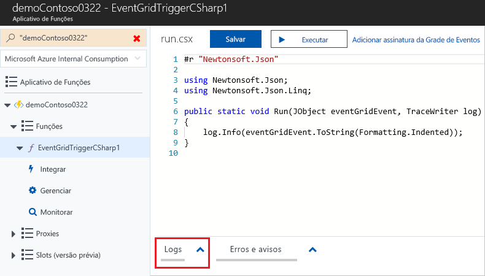

Agora, vamos disparar um evento para ver como a Grade de Eventos distribui a mensagem para o ponto de extremidade. Para simplificar este artigo, use o Cloud Shell para enviar dados de evento de exemplo para o tópico personalizado. Normalmente, um aplicativo ou serviço do Azure enviaria os dados de evento.

[!INCLUDE [cloud-shell-try-it.md](../../includes/cloud-shell-try-it.md)]

## <a name="send-an-event-to-your-topic"></a>Enviar um evento para o tópico

Use a CLI do Azure ou o PowerShell para enviar um evento de teste para seu tópico personalizado.

O primeiro exemplo usa a CLI do Azure. Ele obtém a URL e a chave do tópico, além dos dados de evento de exemplo. Use o nome do tópico em `<topic_name>`. Para ver o evento completo, use `echo "$body"`. O elemento `data` do JSON é a carga do evento. Qualquer JSON bem formado pode ficar nesse campo. Você também pode usar o campo de assunto para roteamento e filtragem avançados. CURL é um utilitário que envia solicitações HTTP.

```azurecli-interactive
endpoint=$(az eventgrid topic show --name <topic_name> -g myResourceGroup --query "endpoint" --output tsv)
key=$(az eventgrid topic key list --name <topic_name> -g myResourceGroup --query "key1" --output tsv)

body=$(eval echo "'$(curl https://raw.githubusercontent.com/Azure/azure-docs-json-samples/master/event-grid/customevent.json)'")

curl -X POST -H "aeg-sas-key: $key" -d "$body" $endpoint
```

O segundo exemplo usa o PowerShell para realizar etapas semelhantes.

```azurepowershell-interactive
$endpoint = (Get-AzureRmEventGridTopic -ResourceGroupName gridResourceGroup -Name <topic-name>).Endpoint
$keys = Get-AzureRmEventGridTopicKey -ResourceGroupName gridResourceGroup -Name <topic-name>

$eventID = Get-Random 99999

#Date format should be SortableDateTimePattern (ISO 8601)
$eventDate = Get-Date -Format s

#Construct body using Hashtable
$htbody = @{
    id= $eventID
    eventType="recordInserted"
    subject="myapp/vehicles/motorcycles"
    eventTime= $eventDate   
    data= @{
        make="Ducati"
        model="Monster"
    }
    dataVersion="1.0"
}

#Use ConvertTo-Json to convert event body from Hashtable to JSON Object
#Append square brackets to the converted JSON payload since they are expected in the event's JSON payload syntax
$body = "["+(ConvertTo-Json $htbody)+"]"

Invoke-WebRequest -Uri $endpoint -Method POST -Body $body -Headers @{"aeg-sas-key" = $keys.Key1}
```

Você disparou o evento, e a Grade de Eventos enviou a mensagem para o ponto de extremidade configurado durante a assinatura. Examine os logs para ver os dados do evento.

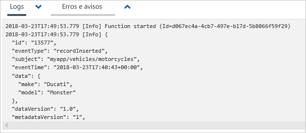

## <a name="clean-up-resources"></a>Limpar recursos

Caso planeje continuar a trabalhar com esse evento, não limpe os recursos criados neste artigo. Caso contrário, exclua os recursos criados neste artigo.

Selecione o grupo de recursos e selecione **Excluir grupo de recursos**.

## <a name="next-steps"></a>Próximas etapas

Agora que você sabe como criar tópicos e assinaturas de evento personalizados, saiba mais sobre como a Grade de Eventos pode ajudá-lo:

- [Sobre a Grade de Eventos](overview.md)
- [Rotear eventos do Armazenamento de Blobs para um ponto de extremidade da Web personalizado](../storage/blobs/storage-blob-event-quickstart.md?toc=%2fazure%2fevent-grid%2ftoc.json)
- [Monitorar alterações de máquina virtual com a Grade de Eventos do Azure e os Aplicativos Lógicos](monitor-virtual-machine-changes-event-grid-logic-app.md)
- [Transmitir Big Data para um data warehouse](event-grid-event-hubs-integration.md)
