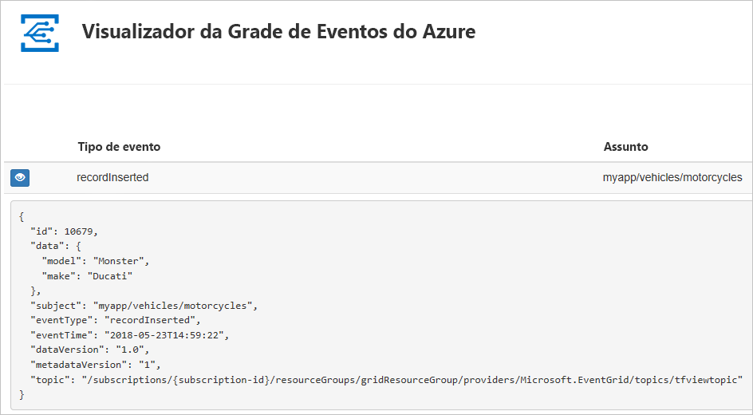
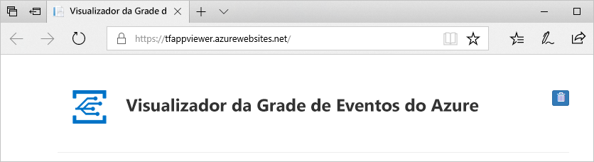
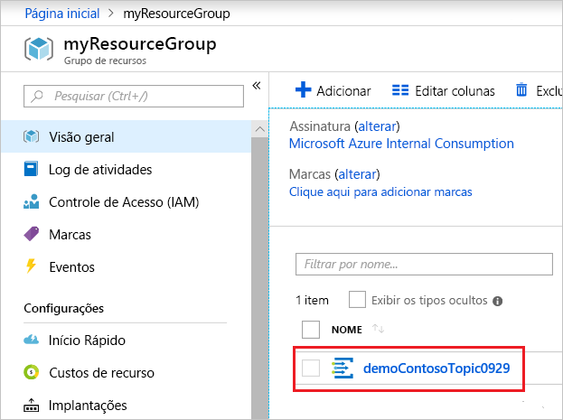
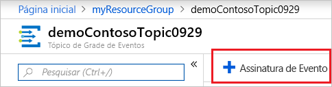
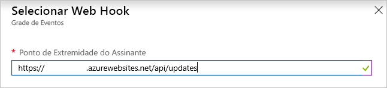
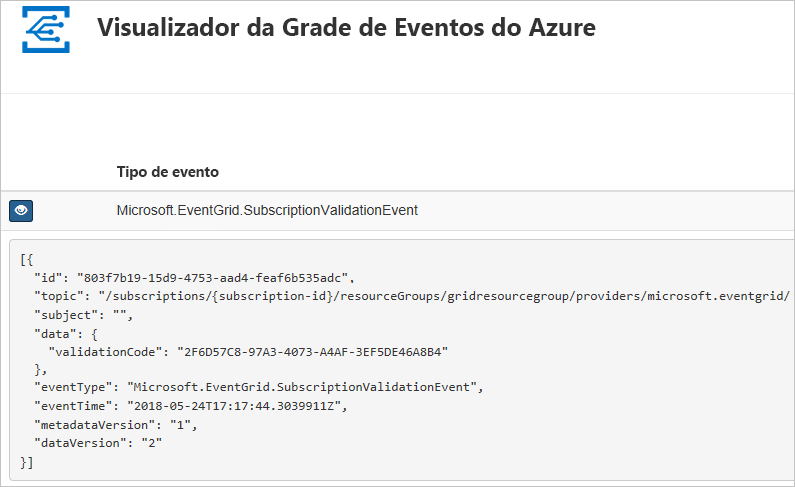

# <a name="quickstart-route-custom-events-to-web-endpoint-with-the-azure-portal-and-event-grid"></a>Início Rápido: Encaminhar eventos personalizados ao ponto de extremidade Web com o portal do Azure e a Grade de Eventos

A Grade de Eventos do Azure é um serviço de eventos para a nuvem. Neste artigo, você pode usar o portal do Azure para criar um tópico personalizado, assinar o tópico personalizado e disparar o evento para exibir o resultado. Normalmente, você envia eventos para um ponto de extremidade que processa os dados de evento e realiza ações. No entanto, para simplificar este artigo, você enviará os eventos para um aplicativo Web que coleta e exibe as mensagens.

Ao concluir, você verá que os dados do evento foram enviados para um aplicativo Web.



[!INCLUDE [updated-for-az](../../includes/updated-for-az.md)]

[!INCLUDE [quickstarts-free-trial-note.md](../../includes/quickstarts-free-trial-note.md)]

[!INCLUDE [event-grid-register-provider-portal.md](../../includes/event-grid-register-provider-portal.md)]

## <a name="create-a-custom-topic"></a>Criar um tópico personalizado

Um tópico de grade de evento fornece um ponto de extremidade definido pelo usuário no qual você posta seus eventos. 

1. Entre no [Portal do Azure](https://portal.azure.com/).

1. Para criar um tópico personalizado, selecione **Criar um recurso**. 

   

1. Pesquise *Tópico de Grade de Eventos* e selecione a partir das opções disponíveis.

   

1. Selecione **Criar**.

   

1. Forneça um nome exclusivo para o tópico personalizado. O nome do tópico deve ser exclusivo, pois é representado por uma entrada DNS. Não use o nome mostrado na imagem. Em vez disso, crie seu próprio nome – ele deve ter entre 3 e 50 caracteres e conter apenas valores a-z, A-Z, 0-9 e "-". Forneça um nome para um novo grupo de recursos. Selecione **Criar**.

   

1. Depois que o tópico personalizado tiver sido criado, você verá a notificação de êxito.

   

   Se a implantação não obteve êxito, descubra o que causou o erro. Selecione a **Implantação com falha**.

   

   Selecione a mensagem de erro.

   

   A imagem a seguir mostra uma implantação que falhou porque o nome do tópico personalizado já está em uso. Se você vir esse erro, repita a implantação com um nome diferente.

   

## <a name="create-a-message-endpoint"></a>Criar um ponto de extremidade de mensagem

Antes de assinar o tópico personalizado, vamos criar o ponto de extremidade para a mensagem do evento. Normalmente, o ponto de extremidade executa ações com base nos dados de evento. Para simplificar este início rápido, você implanta um [aplicativo Web criado previamente](https://github.com/Azure-Samples/azure-event-grid-viewer) que exibe as mensagens de eventos. A solução implantada inclui um plano do Serviço de Aplicativo, um aplicativo Web do Aplicativo do Serviço de e o código-fonte do GitHub.

1. Selecione **Implantar no Azure** para implantar a solução na sua assinatura. No portal do Azure, forneça os valores para os parâmetros.

   <a href="https://portal.azure.com/#create/Microsoft.Template/uri/https%3A%2F%2Fraw.githubusercontent.com%2FAzure-Samples%2Fazure-event-grid-viewer%2Fmaster%2Fazuredeploy.json" target="_blank"></a>

1. A implantação pode levar alguns minutos para ser concluída. Depois que a implantação for bem-sucedida, exiba seu aplicativo Web para garantir que ele esteja em execução. Em um navegador da Web, navegue até: `https://<your-site-name>.azurewebsites.net`

1. Você verá o site, mas nenhum evento ainda estará publicado.

   

## <a name="subscribe-to-custom-topic"></a>Inscrever-se em um tópico personalizado

Você assina um tópico da grade de eventos para indicar à Grade de Eventos quais eventos você deseja acompanhar e para onde enviá-los.

1. No portal, selecione seu tópico personalizado.

   

1. Selecione **+ Assinatura de Evento**.

   

1. Selecione **Web Hook** para o tipo de ponto de extremidade. Forneça um nome para a assinatura de evento.

   

1. Selecione **Selecionar um ponto de extremidade**. 

1. Para o ponto de extremidade do web hook, forneça a URL do seu aplicativo Web e adicione `api/updates` à URL da página inicial. Selecione **Confirmar seleção**.

   

1. Quando terminar de fornecer os valores de assinatura de evento, selecione **Criar**.

Exiba novamente o seu aplicativo Web e observe que um evento de validação de assinatura foi enviado a ele. Selecione o ícone de olho para expandir os dados de evento. A Grade de Eventos envia o evento de validação de modo que o ponto de extremidade possa verificar se ele deseja receber os dados de evento. O aplicativo Web inclui o código para validar a assinatura.



## <a name="send-an-event-to-your-topic"></a>Enviar um evento para o tópico

Agora, vamos disparar um evento para ver como a Grade de Eventos distribui a mensagem para o ponto de extremidade. Use a CLI do Azure ou o PowerShell para enviar um evento de teste para seu tópico personalizado. Normalmente, um aplicativo ou serviço do Azure enviaria os dados de evento.

O primeiro exemplo usa a CLI do Azure. Ele obtém a URL e a chave do tópico personalizado, além dos dados de evento de exemplo. Use o nome do tópico personalizado para `<topic_name>`. Ele cria dados de evento de exemplo. O elemento `data` do JSON é a carga do evento. Qualquer JSON bem formado pode ficar nesse campo. Você também pode usar o campo de assunto para roteamento e filtragem avançados. CURL é um utilitário que envia solicitações HTTP.

```azurecli-interactive
endpoint=$(az eventgrid topic show --name <topic_name> -g myResourceGroup --query "endpoint" --output tsv)
key=$(az eventgrid topic key list --name <topic_name> -g myResourceGroup --query "key1" --output tsv)

event='[ {"id": "'"$RANDOM"'", "eventType": "recordInserted", "subject": "myapp/vehicles/motorcycles", "eventTime": "'`date +%Y-%m-%dT%H:%M:%S%z`'", "data":{ "make": "Ducati", "model": "Monster"},"dataVersion": "1.0"} ]'

curl -X POST -H "aeg-sas-key: $key" -d "$event" $endpoint
```

O segundo exemplo usa o PowerShell para realizar etapas semelhantes.

```azurepowershell-interactive
$endpoint = (Get-AzEventGridTopic -ResourceGroupName gridResourceGroup -Name <topic-name>).Endpoint
$keys = Get-AzEventGridTopicKey -ResourceGroupName gridResourceGroup -Name <topic-name>

$eventID = Get-Random 99999

#Date format should be SortableDateTimePattern (ISO 8601)
$eventDate = Get-Date -Format s

#Construct body using Hashtable
$htbody = @{
    id= $eventID
    eventType="recordInserted"
    subject="myapp/vehicles/motorcycles"
    eventTime= $eventDate   
    data= @{
        make="Ducati"
        model="Monster"
    }
    dataVersion="1.0"
}

#Use ConvertTo-Json to convert event body from Hashtable to JSON Object
#Append square brackets to the converted JSON payload since they are expected in the event's JSON payload syntax
$body = "["+(ConvertTo-Json $htbody)+"]"

Invoke-WebRequest -Uri $endpoint -Method POST -Body $body -Headers @{"aeg-sas-key" = $keys.Key1}
```

Você disparou o evento, e a Grade de Eventos enviou a mensagem para o ponto de extremidade configurado durante a assinatura. Exiba seu aplicativo Web para ver o evento que você acabou de enviar.

```json
[{
  "id": "1807",
  "eventType": "recordInserted",
  "subject": "myapp/vehicles/motorcycles",
  "eventTime": "2017-08-10T21:03:07+00:00",
  "data": {
    "make": "Ducati",
    "model": "Monster"
  },
  "dataVersion": "1.0",
  "metadataVersion": "1",
  "topic": "/subscriptions/{subscription-id}/resourceGroups/{resource-group}/providers/Microsoft.EventGrid/topics/{topic}"
}]
```


## <a name="clean-up-resources"></a>Limpar recursos

Caso planeje continuar a trabalhar com esse evento, não limpe os recursos criados neste artigo. Caso contrário, exclua os recursos criados neste artigo.

Selecione o grupo de recursos e selecione **Excluir grupo de recursos**.

## <a name="next-steps"></a>Próximas etapas

Agora que você sabe como criar tópicos e assinaturas de evento personalizados, saiba mais sobre como a Grade de Eventos pode ajudá-lo:

- [Sobre a Grade de Eventos](overview.md)
- [Rotear eventos do Armazenamento de Blobs para um ponto de extremidade da Web personalizado](../storage/blobs/storage-blob-event-quickstart.md?toc=%2fazure%2fevent-grid%2ftoc.json)
- [Monitorar alterações de máquina virtual com a Grade de Eventos do Azure e os Aplicativos Lógicos](monitor-virtual-machine-changes-event-grid-logic-app.md)
- [Transmitir Big Data para um data warehouse](event-grid-event-hubs-integration.md)
