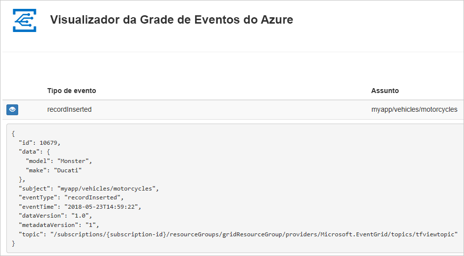
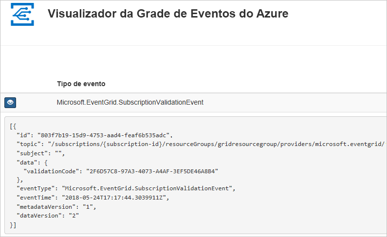

# <a name="create-and-route-custom-events-with-azure-powershell-and-event-grid"></a>Criar e encaminhar eventos personalizados com o Azure PowerShell e a Grade de Eventos do Azure

A Grade de Eventos do Azure é um serviço de eventos para a nuvem. Neste artigo, você pode usar o Azure PowerShell para criar um tópico personalizado, assinar o tópico e disparar o evento para exibir o resultado. Normalmente, você envia eventos para um ponto de extremidade que processa os dados de evento e realiza ações. No entanto, para simplificar este artigo, você enviará os eventos para um aplicativo Web que coleta e exibe as mensagens.

Ao concluir, você verá que os dados do evento foram enviados para um aplicativo Web.



[!INCLUDE [quickstarts-free-trial-note.md](../../includes/quickstarts-free-trial-note.md)]

Este artigo requer que você esteja executando a versão mais recente do Azure PowerShell. Se você precisa instalar ou atualizar, confira [Instalar e configurar o Azure PowerShell](/powershell/azure/install-azurerm-ps).

## <a name="create-a-resource-group"></a>Criar um grupo de recursos

Os tópicos de Grade de Eventos são recursos do Azure e devem ser colocados em um grupo de recursos do Azure. O grupo de recursos do Azure é uma coleção lógica na qual os recursos do Azure são implantados e gerenciados.

Crie um grupo de recursos com o comando [New-AzureRmResourceGroup](/powershell/module/azurerm.resources/new-azurermresourcegroup).

O exemplo a seguir cria um grupo de recursos chamado *gridResourceGroup* no local *westus2*.

```powershell-interactive
New-AzureRmResourceGroup -Name gridResourceGroup -Location westus2
```

[!INCLUDE [event-grid-register-provider-powershell.md](../../includes/event-grid-register-provider-powershell.md)]

## <a name="create-a-custom-topic"></a>Criar um tópico personalizado

Um tópico de grade de evento fornece um ponto de extremidade definido pelo usuário no qual você posta seus eventos. O exemplo a seguir cria o tópico personalizado no seu grupo de recursos. Substitua `<your-topic-name>` por um nome exclusivo para o tópico. O nome do tópico deve ser exclusivo, pois é parte de uma entrada DNS.

```powershell-interactive
$topicname="<your-topic-name>"

New-AzureRmEventGridTopic -ResourceGroupName gridResourceGroup -Location westus2 -Name $topicname
```

## <a name="create-a-message-endpoint"></a>Criar um ponto de extremidade de mensagem

Antes de assinar o tópico, vamos criar o ponto de extremidade para a mensagem do evento. Normalmente, o ponto de extremidade executa ações com base nos dados de evento. Para simplificar este início rápido, você implanta um [aplicativo Web criado previamente](https://github.com/Azure-Samples/azure-event-grid-viewer) que exibe as mensagens de eventos. A solução implantada inclui um plano do Serviço de Aplicativo, um aplicativo Web do Aplicativo do Serviço de e o código-fonte do GitHub.

Substitua `<your-site-name>` por um nome exclusivo para o aplicativo Web. O nome do aplicativo Web deve ser exclusivo, pois é parte de uma entrada DNS.

```powershell-interactive
$sitename="<your-site-name>"

New-AzureRmResourceGroupDeployment `
  -ResourceGroupName gridResourceGroup `
  -TemplateUri "https://raw.githubusercontent.com/Azure-Samples/azure-event-grid-viewer/master/azuredeploy.json" `
  -siteName $sitename `
  -hostingPlanName viewerhost
```

A implantação pode levar alguns minutos para ser concluída. Depois que a implantação for bem-sucedida, exiba seu aplicativo Web para garantir que ele esteja em execução. Em um navegador da Web, navegue até: `https://<your-site-name>.azurewebsites.net`

Você deve ver o site sem mensagens exibidas no momento.

## <a name="subscribe-to-a-topic"></a>Assinar um tópico

Assine um tópico para indicar à Grade de Eventos quais eventos você deseja acompanhar e para onde enviar esses eventos. O exemplo a seguir assina o tópico que você criou e transmite a URL do seu aplicativo Web como o ponto de extremidade para notificação de eventos.

O ponto de extremidade para seu aplicativo Web deve incluir o sufixo `/api/updates/`.

```powershell-interactive
$endpoint="https://$sitename.azurewebsites.net/api/updates"

New-AzureRmEventGridSubscription `
  -EventSubscriptionName demoViewerSub `
  -Endpoint $endpoint `
  -ResourceGroupName gridResourceGroup `
  -TopicName $topicname
```

Exiba novamente o seu aplicativo Web e observe que um evento de validação de assinatura foi enviado a ele. Selecione o ícone de olho para expandir os dados de evento. A Grade de Eventos envia o evento de validação de modo que o ponto de extremidade possa verificar se ele deseja receber os dados de evento. O aplicativo Web inclui o código para validar a assinatura.



## <a name="send-an-event-to-your-topic"></a>Enviar um evento para o tópico

Vamos disparar um evento para ver como a Grade de Eventos distribui a mensagem para o ponto de extremidade. Primeiro, vamos obter a URL e a chave para o tópico.

```powershell-interactive
$endpoint = (Get-AzureRmEventGridTopic -ResourceGroupName gridResourceGroup -Name $topicname).Endpoint
$keys = Get-AzureRmEventGridTopicKey -ResourceGroupName gridResourceGroup -Name $topicname
```

Para simplificar este artigo, vamos configurar dados de evento de exemplo para enviar ao tópico personalizado. Normalmente, um aplicativo ou serviço do Azure enviaria os dados de evento. O exemplo a seguir usa a tabela de hash para construir os dados do evento `htbody` e, em seguida, converte-os para o objeto de carga JSON bem formado `$body`:

```powershell-interactive
$eventID = Get-Random 99999

#Date format should be SortableDateTimePattern (ISO 8601)
$eventDate = Get-Date -Format s

#Construct body using Hashtable
$htbody = @{
    id= $eventID
    eventType="recordInserted"
    subject="myapp/vehicles/motorcycles"
    eventTime= $eventDate   
    data= @{
        make="Ducati"
        model="Monster"
    }
    dataVersion="1.0"
}

#Use ConvertTo-Json to convert event body from Hashtable to JSON Object
#Append square brackets to the converted JSON payload since they are expected in the event's JSON payload syntax
$body = "["+(ConvertTo-Json $htbody)+"]"
```

Se você exibir `$body`, verá o evento completo. O elemento `data` do JSON é a carga do evento. Qualquer JSON bem formado pode ficar nesse campo. Você também pode usar o campo de assunto para roteamento e filtragem avançados.

Agora, envie o evento para o tópico.

```powershell-interactive
Invoke-WebRequest -Uri $endpoint -Method POST -Body $body -Headers @{"aeg-sas-key" = $keys.Key1}
```

Você disparou o evento, e a Grade de Eventos enviou a mensagem para o ponto de extremidade configurado durante a assinatura. Exiba seu aplicativo Web para ver o evento que você acabou de enviar.

```json
[{
  "id": "1807",
  "eventType": "recordInserted",
  "subject": "myapp/vehicles/motorcycles",
  "eventTime": "2018-01-25T15:58:13",
  "data": {
    "make": "Ducati",
    "model": "Monster"
  },
  "dataVersion": "1.0",
  "metadataVersion": "1",
  "topic": "/subscriptions/{subscription-id}/resourceGroups/{resource-group}/providers/Microsoft.EventGrid/topics/{topic}"
}]
```

## <a name="clean-up-resources"></a>Limpar recursos

Caso planeje continuar a trabalhar com esse evento ou com o aplicativo visualizador de evento, não limpe os recursos criados neste artigo. Caso contrário, use os comandos a seguir para excluir os recursos criados por você neste artigo.

```powershell
Remove-AzureRmResourceGroup -Name gridResourceGroup
```

## <a name="next-steps"></a>Próximas etapas

Agora que você sabe como criar tópicos e assinaturas de evento, saiba mais sobre como a Grade de Eventos pode ajudá-lo:

- [Sobre a Grade de Eventos](overview.md)
- [Rotear eventos do Armazenamento de Blobs para um ponto de extremidade da Web personalizado](../storage/blobs/storage-blob-event-quickstart.md?toc=%2fazure%2fevent-grid%2ftoc.json)
- [Monitorar alterações de máquina virtual com a Grade de Eventos do Azure e os Aplicativos Lógicos](monitor-virtual-machine-changes-event-grid-logic-app.md)
- [Transmitir Big Data para um data warehouse](event-grid-event-hubs-integration.md)
