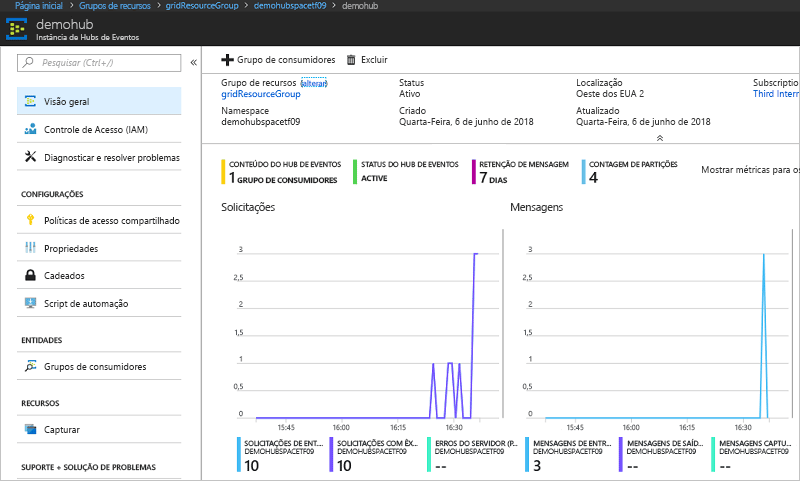

# <a name="route-custom-events-to-azure-event-hubs-with-azure-cli-and-event-grid"></a>Encaminhar eventos personalizados para os Hubs de Eventos do Azure com a CLI do Azure e a Grade de Eventos

A Grade de Eventos do Azure é um serviço de eventos para a nuvem. Os Hubs de Eventos do Azure é um dos manipuladores de eventos com suporte. Neste artigo, você pode usar a CLI do Azure para criar um tópico personalizado, assinar o tópico e disparar o evento para exibir o resultado. Os eventos devem ser enviados para um hub de eventos.

[!INCLUDE [quickstarts-free-trial-note.md](../../includes/quickstarts-free-trial-note.md)]

## <a name="create-a-resource-group"></a>Criar um grupo de recursos

Os tópicos de Grade de Eventos são recursos do Azure e devem ser colocados em um grupo de recursos do Azure. O grupo de recursos do Azure é uma coleção lógica na qual os recursos do Azure são implantados e gerenciados.

Crie um grupo de recursos com o comando [az group create](/cli/azure/group#az_group_create). 

O exemplo a seguir cria um grupo de recursos chamado *gridResourceGroup* no local *westus2*.

```azurecli-interactive
az group create --name gridResourceGroup --location westus2
```

[!INCLUDE [event-grid-register-provider-cli.md](../../includes/event-grid-register-provider-cli.md)]

## <a name="create-a-custom-topic"></a>Criar um Tópico personalizado

Um tópico de grade de evento fornece um ponto de extremidade definido pelo usuário no qual você posta seus eventos. O exemplo a seguir cria o tópico personalizado no seu grupo de recursos. Substitua `<your-topic-name>` por um nome exclusivo para o tópico. O nome do tópico deve ser exclusivo, pois é representado por uma entrada DNS.

```azurecli-interactive
topicname=<your-topic-name>
az eventgrid topic create --name $topicname -l westus2 -g gridResourceGroup
```

## <a name="create-event-hub"></a>Criar hub de eventos

Antes de assinar o tópico, vamos criar o ponto de extremidade para a mensagem do evento. Um hub de eventos deve ser criado para coletar os eventos.

```azurecli-interactive
namespace=<unique-namespace-name>
hubname=demohub

az eventhubs namespace create --name $namespace --resource-group gridResourceGroup
az eventhubs eventhub create --name $hubname --namespace-name $namespace --resource-group gridResourceGroup
```

## <a name="subscribe-to-a-topic"></a>Assinar um tópico

Assine um tópico para indicar à Grade de Eventos quais eventos você deseja acompanhar. O exemplo a seguir assina o tópico que você criou e transmite a ID de recurso do hub de evento para o ponto de extremidade. O ponto de extremidade está no formato:

`/subscriptions/<subscription-id>/resourceGroups/<resource-group-name>/providers/Microsoft.EventHub/namespaces/<namespace-name>/eventhubs/<hub-name>`

O script a seguir obtém a ID de recurso para o hub de eventos e assina um tópico de grade de eventos. Ele define o tipo de ponto de extremidade como `eventhub` e usa a ID de hub de evento para o ponto de extremidade.

```azurecli-interactive
hubid=$(az eventhubs eventhub show --name $hubname --namespace-name $namespace --resource-group gridResourceGroup --query id --output tsv)

az eventgrid event-subscription create \
  --topic-name $topicname \
  -g gridResourceGroup \
  --name subtoeventhub \
  --endpoint-type eventhub \
  --endpoint $hubid
```

## <a name="send-an-event-to-your-topic"></a>Enviar um evento para o tópico

Vamos disparar um evento para ver como a Grade de Eventos distribui a mensagem para o ponto de extremidade. Primeiro, vamos obter a URL e a chave para o tópico personalizado.

```azurecli-interactive
endpoint=$(az eventgrid topic show --name $topicname -g gridResourceGroup --query "endpoint" --output tsv)
key=$(az eventgrid topic key list --name $topicname -g gridResourceGroup --query "key1" --output tsv)
```

Para simplificar este artigo, use dados de evento de exemplo para enviar ao tópico. Normalmente, um aplicativo ou serviço do Azure enviaria os dados de evento. CURL é um utilitário que envia solicitações HTTP. Neste artigo, use o CURL para enviar o evento ao tópico.  O exemplo a seguir envia três eventos para o tópico de grade de eventos:

```azurecli-interactive
for i in 1 2 3
do
   body=$(eval echo "'$(curl https://raw.githubusercontent.com/Azure/azure-docs-json-samples/master/event-grid/customevent.json)'")
   curl -X POST -H "aeg-sas-key: $key" -d "$body" $endpoint
done
```

Navegue até o hub de evento no portal e observe que a Grade de Eventos enviou esses três eventos para o hub de eventos.



Normalmente você cria um aplicativo que recupera os eventos do hub de eventos. Para criar um aplicativo que recebe mensagens de um hub de eventos, consulte:

* [Introdução à recepção de mensagens com o Host do Processador de Eventos no .NET Standard](../event-hubs/event-hubs-dotnet-standard-getstarted-receive-eph.md)
* [Receber eventos de Hubs de Eventos do Azure usando Java](../event-hubs/event-hubs-java-get-started-receive-eph.md)
* [Receber eventos de Hubs de Eventos usando o Apache Storm](../event-hubs/event-hubs-storm-getstarted-receive.md)

## <a name="clean-up-resources"></a>Limpar recursos
Caso planeje continuar a trabalhar com esse evento, não limpe os recursos criados neste artigo. Caso contrário, use os comandos a seguir para excluir os recursos criados por você neste artigo.

```azurecli-interactive
az group delete --name gridResourceGroup
```

## <a name="next-steps"></a>Próximas etapas

Agora que você sabe como criar tópicos e assinaturas de evento, saiba mais sobre como a Grade de Eventos pode ajudá-lo:

- [Sobre a Grade de Eventos](overview.md)
- [Rotear eventos do Armazenamento de Blobs para um ponto de extremidade da Web personalizado](../storage/blobs/storage-blob-event-quickstart.md?toc=%2fazure%2fevent-grid%2ftoc.json)
- [Monitorar alterações de máquina virtual com a Grade de Eventos do Azure e os Aplicativos Lógicos](monitor-virtual-machine-changes-event-grid-logic-app.md)
- [Transmitir Big Data para um data warehouse](event-grid-event-hubs-integration.md)
