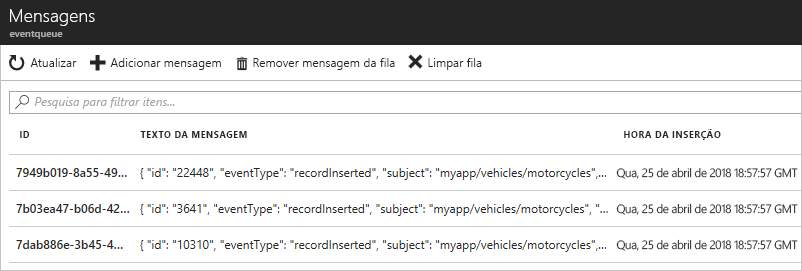

# <a name="quickstart-route-custom-events-to-azure-queue-storage-with-azure-cli-and-event-grid"></a>Início Rápido: Encaminhar eventos personalizados para o Armazenamento de Filas do Azure com a CLI do Azure e a Grade de Eventos

A Grade de Eventos do Azure é um serviço de eventos para a nuvem. O Armazenamento de Filas do Azure é um dos manipuladores de eventos com suporte. Neste artigo, você usa a CLI do Azure para criar um tópico personalizado, assinar esse tópico e disparar o evento para exibir o resultado. Você pode enviar os eventos para o Armazenamento de Filas.

[!INCLUDE [quickstarts-free-trial-note.md](../../includes/quickstarts-free-trial-note.md)]

[!INCLUDE [cloud-shell-try-it.md](../../includes/cloud-shell-try-it.md)]

## <a name="install-preview-feature"></a>Instalar versão prévia do recurso

[!INCLUDE [event-grid-preview-feature-note.md](../../includes/event-grid-preview-feature-note.md)]

## <a name="create-a-resource-group"></a>Criar um grupo de recursos

Os tópicos de Grade de Eventos são recursos do Azure e devem ser colocados em um grupo de recursos do Azure. O grupo de recursos do Azure é uma coleção lógica na qual os recursos do Azure são implantados e gerenciados.

Crie um grupo de recursos com o comando [az group create](/cli/azure/group#az-group-create). 

O exemplo a seguir cria um grupo de recursos chamado *gridResourceGroup* no local *westus2*.

```azurecli-interactive
az group create --name gridResourceGroup --location westus2
```

[!INCLUDE [event-grid-register-provider-cli.md](../../includes/event-grid-register-provider-cli.md)]

## <a name="create-a-custom-topic"></a>Criar um tópico personalizado

Um tópico de grade de evento fornece um ponto de extremidade definido pelo usuário no qual você posta seus eventos. O exemplo a seguir cria o tópico personalizado no seu grupo de recursos. Substitua `<topic_name>` por um nome exclusivo para o tópico personalizado. O nome do tópico de grade de eventos deve ser exclusivo, pois é representado por uma entrada DNS.

```azurecli-interactive
# if you have not already installed the extension, do it now.
# This extension is required for preview features.
az extension add --name eventgrid

az eventgrid topic create --name <topic_name> -l westus2 -g gridResourceGroup
```

## <a name="create-queue-storage"></a>Criar Armazenamento de Filas

Antes de assinar o tópico personalizado, vamos criar o ponto de extremidade para a mensagem do evento. Crie um Armazenamento de Filas para coletar os eventos.

```azurecli-interactive
storagename="<unique-storage-name>"
queuename="eventqueue"

az storage account create -n $storagename -g gridResourceGroup -l westus2 --sku Standard_LRS
az storage queue create --name $queuename --account-name $storagename
```

## <a name="subscribe-to-a-custom-topic"></a>Assinar um tópico personalizado

Você assina um tópico personalizado para indicar à Grade de Eventos quais eventos você deseja acompanhar. O exemplo a seguir assina o tópico personalizado que você criou e transmite a ID de recurso do Armazenamento de Filas para o ponto de extremidade. Com a CLI do Azure, passe a ID de armazenamento da fila como o ponto de extremidade. O ponto de extremidade está no formato:

`/subscriptions/<subscription-id>/resourcegroups/<resource-group-name>/providers/Microsoft.Storage/storageAccounts/<storage-name>/queueservices/default/queues/<queue-name>`

O script a seguir obtém a ID de recurso da conta de armazenamento para a fila. Ele constrói a ID para o armazenamento de fila e assina um tópico de grade de eventos. Ele define o tipo de ponto de extremidade como `storagequeue` e usa a ID da fila do ponto de extremidade.

```azurecli-interactive
storageid=$(az storage account show --name $storagename --resource-group gridResourceGroup --query id --output tsv)
queueid="$storageid/queueservices/default/queues/$queuename"
topicid=$(az eventgrid topic show --name <topic_name> -g gridResourceGroup --query id --output tsv)

az eventgrid event-subscription create \
  --source-resource-id $topicid \
  --name <event_subscription_name> \
  --endpoint-type storagequeue \
  --endpoint $queueid \
  --expiration-date "<yyyy-mm-dd>"
```

A conta que cria a assinatura de evento deve ter acesso de gravação ao armazenamento de filas. Observe que uma [data de expiração](concepts.md#event-subscription-expiration) está definida para a assinatura.

Se você usar a API REST para criar a assinatura, passe a ID da conta de armazenamento e o nome da fila como parâmetros separados.

```json
"destination": {
  "endpointType": "storagequeue",
  "properties": {
    "queueName":"eventqueue",
    "resourceId": "/subscriptions/<subscription-id>/resourcegroups/<resource-group-name>/providers/Microsoft.Storage/storageAccounts/<storage-name>"
  }
  ...
```

## <a name="send-an-event-to-your-custom-topic"></a>Enviar um evento para o tópico personalizado

Vamos disparar um evento para ver como a Grade de Eventos distribui a mensagem para o ponto de extremidade. Primeiro, vamos obter a URL e a chave para o tópico personalizado. Novamente, use o nome do tópico personalizado para `<topic_name>`.

```azurecli-interactive
endpoint=$(az eventgrid topic show --name <topic_name> -g gridResourceGroup --query "endpoint" --output tsv)
key=$(az eventgrid topic key list --name <topic_name> -g gridResourceGroup --query "key1" --output tsv)
```

Para simplificar este artigo, use dados de evento de exemplo para enviar ao tópico personalizado. Normalmente, um aplicativo ou serviço do Azure enviaria os dados de evento. CURL é um utilitário que envia solicitações HTTP. Neste artigo, use o CURL para enviar o evento ao tópico personalizado.  O exemplo a seguir envia três eventos para o tópico de grade de eventos:

```azurecli-interactive
for i in 1 2 3
do
   event='[ {"id": "'"$RANDOM"'", "eventType": "recordInserted", "subject": "myapp/vehicles/motorcycles", "eventTime": "'`date +%Y-%m-%dT%H:%M:%S%z`'", "data":{ "make": "Ducati", "model": "Monster"},"dataVersion": "1.0"} ]'
   curl -X POST -H "aeg-sas-key: $key" -d "$event" $endpoint
done
```

Navegue até o Armazenamento em Filas no portal e observe que a Grade de Eventos enviou esses três eventos para a fila.




## <a name="clean-up-resources"></a>Limpar recursos
Caso planeje continuar a trabalhar com esse evento, não limpe os recursos criados neste artigo. Caso contrário, use os comandos a seguir para excluir os recursos criados por você neste artigo.

```azurecli-interactive
az group delete --name gridResourceGroup
```

## <a name="next-steps"></a>Próximas etapas

Agora que você sabe como criar tópicos e assinaturas de evento, saiba mais sobre como a Grade de Eventos pode ajudá-lo:

- [Sobre a Grade de Eventos](overview.md)
- [Rotear eventos do Armazenamento de Blobs para um ponto de extremidade da Web personalizado](../storage/blobs/storage-blob-event-quickstart.md?toc=%2fazure%2fevent-grid%2ftoc.json)
- [Monitorar alterações de máquina virtual com a Grade de Eventos do Azure e os Aplicativos Lógicos](monitor-virtual-machine-changes-event-grid-logic-app.md)
- [Transmitir Big Data para um data warehouse](event-grid-event-hubs-integration.md)
