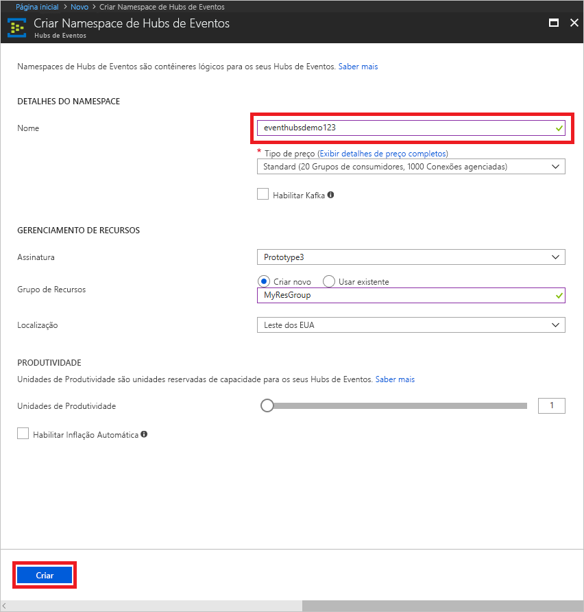

# Criar um namespace de Hubs de Eventos e um hub de eventos usando o Portal do Azure

## Criar um namespace de Hubs de Eventos
1. Faça logon no [Portal do Azure][Azure portal] e clique em **Criar um recurso** na parte superior esquerda da tela.
1. Clique em **Internet das Coisas** e, em seguida, clique em **Hubs de Eventos**.
   
    
1. Em **Criar um namespace**, insira um nome de namespace. O sistema imediatamente verifica para ver se o nome está disponível.
   
    
1. Depois de verificar se o nome do namespace está disponível, escolha o tipo de preço (Básico ou Standard). Além disso, escolha uma assinatura do Azure, o grupo de recursos e o local no qual o recurso será criado. 
1. Clique em **Criar** para criar o namespace. Talvez você precise aguardar alguns minutos para o sistema provisionar totalmente os recursos.
2. Na lista de namespaces do portal, clique no namespace recém-criado.
2. Clique em **Políticas de acesso compartilhado** e, em seguida, clique em **RootManageSharedAccessKey**.
    
    

3. Clique no botão de cópia para copiar a cadeia de conexão **RootManageSharedAccessKey** na área de transferência. Salve esta cadeia de conexão em um local temporário, como o Bloco de Notas, para uso futuro.
    
    

## Criar um Hub de Evento

1. Na lista de namespaces dos Hubs de Eventos, clique no namespace recém-criado.      
   
     

2. Na folha do namespace, clique em **Hubs de Eventos**.
   
    

1. Na parte superior da folha, clique em **Adicionar Hub de Eventos**.
   
    
1. Digite um nome para seu hub de eventos e clique em **Criar**.
   
    

Seu hub de eventos foi criado, e você tem as cadeias de conexão que precisa para enviar e receber eventos.

## Próximas etapas
Para saber mais sobre os Hubs de Eventos, consulte estes links:

* [Visão Geral dos Hubs de Eventos](event-hubs-what-is-event-hubs.md)
* [Visão geral de API de Hubs de Eventos](event-hubs-api-overview.md)

[Azure portal]: https://portal.azure.com/