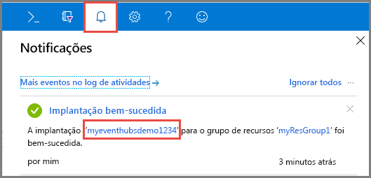
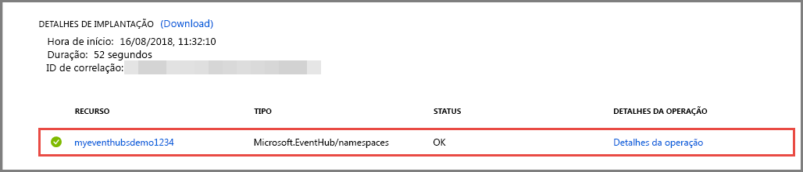

# Início Rápido: Criar um hub de eventos usando o portal do Azure
Os Hubs de Eventos do Azure são uma plataforma de streaming de Big Data e um serviço de ingestão de eventos capaz de receber e processar milhões de eventos por segundo. Os Hubs de Eventos podem processar e armazenar eventos, dados ou telemetria produzidos pelos dispositivos e software distribuídos. Os dados enviados para um Hub de Eventos podem ser transformados e armazenados usando qualquer provedor de análise em tempo real ou adaptadores de envio em lote/armazenamento. Para obter uma visão detalhada dos Hubs de Eventos, confira [Visão geral de Hubs de Eventos](event-hubs-about.md) e [Recursos de Hubs de Eventos](event-hubs-features.md).

Neste início rápido, você cria um hub de eventos usando o [portal do Azure](https://portal.azure.com).

## Pré-requisitos

Para concluir este início rápido, verifique se você tem:

- Assinatura do Azure. Se você não tiver [uma conta gratuita](https://azure.microsoft.com/free/), crie uma antes de começar.
- [Atualização 3 do Visual Studio 2017 (versão 15.3, 26730.01)](https://www.visualstudio.com/vs) ou posterior.
- [SDK do .NET Standard](https://www.microsoft.com/net/download/windows), versão 2.0 ou posterior.

## Criar um grupo de recursos

Um grupo de recursos é uma coleção lógica dos recursos do Azure. Todos os recursos são implantados e gerenciados em um grupo de recursos. Faça o seguinte para criar um grupo de recursos:

1. Entre no [Portal do Azure](https://portal.azure.com).
2. No painel de navegação esquerdo, clique em **Grupos de recursos**. Clique em **Adicionar**.

   

2. Digite um nome exclusivo para o grupo de recursos. O sistema imediatamente verifica para ver se o nome está disponível na assinatura do Azure selecionada no momento.

3. Em **Assinatura**, clique no nome da assinatura do Azure na qual você deseja criar o grupo de recursos.

4. Selecione um local geográfico para o grupo de recursos.

5. Clique em **Criar**.

   

## Criar um namespace de Hubs de Eventos

Um namespace de Hubs de Eventos fornece um contêiner de escopo exclusivo, referenciado pelo nome de domínio totalmente qualificado, em que você cria uma ou mais hubs de eventos. Para criar um namespace em seu grupo de recursos usando o portal, faça o seguinte:

1. Faça logon no portal do Azure e clique em **Criar um recurso** na parte superior esquerda da tela.

2. Clique em **Internet das Coisas** e, em seguida, clique em **Hubs de Eventos**.

3. Em **Criar um namespace**, insira um nome de namespace. O sistema imediatamente verifica para ver se o nome está disponível.

   

4. Depois de verificar se o nome do namespace está disponível, escolha o tipo de preço (Básico ou Standard). Além disso, escolha uma assinatura do Azure, o grupo de recursos e o local no qual o recurso será criado.
 
5. Clique em **Criar** para criar o namespace. Talvez você precise aguardar alguns minutos para o sistema provisionar totalmente os recursos.
6. Selecione **Alertas**e, em seguida, selecione o **implantação** com o mesmo nome que o nome do namespace do hub de eventos. 

   
6. Selecione seu namespace do hub de eventos da lista de recursos criada na implantação. 

   
7. Na página **Namespace de Hubs de Eventos**, selecione **Políticas de acesso compartilhado** e, em seguida, clique em **RootManageSharedAccessKey**.
    
8. Clique no botão de cópia para copiar a cadeia de conexão **RootManageSharedAccessKey** na área de transferência. Salve esta cadeia de conexão em um local temporário, como o Bloco de Notas, para uso futuro.
    
## Criar um Hub de Evento

Para criar um hub de eventos dentro do namespace, faça o seguinte:

1. Na página de namespaces de Hubs de eventos, clique **Hubs de Eventos**.
   
    

1. Na parte superior da janela, clique em **+ Hub de Eventos**.
   
    
1. Digite um nome para seu hub de eventos e clique em **Criar**.
   
    

Parabéns! Você usou o portal para criar um namespace de Hubs de eventos e um hub de eventos dentro desse namespace. 

## Próximas etapas

Neste artigo, você criou um grupo de recursos, um namespace de Hubs de Eventos e um hub de eventos. Para obter instruções passo a passo sobre como enviar eventos (ou) receber eventos de um hub de eventos, confira os tutoriais a seguir:  

- **Enviar eventos para um hub de eventos**: [.NET Core](event-hubs-dotnet-standard-getstarted-send.md), [.NET Framework](event-hubs-dotnet-framework-getstarted-send.md), [Java](event-hubs-java-get-started-send.md), [Python](event-hubs-python-get-started-send.md), [Node.js](event-hubs-node-get-started-send.md), [Go](event-hubs-go-get-started-send.md), [C](event-hubs-c-getstarted-send.md)
- **Receber eventos para um hub de eventos**: [.NET Core](event-hubs-dotnet-standard-getstarted-receive-eph.md), [.NET Framework](event-hubs-dotnet-framework-getstarted-receive-eph.md), [Java](event-hubs-java-get-started-receive-eph.md), [Python](event-hubs-python-get-started-receive.md), [Node.js](event-hubs-node-get-started-receive.md), [Go](event-hubs-go-get-started-receive-eph.md), [Apache Storm](event-hubs-storm-getstarted-receive.md)

[Azure portal]: https://portal.azure.com/
[3]: ./media/event-hubs-quickstart-portal/sender1.png
[4]: ./media/event-hubs-quickstart-portal/receiver1.png
