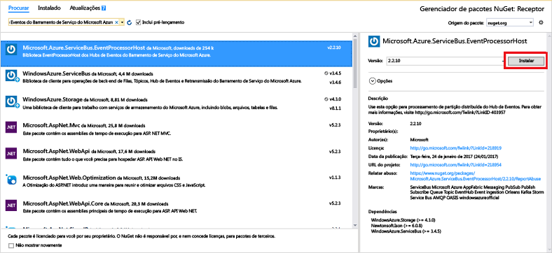

# <a name="get-started-with-event-hubs-using-the-net-framework"></a>Introdução aos Hubs de Eventos usando o .NET Framework

## <a name="receive-messages-with-eventprocessorhost"></a>Receber mensagens com EventProcessorHost
[EventProcessorHost][EventProcessorHost] é uma classe .NET que simplifica o recebimento de eventos de Hubs de Eventos ao gerenciar pontos de verificação persistentes e recebimentos paralelos desses Hubs de Eventos. Usando o [EventProcessorHost][EventProcessorHost], você pode dividir eventos entre vários destinatários, mesmo quando hospedados em nós diferentes. Este exemplo mostra como usar o [EventProcessorHost][EventProcessorHost] para um único destinatário. O exemplo de [Processamento de eventos de escala horizontal][Scale out Event Processing with Event Hubs] mostra como usar [EventProcessorHost][EventProcessorHost] com vários destinatários.

Para usar o [EventProcessorHost][EventProcessorHost], você deverá ter uma [conta do Armazenamento do Azure][Azure Storage account]:

1. Faça logon no [portal do Azure][Azure portal] e clique em **Novo** na parte superior esquerda da tela.
2. Clique em **Armazenamento** e em **conta de Armazenamento**.
   
    
3. Na folha **Criar conta de armazenamento** , digite um nome para sua conta de armazenamento. Escolha uma assinatura do Azure, o grupo de recursos e o local no qual o recurso será criado. Em seguida, clique em **Criar**.
   
    
4. Na lista de contas de armazenamento, clique na conta de armazenamento recém-criada.
5. Na folha da conta de Armazenamento, clique em **Chaves de acesso**. Copie o valor da **chave1** de para usar posteriormente neste tutorial.
   
    
6. No Visual Studio, crie um novo projeto de aplicativo de área de trabalho do Visual C# usando o modelo de projeto de **Aplicativo de Console** . Nomeie o projeto como **Destinatário**.
   
    
7. No Gerenciador de Soluções, clique com o botão direito na solução e clique em **Gerenciar Pacotes NuGet para Solução**.
8. Clique na guia **Procurar** e procure `Microsoft Azure Service Bus Event Hub - EventProcessorHost`. Verifique se o nome do projeto (**Receptor**) está especificado na caixa **Versões**. Clique em **Instalar**e aceite os termos de uso.
   
    
   
    O Visual Studio baixa, instala e adiciona uma referência ao [Hub de Eventos do Barramento de Serviço do Azure - pacote NuGet do EventProcessorHost](https://www.nuget.org/packages/Microsoft.Azure.ServiceBus.EventProcessorHost), com todas as suas dependências.
9. Clique com o botão direito do mouse no projeto do **Receptor**, clique em **Adicionar** e clique em **Classe**. Nomeie a nova classe **SimpleEventProcessor** e clique em **Adicionar** para criar a classe.
   
    
10. Adicione as seguintes instruções na parte superior do arquivo SimpleEventProcessor.cs file:
    
     ```csharp
     using Microsoft.ServiceBus.Messaging;
     using System.Diagnostics;
     ```
    
     Em seguida, substitua o seguinte código no corpo da classe:
    
     ```csharp
     class SimpleEventProcessor : IEventProcessor
     {
         Stopwatch checkpointStopWatch;
    
         async Task IEventProcessor.CloseAsync(PartitionContext context, CloseReason reason)
         {
             Console.WriteLine("Processor Shutting Down. Partition '{0}', Reason: '{1}'.", context.Lease.PartitionId, reason);
             if (reason == CloseReason.Shutdown)
             {
                 await context.CheckpointAsync();
             }
         }
    
         Task IEventProcessor.OpenAsync(PartitionContext context)
         {
             Console.WriteLine("SimpleEventProcessor initialized.  Partition: '{0}', Offset: '{1}'", context.Lease.PartitionId, context.Lease.Offset);
             this.checkpointStopWatch = new Stopwatch();
             this.checkpointStopWatch.Start();
             return Task.FromResult<object>(null);
         }
    
         async Task IEventProcessor.ProcessEventsAsync(PartitionContext context, IEnumerable<EventData> messages)
         {
             foreach (EventData eventData in messages)
             {
                 string data = Encoding.UTF8.GetString(eventData.GetBytes());
    
                 Console.WriteLine(string.Format("Message received.  Partition: '{0}', Data: '{1}'",
                     context.Lease.PartitionId, data));
             }
    
             //Call checkpoint every 5 minutes, so that worker can resume processing from 5 minutes back if it restarts.
             if (this.checkpointStopWatch.Elapsed > TimeSpan.FromMinutes(5))
             {
                 await context.CheckpointAsync();
                 this.checkpointStopWatch.Restart();
             }
         }
     }
     ```
    
     Essa classe será chamada pelo **EventProcessorHost** para processar eventos recebidos do Hub de Eventos. Observe que a classe `SimpleEventProcessor` usa um cronômetro para chamar o método de ponto de verificação periodicamente no contexto do **EventProcessorHost** . Isso garante que, se o destinatário for reiniciado, ele perderá, no máximo, cinco minutos de trabalho de processamento.
11. Na classe **Program**, adicione a seguinte instrução `using` na parte superior do arquivo:
    
     ```csharp
     using Microsoft.ServiceBus.Messaging;
     ```
    
     Em seguida, substitua o método `Main` na classe `Program` pelo código a seguir, substituindo o nome do Hub de Eventos e a cadeia de conexão no nível de namespace que você salvou anteriormente, e a conta de armazenamento e a chave que você copiou nas seções anteriores. 
    
     ```csharp
     static void Main(string[] args)
     {
       string eventHubConnectionString = "{Event Hub connection string}";
       string eventHubName = "{Event Hub name}";
       string storageAccountName = "{storage account name}";
       string storageAccountKey = "{storage account key}";
       string storageConnectionString = string.Format("DefaultEndpointsProtocol=https;AccountName={0};AccountKey={1}", storageAccountName, storageAccountKey);
    
       string eventProcessorHostName = Guid.NewGuid().ToString();
       EventProcessorHost eventProcessorHost = new EventProcessorHost(eventProcessorHostName, eventHubName, EventHubConsumerGroup.DefaultGroupName, eventHubConnectionString, storageConnectionString);
       Console.WriteLine("Registering EventProcessor...");
       var options = new EventProcessorOptions();
       options.ExceptionReceived += (sender, e) => { Console.WriteLine(e.Exception); };
       eventProcessorHost.RegisterEventProcessorAsync<SimpleEventProcessor>(options).Wait();
    
       Console.WriteLine("Receiving. Press enter key to stop worker.");
       Console.ReadLine();
       eventProcessorHost.UnregisterEventProcessorAsync().Wait();
     }
     ```

> [!NOTE]
> Este tutorial usa uma única instância do [EventProcessorHost][EventProcessorHost]. Para aumentar a taxa de transferência, é recomendável que você execute várias instâncias do [EventProcessorHost][EventProcessorHost], como mostrado no exemplo de [Processamento de eventos de escala horizontal][Processamento de eventos de escala horizontal]. Nesses casos, as diversas instâncias são coordenadas automaticamente umas com as outras para balancear a carga de eventos recebidos. Se você quiser que vários destinatários processem, cada um, *todos* os eventos, você deve usar o conceito **ConsumerGroup** . Ao receber eventos em máquinas diferentes, pode ser útil especificar nomes para instâncias de [EventProcessorHost][EventProcessorHost] com base em máquinas (ou funções) nas quais eles foram implantados. Para saber mais sobre esses tópicos, confira a [Visão geral de Hubs de Eventos][Event Hubs Overview] e o [Guia de Programação de Hubs de Eventos][Event Hubs Programming Guide].
> 
> 

<!-- Links -->
[Event Hubs Overview]: event-hubs-overview.md
[Event Hubs Programming Guide]: event-hubs-programming-guide.md
[Azure Storage account]: ../storage/storage-create-storage-account.md
[EventProcessorHost]: /dotnet/api/microsoft.servicebus.messaging.eventprocessorhost
[Azure portal]: https://portal.azure.com

## <a name="next-steps"></a>Próximas etapas
Agora que você criou um aplicativo funcional que cria um Hub de Eventos e envia e recebe dados, poderá saber mais ao visitar estes links:

* [Host do Processador de Eventos](/dotnet/api/microsoft.servicebus.messaging.eventprocessorhost)
* [Visão Geral dos Hubs de Eventos][Event Hubs overview]
* [Perguntas frequentes sobre os Hubs de Eventos](event-hubs-faq.md)

<!-- Images. -->
[19]: ./media/event-hubs-csharp-ephcs-getstarted/create-eh-proj1.png
[20]: ./media/event-hubs-csharp-ephcs-getstarted/create-eh-proj2.png
[21]: ./media/event-hubs-csharp-ephcs-getstarted/run-csharp-ephcs1.png
[22]: ./media/event-hubs-csharp-ephcs-getstarted/run-csharp-ephcs2.png

<!-- Links -->
[Event Processor Host]: https://www.nuget.org/packages/Microsoft.Azure.ServiceBus.EventProcessorHost
[Event Hubs overview]: event-hubs-overview.md
[Scale out Event Processing with Event Hubs]: https://code.msdn.microsoft.com/Service-Bus-Event-Hub-45f43fc3


<!--HONumber=Feb17_HO1-->


