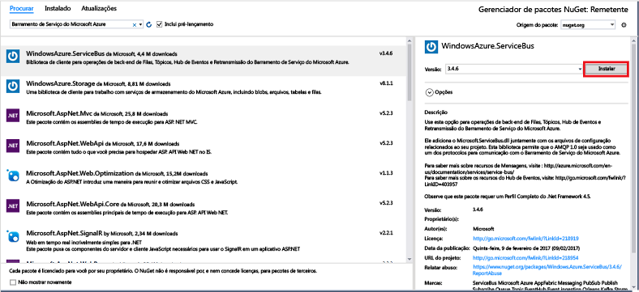

# <a name="send-events-to-azure-event-hubs-using-the-net-framework"></a>Enviar eventos para Hubs de Eventos do Azure usando o .NET Framework

## <a name="introduction"></a>Introdução
Os Hubs de Eventos são um serviço que processa grandes quantidades de dados de eventos (telemetria) a partir de aplicativos e dispositivos conectados. Depois de coletar dados para Hubs de Eventos, você pode armazenar os dados usando um cluster de armazenamento ou transformá-los usando um provedor de análise em tempo real. Essa funcionalidade de coleta e processamento de eventos em grande escala é um componente fundamental de arquiteturas de aplicativos modernas, incluindo a IoT (Internet das Coisas).

Este tutorial mostra como usar o [portal do Azure](https://portal.azure.com) para criar um hub de eventos. Ele também mostra como enviar eventos para um hub de eventos usando um aplicativo de console escrito em C# usando o .NET Framework. Para receber eventos usando o .NET Framework, veja o artigo [Receber eventos usando o .NET Framework](event-hubs-dotnet-framework-getstarted-receive-eph.md) artigo, ou clique no idioma apropriado de recebimento no sumário à esquerda.

Para concluir esse tutorial, você precisará do seguinte:

* [Microsoft Visual Studio 2015 ou superior](http://visualstudio.com). As capturas de tela neste tutorial usam o Visual Studio 2017.
* Uma conta ativa do Azure. Se não tiver uma, você poderá criar uma conta gratuita em apenas alguns minutos. Para obter detalhes, consulte [Avaliação gratuita do Azure](https://azure.microsoft.com/free/).

## <a name="create-an-event-hubs-namespace-and-an-event-hub"></a>Como criar um namespace de hubs de eventos e um hub de eventos

A primeira etapa é usar o [portal do Azure](https://portal.azure.com) para criar um namespace do tipo Hubs de eventos e obter as credenciais de gerenciamento das quais que seu aplicativo precisa para se comunicar com o hub de eventos. Para criar um namespace e um hub de eventos, execute o procedimento [neste artigo](event-hubs-create.md) e, então, continue com as etapas a seguir.

## <a name="create-a-console-application"></a>Criar um aplicativo de console
Nesta seção, você escreverá um aplicativo de console do Windows para enviar eventos para o hub de eventos.

1. No Visual Studio, crie um novo projeto de aplicativo de área de trabalho do Visual C# usando o modelo de projeto de **Aplicativo de Console** . Nomeie o projeto como **Remetente**.
   
    
2. No Gerenciador de Soluções, clique com o botão direito do mouse no projeto **Remetente** clique em **Gerenciar Pacotes NuGet para Solução**. 
3. Clique na guia **Procurar** e procure `Microsoft Azure Service Bus`. Clique em **Instalar**e aceite os termos de uso. 
   
    
   
    O Visual Studio faz o download, instala e adiciona uma referência ao [pacote NuGet de biblioteca do Barramento de Serviço do Azure](https://www.nuget.org/packages/WindowsAzure.ServiceBus).
4. Adicione as instruções `using` abaixo na parte superior do arquivo **Program.cs** :
   
    ```csharp
    using System.Threading;
    using Microsoft.ServiceBus.Messaging;
    ```
5. Adicione os seguintes campos à classe **Programa**, substituindo os valores do espaço reservado pelo nome do hub de eventos criado na seção anterior e pela cadeia de conexão no nível do namespace que você salvou anteriormente.
   
    ```csharp
    static string eventHubName = "{Event Hub name}";
    static string connectionString = "{send connection string}";
    ```
6. Adicione o seguinte método à classe **Programa** :
   
    ```csharp
    static void SendingRandomMessages()
    {
        var eventHubClient = EventHubClient.CreateFromConnectionString(connectionString, eventHubName);
        while (true)
        {
            try
            {
                var message = Guid.NewGuid().ToString();
                Console.WriteLine("{0} > Sending message: {1}", DateTime.Now, message);
                eventHubClient.Send(new EventData(Encoding.UTF8.GetBytes(message)));
            }
            catch (Exception exception)
            {
                Console.ForegroundColor = ConsoleColor.Red;
                Console.WriteLine("{0} > Exception: {1}", DateTime.Now, exception.Message);
                Console.ResetColor();
            }
   
            Thread.Sleep(200);
        }
    }
    ```
   
    Esse método envia continuamente os eventos para seu hub de eventos com um atraso de 200 ms.
7. Por fim, adicione as seguintes linhas ao método **Main** :
   
    ```csharp
    Console.WriteLine("Press Ctrl-C to stop the sender process");
    Console.WriteLine("Press Enter to start now");
    Console.ReadLine();
    SendingRandomMessages();
    ```
8. Execute o programa e certifique-se de que não existem erros.
  
Parabéns! Agora você enviou mensagens para um hub de eventos.

## <a name="next-steps"></a>Próximas etapas
Agora que você criou um aplicativo funcional que cria um hub de eventos e envia dados, poderá passar para os seguintes cenários:

* [Receber eventos usando o Host de Processador de Eventos](event-hubs-dotnet-framework-getstarted-receive-eph.md)
* [Referência do host de processador de eventos](/dotnet/api/microsoft.servicebus.messaging.eventprocessorhost)
* [Visão Geral dos Hubs de Eventos](event-hubs-what-is-event-hubs.md)

<!-- Images. -->
[19]: ./media/event-hubs-csharp-ephcs-getstarted/create-eh-proj1.png
[20]: ./media/event-hubs-csharp-ephcs-getstarted/create-eh-proj2.png
[21]: ./media/event-hubs-csharp-ephcs-getstarted/run-csharp-ephcs1.png
[22]: ./media/event-hubs-csharp-ephcs-getstarted/run-csharp-ephcs2.png


