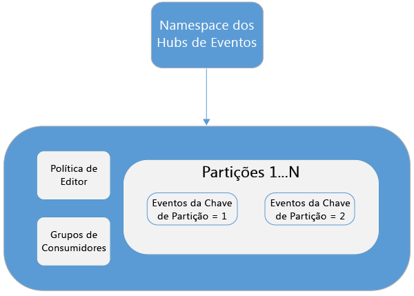
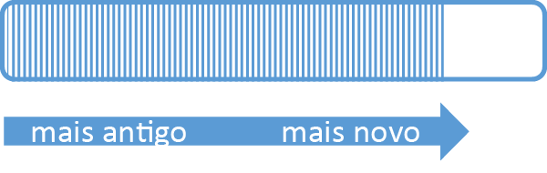
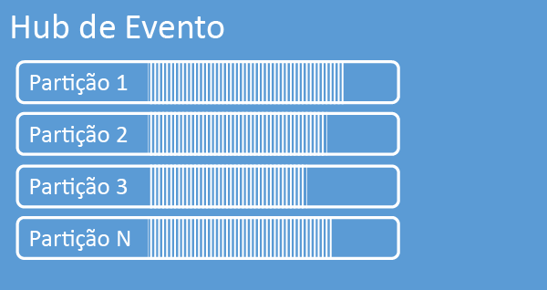
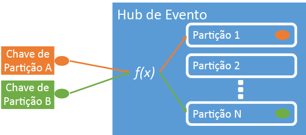
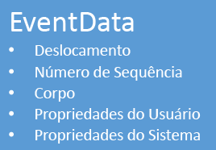

# <a name="azure-event-hubs-overview"></a>Visão geral dos Hubs de Eventos do Azure
Muitas soluções modernas pretendem fornecer experiências adaptáveis para os clientes ou para aperfeiçoar os produtos por meio de comentários contínuos e telemetria automatizada. Essas soluções enfrentam o desafio de saber como processar de forma segura e confiável grandes quantidades de informações de vários editores simultâneos. O Hub de Evento do Microsoft Azure é um serviço de plataforma gerenciada que fornece uma base para inserção de dados em grande escala em uma ampla variedade de cenários. Exemplos dessas situações rastreamento de comportamento de aplicativos móveis, informações de tráfego de farms da web, captura de eventos de jogos em jogos de console ou dados de telemetria coletados de máquinas industriais ou veículos conectados. A função comum que o Hub de Evento desempenha em arquiteturas de solução é que ele atua como a "porta da frente" de um pipeline de evento, geralmente chamado de *ingestor de eventos*. Um ingestor de eventos é um componente ou serviço que fica entre os editores de eventos e consumidores de eventos para desacoplar a produção de uma transmissão de eventos do consumo desses eventos.


O Hub de Evento do Azure é um serviço de processamento de eventos que fornece entrada de telemetria e eventos na nuvem em grande escala, com baixa latência e alta confiabilidade. Esse serviço, usado com outros serviços downstream, é especialmente útil em cenários de instrumentação de aplicativos, processamento de fluxo de trabalho ou experiência do usuário e Internet das Coisas (IoT). O Hubs de Eventos fornece um recurso de manipulação de fluxo de mensagens e, embora um Hub de Eventos seja uma entidade similar a filas e tópicos, ele tem características que são muito diferentes das mensagens corporativas tradicionais. Cenários de mensagens corporativas, geralmente, exigem recursos sofisticados, como sequenciamento, mensagens mortas, suporte a transações e fortes garantias de entrega, enquanto a preocupação dominante para entrada de evento é alta taxa de transferência e flexibilidade de processamento para fluxos de eventos. Portanto, os recursos de Hubs de Eventos são diferentes de tópicos do Barramento de Serviço, no sentido de que são eficientes nos cenários de alta produtividade e processamento de eventos. Dessa forma, os Hubs de Evento não implementam alguns dos recursos de mensagens que estão disponíveis para tópicos. Se você precisa desses recursos, os tópicos continuam sendo a melhor opção.

Um Hub de Eventos é criado no nível de namespace do Hubs de Eventos, semelhante a filas e tópicos do Barramento de Serviço. O Hubs de Evento usa HTTP e AMQP como suas interfaces de API principais. O diagrama a seguir mostra a relação entre o Hubs de Eventos e o Barramento de Serviço.



## <a name="conceptual-overview"></a>Visão geral conceitual
O Hub de Evento fornece um fluxo de mensagens por meio de um padrão de consumidor particionado. As filas e tópicos usam um modelo [*consumidor concorrente*](https://msdn.microsoft.com/library/dn568101.aspx) no qual cada consumidor tenta ler da mesma fila ou recurso. Essa competição por recursos acaba resultando em complexidade e limites de escala para aplicativos de processamento de fluxo. O Hub de Evento usa um padrão de consumidor particionado no qual cada consumidor lê somente um subconjunto específico, ou partição, do fluxo de mensagens. Esse padrão permite a escala horizontal para processamento de eventos e fornece outros recursos centrados no fluxo que não estão disponíveis em filas e tópicos.

### <a name="partitions"></a>Partições
Uma partição é uma sequência ordenada de eventos que é mantida em um Hub de Eventos. À medida que novos eventos chegam, eles são adicionados ao final dessa sequência. Uma partição pode ser pensada como "log de confirmação".



As partições retém dados por um período de retenção configurado que é definido no nível do Hub de Eventos. Essa configuração aplica-se a todas as partições no Hub de Eventos. Eventos expiram periodicamente; não é possível excluí-los explicitamente. Um Hub de Eventos contém várias partições. Cada partição é independente e contém sua própria sequência de dados. Como resultado, partições geralmente aumentam em taxas diferentes.



O número de partições é especificado no momento da criação do Hub de Eventos e deve estar entre 2 e 32 (o padrão é quatro). As partições são um mecanismo de organização de dados e estão mais relacionadas ao grau de paralelismo de downstream necessário em aplicativos de consumo que de consumo de Hubs de Evento. Isso torna a escolha do número de partições em um Hub de Eventos diretamente relacionado ao número de leitores simultâneos que você espera ter. Após a criação do Hub de Eventos, a contagem de partições não é alterável; você deve considerar esse número em termos de escala esperada de longo prazo. Você pode aumentar o limite de 32 partições entrando em contato com a equipe do Barramento de Serviço.

Enquanto as partições podem ser identificadas e podem ser enviadas diretamente é melhor evitar o envio de dados para partições específicas. Em vez disso, você pode usar construções de nível superior abordadas nas seções [Editor de eventos](#event-publisher) e [Política de editor](#capacity-and-security).

No contexto dos Hubs de Evento, as mensagens são denominadas *dados de evento*. Os dados do evento contêm o corpo do evento, um recipiente de propriedades definidas pelo usuário e diversos metadados sobre o evento, como seu deslocamento na partição e seu número na sequência de fluxo. As partições são preenchidas com uma sequência de dados de evento.

## <a name="event-publisher"></a>Editor de eventos
Qualquer entidade que envia eventos ou dados para um Hub de Eventos é um *editor de eventos*. Os editores de eventos podem publicar eventos usando HTTPS ou AMQP 1.0. Os editores de eventos usam um token de SAS (Assinatura de Acesso Compartilhado) para se identificar para um Hub de eventos, e podem ter uma identidade exclusiva ou usar um token SAS comum, dependendo das exigências do cenário.

Para saber mais sobre como trabalhar com SAS, confira [Autenticação de assinatura de acesso compartilhado com o Barramento de Serviço](../service-bus-messaging/service-bus-shared-access-signature-authentication.md).

### <a name="common-publisher-tasks"></a>Tarefas comuns do editor
Esta seção descreve as tarefas comuns para editores de eventos.

#### <a name="acquire-a-sas-token"></a>Adquirir um token SAS
Uma SAS (Assinatura de Acesso Compartilhado) é o mecanismo de autenticação para Hubs de Evento. O Barramento de Serviço fornece políticas de SAS no namespace e no nível do Hub de Eventos. Um token SAS é gerado a partir de uma chave de SAS e é um hash SHA de uma URL, codificado em um formato específico. Usando o nome da chave (política) e o token, o Barramento de Serviço pode regenerar o hash e, portanto, autenticar o remetente. Normalmente, os tokens SAS para editores de eventos são criados apenas com privilégios de **enviar** em um Hub de Eventos específico. Esse mecanismo de URL de token SAS é a base para a identificação de editor abordada na política do editor. Para saber mais sobre como trabalhar com SAS, confira [Autenticação de assinatura de acesso compartilhado com o Barramento de Serviço](../service-bus-messaging/service-bus-shared-access-signature-authentication.md).

#### <a name="publishing-an-event"></a>Publicar um evento
Você pode publicar um evento por meio do AMQP 1.0 ou HTTPS. O Barramento de Serviço fornece uma classe [EventHubClient](/dotnet/api/microsoft.servicebus.messaging.eventhubclient?redirectedfrom=MSDN#microsoft_servicebus_messaging_eventhubclient) de publicação de eventos para um Hub de Eventos de clientes .NET. Para outras plataformas e tempos de execução, você pode usar qualquer cliente AMQP 1.0, como o [Apache Qpid](http://qpid.apache.org/). Você pode publicar eventos individualmente ou em lotes. Uma única publicação (instância de dados do evento) tem um limite de 256 KB, independentemente de ser um único evento ou um lote. Eventos de publicação maiores que isso resultam em um erro. Uma prática recomendada para editores é não conhecer as partições no Hub de Eventos e especificar apenas uma *chave de partição* (abordada na próxima seção), ou sua identidade por meio de seu token SAS.

A opção de usar AMQP ou HTTPS é específica para o cenário de uso. O AMQP requer o estabelecimento de um soquete bidirecional persistente, além do TLS (segurança de nível de transporte) ou SSL/TLS. Essa pode ser uma operação cara em termos de tráfego de rede, mas só acontece no início de uma sessão de AMQP. O HTTPS tem uma sobrecarga inicial menor, mas exige mais sobrecarga de SSL para cada solicitação. Para editores que publicam eventos frequentemente, o AMQP oferece descontos significativos de taxa de transferência, desempenho e latência.

### <a name="partition-key"></a>Chave de partição
Uma chave de partição é um valor que é usado para mapear dados de evento de entrada em partições específicas para fins de organização de dados. A chave de partição é um valor fornecido pelo remetente passado para um Hub de Eventos. Ela é processada por meio de uma função de hash estática, cujo resultado cria a atribuição de partição. Se você não especificar uma chave de partição ao publicar um evento, uma atribuição de round robin será usada. Ao usar chaves de partição, o editor de eventos só está ciente da sua chave de partição, não da partição para a qual os eventos são publicados. Essa desassociação de chave e partição isenta o remetente da necessidade de saber muito sobre o armazenamento de eventos e o processamento de downstream. As chaves de partição são importantes para organizar dados para processamento de downstream, mas, basicamente, não são relacionadas às partições em si. Uma identidade por dispositivo ou exclusiva do usuário é uma boa chave de partição, mas outros atributos, como geografia, também podem ser usados para agrupar eventos relacionados em uma única partição. A imagem a seguir mostra os remetentes de evento usando chaves de partição para se fixar a partições.



Os Hubs de Eventos garantem que todos os eventos que compartilham o mesmo valor de chave de partição sejam entregues na ordem e para a mesma partição. É importante lembrar que, se forem usadas chaves de partição com políticas de editor, descritas na próxima seção, a identidade do editor e o valor da chave de partição devem corresponder. Caso contrário, ocorrerá um erro.

### <a name="event-consumer"></a>Consumidor de eventos
Qualquer entidade que lê dados de evento de um Hub de Evento é um consumidor de eventos. Todos os consumidores de evento leem o fluxo de eventos por meio de partições em um grupo de consumidores. Cada partição deve ter apenas um leitor ativo por vez. Todos os consumidores de Hubs de Eventos se conectam por meio de sessão do AMQP 1.0, onde os eventos são entregues quando estão disponíveis. O cliente não precisa buscar pela disponibilidade de dados.

#### <a name="consumer-groups"></a>Grupos de consumidores
O mecanismo de publicação/assinatura dos Hubs de Evento é habilitado por meio de grupos de consumidores. Um grupo de consumidores é uma exibição (estado, posição ou deslocamento) de todo um Hub de Evento. Os grupos de consumidores habilitam vários aplicativos de consumo para ter um modo de exibição separado do fluxo de eventos e para ler o fluxo de forma independente em seu próprio ritmo e com seus próprios deslocamentos. Em um arquitetura de processamento de fluxo, cada aplicativo downstream equivale a um grupo de consumidores. Se você quiser gravar dados de evento em um armazenamento de longo prazo, isso quer dizer que esse aplicativo gravador de armazenamento é um grupo de consumidores. O processamento de eventos complexos é executado por outro grupo separado de consumidores. Você pode acessar partições somente por meio de um grupo de consumidores. Sempre há um grupo de consumidores padrão em um Hub de Eventos, e você pode criar até 20 grupos de consumidores para um Hub de Evento de camada Padrão.

Veja estes exemplos de convenção de URI de grupo de consumidores:

```
//<my namespace>.servicebus.windows.net/<event hub name>/<Consumer Group #1>
//<my namespace>.servicebus.windows.net/<event hub name>/<Consumer Group #2>
```

A imagem a seguir mostra os consumidores de evento dentro de grupos de consumidores.


#### <a name="stream-offsets"></a>Deslocamentos de fluxo
Um deslocamento é a posição de um evento dentro de uma partição. Você pode pensar em um deslocamento como um cursor do lado do cliente. O deslocamento é uma numeração em bytes do evento. Isso permite que um consumidor de eventos (leitor) especifique um ponto no fluxo de eventos a partir do qual deseja começar a ler eventos. Você pode especificar o deslocamento como um carimbo de data hora ou um valor de deslocamento. Os consumidores são responsáveis por armazenar seu próprios valores de deslocamento fora do serviço de Hubs de Evento.


Dentro de uma partição, cada evento inclui um deslocamento. Esse deslocamento é usado pelos consumidores para mostrar a localização na sequência de eventos para uma determinada partição. Os deslocamentos podem ser passados para o Hub de Eventos como um número ou um valor de carimbo de data e hora quando um leitor se conecta.

#### <a name="checkpointing"></a>Ponto de verificação
*Ponto de verificação* é um processo pelo qual os leitores marcam ou confirmam sua posição em uma sequência de eventos da partição. O ponto de verificação é responsabilidade do consumidor e ocorre em uma base por partição dentro de um grupo de consumidores. Isso significa que, para cada grupo de consumidores, cada leitor de partição deve manter o controle da sua posição atual no fluxo de eventos e pode informar o serviço quando considerar o fluxo de dados concluído. Se um leitor se desconecta de uma partição, ao se reconectar, ele começa a ler no ponto de verificação que foi anteriormente enviado pelo último leitor dessa partição nesse grupo de consumidores. Quando o leitor se conecta, ele passa esse deslocamento para o Hub de Eventos para especificar o local no qual começar a ler. Assim, você pode usar o ponto de verificação para marcar eventos como "concluídos" por aplicativos de downstream e oferecer resiliência no evento caso ocorra um failover entre leitores em execução em máquinas diferentes. Como os dados do evento são retidos durante o intervalo de retenção especificado quando o Hub de Eventos é criado, é possível retornar aos dados mais antigos, especificando um deslocamento inferior desse processo de ponto de verificação. Por meio desse mecanismo, o ponto de verificação permite resiliência de failover e reprodução controlada de fluxo de eventos.

#### <a name="common-consumer-tasks"></a>Tarefas comuns do consumidor
Esta seção descreve as tarefas comuns para consumidores de evento de Hubs de Eventos ou leitores. Todos os consumidores de Hubs de Eventos se conectam por meio do AMQP 1.0. O AMQP 1.0 é uma sessão e um canal de comunicação bidirecional com reconhecimento de estado. Cada partição tem uma sessão de link AMQP 1.0 que facilita o transporte de eventos separados por partição.

##### <a name="connect-to-a-partition"></a>Conectar-se a uma partição
Para consumir eventos de um Hub de Eventos, um consumidor deve se conectar a uma partição. Conforme mencionado anteriormente, você sempre acessa partições por meio de um grupo de consumidores. Como parte do modelo de consumidor particionado, somente um único leitor deve ficar ativo em uma partição por vez dentro de um grupo de consumidores. Essa é uma prática comum ao se conectar diretamente a partições para usar um mecanismo de concessão para coordenar conexões de leitores a partições específicas. Dessa forma, é possível que cada partição em um grupo de consumidores tenha apenas um leitor ativo. O gerenciamento da posição na sequência para um leitor é uma tarefa importante que pode ser realizada por meio de pontos de verificação. Essa funcionalidade é simplificada usando a classe [EventProcessorHost](https://msdn.microsoft.com/library/microsoft.servicebus.messaging.eventprocessorhost.aspx) para clientes .NET. [EventProcessorHost](https://msdn.microsoft.com/library/microsoft.servicebus.messaging.eventprocessorhost.aspx) é um agente de consumidor inteligente e é descrito na próxima seção.

##### <a name="read-events"></a>Ler eventos
Depois de uma sessão do AMQP 1.0 e o link ser aberto para uma partição específica, os eventos são entregues ao cliente AMQP 1.0 pelo serviço de Hubs de Evento. Esse mecanismo de entrega permite uma maior taxa de transferência e menor latência que mecanismos baseado em pull, como HTTP GET. Como os eventos são enviados para o cliente, cada instância de dados do evento contém metadados importantes, como o deslocamento e número da sequência que são usados para facilitar o ponto de verificação na sequência de eventos.



É sua responsabilidade gerenciar esse deslocamento da melhor maneira para gerenciar o progresso ao processar o fluxo.

## <a name="capacity-and-security"></a>Capacidade e segurança
O Hub de Eventos é uma arquitetura paralela altamente dimensionável para entrada de fluxo. Por isso, há vários aspectos importantes a considerar ao dimensionar e escalar uma solução baseada em Hubs de Evento. O primeiro desses controles de capacidade é chamado de *unidade de produtividade*, descrito na seção a seguir.

### <a name="throughput-units"></a>Unidades de transferência
A capacidade de transferência dos Hubs de Eventos é controlada pelas unidades de transferência. As unidades de taxa de transferência são unidades de capacidade pré-adquiridas. Uma única unidade de transferência inclui o seguinte:

* Entrada: até 1 MB por segundo ou mil eventos por segundo.
* Saída: até 2 MB por segundo.

A entrada está limitada à quantidade de capacidade fornecida pelo número adquirido de unidades de transferência. O envio de dados acima essa quantidade resulta em uma exceção "cota excedida". Esse valor é 1 MB por segundo ou 1.000 eventos por segundo, o que ocorrer primeiro. A saída não gera exceções de limitação, mas está limitada à quantidade de transferência de dados fornecida pelas unidades adquiridas de transferência: 2 MB por segundo por unidade de transferência. Se você receber exceções de taxa de publicação ou estiver esperando ver mais saída, verifique quantas unidades de transferência você comprou para o namespace no qual o Hub de Eventos foi criado. Para obter mais unidades de produtividade, você pode ajustar a configuração na página **Namespaces** na guia **Escala** no [Portal Clássico do Azure][Azure classic portal]. Você também pode alterar essa configuração usando as APIs do Azure.

Enquanto as partições são um conceito de organização de dados, as unidades de transferência são puramente um conceito de capacidade. As unidades de taxa de transferência são cobradas por hora e são pré-adquiridas. Depois de adquiridas, as unidades de taxa de transferência são cobradas por um mínimo de uma hora. É possível adquirir até 20 unidades de transferência para um namespace dos Hubs de Eventos, e há um limite de conta do Azure de 20 unidades de produtividade. Essas unidades de transferência são compartilhadas em todos os Hubs de Evento em um namespace específico.

As unidades de taxa de transferência são provisionadas da melhor maneira possível e podem não estar sempre disponíveis para compra imediata. Se você precisar de um recurso específico, é recomendável adquirir essas unidades de transferência com antecedência. Se precisar de mais de 20 unidades de produtividade, você pode entrar em contato com o suporte do Azure para adquirir mais unidades de produtividade em uma base de compromisso em blocos de 20 até as 100 primeiras unidades de produtividade. Além disso, você também pode comprar blocos de 100 unidades de transferência.

É recomendável balancear criteriosamente partições e unidades de transferência para obter uma escala ideal com Hubs de Eventos. Uma única partição tem uma escala máxima de uma unidade de transferência. O número de unidades de transferência deve ser menor ou igual ao número de partições em um Hub de Eventos.

Para obter informações sobre preços, veja a página [Preços de Hubs de Eventos](https://azure.microsoft.com/pricing/details/event-hubs/).

### <a name="publisher-policy"></a>Política de editor
Os Hubs de Eventos permitem um controle granular sobre os editores de eventos por meio de *políticas do editor*. As políticas do editor são um conjunto de recursos de tempo de execução criado para facilitar um grande número de editores de eventos independentes. Com as políticas do editor, cada editor usa seu próprio identificador exclusivo ao publicar eventos em um Hub de Eventos usando o mecanismo a seguir:

```
//<my namespace>.servicebus.windows.net/<event hub name>/publishers/<my publisher name>
```

Você não precisa criar nomes de editor com antecedência, mas eles devem coincidir com o token SAS usado ao publicar um evento, para garantir identidades de editores independentes. Para saber mais sobre SAS, confira [Autenticação de assinatura de acesso compartilhado com o Barramento de serviço](../service-bus-messaging/service-bus-shared-access-signature-authentication.md). Ao usar políticas de editor, o valor **PartitionKey** é definido como o nome do editor. Para funcionar adequadamente, esses valores devem corresponder.

## <a name="summary"></a>Resumo
Os Hubs de Eventos do Azure fornecem um evento de hiperescala e um serviço de processamento de telemetria que pode ser usado para monitoramento de fluxo de trabalho do usuário e aplicativos comuns em qualquer escala. Com a capacidade de fornecer recursos de publicação/assinatura com baixa latência e em grande escala, os Hubs de Eventos servem como uma "subida" para Big Data. Com a identidade com base no editor e listas de revogação, esses recursos são estendidos para cenários comuns de [Internet das Coisas](https://docs.microsoft.com/azure/#pivot=services&panel=iot). Para obter mais informações sobre como desenvolver aplicativos de Hubs de Eventos, confira o [Guia de programação dos Hubs de Eventos](event-hubs-programming-guide.md).

## <a name="next-steps"></a>Próximas etapas
Agora que já aprendeu conceitos de Hubs de Eventos, você pode passar para os seguintes cenários:

* Introdução com um [Tutorial de Hubs de Evento].
* Um [aplicativo de exemplo completo que usa os Hubs de Evento].

[Azure classic portal]: http://manage.windowsazure.com
[Tutorial de Hubs de Evento]: event-hubs-csharp-ephcs-getstarted.md
[aplicativo de exemplo completo que usa os Hubs de Evento]: https://code.msdn.microsoft.com/windowsazure/Service-Bus-Event-Hub-286fd097


<!--HONumber=Dec16_HO1-->


