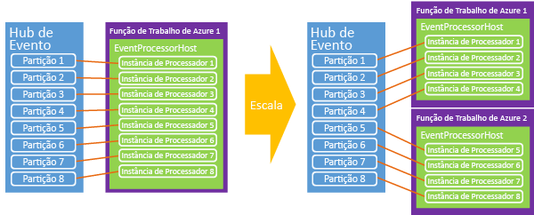

# <a name="programming-guide-for-azure-event-hubs"></a>Guia de programação para Hubs de Eventos do Azure
Este artigo descreve alguns cenários comuns de produção de código usando os Hubs de Eventos do Azure. Ele supõe uma compreensão preliminar de Hubs de Eventos. Para obter uma visão geral conceitual dos Hubs de Eventos, confira [Visão geral dos Hubs de Eventos](event-hubs-what-is-event-hubs.md).

## <a name="event-publishers"></a>Editores de eventos

Envie eventos para um Hub de Eventos usando HTTP POST ou via uma conexão AMQP 1.0. A escolha de qual usar e quando depende do cenário específico que está sendo abordado. Conexões do AMQP 1.0 são medidas como conexões negociadas no Barramento de Serviço e são mais apropriadas em cenários com volumes de mensagem frequentemente mais altos e requisitos de latência mais baixos, já que fornecem um canal de mensagens persistente.

Ao usar APIs gerenciadas pelo .NET, as principais construções para publicar os dados nos Hubs de Eventos são as classes [EventHubClient][] e [EventData][]. [EventHubClient][] fornece o canal de comunicação AMQP pelo qual os eventos são enviados ao Hub de Eventos. A classe [EventData][] representa um evento e é usada para publicar mensagens em um hub de eventos. Essa classe inclui o corpo, alguns metadados e informações de cabeçalho sobre o evento. Outras propriedades são adicionadas ao objeto [EventData][] à medida que ele passa por um hub de eventos.

## <a name="get-started"></a>Introdução
As classes do .NET que são compatíveis com os Hubs de Eventos são fornecidas no pacote do NuGet [Microsoft.Azure.EventHubs](https://www.nuget.org/packages/Microsoft.Azure.EventHubs/). Você pode instalar usando o gerenciador de soluções do Visual Studio, ou o [Console do Gerenciador de pacotes](https://docs.nuget.org/docs/start-here/using-the-package-manager-console) no Visual Studio. Digite o comando a seguir na janela [Console do Gerenciador de Pacotes](https://docs.nuget.org/docs/start-here/using-the-package-manager-console) :

```shell
Install-Package Microsoft.Azure.EventHubs
```

## <a name="create-an-event-hub"></a>Criar um Hub de Evento

Você pode usar portal do Azure, o Azure PowerShell, a CLI do Azure para criar os Hubs de Eventos. Para obter mais detalhes, consulte [Criar um namespace de Hubs de Eventos e um hub de eventos usando o portal do Azure](event-hubs-create.md).

## <a name="create-an-event-hubs-client"></a>Criar um cliente de Hubs de Eventos

A classe principal para interagir com Hubs de Eventos é [Microsoft.Azure.EventHubs.EventHubClient][EventHubClient]. Você pode iniciar essa classe usando o método [CreateFromConnectionString](/dotnet/api/microsoft.azure.eventhubs.eventhubclient.createfromconnectionstring), conforme mostrado no exemplo a seguir:

```csharp
private const string EventHubConnectionString = "Event Hubs namespace connection string";
private const string EventHubName = "event hub name";

var connectionStringBuilder = new EventHubsConnectionStringBuilder(EventHubConnectionString)
{
    EntityPath = EventHubName

};
eventHubClient = EventHubClient.CreateFromConnectionString(connectionStringBuilder.ToString());
```

## <a name="send-events-to-an-event-hub"></a>Enviar eventos para um hub de eventos

Você envia eventos a um hub de eventos, criando uma instância [EventHubClient][] e enviando-a por meio do método [SendAsync](/dotnet/api/microsoft.azure.eventhubs.eventhubclient.sendasync). Esse método usa um único parâmetro [EventData][] da instância e o envia de forma assíncrona para um hub de eventos.

## <a name="event-serialization"></a>Serialização de evento

A classe [EventData][] tem [ dois construtores sobrecarregados](/dotnet/api/microsoft.azure.eventhubs.eventdata.-ctor) que usam vários parâmetros,bytes ou matriz de byte, que representam o payload dos dados do evento. Ao usar o JSON com [EventData][], você pode usar **Encoding.UTF8.GetBytes()** para recuperar a matriz de bytes para uma cadeia de caracteres codificada em JSON. Por exemplo: 

```csharp
for (var i = 0; i < numMessagesToSend; i++)
{
    var message = $"Message {i}";
    Console.WriteLine($"Sending message: {message}");
    await eventHubClient.SendAsync(new EventData(Encoding.UTF8.GetBytes(message)));
}
```

## <a name="partition-key"></a>Chave de partição

Ao enviar dados de evento, você pode especificar um valor de hash para produzir uma atribuição de partição. Especifique a partição usando a propriedade [PartitionSender.PartitionID](/dotnet/api/microsoft.azure.eventhubs.partitionsender.partitionid). No entanto, a decisão de usar partições implica uma escolha entre disponibilidade e consistência. 

### <a name="availability-considerations"></a>Considerações sobre disponibilidade

Usar uma chave de partição é opcional, e você deve considerar cuidadosamente se deseja ou não usar uma. Se você não especificar uma chave de partição ao publicar um evento, uma atribuição de round robin será usada. Em muitos casos, usar uma chave de partição é uma boa opção se a ordem dos eventos for importante. Quando você usa uma chave de partição, essas partições exigem disponibilidade em um único nó, e podem ocorrer interrupções ao longo do tempo; por exemplo, durante a reinicialização e aplicação de patches de nós de computação. Assim, se você definir uma ID de partição, e essa partição ficar indisponível por algum motivo, uma tentativa de acessar os dados na partição falhará. Se a alta disponibilidade for mais importante, não especifique uma chave de partição; nesse caso, os eventos são enviados às partições usando o modelo de round-robin descrito anteriormente. Nesse cenário, você está fazendo uma opção explícita entre disponibilidade (sem ID de partição) e consistência (fixando eventos a uma ID de partição).

Outra consideração é o tratamento de atrasos no processamento de eventos. Em alguns casos, talvez seja melhor remover os dados e repetir a operação do que acompanhar o processamento, o que pode causar ainda mais atrasos de processamento de downstream. Por exemplo, com uma cotação de bolsa é melhor aguardar dados atualizados, mas em um bate-papo ao vivo ou um cenário de VOIP é melhor ter os dados rapidamente, mesmo se não estiverem completos.

Com base nessas considerações de disponibilidade, nesses cenários, você pode escolher uma das seguinte estratégias de tratamento de erro:

- Parar (para de ler de Hubs de Eventos até que tudo seja corrigido)
- Descartar (as mensagens não são importantes, descarte-as)
- Tentar novamente (repete as mensagens como você achar adequado)

Para obter mais informações e uma discussão sobre as compensações entre disponibilidade e a consistência, consulte [Disponibilidade e a consistência nos Hubs de Eventos](event-hubs-availability-and-consistency.md). 

## <a name="batch-event-send-operations"></a>Operações de envio de eventos em lote

O envio de eventos em lotes pode aumentar a taxa de transferência. Você pode usar a API [CreateBatch](/dotnet/api/microsoft.azure.eventhubs.eventhubclient.createbatch) API para criar um lote no qual os dados objetos podem ser adicionados posteriormente a uma chamada [SendAsync](/dotnet/api/microsoft.azure.eventhubs.eventhubclient.sendasync).

Um único lote não deve exceder o limite de 1 MB de um evento. Além disso, cada mensagem no lote usa a mesma identidade do publicador. É responsabilidade do remetente garantir que o lote não exceda o tamanho máximo do evento. Em caso afirmativo, um erro **Enviar** do cliente é gerado. Use o método auxiliar [EventHubClient.CreateBatch](/dotnet/api/microsoft.azure.eventhubs.eventhubclient.createbatch) para garantir que o lote não exceda 1 MB. Você obtém um [EventDataBatch](/dotnet/api/microsoft.azure.eventhubs.eventdatabatch) vazio na API do [CreateBatch](/dotnet/api/microsoft.azure.eventhubs.eventhubclient.createbatch) e, em seguida, usa [TryAdd](/dotnet/api/microsoft.azure.eventhubs.eventdatabatch.tryadd) para adicionar eventos para construir o lote. 

## <a name="send-asynchronously-and-send-at-scale"></a>Enviar de forma assíncrona e em escala

Você envia eventos para um hub de eventos de forma assíncrona. O envio de forma assíncrona pode aumentar a taxa em que um cliente é capaz de enviar eventos. O [SendAsync](/dotnet/api/microsoft.azure.eventhubs.eventhubclient.sendasync) retorna um objeto da [Tarefa](https://msdn.microsoft.com/library/system.threading.tasks.task.aspx). Você pode usar a classe [RetryPolicy](/dotnet/api/microsoft.servicebus.retrypolicy) no cliente para controlar as opções de novas tentativas do cliente.

## <a name="event-consumers"></a>Consumidores de evento
A classe [EventProcessorHost][] processa dados de Hubs de Eventos. Você deve usar essa implementação ao criar os leitores de evento na plataforma .NET. [EventProcessorHost][] fornece um ambiente de tempo de execução seguro, thread-safe, de vários processos, para implementações de processador de eventos, que também fornece gerenciamento de concessão de ponto de verificação e partição.

Para usar a classe [EventProcessorHost][], você pode implementar o [IEventProcessor](/dotnet/api/microsoft.azure.eventhubs.processor.ieventprocessor). Essa interface contém quatro métodos:

* [OpenAsync](/dotnet/api/microsoft.azure.eventhubs.processor.ieventprocessor.openasync)
* [CloseAsync](/dotnet/api/microsoft.azure.eventhubs.processor.ieventprocessor.closeasync)
* [ProcessEventsAsync](/dotnet/api/microsoft.azure.eventhubs.processor.ieventprocessor.processeventsasync)
* [ProcessErrorAsync](/dotnet/api/microsoft.azure.eventhubs.processor.ieventprocessor.processerrorasync)

Para iniciar o processamento de eventos, instancie o [EventProcessorHost][] fornecendo os parâmetros adequados para seu hub de eventos. Por exemplo: 

> [!NOTE]
> EventProcessorHost e suas classes relacionadas são fornecidos a **Microsoft.Azure.EventHubs.Processor** pacote. Adicionar o pacote ao projeto do Visual Studio seguindo as instruções em [neste artigo](event-hubs-dotnet-framework-getstarted-send.md#add-the-event-hubs-nuget-package) ou emitindo o comando a seguir na [Package Manager Console](https://docs.nuget.org/docs/start-here/using-the-package-manager-console) janela:`Install-Package Microsoft.Azure.EventHubs.Processor`.

```csharp
var eventProcessorHost = new EventProcessorHost(
        EventHubName,
        PartitionReceiver.DefaultConsumerGroupName,
        EventHubConnectionString,
        StorageConnectionString,
        StorageContainerName);
```

Em seguida, chame [RegisterEventProcessorAsync](/dotnet/api/microsoft.azure.eventhubs.processor.eventprocessorhost.registereventprocessorasync) para registrar sua implementação [IEventProcessor](/dotnet/api/microsoft.azure.eventhubs.processor.ieventprocessor) na execução:

```csharp
await eventProcessorHost.RegisterEventProcessorAsync<SimpleEventProcessor>();
```

Neste ponto, o host tenta adquirir uma concessão em todas as partições do hub de eventos usando um algoritmo “greedy”. Essas concessões duram por determinado período e, em seguida, devem ser renovadas. Como novos nós, as instâncias de trabalho, nesse caso, ficam online, colocam reservas de concessão e com o tempo, a carga é trocada entre os nós, à medida que cada uma tenta adquirir mais concessões.



Ao longo do tempo, é estabelecido um equilíbrio. Essa funcionalidade dinâmica permite que o dimensionamento automático com base em CPU seja aplicado aos consumidores de ampliação e redução de escala. Como os Hubs de Eventos não têm um conceito direto de contagem de mensagens, a utilização média da CPU é, geralmente, o melhor mecanismo para medir back-end ou escala do consumidor. Se os publicadores começam a publicar mais eventos do que os consumidores podem processar, o aumento de CPU nos consumidores pode ser usado para provocar escala automática na contagem de instâncias de trabalho.

A classe [EventProcessorHost][] também implementa um mecanismo de verificação com base em armazenamento do Azure. Esse mecanismo armazena o deslocamento por base de partição, de forma que cada consumidor pode determinar qual foi o último ponto de verificação do consumidor anterior. Conforme as partições fazem transição entre os nós por meio de concessões, esse é o mecanismo de sincronização que facilita a alternância de carga.

## <a name="publisher-revocation"></a>Revogação do publicador

Além dos recursos avançados de tempo de execução do [EventProcessorHost][], os Hubs de Eventos permitem a revogação do editor para impedir que publicadores específicos enviem eventos para um hub de eventos. Esses recursos serão úteis se o token do editor tiver sido comprometido ou uma atualização de software estiver causando um comportamento inadequado. Nessas situações, a identidade do editor, que faz parte do token SAS, pode ser impedida de publicar eventos.

Para obter mais informações sobre a revogação do publicador e como enviar para os Hubs de Eventos como um publicador, consulte o exemplo [Publicação Segura em Larga Escala dos Hubs de Eventos](https://code.msdn.microsoft.com/Service-Bus-Event-Hub-99ce67ab).

## <a name="next-steps"></a>Próximas etapas

Para saber mais sobre os cenários de Hubs de Eventos, consulte estes links:

* [Visão geral de API de Hubs de Eventos](event-hubs-api-overview.md)
* [O que são Hubs de Eventos](event-hubs-what-is-event-hubs.md)
* [Disponibilidade e consistência nos Hubs de Eventos](event-hubs-availability-and-consistency.md)
* [Referência de API do host de processador de eventos](/dotnet/api/microsoft.servicebus.messaging.eventprocessorhost)

[NamespaceManager]: /dotnet/api/microsoft.servicebus.namespacemanager
[EventHubClient]: /dotnet/api/microsoft.azure.eventhubs.eventhubclient
[EventData]: /dotnet/api/microsoft.azure.eventhubs.eventdata
[CreateEventHubIfNotExists]: /dotnet/api/microsoft.servicebus.namespacemanager.createeventhubifnotexists
[PartitionKey]: /dotnet/api/microsoft.servicebus.messaging.eventdata#Microsoft_ServiceBus_Messaging_EventData_PartitionKey
[EventProcessorHost]: /dotnet/api/microsoft.azure.eventhubs.processor
