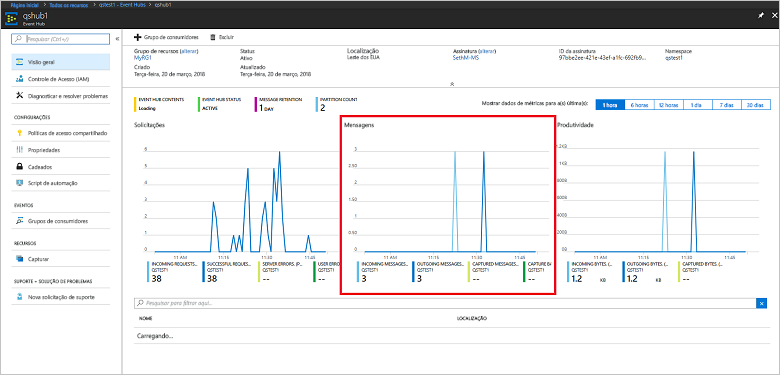

# <a name="quickstart-create-an-event-hub-using-azure-cli"></a>Início Rápido: criar um hub de eventos usando a CLI do Azure

Os Hubs de Eventos do Azure são uma plataforma de fluxo de dados altamente escalonável e um serviço de ingestão capaz de receber e processar milhões de eventos por segundo. Este início rápido mostra como criar recursos de Hubs de Eventos usando a CLI do Azure, em seguida, enviar e receber fluxos de eventos de um hub de eventos usando código Java.

Para concluir este início rápido, você precisa de uma assinatura do Azure. Se você não tiver [uma conta gratuita][], crie uma antes de começar.

## <a name="prerequisites"></a>Pré-requisitos

[!INCLUDE [cloud-shell-try-it.md](../../includes/cloud-shell-try-it.md)]

Se você optar por instalar e usar a CLI do Azure localmente, este tutorial exigirá que você execute a CLI do Azure versão 2.0.4 ou posterior. Execute `az --version` para verificar sua versão. Se você precisa instalar ou atualizar, consulte [Instalar a CLI 2.0 do Azure]( /cli/azure/install-azure-cli).

## <a name="log-on-to-azure"></a>Fazer logon no Azure

As etapas a seguir não são necessárias se você estiver executando comandos no Cloud Shell. Se você estiver executando a CLI localmente, execute as seguintes etapas para fazer logon no Azure e configure sua assinatura atual:

Execute o comando a seguir para fazer logon no Azure:

```azurecli-interactive
az login
```

Defina o contexto da assinatura atual. Substitua `MyAzureSub` pelo nome da assinatura do Azure que deseja usar:

```azurecli-interactive
az account set --subscription MyAzureSub
``` 

## <a name="provision-resources"></a>Provisionar recursos

Emita os comandos a seguir para provisionar os recursos dos Hubs de Eventos. Verifique se os espaços reservados `myResourceGroup`, `namespaceName`, `eventHubName` e `storageAccountName` foram substituídos pelos valores apropriados:

```azurecli-interactive
# Create a resource group
az group create --name myResourceGroup --location eastus

# Create an Event Hubs namespace
az eventhubs namespace create --name namespaceName --resource-group myResourceGroup -l eastus2

# Create an event hub
az eventhubs eventhub create --name eventHubName --resource-group myResourceGroup --namespace-name namespaceName

# Create a general purpose standard storage account
az storage account create --name storageAccountName --resource-group myResourceGroup --location eastus2 --sku Standard_RAGRS --encryption blob

# List the storage account access keys
az storage account keys list --resource-group myResourceGroup --account-name storageAccountName

# Get namespace connection string
az eventhubs namespace authorization-rule keys list --resource-group myResourceGroup --namespace-name namespaceName --name RootManageSharedAccessKey
```

Copie e cole a cadeia de conexão em um local temporário, como o Bloco de notas, para uso futuro.

## <a name="stream-into-event-hubs"></a>Transmitir para os Hubs de Eventos

A próxima etapa é baixar o código de exemplo que transmite eventos para um hub de eventos e recebe esses eventos usando o Host do Processador de Eventos. Primeiro, envie as mensagens:

Clone o [repositório GitHub dos Hubs de Eventos](https://github.com/Azure/azure-event-hubs), emitindo o comando a seguir:

```bash
git clone https://github.com/Azure/azure-event-hubs.git
```

Navegue até a pasta **SimpleSend**: `\azure-event-hubs\samples\Java\Basic\SimpleSend\src\main\java\com\microsoft\azure\eventhubs\samples\SimpleSend`. Abra o arquivo SimpleSend.java e substitua a cadeia de caracteres `"Your Event Hubs namaspace name"` pelo namespace dos Hubs de Eventos que você obteve na seção "Criar um namespace de Hubs de Eventos" deste artigo.

Substitua `"Your event hub"` pelo nome do hub de eventos criado dentro desse namespace, e `"Your policy name"` pelo nome da política de acesso compartilhada para o namespace. A menos que você tenha criado uma nova política, o padrão é **RootManageSharedAccessKey**. 

Por fim, substitua `"Your primary SAS key"` pelo valor da chave SAS para a política na etapa anterior.

### <a name="build-the-application"></a>Compilar o aplicativo 

Navegue de volta para a pasta `\azure-event-hubs\samples\Java\Basic\SimpleSend` e emita o seguinte comando de compilação:

```shell
mvn clean package -DskipTests
```

### <a name="receive"></a>Receber

Agora baixe o de Host do Processador de Eventos, que recebe as mensagens que você acabou de enviar. Navegue até a pasta **EventProcessorSample**: `\azure-event-hubs\samples\Java\Basic\EventProcessorSample\src\main\java\com\microsoft\azure\eventhubs\samples\eventprocessorsample`.

No arquivo EventProcessorSample.java, substitua o valor `----EventHubsNamespaceName-----` pelo namespace dos Hubs de Eventos que você obteve na seção "Criar um namespace de Hubs de Eventos" deste artigo. 

Substitua os outros valores da cadeia de caracteres nesse arquivo: substitua `----EventHubName-----` pelo nome do hub de eventos criado dentro desse namespace, e `-----SharedAccessSignatureKeyName-----` pelo nome da política de acesso compartilhada para o namespace. A menos que você tenha criado uma nova política, o padrão é **RootManageSharedAccessKey**.

Substitua `---SharedAccessSignatureKey----` pelo valor da chave SAS para a política na etapa anterior, substitua `----AzureStorageConnectionString----` pela cadeia de conexão para a conta de armazenamento que você criou, e `----StorageContainerName----` pelo nome do contêiner na conta de armazenamento que você criou. 

Por último, substitua `----HostNamePrefix----` pelo nome da conta de armazenamento.

### <a name="build-the-receiver"></a>Compilar o receptor 

Para compilar o aplicativo de recebimento, navegue até a pasta `\azure-event-hubs\samples\Java\Basic\EventProcessorSample` e execute o comando a seguir:

```shell
mvn clean package -DskipTests
```

### <a name="run-the-apps"></a>Executar os aplicativos

Se as compilações tiverem sido concluídas com êxito, você está pronto para enviar e receber eventos. Primeiro, execute o aplicativo **SimpleSend** e observe os eventos que estão sendo enviados. Para executar o programa, navegue até a pasta `\azure-event-hubs\samples\Java\Basic\SimpleSend` e execute o seguinte comando:

```shell
java -jar ./target/simplesend-1.0.0-jar-with-dependencies.jar
```

Em seguida, execute o aplicativo **EventProcessorSample** aplicativo e observe os eventos que estão sendo recebidos. Para executar o programa, navegue até a pasta `\azure-event-hubs\samples\Java\Basic\EventProcessorSample` e execute o seguinte comando:
   
```shell
java -jar ./target/eventprocessorsample-1.0.0-jar-with-dependencies.jar
```

Depois de executar os dois programas, você pode verificar a página de visão geral do portal do Azure para o hub de eventos para ver a contagem de mensagens de entrada e saída:



## <a name="clean-up-resources"></a>Limpar recursos

Execute o comando a seguir para remover o grupo de recursos, o namespace, a conta de armazenamento e todos os recursos relacionados. Substitua `myResourceGroup` pelo nome do grupo de recursos que você criou:

```azurecli
az group delete --resource-group myResourceGroup
```

## <a name="understand-the-sample-code"></a>Entender o código de exemplo

Esta seção contém mais detalhes sobre o que o código de exemplo faz.

### <a name="send"></a>Enviar

No arquivo SimpleSend.java, a maioria do trabalho é feito no método main(). Primeiro, o código usa uma instância `ConnectionStringBuilder` para construir a cadeia de conexão usando os valores definidos pelo usuário para o nome do namespace, nome do hub de eventos, nome da chave SAS e a própria chave SAS:

```java
final ConnectionStringBuilder connStr = new ConnectionStringBuilder()
        .setNamespaceName("Your Event Hubs namespace name")
        .setEventHubName("Your event hub")
        .setSasKeyName("Your policy name")
        .setSasKey("Your primary SAS key");
```

O objeto de Java que contém a carga do evento, em seguida, é convertido em Json:

```java
final Gson gson = new GsonBuilder().create();

final PayloadEvent payload = new PayloadEvent(1);
byte[] payloadBytes = gson.toJson(payload).getBytes(Charset.defaultCharset());
EventData sendEvent = EventData.create(payloadBytes);  
```

O cliente de Hubs de Eventos é criado nesta linha de código:

```java
final EventHubClient ehClient = EventHubClient.createSync(connStr.toString(), executorService);
```

O bloco try/finally envia um evento round robin para uma partição não especificada:

```java
try {
    for (int i = 0; i < 100; i++) {

        String payload = "Message " + Integer.toString(i);
        //PayloadEvent payload = new PayloadEvent(i);
        byte[] payloadBytes = gson.toJson(payload).getBytes(Charset.defaultCharset());
        EventData sendEvent = EventData.create(payloadBytes);

        // Send - not tied to any partition
        // Event Hubs service will round-robin the events across all EventHubs partitions.
        // This is the recommended & most reliable way to send to EventHubs.
        ehClient.sendSync(sendEvent);
    }

    System.out.println(Instant.now() + ": Send Complete...");
    System.in.read();
} finally {
    ehClient.closeSync();
    executorService.shutdown();
}
```

### <a name="receive"></a>Receber 

A operação de recebimento ocorre no arquivo EventProcessorSample.java. Primeiro, ele declara constantes para manter o nome do namespace de Hubs de Eventos e outras credenciais:

```java
String consumerGroupName = "$Default";
String namespaceName = "----NamespaceName----";
String eventHubName = "----EventHubName----";
String sasKeyName = "----SharedAccessSignatureKeyName----";
String sasKey = "----SharedAccessSignatureKey----";
String storageConnectionString = "----AzureStorageConnectionString----";
String storageContainerName = "----StorageContainerName----";
String hostNamePrefix = "----HostNamePrefix----";
```

Semelhante ao programa SimpleSend, o código, em seguida, cria uma instância de ConnectionStringBuilder para construir a cadeia de conexão:

```java
ConnectionStringBuilder eventHubConnectionString = new ConnectionStringBuilder()
    .setNamespaceName(namespaceName)
    .setEventHubName(eventHubName)
    .setSasKeyName(sasKeyName)
    .setSasKey(sasKey);
```

O *Host do Processador de Eventos* é uma classe do que simplifica o recebimento de eventos de hubs de eventos ao gerenciar pontos de verificação persistentes e recebimentos paralelos desses hubs de eventos. Agora, o código cria uma instância de `EventProcessorHost`:

```java
EventProcessorHost host = new EventProcessorHost(
    EventProcessorHost.createHostName(hostNamePrefix),
    eventHubName,
    consumerGroupName,
    eventHubConnectionString.toString(),
    storageConnectionString,
    storageContainerName);
```

Depois de declarar algum código de tratamento de erro, o aplicativo, em seguida, define a classe `EventProcessor`, uma implementação da interface `IEventProcessor`. Essa classe processa eventos recebidos:

```java
public static class EventProcessor implements IEventProcessor
{
    private int checkpointBatchingCount = 0;
    ...
```

O método `onEvents()` é chamado quando os eventos são recebidos nessa partição do hub de eventos:

```java
@Override
public void onEvents(PartitionContext context, Iterable<EventData> events) throws Exception
{
    System.out.println("SAMPLE: Partition " + context.getPartitionId() + " got event batch");
    int eventCount = 0;
    for (EventData data : events)
    {
        try
        {
         System.out.println("SAMPLE (" + context.getPartitionId() + "," + data.getSystemProperties().getOffset() + "," +
                data.getSystemProperties().getSequenceNumber() + "): " + new String(data.getBytes(), "UTF8"));
             eventCount++;
                
         // Checkpointing persists the current position in the event stream for this partition and means that the next
         // time any host opens an event processor on this event hub+consumer group+partition combination, it will start
         // receiving at the event after this one. Checkpointing is usually not a fast operation, so there is a tradeoff
         // between checkpointing frequently (to minimize the number of events that will be reprocessed after a crash, or
         // if the partition lease is stolen) and checkpointing infrequently (to reduce the impact on event processing
         // performance). Checkpointing every five events is an arbitrary choice for this sample.
         this.checkpointBatchingCount++;
         if ((checkpointBatchingCount % 5) == 0)
         {
            System.out.println("SAMPLE: Partition " + context.getPartitionId() + " checkpointing at " +
                    data.getSystemProperties().getOffset() + "," + data.getSystemProperties().getSequenceNumber());
            // Checkpoints are created asynchronously. It is important to wait for the result of checkpointing
            // before exiting onEvents or before creating the next checkpoint, to detect errors and to ensure proper ordering.
            context.checkpoint(data).get();
         }
    }
        catch (Exception e)
        {
            System.out.println("Processing failed for an event: " + e.toString());
        }
    }
    System.out.println("SAMPLE: Partition " + context.getPartitionId() + " batch size was " + eventCount + " for host " + context.getOwner());
}
```

## <a name="next-steps"></a>Próximas etapas

Neste artigo, você criou um namespace de Hubs de Eventos e outros recursos necessários para enviar e receber eventos do seu hub de eventos. Para saber mais, continue com o tutorial a seguir:

> [!div class="nextstepaction"]
> [Visualizar anomalias de dados nos fluxos de dados dos Hubs de Eventos](event-hubs-tutorial-visualize-anomalies.md)

[uma conta gratuita]: https://azure.microsoft.com/free/?ref=microsoft.com&utm_source=microsoft.com&utm_medium=docs&utm_campaign=visualstudio
[Install Azure CLI 2.0]: /cli/azure/install-azure-cli
[az group create]: /cli/azure/group#az-group-create
[fully qualified domain name]: https://wikipedia.org/wiki/Fully_qualified_domain_name
