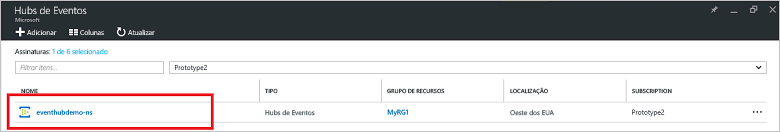
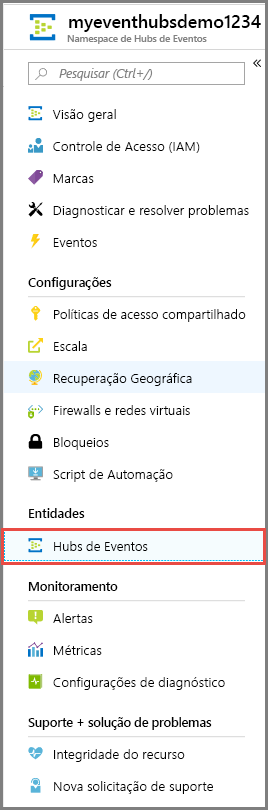
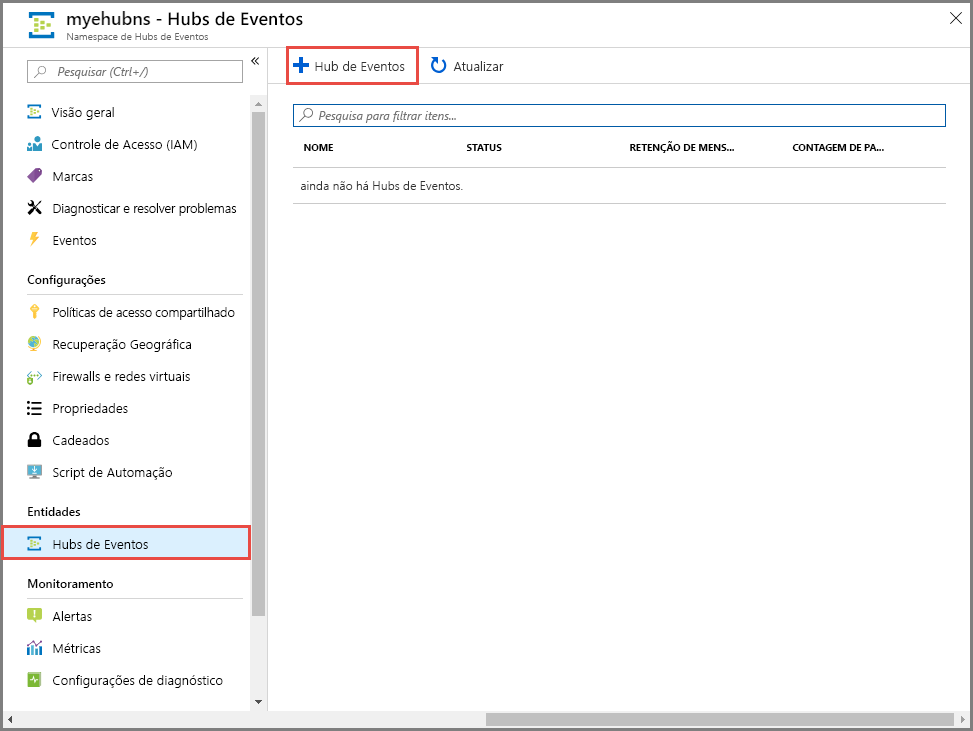
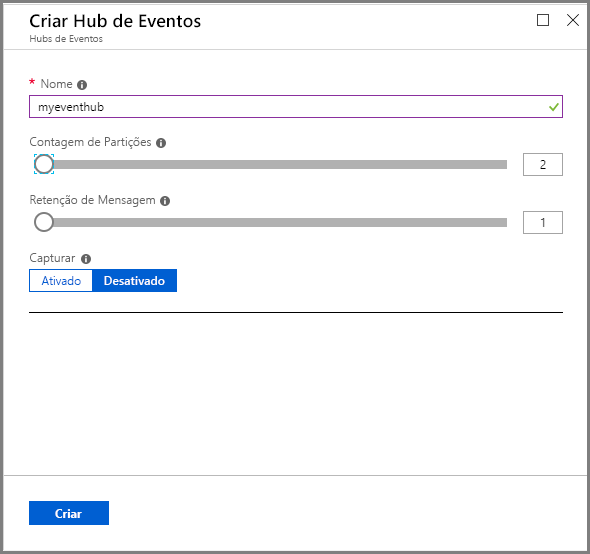
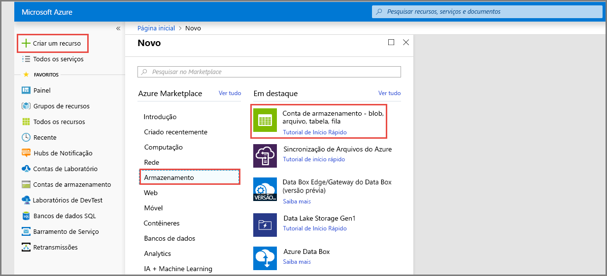
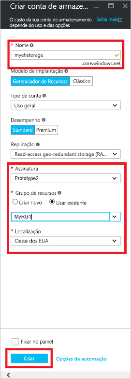
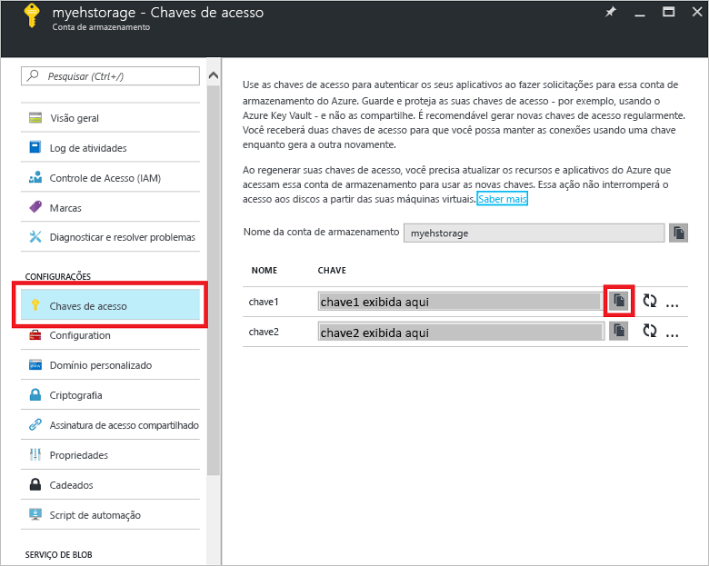

# Início Rápido: criar um hub de eventos usando o portal do Azure

Os Hubs de Eventos do Azure são uma plataforma de fluxo de dados altamente escalonável e um serviço de ingestão capaz de receber e processar milhões de eventos por segundo. Este início rápido mostra como criar um hub de eventos usando o [portal do Azure](https://portal.azure.com)e, em seguida, enviar e receber de um hub de eventos usando o SDK do .NET Standard.

Para concluir este início rápido, você precisa de uma assinatura do Azure. Se você não tiver [uma conta gratuita][], crie uma antes de começar.

## Pré-requisitos

Para concluir este início rápido, certifique-se de que:

- [Atualização 3 do Visual Studio 2017 (versão 15.3, 26730.01)](http://www.visualstudio.com/vs) ou posterior.
- [SDK do .NET Standard](https://www.microsoft.com/net/download/windows), versão 2.0 ou posterior.

## Criar um grupo de recursos

Um grupo de recursos é uma coleção lógica dos recursos do Azure. Todos os recursos são implantados e gerenciados em um grupo de recursos. Faça o seguinte para criar um grupo de recursos:

1. No painel de navegação esquerdo, clique em **Grupos de recursos**. Clique em **Adicionar**.

   ![][1]

2. Digite um nome exclusivo para o grupo de recursos. O sistema imediatamente verifica para ver se o nome está disponível na assinatura do Azure selecionada no momento.

3. Em **Assinatura**, clique no nome da assinatura do Azure na qual você deseja criar o grupo de recursos.

4. Selecione um local geográfico para o grupo de recursos.

5. Clique em **Criar**.

   ![][2]

## Criar um namespace de Hubs de Eventos

Um namespace de Hubs de Eventos fornece um contêiner de escopo exclusivo, referenciado pelo nome de domínio totalmente qualificado, em que você cria uma ou mais hubs de eventos. Para criar um namespace em seu grupo de recursos usando o portal, faça o seguinte:

1. Faça logon no [portal do Azure][] e clique em **Criar um recurso** na parte superior esquerda da tela.

2. Clique em **Internet das Coisas** e, em seguida, clique em **Hubs de Eventos**.

3. Em **Criar um namespace**, insira um nome de namespace. O sistema imediatamente verifica para ver se o nome está disponível.

   

4. Depois de verificar se o nome do namespace está disponível, escolha o tipo de preço (Básico ou Standard). Além disso, escolha uma assinatura do Azure, o grupo de recursos e o local no qual o recurso será criado.
 
5. Clique em **Criar** para criar o namespace. Talvez você precise aguardar alguns minutos para o sistema provisionar totalmente os recursos.

6. Na lista de namespaces do portal, clique no namespace recém-criado.

7. Clique em **Políticas de acesso compartilhado** e, em seguida, clique em **RootManageSharedAccessKey**.
    
8. Clique no botão de cópia para copiar a cadeia de conexão **RootManageSharedAccessKey** na área de transferência. Salve esta cadeia de conexão em um local temporário, como o Bloco de Notas, para uso futuro.
    
## Criar um Hub de Evento

Para criar um hub de eventos dentro do namespace, faça o seguinte:

1. Na lista de namespaces dos Hubs de Eventos, clique no namespace recém-criado.      
   
     

2. Na janela do namespace, clique em **Hubs de Eventos**.
   
    

1. Na parte superior da janela, clique em **+ Adicionar Hub de Eventos**.
   
    
1. Digite um nome para seu hub de eventos e clique em **Criar**.
   
    

Parabéns! Você usou o portal para criar um namespace de Hubs de eventos e um hub de eventos dentro desse namespace.

## Criar uma conta de armazenamento para o Host do Processador de Eventos

O Host do Processador de Eventos é um agente inteligente que simplifica o recebimento de eventos de hubs de eventos ao gerenciar pontos de verificação persistentes e recebimentos paralelos. Para o ponto de verificação, o Host do Processador de Eventos requer uma conta de armazenamento. O exemplo a seguir mostra como criar uma conta de armazenamento e como obter suas chaves de acesso:

1. Faça logon no [Portal do Azure][Portal do Azure] e clique em **Novo** na parte superior esquerda da tela.

2. Clique em **Armazenamento** e em **conta de Armazenamento**.
   
    

3. Em **Criar conta de armazenamento**, digite um nome para a conta de armazenamento. Escolha uma assinatura do Azure, o grupo de recursos e o local no qual o recurso será criado. Em seguida, clique em **Criar**.
   
    

4. Na lista de contas de armazenamento, clique na conta de armazenamento recém-criada.

5. Na janela Conta de armazenamento, clique em **Chaves de acesso**. Copie o valor da **chave1** de para usar posteriormente.
   
    

## Baixar e executar os exemplos

A próxima etapa é executar o código de exemplo que envia eventos para um hub de eventos e recebe esses eventos usando o Host do Processador de Eventos. 

Primeiro, baixe os exemplos de [SampleSender](https://github.com/Azure/azure-event-hubs/tree/master/samples/DotNet/Microsoft.Azure.EventHubs/SampleSender) e [SampleEphReceiver](https://github.com/Azure/azure-event-hubs/tree/master/samples/DotNet/Microsoft.Azure.EventHubs/SampleEphReceiver) do GitHub ou clone o [repositório azure-event-hubs](https://github.com/Azure/azure-event-hubs).

### Remetente

1. Abra o Visual Studio e, no menu **Arquivo**, clique em **Abrir** e clique em **Projeto/Solução**.

2. Localize a pasta de exemplo de **SampleSender** que você baixou anteriormente e, em seguida, clique duas vezes no arquivo SampleSender.sln para carregar o projeto no Visual Studio.

3. No Gerenciador de Soluções, clique duas vezes em Program.cs para abrir o arquivo no editor do Visual Studio.

4. Substitua o valor de `EventHubConnectionString` pela cadeia de conexão que você obteve quando criou o namespace.

5. Substitua `EventHubName` pelo nome do hub de eventos criado dentro desse namespace.

6. No menu **Compilar**, clique em **Compilar Solução** para garantir que não há nenhum erro.

### Receptor

1. Abra o Visual Studio e, no menu **Arquivo**, clique em **Abrir** e clique em **Projeto/Solução**.

2. Localize a pasta de exemplo de **SampleEphReceiver** que você baixou na etapa 1 e, em seguida, clique duas vezes no arquivo SampleEphReceiver.sln para carregar o projeto no Visual Studio.

3. No Gerenciador de Soluções, clique duas vezes em Program.cs para abrir o arquivo no editor do Visual Studio.

4. Substitua os valores das seguintes variáveis:
    1. `EventHubConnectionString`: Substitua o valor pela cadeia de conexão que você obteve quando criou o namespace.
    2. `EventHubName`: O nome do hub de eventos criado dentro desse namespace.
    3. `StorageContainerName`: O nome de um contêiner de armazenamento. Dê a ele um nome exclusivo e o contêiner é criado para você quando você executa o aplicativo.
    4. `StorageAccountName`: O nome da conta de armazenamento criada.
    5. `StorageAccountKey`: A chave de conta de armazenamento que você obteve do portal do Azure.

5. No menu **Compilar**, clique em **Compilar Solução** para garantir que não há nenhum erro.

### Executar os aplicativos

Primeiro, execute o aplicativo **SampleSender** e observe as 100 mensagens que são enviadas. Pressione **Enter** para encerrar o programa.

![][3]

Em seguida, execute o aplicativo **SampleEphReceiver** e observe as mensagens que são recebidas para o Host do Processador de Eventos.

![][4]
 
## Limpar recursos

É possível usar o portal para remover a conta de armazenamento, o namespace e o hub de eventos. 

1. No portal do Azure clique em **Todos os recursos** no menu à esquerda. 
2. Clique na conta de armazenamento ou no namespace que você deseja excluir. Excluir o namespace também remove os hubs de eventos dentro dele.
3. Na barra de menus na parte superior da tela, clique em **Excluir**. Confirme a exclusão. 

## Próximas etapas

Neste artigo, você criou um namespace de Hubs de Eventos e outros recursos necessários para enviar e receber eventos do seu hub de eventos. Para saber mais, continue com o tutorial a seguir:

> [!div class="nextstepaction"]
> [Visualizar anomalias de dados nos fluxos de dados dos Hubs de Eventos](event-hubs-tutorial-visualize-anomalies.md)

[uma conta gratuita]: https://azure.microsoft.com/free/?ref=microsoft.com&utm_source=microsoft.com&utm_medium=docs&utm_campaign=visualstudio
[portal do Azure]: https://portal.azure.com/
[1]: ./media/event-hubs-quickstart-portal/resource-groups1.png
[2]: ./media/event-hubs-quickstart-portal/resource-groups2.png
[3]: ./media/event-hubs-quickstart-portal/sender1.png
[4]: ./media/event-hubs-quickstart-portal/receiver1.png
