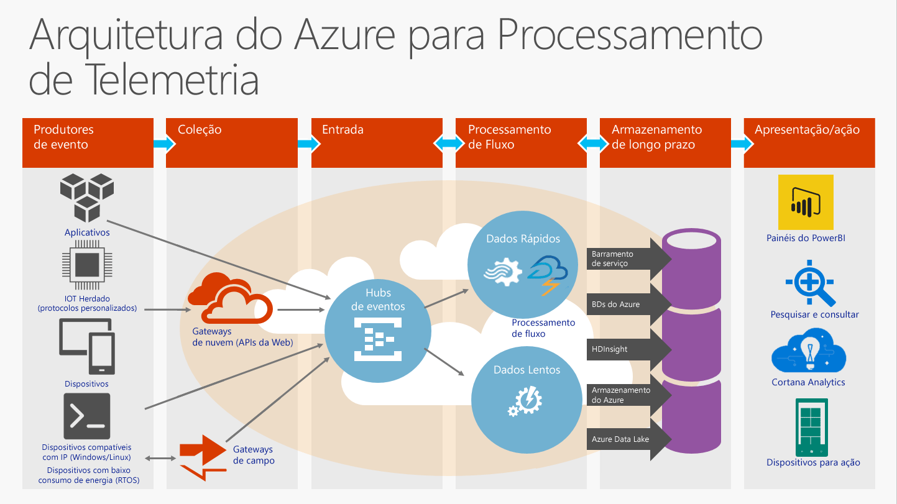

# O que são Hubs de Eventos?

Os Hubs de Evento do Azure são um plataforma de transmissão de dados altamente dimensionável e um serviço de ingestão de dados capaz de receber e processar milhões de eventos por segundo. Os Hubs de Eventos podem processar e armazenar eventos, dados ou telemetria produzidos pelos dispositivos e software distribuídos. Os dados enviados para um Hub de Eventos podem ser transformados e armazenados usando qualquer provedor de análise em tempo real ou adaptadores de envio em lote/armazenamento. Com a capacidade de fornecer [recursos de publicação/assinatura](https://msdn.microsoft.com/library/aa560414.aspx) com baixa latência e em grande escala, os Hubs de Eventos servem como uma "subida" para Big Data.

## Por que usar Hubs de Eventos?

Os eventos de Hubs de Eventos e os recursos de manipulação de telemetria o tornam especialmente útil para:

* Instrumentação de aplicativos
* Experiência do usuário ou o processamento de fluxo de trabalho
* Cenários de IoT (Internet das coisas)

Por exemplo, os Hubs de Eventos habilitam o rastreamento de comportamentos em aplicativos móveis, informações do tráfego de web farms, captura de eventos de jogos em jogos de console ou telemetria coletada de máquinas industriais, veículos conectados ou outros dispositivos.

## Visão geral dos Hubs de Eventos do Azure

A função comum que os Hubs de Evento desempenham em arquiteturas de solução é ser a "porta da frente" de um pipeline de evento, geralmente chamado de *ingestor de eventos*. Um ingestor de eventos é um componente ou serviço que fica entre os editores de eventos e consumidores de eventos para desacoplar a produção de uma transmissão de eventos do consumo desses eventos. A figura a seguir ilustra essa arquitetura:

Os Hubs de Eventos fornecem recurso de manipulação de fluxo de mensagens, mas têm características que são diferentes das mensagens corporativas tradicionais. Os recursos de Hubs de Eventos são criados em torno de cenários de alta produtividade e de processamento de eventos. Assim, os Hubs de Eventos são diferentes das mensagens do [Barramento de Serviço do Azure](https://azure.microsoft.com/services/service-bus/) e não implementam alguns dos recursos que estão disponíveis para entidades de [mensagens do Barramento de Serviço](/azure/service-bus-messaging/), por exemplo, tópicos.

## Recursos de Hubs de Eventos

Os Hubs de Eventos contêm os seguintes elementos principais:

- [**Editores/produtores de eventos**](event-hubs-features.md#event-publishers): uma entidade que envia dados para um hub de eventos. Um evento é publicado por meio de AMQP 1.0 ou HTTPS.
- [**Capturar**](event-hubs-features.md#capture): habilita a captura de dados de transmissão de Hubs de Eventos e o armazenamento em uma conta de armazenamento de blobs do Azure.
- [**Partições**](event-hubs-features.md#partitions): permite que cada consumidor leia apenas um subconjunto específico, ou uma partição, do fluxo de eventos.
- [**Tokens SAS**](event-hubs-features.md#sas-tokens): identifica e autentica o editor do evento.
- [**Consumidores de evento**](event-hubs-features.md#event-consumers): qualquer entidade que leia dados de evento de um hub de eventos. Os consumidores do evento se conectam por meio de AMQP 1.0. 
- [**Grupos de consumidores**](event-hubs-features.md#consumer-groups): fornece a cada aplicativo com consumo múltiplo uma exibição separada do fluxo de eventos, permitindo que os consumidores ajam independentemente.
- [**Unidades de produtividade**](event-hubs-features.md#capacity): unidades de capacidade pré-adquiridas. Uma única partição tem uma escala máxima de 1 unidade de transferência.

Para obter detalhes técnicos sobre esses e outros recursos dos Hubs de Eventos, consulte a [Visão geral dos recursos de Hubs de Eventos](event-hubs-features.md). 

## Próximas etapas

Para obter informações sobre preços de Hubs de Evento, consulte [Preços de Hubs de Evento](https://azure.microsoft.com/pricing/details/event-hubs/).

Para saber mais sobre os Hubs de Eventos, visite os seguintes links:

* Introdução com um [Tutorial de Hubs de Eventos](event-hubs-dotnet-standard-getstarted-send.md)
* [Perguntas frequentes sobre os Hubs de Eventos](event-hubs-faq.md)
* [Aplicativos de exemplo que usam Hub de Eventos](https://github.com/Azure/azure-event-hubs/tree/master/samples)
 
 

