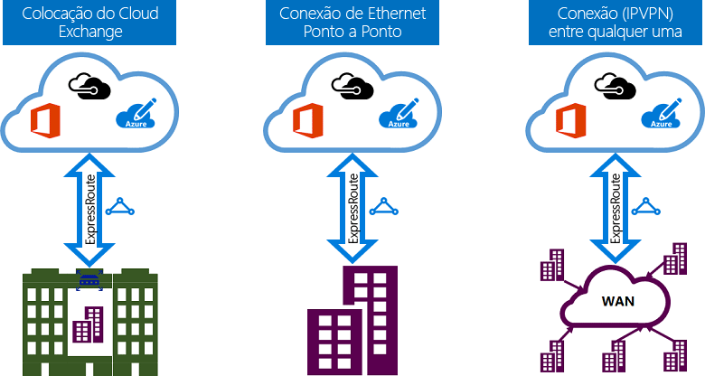

# Modelos de conectividade do ExpressRoute
Você pode criar uma conexão entre sua rede local e a nuvem da Microsoft de três maneiras diferentes, [Colocalização do CloudExchange](#CloudExchange), [Conexão de Ethernet Ponto a Ponto](#Ethernet) e [Conexão Qualquer para Qualquer (IPVPN)](#IPVPN). Os provedores de conectividade podem oferecer um ou mais modelos de conectividade. Converse com seu provedor de conectividade a fim de escolher o modelo mais adequado a você.
  

## Colocalizada em uma troca de nuvem
Se você estiver colocalizado em uma instalação que possua uma troca de nuvem, poderá solicitar conexões cruzadas virtuais para a nuvem da Microsoft por meio da troca Ethernet do provedor da colocalização. Os provedores da colocalização podem oferecer conexões cruzadas de Camada 2 ou conexões cruzadas gerenciadas de Camada 3 entre sua infraestrutura na instalação de colocalização e a nuvem da Microsoft.

## Conexões Ethernet ponto a ponto
Você pode conectar seus data centers/escritórios locais à nuvem da Microsoft por meio de links de Ethernet ponto a ponto. Os provedores de Ethernet ponto a ponto podem oferecer conexões de Camada 2 ou conexões gerenciadas de Camada 3 entre seu site e a nuvem da Microsoft.

## Redes Qualquer para Qualquer (IPVPN)
É possível integrar sua WAN à nuvem da Microsoft. Os Provedores de IPVPN (normalmente, VPN MPLS) oferecem conectividade “qualquer para qualquer” entre suas filiais e datacenters. A nuvem da Microsoft pode ser interconectada à sua WAN para que ela fique exatamente igual a qualquer outra filial. Normalmente, os provedores de rede WAN oferecem conectividade gerenciada de Camada 3. Os recursos do ExpressRoute são idênticos em todos os modelos de conectividade mencionados acima. 

## Próximos passos
* Saiba mais sobre conexões e domínios de roteamento do ExpressRoute. Consulte [Circuitos e domínios de roteamento do ExpressRoute](expressroute-circuit-peerings.md).
* Saiba mais sobre recursos do ExpressRoute. Veja a [Visão geral técnica do ExpressRoute](expressroute-introduction.md)
* Encontrar um provedor de serviços. Consulte [Parceiros e locais de emparelhamento do ExpressRoute](expressroute-locations.md).
* Verifique se todos os pré-requisitos foram atendidos. Consulte [Pré-requisitos do ExpressRoute](expressroute-prerequisites.md).
* Consulte os requisitos para [Roteamento](expressroute-routing.md), [NAT](expressroute-nat.md) e [QoS](expressroute-qos.md).
* Configurar sua conexão do ExpressRoute.
  * [Criar um circuito do ExpressRoute](expressroute-howto-circuit-portal-resource-manager.md)
  * [Configurar o roteamento](expressroute-howto-routing-portal-resource-manager.md)
  * [Vincular uma Rede Virtual a um circuito do ExpressRoute](expressroute-howto-linkvnet-portal-resource-manager.md)