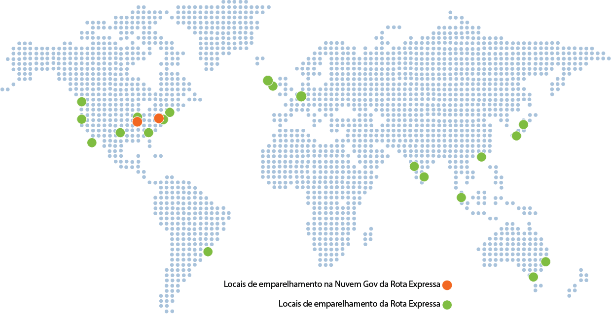

<properties
   pageTitle="Locais da Rota Expressa | Microsoft Azure"
   description="Este artigo fornece uma visão geral detalhada dos locais onde os serviços são oferecidos e de como se conectar a regiões do Azure."
   services="expressroute"
   documentationCenter="na"
   authors="cherylmc"
   manager="carolz"
   editor="" />
<tags
   ms.service="expressroute"
   ms.devlang="na"
   ms.topic="get-started-article"
   ms.tgt_pltfrm="na"
   ms.workload="infrastructure-services"
   ms.date="09/22/2015"
   ms.author="cherylmc" />

# Locais de emparelhamento e parceiros da Rota Expressa

As tabelas neste artigo fornecem informações sobre provedores de conectividade da Rota Expressa, a cobertura geográfica da Rota Expressa, serviços em nuvem da Microsoft com suporte ao longo da Rota Expressa e SIs (Integradores de Serviço) da Rota Expressa.

## Provedores de conectividade da Rota Expressa

Há suporte para Rota Expressa em todos os locais e regiões do Azure. O mapa a seguir fornece uma lista de locais de Rota Expressa e regiões do Azure. Os locais de Rota Expressa são aqueles onde a Microsoft emparelha-se a vários provedores de serviços.

Você terá acesso aos serviços do Azure em todas as regiões dentro de uma região geopolítica se estiver conectado a pelo menos um local de Rota Expressa dentro da região geopolítica. A tabela a seguir fornece um mapa das regiões do Azure para locais de Rota Expressa em uma região geopolítica.

|**Região Geopolítica**|**Regiões do Azure**|**Locais de Rota Expressa**|
|---|---|---|
|**América do Norte**|Todas as regiões dos EUA - Leste dos EUA, Oeste dos EUA, Leste dos EUA 2, Centro dos EUA, Centro-Sul dos EUA, Centro-Norte dos EUA|Atlanta, Chicago, Dallas, Los Angeles, Nova York, Seattle, Vale do Silício, Washington, D.C.|
|**América do Sul**|Sul do Brasil|São Paulo|
|**Europa**|Norte da Europa, Europa Ocidental|Amsterdã, Dublin +, Londres|
|**Ásia**|Ásia Oriental, Sudeste Asiático|Hong Kong, Cingapura|
|**Japão**|Oeste do Japão, Leste do Japão|Osaka, Tóquio|
|**Austrália**|Sudeste da Austrália, Leste da Austrália|Melbourne, Sydney|
|**Índia**|Oeste da Índia, Índia Central, Sul da Índia|Chennai, Mumbai|

A tabela a seguir fornece informações sobre regiões e limites geopolíticos para nuvens nacionais.

|**Região Geopolítica**|**Regiões do Azure**|**Locais de Rota Expressa**|
|---|---|---|---|
|**Nuvem do Governo dos EUA**|Governo dos EUA|Iowa, Virgínia|Ashburn, Chicago|
|**Nuvem na China**|China|Pequim, Xangai|

Não há suporte para conectividade entre regiões geopolíticas no SKU de Rota Expressa padrão. Você precisará habilitar o complemento premium de Rota Expressa para dar suporte a conectividade global. Não há suporte a conectividade para ambientes de nuvem nacionais. Você pode trabalhar com seu provedor de conectividade se surgir necessidade de fazê-lo.

## Locais de provedor de conectividade

### Produção do Azure

| **Provedor de serviços** |**Microsoft Azure** | **Office 365 e CRM Online** | **Locais** |
|-----------------------|--------------------|----------------|---------------|
| **[Aryaka Networks](http://www.aryaka.com/)** | Suportado | Suportado | Amsterdã, Vale do Silício, Cingapura, Washington, D.C. |
| **[AT&T NetBond](https://www.synaptic.att.com/clouduser/html/productdetail/ATT_NetBond.htm)** | Suportado | Suportado | Amsterdã, Dallas, Londres, Vale do Silício, Cingapura, Washington, D.C. |
| **[British Telecom](http://www.globalservices.bt.com/uk/en/news/bt_to_provide_connectivity_to_microsoft_azure)** | Suportado | Suportado | Amsterdã, Hong Kong, Londres, Vale do Silício, Cingapura, Tóquio, Washington, D.C. |
|**China Telecom Global** | Em breve | Sem suporte | Hong Kong |
| **[Colt](http://www.colt.net/uk/en/news/colt-announces-dedicated-cloud-access-for-microsoft-azure-services-en.htm)** | Suportado | Sem suporte | Amsterdã, Londres |
| **Comcast** | Suportado | Suportado | Vale do Silício, Washington, D.C. |
| **CoreSite** | Com suporte | Sem suporte | São Paulo | 
| **[Equinix](http://www.equinix.com/partners/microsoft-azure/)** | Suportado | Com suporte | Amsterdã, Atlanta, Chicago, Dallas, Hong Kong, Londres, Los Angeles, Londres, Nova York, Osaka, São Paulo, Seattle, Vale do Silício, Cingapura, Sydney, Tóquio, Washington, D.C. |
| **[Internet Initiative Japan Inc. - IIJ](http://www.iij.ad.jp/en/news/pressrelease/2013/pdf/Azure_E.pdf)** | Suportado | Sem suporte | Osaka, Tóquio |
| **[InterCloud](https://www.intercloud.com/)** | Suportado | Suportado | Amsterdã+, Londres, Cingapura, Washington, D.C. |
| **Internet Solutions - Cloud Connect** | Suportado | Suportado | Amsterdã, Londres |
| **Interxion** | Com suporte | Suportado | Amsterdã |
| **[Comunicações de Nível 3](http://your.level3.com/LP=882?WT.tsrc=02192014LP882AzureVanityAzureText)** | Suportado | Sem suporte | Amsterdã, Chicago, Dallas, Londres, Seattle, Vale do Silício, Washington, D.C. |
| **Megaport** | Suportado | Sem suporte | Melbourne, Sydney |
| **MTN** | Suportado | Sem suporte | Londres |
| **NEXTDC** | Suportado | Suportado | Melbourne, Sydney+ |
| **NTT Communications** | Suportado | Sem suporte | Londres+, Tóquio |
| **[Orange](http://www.orange-business.com/)** | Suportado | Sem suporte | Amsterdã, Hong Kong, Londres, Vale do Silício, Cingapura, Washington, D.C. |
| **PCCW Global Limited** | Suportado | Sem suporte | Hong Kong |
| **[SingTel](http://info.singtel.com/about-us/news-releases/singtel-provide-secure-private-access-microsoft-azure-public-cloud)** | Suportado | Sem suporte | Cingapura |
| **[Tata Communications](http://www.tatacommunications.com/lp/izo/azure/azure_index.html)** | Suportado | Suportado | Amsterdã, Chennai, Hong Kong, Londres, Mumbai, Cingapura, Washington D.C. |
| **[TeleCity Group](http://www.telecitygroup.com/investor-centre/news_details.htm?locid=03100500400b00d&xml)** | Suportado | Suportado | Amsterdã, Londres |
| **[Telstra Corporation](http://www.telstra.com.au/business-enterprise/network-services/networks/cloud-direct-connect/)** | Suportado | Sem suporte | Melbourne, Sydney |
| **[Verizon](http://www.verizonenterprise.com/products/networking/secure-cloud-interconnect/)** | Suportado | Com suporte | Hong Kong, Londres, Vale do Silício, Sydney, Washington, D.C. |
| **Vodafone** | Com suporte | Sem suporte | Londres | 
| **[Zayo Group](http://www.zayo.com/)** | Suportado | Suportado | Chicago, Los Angeles, Nova York, Vale do Silício, Washington, D.C. |

 **+** indica que haverá em breve

### Ambientes de nuvem nacionais

#### Nuvem do Governo dos EUA

| **Provedor de serviços** |**Microsoft Azure** | **Office 365** | **Locais** |
|-----------------------|--------------------|----------------|---------------|
| **[AT&T NetBond](https://www.synaptic.att.com/clouduser/html/productdetail/ATT_NetBond.htm)** | Com suporte | Sem suporte | Chicago+, Washington D.C. |
| **[Equinix](http://www.equinix.com/partners/microsoft-azure/)** | Em breve | Sem suporte | Chicago+, Washington D.C.+ |
| **[Comunicações de nível 3 - IPVPN](http://your.level3.com/LP=882?WT.tsrc=02192014LP882AzureVanityAzureText)** | Suportado | Sem suporte | Chicago+, Washington D.C. |
| **[Verizon](http://news.verizonenterprise.com/2014/04/secure-cloud-interconnect-solutions-enterprise/)** | Suportado | Sem suporte | Chicago, Washington D.C. |

#### Nuvem na China

| **Provedor de serviços** |**Microsoft Azure** | **Office 365** | **Locais** |
|-----------------------|--------------------|----------------|---------------|
| **China Telecom** | Suportado | Sem suporte | Pequim, Xangai +|
Para saber mais, consulte [Rota Expressa na China](http://www.windowsazure.cn/home/features/expressroute/).

## Conectividade por meio de provedores de serviços não listados

Se seu provedor de conectividade não estiver listado em seções anteriores, você ainda pode criar uma conexão.

- Verifique com seu provedor de conectividade para ver se eles estão conectados a qualquer um dos Exchanges na tabela acima. Você pode verificar os links a seguir para obter mais informações sobre os serviços oferecidos por provedores do Exchange. Vários provedores de conectividade já estão conectados a Exchanges de Ethernet.

	- [Equinix Cloud Exchange](http://www.equinix.com/services/interconnection-connectivity/cloud-exchange/)
	- [TeleCity CloudIX](http://www.telecitygroup.com/colocation-services/cloud-ix.htm)
	- [InterXion](http://www.interxion.com/)
	- [NextDC](http://www.nextdc.com/)
	- [CoreSite](http://www.coresite.com/)
- Faça com que seu provedor de conectividade estenda sua rede para o local de emparelhamento de sua escolha.
	- Certifique-se de que seu provedor de conectividade estenda sua conectividade de maneira altamente disponível para que não exista nenhum ponto de falha.
- Solicite um circuito da Rota Expressa com o Exchange como o provedor de conectividade para conectar-se à Microsoft.
	- Siga as etapas em [Criar um circuito da Rota Expressa](expressroute-howto-circuit-classic.md) para configurar a conectividade.

|**Provedor de conectividade**|**Exchange**|**Locais de emparelhamento**|
|---|---|---|
|**[Comunicações XO](http://www.xo.com/)**|Equinix|Vale do Silício|

## Integradores de sistema de Rota Expressa

Habilitar a conectividade privada para atender às suas necessidades pode ser desafiador, dependendo da escala de sua rede. Você pode trabalhar com qualquer dos integradores de sistema listados na tabela a seguir para ajudá-lo com integração à Rota Expressa.

|**Integrador de Sistema**|**Continent**|
|---|---|
|**[Nimbo](http://www.nimbo.com/)**|EUA||
|**[Dotnet Solutions](http://www.dotnetsolutions.co.uk/)**|EMEA|

## Próximas etapas

- Para obter mais informações sobre a Rota Expressa, consulte [Perguntas Frequentes sobre Rota Expressa](expressroute-faqs.md).
- Certifique-se que todos os pré-requisitos foram atendidos. Confira [Pré-requisitos da Rota Expressa](expressroute-prerequisites.md).

<!---HONumber=AcomDC_1125_2015-->