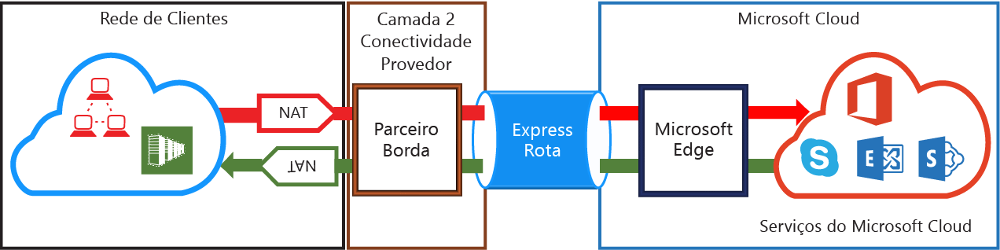
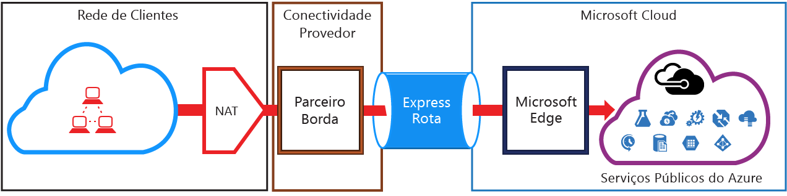

# Requisitos de NAT do ExpressRoute
Para se conectar aos serviços de nuvem da Microsoft usando o ExpressRoute, você precisará configurar e gerenciar NATs. Alguns provedores de conectividade oferecem a configuração e o gerenciamento de NAT como um serviço gerenciado. Verifique se seu provedor de conectividade oferece esse serviço. Caso contrário, você deverá atender aos requisitos descritos abaixo. 

Consulte a página [Circuitos e domínios de roteamento do ExpressRoute](expressroute-circuit-peerings.md) para obter uma visão geral dos vários domínios de roteamento. Para atender aos requisitos de endereço IP público para o emparelhamento público do Azure e da Microsoft, recomendamos a configuração de NAT entre sua rede e a Microsoft. Esta seção fornece uma descrição detalhada da infraestrutura NAT que precisa ser configurada.

## Requisitos de NAT para emparelhamento da Microsoft
O caminho de emparelhamento da Microsoft permite que você se conecte a serviços de nuvem da Microsoft que não têm suporte por meio do caminho de emparelhamento público do Azure. A lista de serviços inclui serviços do Office 365, como o Exchange Online, o SharePoint Online, o Skype for Business e o Dynamics 365. A Microsoft espera dar suporte à conectividade bidirecional no emparelhamento da Microsoft. O tráfego destinado aos serviços de nuvem da Microsoft deve estar no modo SNAT para endereços IPv4 públicos válidos antes de entrar na rede da Microsoft. O tráfego destinado à sua rede proveniente dos serviços de nuvem da Microsoft deve estar no modo SNAT na borda da Internet para evitar um [roteamento assimétrico](expressroute-asymmetric-routing.md). A figura abaixo fornece uma imagem de alto nível de como o NAT deve ser configurado para emparelhamento da Microsoft.

 

### Tráfego com origem em sua rede e destinado à Microsoft
* Você deve garantir que o tráfego esteja entrando no caminho de emparelhamento da Microsoft com um endereço IPv4 público válido. A Microsoft deve ser capaz de validar a propriedade do pool de endereços NAT IPv4 com base no registro regional de roteamento da Internet (RIR) ou em um registro de roteamento da Internet (IRR). Uma verificação será executada com base no número de AS emparelhados e nos endereços IP usados para NAT. Consulte a página [Requisitos de roteamento do ExpressRoute](expressroute-routing.md) para obter informações sobre registros de roteamento.
* Os endereços IP usados para a configuração do emparelhamento público do Azure e de outros circuitos de ExpressRoute não devem ser anunciados à Microsoft por meio da sessão BGP. Não há restrições com relação ao tamanho do prefixo IP NAT anunciado por meio desse emparelhamento.
  
  > [!IMPORTANT]
  > O pool de IPs de NAT anunciado à Microsoft não deve ser anunciado na Internet. Isso interromperá a conectividade com outros serviços da Microsoft.
  > 
  > 

### Tráfego com origem na Microsoft e destinado à sua rede
* Certas situações exigem que a Microsoft inicie a conectividade com os pontos de extremidade do serviço hospedados em sua rede. Um exemplo típico dessa situação seria a conectividade com servidores ADFS hospedados em sua rede desde o Office 365. Nesses casos, você deve vazar os prefixos apropriados de sua rede para o emparelhamento da Microsoft. 
* Você deve colocar tráfego da Microsoft no modo SNAT na borda da Internet para pontos de extremidade de serviço dentro de sua rede para evitar um [roteamento assimétrico](expressroute-asymmetric-routing.md). Solicitações **e respostas** com um destino IP que correspondam a uma rota recebida por meio do ExpressRoute serão sempre enviadas por meio do ExpressaRoute. O roteamento assimétrico existe se a solicitação é recebida através da Internet com a resposta enviada por meio do ExpressRoute. Colocar o tráfego de entrada da Microsoft no modo SNAT na borda da Internet força o tráfego de resposta de volta para a borda da Internet, resolvendo o problema.

## Requisitos de NAT para o emparelhamento público do Azure

> [!NOTE]
> Não está disponível para novos circuitos do emparelhamento público do Azure.
> 

O caminho do emparelhamento público do Azure permite que você se conecte a todos os serviços hospedados no Azure por meio de seus endereços IP públicos. Isso inclui os serviços listados nas [Perguntas Frequentes sobre a Rota Expressa](expressroute-faqs.md) e quaisquer serviços hospedados por ISVs no Microsoft Azure. 

> [!IMPORTANT]
> A conectividade com os serviços do Microsoft Azure no emparelhamento público é sempre iniciada de sua rede para a rede da Microsoft. Portanto, as sessões não podem ser iniciadas dos serviços do Microsoft Azure para sua rede por ExpressRoute. Se você tentar, os pacotes enviados aos IPs indicados usarão a Internet em vez do ExpressRoute.
> 

O tráfego destinado ao Microsoft Azure no emparelhamento público deve estar no modo SNAT para endereços IPv4 públicos válidos antes que eles entrem na rede da Microsoft. A figura abaixo fornece uma imagem de alto nível de como a NAT deve ser configurada para atender ao requisito acima.

 

### Pool de IP de NAT e anúncios de rota
Você deve garantir que o tráfego esteja entrando no caminho de emparelhamento público do Azure com o endereço IPv4 público válido. A Microsoft deve ser capaz de validar a propriedade do pool de endereços NAT IPv4 com base em um registro regional de roteamento da Internet (RIR) ou em um registro de roteamento da Internet (IRR). Uma verificação será executada com base no número de AS emparelhados e nos endereços IP usados para NAT. Consulte a página [Requisitos de roteamento do ExpressRoute](expressroute-routing.md) para obter informações sobre registros de roteamento.

Não há restrições com relação ao tamanho do prefixo IP de NAT anunciado por meio desse emparelhamento. Você deve monitorar o pool de NAT e não ficar sem sessões NAT.

> [!IMPORTANT]
> O pool de IPs de NAT anunciado à Microsoft não deve ser anunciado na Internet. Isso interromperá a conectividade com outros serviços da Microsoft.
> 
> 

## Próximas etapas
* Consulte os requisitos para o [Roteamento](expressroute-routing.md) e [QoS](expressroute-qos.md).
* Para obter informações sobre o fluxo de trabalho, consulte [Fluxos de trabalho de provisionamento e estados do circuito do ExpressRoute](expressroute-workflows.md).
* Configurar sua conexão do ExpressRoute.
  
  * [Criar um circuito do ExpressRoute](expressroute-howto-circuit-portal-resource-manager.md)
  * [Configurar o roteamento](expressroute-howto-routing-portal-resource-manager.md)
  * [Vincular uma Rede Virtual a um circuito do ExpressRoute](expressroute-howto-linkvnet-portal-resource-manager.md)

