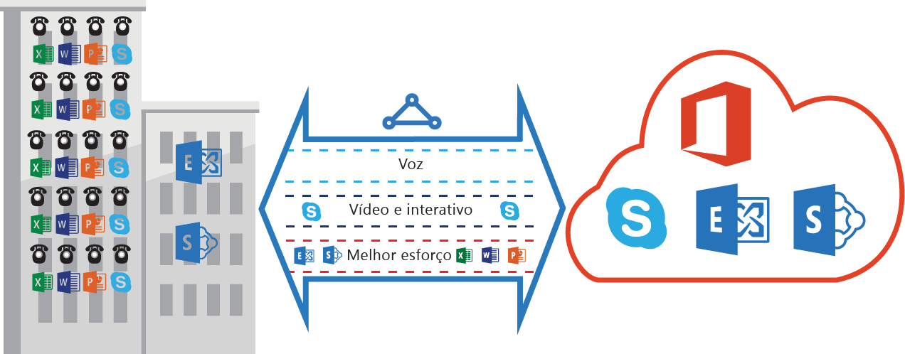

<properties
   pageTitle="Requisitos de QoS para Rota Expressa | Microsoft Azure"
   description="Esta página fornece requisitos detalhados para a configuração e gerenciamento de QoS para circuitos da Rota Expressa."
   documentationCenter="na"
   services="expressroute"
   authors="cherylmc"
   manager="carmonm"
   editor=""/>
<tags
   ms.service="expressroute"
   ms.devlang="na"
   ms.topic="get-started-article"
   ms.tgt_pltfrm="na"
   ms.workload="infrastructure-services"
   ms.date="04/18/2016"
   ms.author="cherylmc"/>

# Requisitos de QoS para Rota Expressa

Skype for Business tem várias cargas de trabalho que exigem tratamento de QoS diferenciado. Se você planeja utilizar serviços de voz por meio de Rota Expressa, siga os requisitos descritos abaixo.

>[AZURE.NOTE] Os requisitos de QoS aplicam-se somente ao emparelhamento Microsoft. Os valores de DSCP no tráfego de rede recebido no emparelhamento público e no emparelhamento privado do Azure serão redefinidos como 0.

A tabela a seguir fornece uma lista de marcações DSCP usadas pelo Skype for Business. Para obter mais informações, consulte [Gerenciamento de QoS para Skype for Business](https://technet.microsoft.com/library/gg405409.aspx).

| **Classe de Tráfego** | **Tratamento (Marcação DSCP)** | **Cargas de Trabalho do Skype for Business** |
|---|---|---|
| **Voz** | EF (46) | Voz do Skype / Lync |
| **Interativo** | AF41 (34) | Vídeo |
| | AF21 (18) | Compartilhamento de aplicativo | 
| | CS3 (24) | Sinalização SIP |
| **Padrão** | AF11 (10) | Transferência de arquivo|
| | CS0 (0) | Qualquer outra coisa| 

- Você deve classificar as cargas de trabalho e marcar os valores DSCP corretos. Siga as orientações fornecidas [aqui](https://technet.microsoft.com/library/gg405409.aspx) sobre como definir as marcações de DSCP em sua rede.

- Você deve configurar e dar suporte a várias filas de QoS em sua rede. Voz deve ser uma classe autônoma e receber o tratamento de EF especificado no RFC 3246.

- Você pode decidir o mecanismo de enfileiramento, a política de detecção de congestionamento e a alocação de largura de banda por classe de tráfego. Porém, a marcação DSCP para cargas de trabalho do Skype for Business deve ser preservada. Se você estiver usando marcas DSCP não listadas acima, por exemplo, AF31 (26), você deve reescrever esse valor DSCP para 0 antes de enviar o pacote para a Microsoft. A Microsoft envia somente pacotes marcados com o valor DSCP mostrado na tabela acima.

## Próximas etapas

- Consulte os requisitos de [Roteamento](expressroute-routing.md) e de [NAT](expressroute-nat.md).
- Consulte os links a seguir para configurar a conexão da Rota Expressa.

	- [Criar um circuito da Rota Expressa](expressroute-howto-circuit-classic.md)
	- [Configurar o roteamento](expressroute-howto-routing-classic.md)
	- [Vincular uma Rede Virtual a um circuito de Rota Expressa](expressroute-howto-linkvnet-classic.md)

<!---HONumber=AcomDC_0706_2016-->