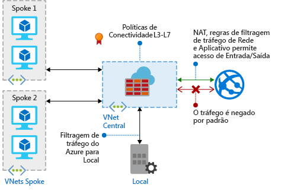

# O que é o Firewall do Azure?

Firewall do Azure é um serviço de segurança de rede gerenciado e baseado em nuvem que protege seus recursos de Rede Virtual do Azure. É um firewall totalmente com estado como serviço, com alta disponibilidade interna e escalabilidade de nuvem sem restrições. 

É possível criar, impor e registrar centralmente políticas de conectividade de rede e de aplicativo em assinaturas e redes virtuais. O Firewall do Azure usa um endereço IP público estático para seus recursos de rede virtual, permitindo que firewalls externos identifiquem o tráfego originário de sua rede virtual.  O serviço é totalmente integrado ao Azure Monitor para registro em log e análise.

## Recursos

O Firewall do Azure oferece os seguintes recursos:

### Alta disponibilidade interna
A alta disponibilidade é interna, portanto, nenhum balanceador de carga adicional é necessário e nenhuma configuração é necessária.

### Escalabilidade de nuvem sem restrições 
O Firewall do Azure pode escalar verticalmente o quanto você precisar a fim de acomodar fluxos de tráfego de rede cambiáveis, para que você não precise de orçamento para o tráfego de pico.

### Regras de filtragem de FQDN de aplicativo

Você pode limitar o tráfego HTTP/S de saída para uma lista especificada FQDNs (nomes de domínio totalmente qualificados) incluindo caracteres curinga. Esse recurso não exige a terminação SSL.

### Regras de filtragem de tráfego de rede

Você pode criar centralmente regras de filtragem de rede para *permitir* ou *negar* por endereço IP de origem e destino, porta e protocolo. O Firewall do Azure é totalmente com estado, para que possa distinguir pacotes legítimos de diferentes tipos de conexões. As regras são impostas e registradas em várias assinaturas e redes virtuais.

### Marcas de FQDN

As marcas de FQDN facilitam permitir o tráfego de rede do serviço do Azure conhecido através do firewall. Por exemplo, digamos que você deseja permitir o tráfego de rede do Windows Update por meio de seu firewall. Você cria uma regra de aplicativo e inclui a marca do Windows Update. Agora o tráfego de rede do Windows Update pode fluir através do firewall.

### Suporte a SNAT de saída

Todos os endereços IP de tráfego de rede virtual de saída são convertidos no IP público do Firewall do Azure (conversão de endereço de rede de origem). Você pode identificar e permitir o tráfego proveniente de sua rede virtual para destinos de Internet remotos.

### Suporte a DNAT de entrada

O tráfego de rede de entrada para seu endereço IP público do firewall é movido (conversão de endereços de rede de destino) e filtrado para os endereços IP privados em suas redes virtuais. 

### Registro em log do Azure Monitor

Todos os eventos são integrados ao Azure Monitor, permitindo que você arquive logs em uma conta de armazenamento, transmita eventos ao Hub de Eventos ou os envie ao Log Analytics.

## Problemas conhecidos

O Firewall do Azure tem os seguintes problemas conhecidos:

|Problema  |DESCRIÇÃO  |Redução  |
|---------|---------|---------|
|Conflito com o recurso JIT (Just-in-Time) da Central de Segurança do Azure (ASC)|Se uma máquina virtual for acessada usando JIT, e estiver em uma sub-rede com uma rota definida pelo usuário que aponta para o Firewall do Azure como gateway padrão, o ASC JIT não funcionará. Esse é o resultado do roteamento assimétrico – um pacote chega via IP público da máquina virtual (JIT abriu o acesso), mas o caminho de retorno ocorre por meio do firewall, que descarta o pacote porque nenhuma sessão é estabelecida no firewall.|Para contornar esse problema, coloque as máquinas virtuais JIT em uma sub-rede separada que não tem uma rota definida pelo usuário para o firewall.|
|Hub e spoke com o emparelhamento global não funciona|Não há suporte para o modelo hub e spoke, no qual o hub e o firewall são implantados em uma região do Azure, e os spokes em outra região do Azure, conectados ao hub por meio do Emparelhamento de VNet Global.|Para saber mais, confira [Criar, alterar ou excluir um emparelhamento de rede virtual](https://docs.microsoft.com/azure/virtual-network/virtual-network-manage-peering#requirements-and-constraints)|
As regras de filtragem de rede para protocolos não TCP/UDP (por exemplo, ICMP) não funcionam para o tráfego vinculado à Internet|As regras de filtragem de rede para protocolos não TCP/UDP não funcionam com o SNAT para seu endereço IP público. Protocolos não TCP/UDP têm suporte entre VNets e sub-redes spoke.|O Firewall do Azure usa o Standard Load Balancer [que não dá suporte a SNAT para protocolos IP](https://docs.microsoft.com/azure/load-balancer/load-balancer-standard-overview#limitations). Estamos explorando as opções para dar suporte a esse cenário em uma versão futura.|
|DNAT (NAT de destino) não funciona para a porta 80 e 22.|O campo de porta de destino na coleção de regras NAT não pode incluir a porta 80 nem a porta 22.|Estamos trabalhando para corrigir esse problema no futuro próximo. Enquanto isso, use qualquer outra porta como a porta de destino em regras de NAT. A porta 80 ou 22 ainda pode ser usada como a porta convertida (por exemplo, você pode mapear ip:81 público para ip:80 privado).|
|

## Próximas etapas

- [Tutorial: Implantar e configurar o Firewall do Azure usando o portal do Azure](tutorial-firewall-deploy-portal.md)
- [Implantar Firewall do Azure usando um modelo](deploy-template.md)
- [Criar um ambiente de teste do Firewall do Azure](scripts/sample-create-firewall-test.md)

