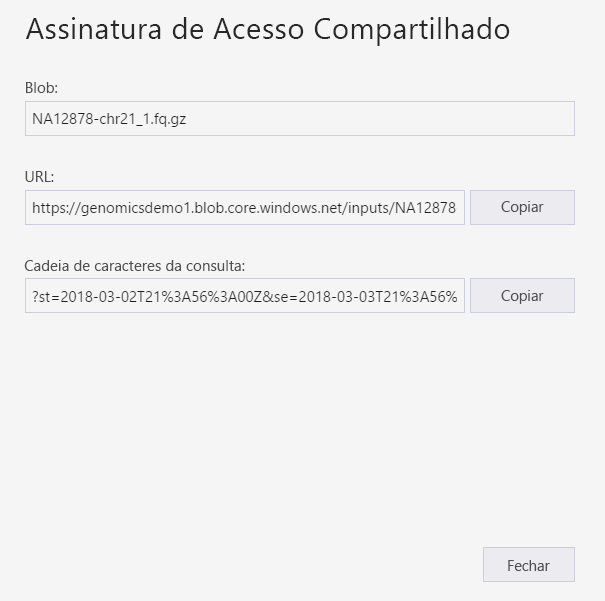
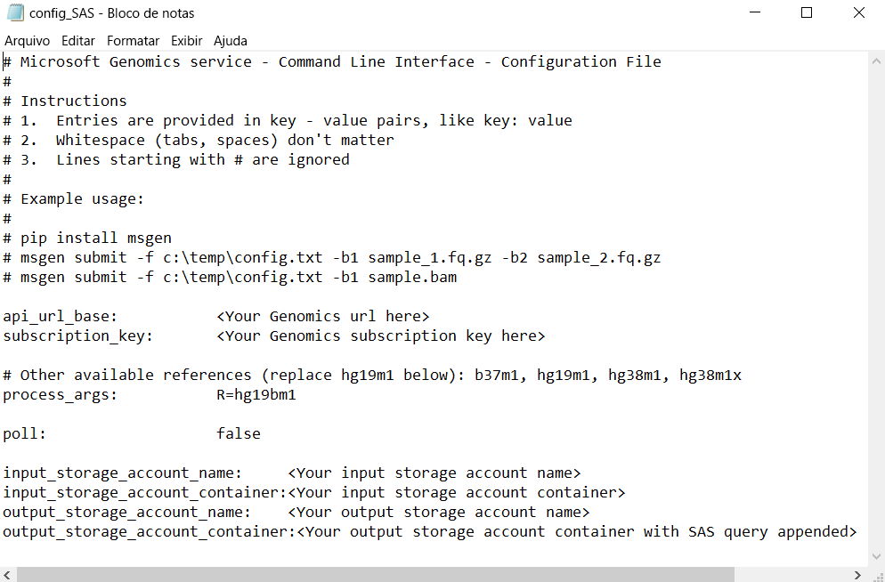

# <a name="submit-a-workflow-to-microsoft-genomics-using-a-sas-instead-of-a-storage-account-key"></a>Enviar um fluxo de trabalho para o Microsoft Genomics usando SAS em vez de uma chave de conta de armazenamento 

Este artigo demonstra como enviar um fluxo de trabalho para o serviço Microsoft Genomics usando um arquivo txt que contenha [(SAS) de assinaturas de acesso compartilhado](https://docs.microsoft.com/azure/storage/common/storage-dotnet-shared-access-signature-part-1) em vez de chaves da conta de armazenamento. Esse recurso pode ser útil em caso de problemas de segurança quanto a ter a chave da conta de armazenamento visível no arquivo txt. 

Este artigo pressupõe que você já instalou e executou o cliente `msgen` e está familiarizado sobre como usar o Armazenamento do Azure. Se você enviou um fluxo de trabalho usando os dados de exemplo fornecidos com êxito, você está pronto para prosseguir com este artigo. 

## <a name="what-is-a-sas"></a>O que é uma SAS?
Uma [SAS (Assinatura de Acesso Compartilhado)](https://docs.microsoft.com/azure/storage/common/storage-dotnet-shared-access-signature-part-1) fornece acesso delegado aos recursos da sua conta de armazenamento. Com uma SAS, você pode conceder acesso aos recursos em sua conta de armazenamento sem compartilhar as chaves de conta. Este é o ponto principal do uso de assinaturas de acesso compartilhado em seus aplicativos: uma SAS é uma maneira segura de compartilhar seus recursos de armazenamento sem comprometer as chaves da conta.

A SAS que é enviada ao Microsoft Genomics deve ser uma [SAS do serviço](https://docs.microsoft.com/rest/api/storageservices/Constructing-a-Service-SAS) que delega acesso apenas ao blob ou contêiner onde os arquivos de entrada e saída são armazenados. 

O URI para um token SAS (assinatura de acesso compartilhado) de nível de serviço consiste no URI para o recurso ao qual a SAS delegará acesso, seguido pelo token SAS. O token SAS é a cadeia de caracteres de consulta que inclui todas as informações necessárias para autenticar as SAS e especifica o recurso, as permissões disponíveis para acesso, o intervalo de tempo no qual a assinatura é válida, o endereço IP ou intervalo de endereços dos quais as solicitações podem se originar, o protocolo com suporte com o qual pode ser feita uma solicitação, um identificador de política de acesso opcional associado à solicitação e a própria assinatura. 

## <a name="sas-needed-for-submitting-a-workflow-to-the-microsoft-genomics-service"></a>SAS necessária para enviar um fluxo de trabalho ao serviço Microsoft Genomics
Dois ou mais tokens SAS são necessários para cada fluxo de trabalho enviado para o serviço Microsoft Genomics, um para cada arquivo de entrada e um para o contêiner de saída.

A SAS para os arquivos de entrada deve ter as seguintes propriedades:
1.  Escopo (conta, contêiner, blob): blob
2.  Término: 48 horas a partir de agora
3.  Permissões: leitura

A SAS para o contêiner de saída deve ter as seguintes propriedades:
1.  Escopo (conta, contêiner, blob): contêiner
2.  Término: 48 horas a partir de agora
3.  Permissões: leitura, gravação, exclusão


## <a name="create-a-sas-for-the-input-files-and-the-output-container"></a>Criar uma SAS para os arquivos de entrada e o contêiner de saída
Há duas maneiras de criar um token SAS: usando o Gerenciador de Armazenamento do Azure ou programaticamente.  Se estiver escrevendo código, você poderá criar a SAS por conta própria ou usar o SDK do Armazenamento do Azure na sua linguagem preferida.


### <a name="set-up-create-a-sas-using-azure-storage-explorer"></a>Configurar: criar uma SAS usando o Gerenciador de Armazenamento do Azure

O [Gerenciador de Armazenamento do Azure](https://azure.microsoft.com/features/storage-explorer/) é uma ferramenta para gerenciar os recursos que você guardou no Armazenamento do Azure.  Você pode aprender mais sobre como usar o Gerenciador de Armazenamento do Azure [aqui](https://docs.microsoft.com/azure/vs-azure-tools-storage-manage-with-storage-explorer).

A SAS para os arquivos de entrada deve ser delimitada para o arquivo de entrada específico (blob). Para criar um token SAS, execute [estas instruções](https://docs.microsoft.com/azure/storage/blobs/storage-quickstart-blobs-storage-explorer). Depois de criar a SAS, a URL completa com a cadeia de consulta e a própria cadeia de consulta são fornecidas e podem ser copiadas na tela.

 


### <a name="set-up-create-a-sas-programmatically"></a>Configurar: Criar uma SAS programaticamente

Para criar uma SAS usando o SDK do Armazenamento do Azure, confira a documentação existente em várias linguagens, incluindo [.NET](https://docs.microsoft.com/azure/storage/blobs/storage-dotnet-shared-access-signature-part-2#generate-a-shared-access-signature-uri-for-a-blob), [Python](https://docs.microsoft.com/azure/storage/blobs/storage-python-how-to-use-blob-storage) e [Node.js](https://docs.microsoft.com/azure/storage/blobs/storage-nodejs-how-to-use-blob-storage). 

Para criar uma SAS sem um SDK, a cadeia de caracteres de consulta da SAS pode ser construída diretamente, incluindo todas as informações necessárias para autenticar a SAS. Estas [instruções](https://docs.microsoft.com/rest/api/storageservices/constructing-a-service-sas) detalham os componentes da cadeia de caracteres de consulta SAS e como criá-la. A assinatura SAS necessária é criada pela geração de um HMAC usando as informações de autenticação do blob/contêiner, conforme descrito nestas [instruções](https://docs.microsoft.com/rest/api/storageservices/service-sas-examples).


## <a name="add-the-sas-to-the-configtxt-file"></a>Adicionar a SAS ao arquivo config.txt
Para executar um fluxo de trabalho com o serviço Microsoft Genomics usando uma cadeia de caracteres de consulta SAS, edite o arquivo config.txt para remover as chaves do arquivo config.txt. Em seguida, anexe a cadeia de caracteres de consulta SAS (que começa com um `?`) ao nome de contêiner de saída, conforme mostrado. 



Use o cliente Python do Microsoft Genomics para enviar o fluxo de trabalho com o seguinte comando, anexando a cadeia de caracteres de consulta SAS correspondente a cada um dos nomes de blob de entrada:

```python
msgen submit -f [full path to your config file] -b1 [name of your first paired end read file, SAS query string appended] -b2 [name of your second paired end read file, SAS query string appended]
```

### <a name="if-adding-the-input-file-names-to-the-configtxt-file"></a>Se adicionar os nomes de arquivo de entrada ao arquivo config.txt
Como alternativa, os nomes dos arquivos emparelhados lidos podem ser diretamente adicionados ao arquivo config.txt, com os tokens de consulta SAS anexados, conforme mostrado:


Nesse caso, use o cliente Microsoft Genomics Python para enviar seu fluxo de trabalho com o seguinte comando, omitindo os comandos `-b1` e `-b2`:

```python
msgen submit -f [full path to your config file] 
```

## <a name="next-steps"></a>Próximas etapas
Neste artigo, você usou tokens SAS em vez das chaves de conta para enviar um fluxo de trabalho para o serviço Microsoft Genomics por meio do cliente Python `msgen`. Para saber mais sobre o envio de fluxo de trabalho e outros comandos que você pode usar com o serviço do Microsoft Genomics, confira nossas [Perguntas frequentes](frequently-asked-questions-genomics.md). 
