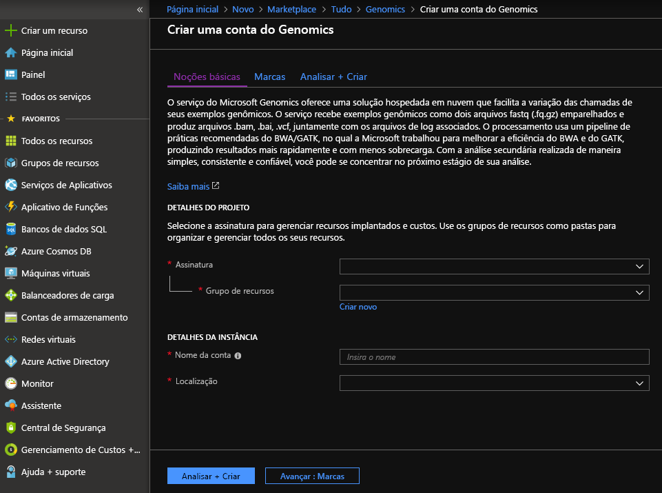
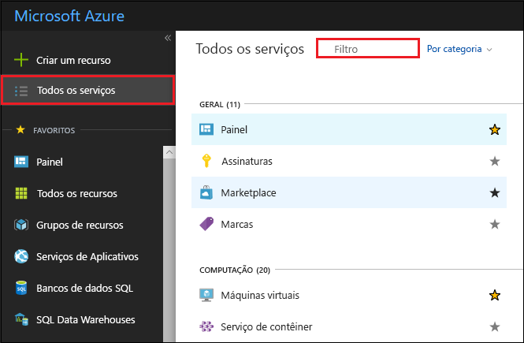
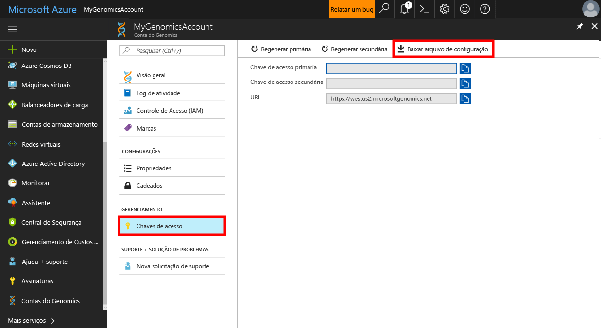

# <a name="quickstart-run-a-workflow-through-the-microsoft-genomics-service"></a>Guia de início rápido: executar um fluxo de trabalho por meio do serviço do Microsoft Genomics

O Microsoft Genomics é um serviço seguro e escalonável para análise secundária que pode processar um genoma rapidamente, começando com leituras brutas e produzindo leituras alinhadas e chamadas variáveis. Introdução em apenas algumas etapas: 
1.  Configurar: crie uma conta no Microsoft Genomics por meio do portal do Azure e instale o cliente Microsoft Genomics Python no seu ambiente local. 
2.  Carregar dados de entrada: crie uma conta de armazenamento do Microsoft Azure por meio do portal do Azure e carregue os arquivos de entrada. Os arquivos de entrada devem estar emparelhados com leituras finais (arquivos FASTQ ou BAM).
3.  Executar: use a interface de linha de comando do Microsoft Genomics para executar fluxos de trabalho por meio do serviço Microsoft Genomics. 

Para obter mais informações sobre o Microsoft Genomics, consulte [O que é Microsoft Genomics?](overview-what-is-genomics.md)

## <a name="set-up-create-a-microsoft-genomics-account-in-the-azure-portal"></a>Configuração: criar uma conta do Microsoft Genomics no portal do Azure

Para criar uma conta do Microsoft Genomics, navegue até o [portal do Azure](https://portal.azure.com/#create/Microsoft.Genomics). Caso ainda não tenha uma assinatura do Azure, crie uma antes de criar uma conta do Microsoft Genomics. 




Configure sua conta do Genomics com as seguintes informações, conforme mostrado na imagem anterior. 

 |**Configuração**          |  **Valor sugerido**  | **Descrição do campo** |
 |:-------------       |:-------------         |:----------            |
 |Nome da conta         | MyGenomicsAccount     |Escolha um identificador de conta exclusivo. Para nomes válidos, consulte [Regras de nomenclatura](https://docs.microsoft.com/azure/architecture/best-practices/naming-conventions) |
 |Assinatura         | O nome da sua assinatura|Essa é a unidade de cobrança para os serviços do Azure. Para obter detalhes sobre sua assinatura, consulte [Assinaturas](https://account.azure.com/Subscriptions) |      
 |Grupo de recursos       | MyResourceGroup       |  Grupos de recursos permitem agrupar vários recursos do Azure (conta de armazenamento, conta genômica, etc.) em um único grupo para um gerenciamento simples. Para obter mais informações, consulte [Grupos de recursos] (https://docs.microsoft.com/pt-br/azure/azure-resource-manager/resource-group-overview#resource-groups). Para obter nomes válidos do grupo de recursos, consulte [Regras de nomenclatura](https://docs.microsoft.com/azure/architecture/best-practices/naming-conventions) |
 |Local padrão                   | Oeste dos EUA 2                    |    O serviço está disponível em Oeste dos EUA 2, Europa Ocidental e Sudeste Asiático |


É possível clicar em Notificações na barra de menus superior para monitorar o processo de implantação.


## <a name="set-up-install-the-microsoft-genomics-python-client"></a>Configuração: instalar o cliente do Microsoft Genomics Python

Os usuários precisam instalar o Python e o cliente Microsoft Genomics Python em seu ambiente local. 

### <a name="install-python"></a>Instalar o Python

O cliente Microsoft Genomics Python é compatível com o Python 2.7. É recomendável usar a versão 2.7.12 ou posterior; a versão sugerida é 2.7.14. Você pode encontrar o download [aqui](https://www.python.org/downloads/). 


### <a name="install-the-microsoft-genomics-client"></a>Instalar o cliente do Microsoft Genomics

Use o pip do Python para instalar o `msgen` do cliente do Microsoft Genomics. As instruções a seguir pressupõem que o Python já está no caminho do seu sistema. Se tiver problemas de não reconhecimento da instalação do pip, você precisa adicionar o Python e a subpasta de scripts ao seu caminho do sistema.


```
pip install --upgrade --no-deps msgen
pip install msgen
```


Se você não deseja instalar `msgen` como um binário de todo o sistema nem modificar pacotes do Python de todo o sistema, use o sinalizador `–-user` com `pip`.
Se você usar a instalação baseada em pacote ou setup.py, todos os pacotes necessários são instalados. Caso contrário, os pacotes básicos requeridos para msgen são 

 * [Azure-storage](https://pypi.python.org/pypi/azure-storage). 
 * [Requests](https://pypi.python.org/pypi/requests). 


Você pode instalar esses pacotes usando `pip`, `easy_install` ou por meio de procedimentos `setup.py` padrão. 


### <a name="test-the-microsoft-genomics-client"></a>Testar o cliente Microsoft Genomics
Para testar o cliente Microsoft Genomics, baixe o arquivo de configuração na sua conta genômica. Navegue até sua conta genômica clicando em **Todos os serviços** na parte superior esquerda, filtrando e selecionando contas genômicas.





Selecione a conta genômica que acabou de criar, navegue até **Chaves de Acesso** e baixe o arquivo de configuração.




Teste o funcionamento do cliente Microsoft Genomics Python com o seguinte comando


```
msgen list -f “<full path where you saved the config file>”
```

## <a name="create-a-microsoft-azure-storage-account"></a>Criar uma Conta de Armazenamento do Microsoft Azure 
O serviço do Microsoft Genomics espera que entradas sejam armazenadas como blob de blocos em uma conta de armazenamento do Azure. Ele também grava arquivos de saída como blobs de blocos para um contêiner especificado pelo usuário em uma conta de armazenamento do Azure. As entradas e saídas podem residir em contas de armazenamento diferentes.
Caso já tenha seus dados em uma conta de armazenamento do Azure, você precisa verificar se eles estão no mesmo local que sua conta do Genomics. Caso contrário, incorrem encargos de saída ao executar o serviço do Genomics. Caso ainda não tenha uma Conta de Armazenamento do Microsoft Azure, você precisa criar uma e carregar seus dados. É possível encontrar mais informações sobre Contas de armazenamento do Azure [aqui](https://docs.microsoft.com/azure/storage/common/storage-create-storage-account), incluindo o que é uma conta de armazenamento e quais serviços ela fornece. Para criar uma Conta de Armazenamento do Microsoft Azure, navegue até o [portal do Azure](https://portal.azure.com/#create/Microsoft.StorageAccount-ARM ).  


Configure sua Conta de armazenamento com as informações a seguir, conforme mostrado na imagem anterior. Use a maioria das opções padrão para uma conta de armazenamento, apenas especificando que a conta é de armazenamento de blobs, não para uso geral. O armazenamento de blob pode ser de duas a cinco vezes mais rápido para downloads e uploads. 


 |**Configuração**          |  **Valor sugerido**  | **Descrição do campo** |
 |:-------------------------       |:-------------         |:----------            |
 |NOME         | MyStorageAccount     |Escolha um identificador de conta exclusivo. Para nomes válidos, consulte [Regras de nomenclatura](https://docs.microsoft.com/azure/architecture/best-practices/naming-conventions) |
 |Modelo de Implantação         | Gerenciador de Recursos| O Gerenciador de Recursos é o modelo de implantação recomendado. Para obter mais informações, confira [Noções básicas sobre a implantação do Gerenciador de Recursos](https://docs.microsoft.com/azure/azure-resource-manager/resource-manager-deployment-model) |      
 |Tipo de conta       | Armazenamento de blob       |  O armazenamento de blob pode ser de duas a cinco vezes mais rápido para downloads e uploads que o uso geral. |
 |Desempenho                  | Standard                   | O padrão é standard. Para obter mais detalhes sobre as contas de armazenamento standard e premium, consulte [Introdução ao Armazenamento do Microsoft Azure](https://docs.microsoft.com/azure/storage/common/storage-introduction)    |
 |Replicação                  | Armazenamento com redundância local                  | O armazenamento com redundância local replica seus dados dentro do datacenter da região em que você criou sua conta de armazenamento. Para obter mais informações, consulte [Replicação do Armazenamento do Azure](https://docs.microsoft.com/azure/storage/common/storage-redundancy)    |
 |Transferência segura é necessária                  | Desabilitado                 | Por padrão, ela fica desabilitada. Para obter mais informações sobre a segurança da transferência de dados, consulte [Requerer transferência segura](https://docs.microsoft.com/azure/storage/common/storage-require-secure-transfer)    |
 |Camada de acesso                  | Dinâmica                   | Uma camada de acesso indica que os objetos na conta de armazenamento serão acessados com mais frequência.    |
 |Assinatura         | Sua assinatura do Azure |Para obter detalhes sobre sua assinatura, consulte [Assinaturas](https://account.azure.com/Subscriptions) |      
 |Grupo de recursos       | MyResourceGroup       |  É possível selecionar o mesmo grupo de recursos que a sua conta genômica. Para obter nomes válidos do grupo de recursos, consulte [Regras de nomenclatura](https://docs.microsoft.com/azure/architecture/best-practices/naming-conventions) |
 |Local padrão                  | Oeste dos EUA 2                  | Use o mesmo local como o local da sua conta genômica para reduzir encargos de saída e reduzir a latência. O serviço do Genomics está disponível em Oeste dos EUA2, Oeste dos EUA 2, Europa Ocidental e Sudeste Asiático    |
 |Redes virtuais                | Desabilitado                   | Por padrão, ela fica desabilitada. Para obter mais informações, consulte [Redes virtuais do Azure](https://docs.microsoft.com/azure/storage/common/storage-network-security)    |


Clique em criar para criar a conta de armazenamento. Assim como você fez com a criação de sua conta do Genomics, é possível clicar em Notificações na barra de menus superior para monitorar o processo de implantação. 


## <a name="upload-input-data-to-your-storage-account"></a>Carregue os dados de entrada na sua conta de armazenamento

O serviço do Microsoft Genomics espera leituras finais emparelhadas como arquivos de entrada. É possível optar por carregar seus próprios dados ou explorar usando dados de exemplo disponíveis publicamente e fornecidos para você. Caso queira usar os dados de exemplo disponíveis publicamente, eles ficam hospedados aqui:


[https://msgensampledata.blob.core.windows.net/small/chr21_1.fq.gz](https://msgensampledata.blob.core.windows.net/small/chr21_1.fq.gz)
[https://msgensampledata.blob.core.windows.net/small/chr21_2.fq.gz](https://msgensampledata.blob.core.windows.net/small/chr21_2.fq.gz)


Em sua conta de armazenamento, você precisa criar um contêiner de blob para seus dados de entrada e um segundo contêiner de blob para os dados de saída.  Carregue os dados de entrada em seu contêiner de blob de entrada. Várias ferramentas podem ser usadas para fazer isso, incluindo [Gerenciador de Armazenamento do Microsoft Azure](https://azure.microsoft.com/features/storage-explorer/), [blobporter](https://github.com/Azure/blobporter) ou [AzCopy](https://docs.microsoft.com/azure/storage/common/storage-use-azcopy?toc=%2fazure%2fstorage%2fblobs%2ftoc.json). 


## <a name="run-a-workflow-through-the-microsoft-genomics-service-using-the-python-client"></a>Execute um fluxo de trabalho por meio do serviço do Microsoft Genomics usando o cliente Python 

Para executar um fluxo de trabalho por meio do serviço do Microsoft Genomics, edite o arquivo config.txt para especificar o contêiner de armazenamento de entrada e saída para seus dados.
Abra o arquivo config.txt que você baixou da sua conta do Genomics. As seções que precisam ser especificadas são sua chave de assinatura e seis itens na parte inferior, o nome da conta de armazenamento e o nome da chave e do contêiner para a entrada e saída. É possível encontrar essas informações navegando no portal até **Chaves de acesso** para sua conta de armazenamento ou diretamente do Gerenciador de Armazenamento do Azure.  


### <a name="submit-your-workflow-to-the-microsoft-genomics-service-the-microsoft-genomics-client"></a>Enviar seu fluxo de trabalho para o serviço do Microsoft Genomics e o cliente Microsoft Genomics

Use o cliente Microsoft Genomics Python para enviar seu fluxo de trabalho com o seguinte comando:


```python
msgen submit -f [full path to your config file] -b1 [name of your first paired end read] -b2 [name of your second paired end read]
```


É possível exibir o status do trabalho usando o seguinte comando: 
```python
msgen list -f c:\temp\config.txt 
```


Assim que o fluxo de trabalho for concluído, é possível exibir os arquivos de saída em sua Conta de Armazenamento do Azure no contêiner de saída que você configurou. 


## <a name="next-steps"></a>Próximas etapas
Neste artigo, você carregou os dados de entrada de exemplo no Armazenamento do Azure e enviou um fluxo de trabalho para o serviço do Microsoft Genomics por meio do cliente Python `msgen`. Para saber mais sobre outros tipos de arquivo de entrada que podem ser usados com o serviço do Microsoft Genomics, consulte as seguintes páginas: [FASTQ emparelhado](quickstart-input-pair-FASTQ.md) | [BAM](quickstart-input-BAM.md) | [Vários FASTQ ou BAM](quickstart-input-multiple.md) 