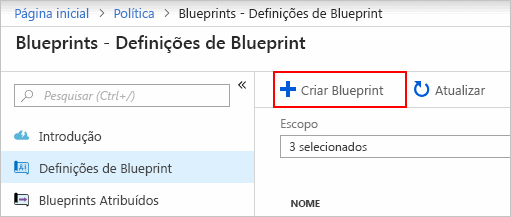
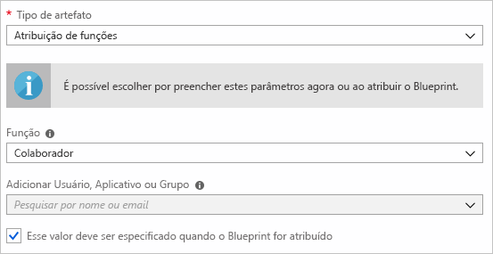
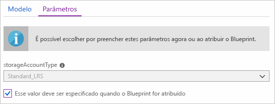
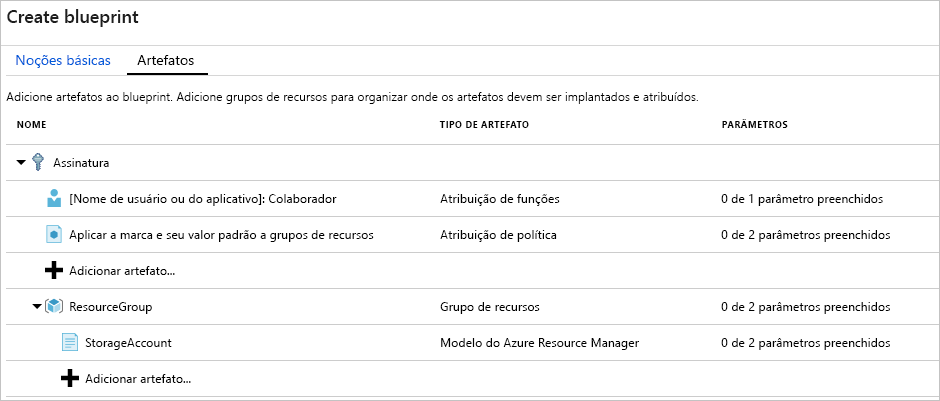
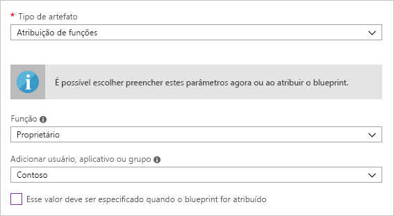
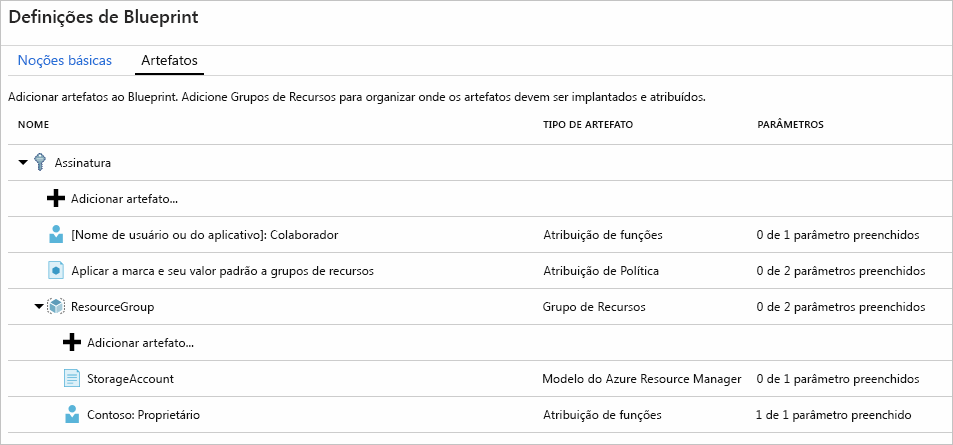
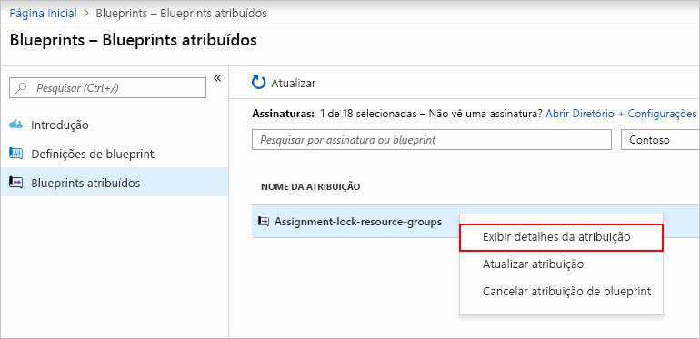

# <a name="define-and-assign-an-azure-blueprint-in-the-portal"></a>Definir e atribuir um blueprint do Azure no portal

Aprender a criar e atribuir blueprints permite definir padrões comuns para desenvolver configurações reutilizáveis e que podem ser implantadas rapidamente com base em modelos do Resource Manager, políticas, segurança e muito mais. Neste tutorial, você aprenderá a usar o Blueprint do Azure para executar algumas das tarefas comuns relacionadas à criação, publicação e atribuição de um blueprint dentro de sua organização, como:

> [!div class="checklist"]
> - Criar um novo projeto e adicionar vários artefatos com suporte
> - Faça alterações em um blueprint existente ainda em **Rascunho**
> - Marcar um plano gráfico como pronto para atribuir com **publicado**
> - Atribuir um blueprint a uma assinatura existente
> - Verificar o status e o progresso de um blueprint atribuído
> - Remover um blueprint que tenha sido atribuído a uma assinatura

Se você não tiver uma assinatura do Azure, crie uma [conta gratuita](https://azure.microsoft.com/free) antes de começar.

## <a name="create-a-blueprint"></a>Criar um plano gráfico

A primeira etapa na definição de um padrão padrão para conformidade é compor um blueprint a partir dos recursos disponíveis. Neste exemplo, crie um novo blueprint chamado 'MyBlueprint' para configurar atribuições de função e política para a assinatura, adicione um novo grupo de recursos e crie um modelo de Gerenciador de Recursos e uma atribuição de função no novo grupo de recursos.

1. Clique em **Todos os serviços**; procure e selecione **Política** no painel esquerdo. Sobre a **política** página, clique em **plantas**.

1. Selecione **definições de plantas** da página à esquerda e clique no **+ criar Blueprint** botão na parte superior da página.

   - Alternativamente, clique em **Criar** na página **Introdução** para ir direto para a criação de um blueprint.

   

1. Forneça um **Blueprint Name** como "MyBlueprint" (letras e números - até 48 caracteres, mas sem espaços ou caracteres especiais) para o blueprint, mas deixe **Blueprint Description** em branco por enquanto .  Na caixa **Definir Local**, clique nas reticências à direita, selecione o [grupo de gerenciamento](../management-groups/overview.md) no qual deseja salvar o blueprint e clique em **Selecione**.

   > [!NOTE]
   > Definições de plantas só podem ser salvo para grupos de gerenciamento. Para criar seu primeiro grupo de gerenciamento, siga [estas etapas](../management-groups/create.md).

1. Verifique se as informações estão corretas (os campos **Blueprint Name** e **Definition Location** não podem ser alterados mais tarde) e clique em **Avançar: Artefatos** na parte inferior da página ou na guia **Artefatos** na parte superior da página.

1. Adicionar atribuição de função na assinatura: clique com o botão esquerdo na linha **+ Adicionar artefato...** em **Assinatura** e a janela "Adicionar artefato" é aberta no lado direito do navegador. Selecione 'Atribuição de Função' para _tipo de Artefato_. Em _Papel_, selecione 'Colaborador' e deixe o campo _Adicionar Usuário, Aplicativo ou Grupo_ com a caixa de seleção indicando um **parâmetro dinâmico**. Clique em **adicionar** para adicionar este artefato para o plano gráfico.

   

   > [!NOTE]
   > A maioria dos artefatos _suporta_ parâmetros. Um parâmetro atribuído a um valor durante a criação do blueprint é um **parâmetro estático**. Se o parâmetro for atribuído durante a atribuição de blueprint, ele será um **parâmetro dinâmico**. Para obter mais informações, consulte [parâmetros de plano gráfico](./concepts/parameters.md).

1. Adicionar designação de política na assinatura: Clique com o botão esquerdo na linha **+ Adicionar artefato...** diretamente sob a **Assinatura**. Selecione 'Atribuição de Política' para _tipo de Artefato_. Altere _tipo_ para "Incorporado" e em _Pesquise_ insira "tag". Clique fora da _pesquisa_ para a filtragem ocorra. Selecione "Aplicar tag e seu valor padrão aos grupos de recursos" clicando nele. Clique em **adicionar** para adicionar este artefato para o plano gráfico.

1. Clique na linha da designação de política 'Aplicar tag e seu valor padrão aos grupos de recursos'. A janela para fornecer parâmetros para o artefato como parte da definição do blueprint é aberta e permite configurar os parâmetros para todas as atribuições (**parâmetros estáticos**) com base nesse blueprint em vez de durante a atribuição (**parâmetros dinâmicos**). Este exemplo usa **parâmetros dinâmicos** durante a atribuição do blueprint e, portanto, deixe os padrões e clique em **Cancelar**.

1. Adicionar grupo de recursos na assinatura: clique com o botão esquerdo na linha **+ Adicionar artefato...** em **Assinatura**. Selecione 'Grupo de recursos' _tipo de artefato_. Deixe os campos _Nome do grupo de recursos_ e _Local_ em branco, mas verifique se a caixa de seleção está marcada em cada propriedade para torná-los **parâmetros dinâmicos**. Clique em **adicionar** para adicionar este artefato para o plano gráfico.

1. Adicionar modelo ao grupo de recursos: clique com o botão esquerdo do mouse no **+ Adicionar artefato.** linha diretamente sob o **ResourceGroup** entrada. Selecione 'Modelo do Azure Resource Manager' para _Tipo de artefato_, defina _Nome de exibição do artefato_ como 'StorageAccount' e deixe _Descrição_ em branco. Na guia **Template** na caixa do editor, cole o seguinte modelo do Resource Manager. Depois de colar o modelo, clique na guia **Parâmetros** e observe que o parâmetro **storageAccountType** e o valor padrão **Standard_LRS** foram automaticamente detectados e preenchidos, mas configurados como **parâmetro dinâmico**. Remova a marca da caixa de seleção e observe que a lista suspensa contém apenas valores incluídos no modelo do Resource Manager em **allowedValues**. Verifique a caixa para defini-lo de volta para um **parâmetro dinâmico**. Clique em **adicionar** para adicionar este artefato para o plano gráfico.

   > [!IMPORTANT]
   > Se estiver importando o modelo, verifique se o arquivo é apenas JSON e não inclui HTML. Ao apontar para uma URL no GitHub, assegure-se de ter clicado em **RAW** para obter o arquivo JSON puro e não aquele envolvido com HTML para exibição no GitHub. Um erro ocorrerá se o modelo importado não for puramente JSON.

   ```json
   {
       "$schema": "https://schema.management.azure.com/schemas/2015-01-01/deploymentTemplate.json#",
       "contentVersion": "1.0.0.0",
       "parameters": {
           "storageAccountType": {
               "type": "string",
               "defaultValue": "Standard_LRS",
               "allowedValues": [
                   "Standard_LRS",
                   "Standard_GRS",
                   "Standard_ZRS",
                   "Premium_LRS"
               ],
               "metadata": {
                   "description": "Storage Account type"
               }
           }
       },
       "variables": {
           "storageAccountName": "[concat(uniquestring(resourceGroup().id), 'standardsa')]"
       },
       "resources": [{
           "type": "Microsoft.Storage/storageAccounts",
           "name": "[variables('storageAccountName')]",
           "apiVersion": "2016-01-01",
           "location": "[resourceGroup().location]",
           "sku": {
               "name": "[parameters('storageAccountType')]"
           },
           "kind": "Storage",
           "properties": {}
       }],
       "outputs": {
           "storageAccountName": {
               "type": "string",
               "value": "[variables('storageAccountName')]"
           }
       }
   }
   ```

   

1. Seu blueprint concluído deve ser semelhante ao seguinte. Observe que cada artefato tem '_x_ de _y_ parâmetros preenchidos' sob a coluna _Parâmetros_. Os **parâmetros dinâmicos** são definidos durante cada atribuição do blueprint.

   

1. Agora que todos os artefatos planejados foram adicionados, clique em **Salvar rascunho** na parte inferior da página.

## <a name="edit-a-blueprint"></a>Editar um blueprint

Em [Criar um blueprint](#create-a-blueprint), uma Descrição não foi fornecida nem a atribuição de função foi adicionada ao novo grupo de recursos. Isso pode ser corrigido seguindo estas etapas:

1. Selecione **Definições do Blueprint** na página à esquerda.

1. Na lista de planos gráficos, clique naquele que você criou anteriormente e selecione **Blueprint editar**.

1. Na **Descrição do Blueprint**, forneça algumas informações sobre o blueprint e os artefatos que o compõem.  Nesse caso, insira algo como: "Este blueprint define a atribuição de política e de atribuição de tag na assinatura, cria um ResourceGroup e implementa um modelo de recurso e uma atribuição de função para esse ResourceGroup".

1. Clique em **Próximo: Artefatos** na parte inferior da página ou na guia **Artefatos** na parte superior da página.

1. Adicionar atribuição de função no grupo de recursos: Clique com o botão esquerdo na linha **+ Adicionar artefato...** diretamente na entrada **ResourceGroup**. Selecione 'Atribuição de Função' para _tipo de Artefato_. Em _Função_, selecione "Proprietário" e remova a verificação do campo _Adicionar Usuário, Aplicativo ou Grupo_ e pesquise e selecione um usuário, aplicativo ou grupo para adicionar. Esse artefato usa um **parâmetro static** definido igualmente em todas as atribuições deste projeto. Clique em **adicionar** para adicionar este artefato para o blueprint.

   

1. Seu blueprint concluído deve ser semelhante ao seguinte. Observe que a designação de função adicionada recentemente mostra **1 de 1 parâmetros preenchidos**, o que significa que é um **parâmetro estático**.

   

1. Clique em **Salvar rascunho** agora que foi atualizado.

## <a name="publish-a-blueprint"></a>Publicar um modelo

Agora que todos os artefatos planejados foram adicionados ao blueprint, é hora de publicá-lo.
A publicação torna disponível para ser atribuído a uma assinatura.

1. Selecione **Definições do Blueprint** na página à esquerda.

1. Na lista de blueprints, clique com o botão direito do mouse no que você criou anteriormente e selecione **Publish Blueprint**.

1. Na caixa de diálogo aberta, forneça uma **Versão** (letras, números e hifens com um comprimento máximo de 20 caracteres), como 'v1', e **Alterar notas** (opcional), como 'Primeira publicação'.

1. Clique em **Publicar** na parte inferior da página.

## <a name="assign-a-blueprint"></a>Atribuir um modelo

Depois que um blueprint for publicado, ele poderá ser atribuído a uma assinatura. Atribua o blueprint criado a uma das assinaturas na sua hierarquia do grupo de gerenciamento.

1. Selecione **Definições do Blueprint** na página à esquerda.

1. Na lista de blueprints, clique com o botão direito do mouse no que você criou anteriormente (ou clique com o botão esquerdo nas reticências) e selecione **Assign Blueprint**.

1. Na página **Atribuir Blueprint**, selecione a (s) assinatura (s) para a qual deseja implantar esse blueprint na lista suspensa **Subscription**.

   > [!NOTE]
   > Uma atribuição é criada para cada assinatura selecionada, permitindo alterações em uma única designação de assinatura posteriormente, sem forçar alterações no restante das assinaturas selecionadas.

1. Para **nome atribuído**, forneça um nome exclusivo para esta atribuição.

1. Em **Local**, selecione uma região para a identidade gerenciada a ser criada. O Blueprint do Azure usa essa identidade gerenciada para implantar todos os artefatos no blueprint atribuído. Para saber mais, veja [identidades gerenciadas para recursos do Azure](../../active-directory/managed-identities-azure-resources/overview.md).

1. Deixe a lista suspensa **Blueprint definition version** de **Published** versões na entrada 'v1' (padrão como a versão mais recente **Publicado**).

1. Para **Atribuição de Bloqueio**, deixe o padrão de **Não Bloquear**. Para obter mais informações, consulte [bloqueio de recursos de projetos](./concepts/resource-locking.md).

1. Para a atribuição de função no nível da assinatura **[Grupo de usuários ou nome do aplicativo]: Colaborador**, pesquise e selecione um usuário, aplicativo ou grupo.

1. Para a atribuição de política em nível de assinatura, defina o **Nome da Tag** como 'CostCenter' e o **Tag Value** como 'ContosoIT'.

1. Para o 'ResourceGroup', forneça um **Nome** de 'StorageAccount' e um **Local** de 'East US 2' no menu suspenso.

   > [!NOTE]
   > Para cada artefato que foi incluído no grupo de recursos durante a definição do blueprint, esse artefato é recuado para alinhar com o grupo de recursos ou objeto com o qual será implementado. Os artefatos que não receberem parâmetros ou não tiverem parâmetros a serem definidos na atribuição serão listados apenas para informações contextuais.

1. No modelo 'StorageAccount' do Azure Resource Manager, selecione 'Standard_GRS' para o parâmetro **storageAccountType**.

1. Leia a caixa de informações na parte inferior da página e clique em **Atribuir**.

## <a name="track-deployment-of-a-blueprint"></a>Controlar a implantação de um plano gráfico

Quando um blueprint foi atribuído a uma ou mais assinaturas, duas coisas acontecem:

- O blueprint é incluído na página **Assigned Blueprints** por assinatura atribuída a
- Inicia o processo de implantação de todos os artefatos definidos pelo plano gráfico

Agora que o blueprint foi atribuído a uma assinatura, verifique o progresso da implantação.

1. Selecione **Assigned Blueprints** na página à esquerda.

1. Na lista de blueprints, clique com o botão direito do mouse no que você atribuiu anteriormente e selecione **View Detalhes da Atribuição**.

   

1. Na página **Detalhes do Deployment**, valide se todos os artefatos foram implementados com sucesso e se não houve erros durante a implementação. Em caso de erro, confira a [solução de problemas de blueprint](./troubleshoot/general.md) a fim de obter as etapas para determinar o que deu errado.

## <a name="unassign-a-blueprint"></a>Cancelar a atribuição de um blueprint

Se não for mais necessária, remova uma atribuição de blueprint de uma assinatura. O blueprint pode ter sido substituído por um mais recente com padrões, políticas e designs atualizados. Quando um blueprint é removido, os artefatos atribuídos como parte desse blueprint são deixados para trás. Para remover uma atribuição de blueprint, siga estas etapas:

1. Selecione **Assigned Blueprints** na página à esquerda.

1. Na lista de blueprints, selecione o blueprint a ser desatribuído e clique no botão **Unassign Blueprint** na parte superior da página.

1. Ler a mensagem de confirmação e, em seguida, clique em **Ok**.

## <a name="delete-a-blueprint"></a>Excluir um plano gráfico

1. Selecione **Definições do Blueprint** na página à esquerda.

1. Clique com o botão direito do mouse no blueprint que deseja excluir e selecione **Delete Blueprint** e clique em **Sim** na caixa de diálogo de confirmação.

> [!NOTE]
> A exclusão de um blueprint nesse método também exclui todas as **Versões publicadas** do blueprint selecionado. Para excluir uma única versão, abra o blueprint, clique na guia **Published versions**, selecione e clique na versão que você deseja excluir e, em seguida, clique em **Delete This Version**. Além disso, um blueprint com atribuições não pode ser excluído até que todas as atribuições de blueprints tenham sido excluídas.

## <a name="next-steps"></a>Próximas etapas

- Aprenda sobre o [ciclo de vida do blueprint](./concepts/lifecycle.md)
- Entenda como usar [parâmetros estáticos e dinâmicos](./concepts/parameters.md)
- Aprenda a personalizar o [especificações técnicas de ordem de sequenciamento](./concepts/sequencing-order.md)
- Saiba como fazer uso do [bloqueio de recurso de blueprint](./concepts/resource-locking.md)
- Saiba como [atualizar atribuições existentes](./how-to/update-existing-assignments.md)
- Resolver problemas durante a atribuição de blueprint com [solução de problemas gerais](./troubleshoot/general.md)
