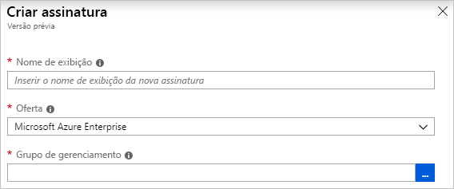

# <a name="define-and-assign-a-blueprint-in-the-portal"></a>Definir e atribuir um blueprint no portal

Aprender a criar e atribuir blueprints permite definir padrões comuns para desenvolver configurações reutilizáveis e que podem ser implantadas rapidamente com base em modelos do Azure Resource Manager, políticas, segurança e muito mais. Neste tutorial, você aprenderá a usar o Azure Blueprints para executar algumas das tarefas comuns relacionadas à criação, publicação e atribuição de um blueprint dentro de sua organização. Essas tarefas incluem:

> [!div class="checklist"]
> - Criar um novo projeto e adicionar vários artefatos com suporte
> - Faça alterações em um blueprint existente ainda em **Rascunho**
> - Marcar um plano gráfico como pronto para atribuir com **publicado**
> - Atribuir um blueprint a uma assinatura existente
> - Verificar o status e o progresso de um blueprint atribuído
> - Remover um blueprint que tenha sido atribuído a uma assinatura

Se você não tiver uma assinatura do Azure, crie uma [conta gratuita](https://azure.microsoft.com/free) antes de começar.

## <a name="create-a-blueprint"></a>Criar um plano gráfico

A primeira etapa na definição de um modelo padrão para conformidade é compor um blueprint a partir dos recursos disponíveis. Neste exemplo, vamos criar um blueprint chamado **MyBlueprint** para configurar as atribuições de função e política para a assinatura. Em seguida, vamos adicionar um grupo de recursos e criar um modelo do Resource Manager e uma atribuição de função ao grupo de recursos.

1. Selecione **Todos os serviços** no painel esquerdo. Pesquise e selecione **Blueprints**.

1. Selecione **Definições de blueprint** da página à esquerda e clique no botão **+ Criar blueprint** na parte superior da página.

   Ou, selecione **Criar** na página **Introdução** para ir direto para a criação de um blueprint.

   

1. Fornecer um **nome do blueprint** tais como **MyBlueprint**. (Use até 48 letras e números, mas sem espaços ou caracteres especiais). Deixe **descrição do blueprint** em branco por enquanto.

1. Na caixa **Definir local**, clique nas reticências à direita, selecione o [grupo de gerenciamento](../management-groups/overview.md) ou a assinatura em que deseja salvar o blueprint e clique em **Selecionar**.

1. Verifique se as informações estão corretas. Os campos **nome do blueprint** e **local da definição** não poderão ser alterados posteriormente. Em seguida, selecione **Avançar: Artefatos** na parte inferior da página ou na guia **Artefatos** na parte superior da página.

1. Criar uma atribuição de função em um nível de assinatura:

   1. Selecione a linha **+ Adicionar artefato** sob **Assinatura**. A janela **Adicionar um artefato** é aberta no lado direito do navegador.

   1. Selecione **Atribuição de função** para **Tipo de artefato**.

   1. Em **Função**, selecione **Colaborador**. Deixe a caixa **Adicionar usuário, aplicativo ou grupo** caixa com a caixa de seleção que indica um parâmetro dinâmico.

   1. Clique em **Adicionar** para adicionar este artefato ao blueprint.

   

   > [!NOTE]
   > A maioria dos artefatos suporta parâmetros. Um parâmetro atribuído a um valor durante a criação do blueprint é um *parâmetro estático*. Se o parâmetro for atribuído durante a atribuição de blueprint, ele será um *parâmetro dinâmico*. Para obter mais informações, consulte [parâmetros de blueprint](./concepts/parameters.md).

1. Incluir uma atribuição de política em um nível de assinatura:

   1. Clique na linha **+ Adicionar artefato** sob o artefato de atribuição de função.

   1. Selecione **Atribuição de política** para **Tipo de artefato**.

   1. Altere **tipo** para **interno**. Na **pesquisa**, insira **marca**.

   1. Clique fora da **pesquisa** para a filtragem ocorra. Selecione **Aplicar a marca e seu valor padrão a grupos de recursos**.

   1. Clique em **Adicionar** para adicionar este artefato ao blueprint.

1. Clique na linha da designação de política **Aplicar tag e seu valor padrão aos grupos de recursos**.

1. A janela para fornecer parâmetros para o artefato como parte da definição do blueprint é aberta e permite configurar os parâmetros para todas as atribuições (parâmetros estáticos) com base nesse blueprint em vez de durante a atribuição (parâmetros dinâmicos). Este exemplo usa parâmetros dinâmicos durante a atribuição do blueprint e, portanto, deixe os padrões e clique em **Cancelar**.

1. Adicione um grupo de recursos no nível da assinatura:

   1. Selecione a linha **+ Adicionar artefato** sob **Assinatura**.

   1. Selecione **Grupo de recursos** para **Tipo de artefato**.

   1. Deixe os campos **Nome de exibição do artefato**, **Nome do grupo de recursos** e **Local** em branco, mas garanta que a caixa de seleção esteja marcada para cada propriedade de parâmetro para torná-los parâmetros dinâmicos.

   1. Clique em **Adicionar** para adicionar este artefato ao blueprint.

1. Adicionar modelo sob o grupo de recursos:

   1. Selecione a linha **+ Adicionar artefato**, sob a entrada **ResourceGroup**.

   1. Selecione **Modelo do Azure Resource Manager** para **Tipo de artefato**, defina **Nome de exibição do artefato** como **StorageAccount** e deixe **Descrição** em branco.

   1. Na guia **Template** na caixa do editor, cole o seguinte modelo do Resource Manager.
      Depois de colar o modelo, selecione a guia **Parâmetros** e observe que os parâmetros de modelo **storageAccountType** e **local** foram detectados. Cada parâmetro foi automaticamente detectado e preenchido, mas configurado como um parâmetro dinâmico.

      > [!IMPORTANT]
      > Se estiver importando o modelo, verifique se o arquivo é apenas JSON e não inclui HTML. Ao apontar para uma URL no GitHub, assegure-se de ter clicado em **RAW** para obter o arquivo JSON puro e não aquele envolvido com HTML para exibição no GitHub. Um erro ocorrerá se o modelo importado não for puramente JSON.

      ```json
      {
          "$schema": "https://schema.management.azure.com/schemas/2015-01-01/deploymentTemplate.json#",
          "contentVersion": "1.0.0.0",
          "parameters": {
              "storageAccountType": {
                  "type": "string",
                  "defaultValue": "Standard_LRS",
                  "allowedValues": [
                      "Standard_LRS",
                      "Standard_GRS",
                      "Standard_ZRS",
                      "Premium_LRS"
                  ],
                  "metadata": {
                      "description": "Storage Account type"
                  }
              },
              "location": {
                  "type": "string",
                  "defaultValue": "[resourceGroup().location]",
                  "metadata": {
                      "description": "Location for all resources."
                  }
              }
          },
          "variables": {
              "storageAccountName": "[concat('store', uniquestring(resourceGroup().id))]"
          },
          "resources": [{
              "type": "Microsoft.Storage/storageAccounts",
              "name": "[variables('storageAccountName')]",
              "location": "[parameters('location')]",
              "apiVersion": "2018-07-01",
              "sku": {
                  "name": "[parameters('storageAccountType')]"
              },
              "kind": "StorageV2",
              "properties": {}
          }],
          "outputs": {
              "storageAccountName": {
                  "type": "string",
                  "value": "[variables('storageAccountName')]"
              }
          }
      }
      ```

   1. Remova a marca da caixa de seleção **storageAccountType** e observe que a lista suspensa contém apenas valores incluídos no modelo do Resource Manager em **allowedValues**. Verifique a caixa para defini-lo de volta para um parâmetro dinâmico.

   1. Clique em **Adicionar** para adicionar este artefato ao blueprint.

   

1. Seu blueprint concluído deve ser semelhante ao seguinte. Observe que cada artefato tem **_x_ de _y_ parâmetros preenchidos** sob a coluna **Parâmetros**. Os parâmetros dinâmicos são definidos durante cada atribuição do blueprint.

   

1. Agora que todos os artefatos planejados foram adicionados, selecione **Salvar rascunho** na parte inferior da página.

## <a name="edit-a-blueprint"></a>Editar um blueprint

Em [Criar um blueprint](#create-a-blueprint), uma descrição não foi fornecida nem a atribuição de função foi adicionada ao novo grupo de recursos. Corrija ambos ao seguir estas etapas:

1. Selecione **Definições do blueprint** na página à esquerda.

1. Na lista de blueprints, clique com o botão direito do mouse naquele que você criou anteriormente e selecione **Editar Blueprint**.

1. Em **Descrição do Blueprint**, forneça algumas informações sobre o blueprint e os artefatos que o compõem. Nesse caso, insira algo como: **Este blueprint define a atribuição de política e de atribuição de tag na assinatura, cria um ResourceGroup e implementa um modelo de recurso e uma atribuição de função para esse ResourceGroup.**

1. Selecione **Avançar: Artefatos** na parte inferior da página ou na guia **Artefatos** na parte superior da página.

1. Adicionar atribuição de função sob o grupo de recursos:

   1. Selecione a linha **+ Adicionar artefato**, diretamente sob a entrada **ResourceGroup**.

   1. Selecione **Atribuição de função** para **Tipo de artefato**.

   1. Sob **Função**, selecione **Proprietário**e desmarque a caixa de seleção sob a caixa **Adicionar usuário, aplicativo ou grupo**.

   1. Procure e selecione um usuário, aplicativo ou grupo a ser adicionado. Esse artefato usa um parâmetro static definido igualmente em todas as atribuições deste blueprint.

   e. Clique em **Adicionar** para adicionar este artefato ao blueprint.

   

1. Seu blueprint concluído deve ser semelhante ao seguinte. Observe que a designação de função adicionada recentemente mostra **1 de 1 parâmetros preenchidos**. Isso significa que ele é um parâmetro estático.

   

1. Selecione **Salvar rascunho** agora que foi atualizado.

## <a name="publish-a-blueprint"></a>Publicar um modelo

Agora que todos os artefatos planejados foram adicionados ao blueprint, é hora de publicá-lo.
A publicação torna o blueprint disponível para ser atribuído a uma assinatura.

1. Selecione **Definições do blueprint** na página à esquerda.

1. Na lista de blueprints, clique com o botão direito do mouse no que você criou anteriormente e selecione **Publicar blueprint**.

1. No painel aberto, forneça uma **Versão** (letras, números e hifens com um comprimento máximo de 20 caracteres), como **v1**. Opcionalmente, insira o texto em **Alterar notas**, como **Primeira publicação**.

1. Selecione **Publicar** na parte inferior da página.

## <a name="assign-a-blueprint"></a>Atribuir um modelo

Depois que um blueprint for publicado, ele poderá ser atribuído a uma assinatura. Atribua o blueprint que você criou a uma das assinaturas em sua hierarquia do grupo de gerenciamento. Se o blueprint for salvo em uma assinatura, ele só poderá ser atribuído a essa assinatura.

1. Selecione **Definições do blueprint** na página à esquerda.

1. Na lista de blueprints, clique com o botão direito do mouse no que você criou anteriormente (ou selecione as reticências) e selecione **Atribuir blueprint**.

1. Na página **Atribuir blueprint**, selecione as assinaturas para as quais deseja implantar esse blueprint na lista suspensa **Assinatura**.

   Se as ofertas do Enterprise com suporte estiverem disponíveis em [Cobrança do Azure](../../billing/index.md), um link **Criar novo** será ativado na caixa **Assinatura**. Siga estas etapas:

   1. Selecione o link **Criar novo** para criar uma nova assinatura, em vez de selecionar os existentes.

   1. Forneça um **Nome de exibição** para a nova assinatura.

   1. Selecione a **Oferta** disponível na lista suspensa.

   1. Use o botão de reticências para selecionar o [grupo de gerenciamento](../management-groups/index.md) do qual a assinatura será um filho.

   1. Selecione **Criar** na parte inferior da página.

   

   > [!IMPORTANT]
   > A nova assinatura será criada imediatamente quando **Criar** for selecionado.

   > [!NOTE]
   > Uma atribuição é criada para cada assinatura que você selecionar. Você pode fazer alterações a uma única atribuição de assinatura posteriormente, sem forçar alterações no restante das assinaturas selecionadas.

1. Para **Nome da atribuição**, forneça um nome exclusivo para essa atribuição.

1. Em **Localização**, selecione uma região na qual criar a identidade gerenciada e o objeto de implantação de assinatura. O Blueprint do Azure usa essa identidade gerenciada para implantar todos os artefatos no blueprint atribuído. Para saber mais, confira [Identidades gerenciadas para os recursos do Azure](../../active-directory/managed-identities-azure-resources/overview.md).

1. Deixe a seleção do menu suspenso **Versão de definição de blueprint** de versões **Publicadas** na entrada **v1**. (O padrão é a versão mais recente publicada.)

1. Para **Atribuição de Bloqueio**, deixe o padrão de **Não Bloquear**. Para obter mais informações, consulte [bloqueio de recursos de projetos](./concepts/resource-locking.md).

   

1. Em **Identidade gerenciada**, deixe o padrão de **Atribuído pelo sistema**.

1. Para a atribuição de função de nível de assinatura **[Grupo de usuários ou nome do aplicativo]: Colaborador**, procure e selecione um usuário, aplicativo ou grupo.

1. Para a atribuição de política em nível de assinatura, defina o **Nome da Tag** como **CostCenter** e o **Tag Value** como **ContosoIT**.

1. Para o **ResourceGroup**, forneça um **Nome** de **StorageAccount** e um **Local** de **East US 2** no menu suspenso.

   > [!NOTE]
   > Para cada artefato que foi incluído no grupo de recursos durante a definição do blueprint, esse artefato é recuado para alinhar com o grupo de recursos ou objeto com o qual será implementado.
   > Os artefatos que não receberem parâmetros ou não tiverem parâmetros a serem definidos na atribuição serão listados apenas para informações contextuais.

1. No modelo **StorageAccount** do Azure Resource Manager, selecione **Standard_GRS** para o parâmetro **storageAccountType**.

1. Leia a caixa de informações na parte inferior da página e selecione **Atribuir**.

## <a name="track-deployment-of-a-blueprint"></a>Controlar a implantação de um blueprint

Quando um blueprint foi atribuído a uma ou mais assinaturas, duas coisas acontecem:

- O blueprint é incluído na página **Blueprints atribuídos** para cada assinatura.
- Inicia o processo de implantação de todos os artefatos definidos pelo blueprint.

Agora que o blueprint foi atribuído a uma assinatura, verifique o progresso da implantação:

1. Selecione **Blueprints atribuídos** na página à esquerda.

1. Na lista de blueprints, clique com o botão direito do mouse no que você atribuiu anteriormente e selecione **Exibir detalhes da atribuição**.

   

1. Na página **Atribuição de blueprint**, valide se todos os artefatos foram implantados com sucesso e se não houve erros durante a implantação. Em caso de erro, confira a [solução de problemas de blueprint](./troubleshoot/general.md) a fim de obter as etapas para determinar o que deu errado.

## <a name="unassign-a-blueprint"></a>Cancelar a atribuição de um blueprint

Se não for mais necessária, remova uma atribuição de blueprint de uma assinatura. O blueprint pode ter sido substituído por um mais recente com padrões, políticas e designs atualizados. Quando um blueprint é removido, os artefatos atribuídos como parte desse blueprint são deixados para trás. Para remover uma atribuição de blueprint, siga estas etapas:

1. Selecione **Blueprints atribuídos** na página à esquerda.

1. Na lista de blueprints, selecione o blueprint em que você deseja cancelar a atribuição. Selecione o botão **Cancelar atribuição do blueprint** na parte superior da página.

1. Leia a mensagem de confirmação e, em seguida, clique em **OK**.

## <a name="delete-a-blueprint"></a>Excluir um blueprint

1. Selecione **Definições do blueprint** na página à esquerda.

1. Clique no blueprint que deseja excluir e, em seguida, selecione **Excluir blueprint**. Em seguida, selecione **Sim** na caixa de diálogo de confirmação.

> [!NOTE]
> A exclusão de um blueprint nesse método também exclui todas as versões publicadas do blueprint selecionado.
> Para excluir uma única versão, abra o blueprint, selecione a guia **Versões publicadas**, selecione a versão que você deseja excluir e, em seguida, clique em **Excluir esta versão**. Além disso, você não pode excluir um blueprint até que tenha excluído todas as atribuições dessa definição de blueprint.

## <a name="next-steps"></a>Próximas etapas

- Saiba mais sobre o [ciclo de vida do blueprint](./concepts/lifecycle.md).
- Saiba como usar [parâmetros estáticos e dinâmicos](./concepts/parameters.md).
- Saiba como personalizar a [ordem de sequenciamento de blueprint](./concepts/sequencing-order.md).
- Saiba como usar o [bloqueio de recurso de blueprint](./concepts/resource-locking.md).
- Saiba como [atualizar atribuições existentes](./how-to/update-existing-assignments.md).
- Resolver problemas durante a atribuição de blueprint com [solução de problemas gerais](./troubleshoot/general.md).