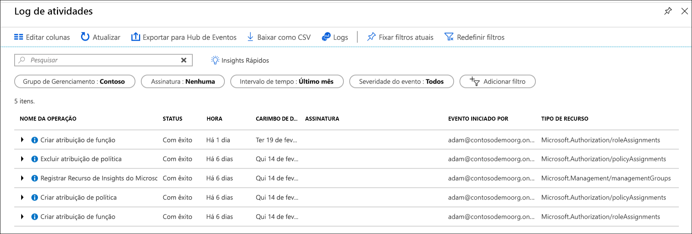

# <a name="manage-your-resources-with-management-groups"></a>Gerenciar seus recursos com grupos de gerenciamento

Se sua organização tiver muitas assinaturas, talvez seja necessária uma maneira de gerenciar com eficiência o acesso, as políticas e a conformidade dessas assinaturas. Os grupos de gerenciamento do Azure fornecem um nível de escopo acima das assinaturas. Você organiza assinaturas em contêineres chamados "grupos de gerenciamento" e aplica as condições de governança aos grupos de gerenciamento. Todas as assinaturas dentro de um grupo de gerenciamento herdam automaticamente as condições aplicadas ao grupo de gerenciamento.

Os grupos de gerenciamento fornecem gerenciamento de nível empresarial em larga escala, independentemente do tipo de assinaturas que você possa ter.  Para saber mais sobre grupos de gerenciamento, consulte [organizar seus recursos com grupos de gerenciamento do Azure](overview.md).

[!INCLUDE [GDPR-related guidance](../../../includes/gdpr-intro-sentence.md)]

[!INCLUDE [az-powershell-update](../../../includes/updated-for-az.md)]

## <a name="change-the-name-of-a-management-group"></a>Alterar o nome de um grupo de gerenciamento

Você pode alterar o nome do grupo de gerenciamento usando o portal, o PowerShell ou a CLI do Azure.

### <a name="change-the-name-in-the-portal"></a>Alterar o nome no portal

1. Faça logon no [Portal do Azure](https://portal.azure.com).

1. Selecione **Todos os serviços** > **Grupos de gerenciamento**.

1. Selecione o grupo de gerenciamento que gostaria de renomear.

1. Selecione a opção **Renomear grupo** na parte superior da página.

   

1. Quando o menu for aberto, digite o novo nome que gostaria de exibir.

   

1. Clique em **Salvar**.

### <a name="change-the-name-in-powershell"></a>Alterar o nome no PowerShell

Para atualizar o nome de exibição, use **AzManagementGroup atualização**. Por exemplo, para alterar um gerenciamento de grupos de nome de exibição de "Contoso IT" para "Contoso Group", execute o seguinte comando:

```azurepowershell-interactive
Update-AzManagementGroup -GroupName 'ContosoIt' -DisplayName 'Contoso Group'
```

### <a name="change-the-name-in-azure-cli"></a>Alterar o nome na CLI do Azure

Para a CLI do Azure, use o comando de atualização.

```azurecli-interactive
az account management-group update --name 'Contoso' --display-name 'Contoso Group'
```

## <a name="delete-a-management-group"></a>Excluir um grupo de gerenciamento

Para a exclusão de um grupo de gerenciamento, os seguintes requisitos deverão ser atendidos:

1. Não existem grupos de gerenciamento filhos ou assinaturas no grupo de gerenciamento.

   - Para mover uma assinatura de um grupo de gerenciamento, confira [Mover assinatura para outro grupo de gerenciamento](#move-subscriptions-in-the-hierarchy).

   - Para mover um grupo de gerenciamento para outro grupo de gerenciamento, consulte [Mover grupos de gerenciamento na hierarquia](#move-management-groups-in-the-hierarchy).

1. Você tem permissões de gravação no grupo de gerenciamento ("Proprietário", "Colaborador" ou "Colaborador do grupo de gerenciamento"). Para ver quais permissões você tem, selecione o grupo de gerenciamento e, em seguida, selecione **IAM**. Para saber mais sobre as funções de RBAC, consulte [Gerenciar acesso e permissões com RBAC](../../role-based-access-control/overview.md).  

### <a name="delete-in-the-portal"></a>Excluir no portal

1. Faça logon no [Portal do Azure](https://portal.azure.com).

1. Selecione **Todos os serviços** > **Grupos de gerenciamento**.

1. Selecione o grupo de gerenciamento que gostaria de excluir.

1. Selecione **Excluir**

    > [!TIP]
    > Se o ícone estiver desativado, passar o seletor de mouse sobre o ícone mostrará o motivo.

   

1. Há uma janela que abre confirmando que deseja excluir o grupo de gerenciamento.

   

1. Selecione **Sim**.

### <a name="delete-in-powershell"></a>Excluir no PowerShell

Use o **AzManagementGroup remover** comando do PowerShell para excluir grupos de gerenciamento.

```azurepowershell-interactive
Remove-AzManagementGroup -GroupName 'Contoso'
```

### <a name="delete-in-azure-cli"></a>Exclusão na CLI do Azure

Com a CLI do Azure, use o comando az account management-group delete.

```azurecli-interactive
az account management-group delete --name 'Contoso'
```

## <a name="view-management-groups"></a>Exibir grupos de gerenciamento

Você pode exibir qualquer grupo de gerenciamento no qual você tem uma função de RBAC direta ou herdada.  

### <a name="view-in-the-portal"></a>Exibir no portal

1. Faça logon no [Portal do Azure](https://portal.azure.com).

1. Selecione **Todos os serviços** > **Grupos de gerenciamento**.

1. A página de hierarquia do grupo de gerenciamento será carregado. Esta página é onde você pode explorar todos os grupos de gerenciamento e assinaturas que você tem acesso. Selecionar o nome do grupo leva você a um nível abaixo da hierarquia. A navegação funciona da mesma forma que um explorador de arquivos.

1. Para ver os detalhes do grupo de gerenciamento, selecione o link **(detalhes)** ao lado do título do grupo de gerenciamento. Se esse link não estiver disponível, você não tem permissões para exibir esse grupo de gerenciamento.

   

### <a name="view-in-powershell"></a>Exibir no PowerShell

Você pode usar o comando Get-AzManagementGroup para recuperar todos os grupos.  Ver [Az.Resources](/powershell/module/az.resources/Get-AzManagementGroup) módulos para a lista completa de gerenciamento de grupo de comandos do Powershell GET.  

```azurepowershell-interactive
Get-AzManagementGroup
```

Para obter informações de um único grupo de gerenciamento, use o parâmetro -GroupName

```azurepowershell-interactive
Get-AzManagementGroup -GroupName 'Contoso'
```

Para retornar a um grupo de gerenciamento específicos e todos os níveis da hierarquia sob ele, use **-expandir** e **-Recurse** parâmetros.  

```azurepowershell-interactive
PS C:\> $response = Get-AzManagementGroup -GroupName TestGroupParent -Expand -Recurse
PS C:\> $response

Id                : /providers/Microsoft.Management/managementGroups/TestGroupParent
Type              : /providers/Microsoft.Management/managementGroups
Name              : TestGroupParent
TenantId          : 00000000-0000-0000-0000-000000000000
DisplayName       : TestGroupParent
UpdatedTime       : 2/1/2018 11:15:46 AM
UpdatedBy         : 00000000-0000-0000-0000-000000000000
ParentId          : /providers/Microsoft.Management/managementGroups/00000000-0000-0000-0000-000000000000
ParentName        : 00000000-0000-0000-0000-000000000000
ParentDisplayName : 00000000-0000-0000-0000-000000000000
Children          : {TestGroup1DisplayName, TestGroup2DisplayName}

PS C:\> $response.Children[0]

Type        : /managementGroup
Id          : /providers/Microsoft.Management/managementGroups/TestGroup1
Name        : TestGroup1
DisplayName : TestGroup1DisplayName
Children    : {TestRecurseChild}

PS C:\> $response.Children[0].Children[0]

Type        : /managementGroup
Id          : /providers/Microsoft.Management/managementGroups/TestRecurseChild
Name        : TestRecurseChild
DisplayName : TestRecurseChild
Children    :
```

### <a name="view-in-azure-cli"></a>Exibir na CLI do Azure

Você pode usar o comando list para recuperar todos os grupos.  

```azurecli-interactive
az account management-group list
```

Para obter informações de um único grupo de gerenciamento, use o comando show

```azurecli-interactive
az account management-group show --name 'Contoso'
```

Para retornar a um grupo de gerenciamento específicos e todos os níveis da hierarquia sob ele, use **-expandir** e **-Recurse** parâmetros.

```azurecli-interactive
az account management-group show --name 'Contoso' -e -r
```

## <a name="move-subscriptions-in-the-hierarchy"></a>Mover assinaturas na hierarquia

Um motivo para criar um grupo de gerenciamento é agrupar assinaturas. Somente grupos de gerenciamento e assinaturas podem ser tornados filhos de outro grupo de gerenciamento. Uma assinatura movida para um grupo de gerenciamento herda todos os acessos de usuário e políticas do grupo de gerenciamento pai.

Para mover a assinatura, todas as permissões de RBAC a seguir precisam ser verdadeiras:

- Função de "Proprietário" na assinatura filho.
- Função "Proprietário", "Colaborador" ou "Colaborador do grupo de gerenciamento" no group.* de gerenciamento do pai de destino
- Função "Proprietário", "Colaborador" ou "Colaborador do grupo de gerenciamento" no group.* de gerenciamento pai existente

*: A menos que o destino ou o grupo de gerenciamento existente do pai é o grupo de gerenciamento raiz. Uma vez que o grupo de gerenciamento raiz é o padrão de aterrissagem especial para todos os novos grupos de gerenciamento e assinaturas, os usuários não precisam de permissões para mover um item.

Para ver quais permissões você tem no portal do Azure, selecione o gerenciamento de grupo e, em seguida, selecione **IAM**. Para saber mais sobre as funções de RBAC, consulte [Gerenciar acesso e permissões com RBAC](../../role-based-access-control/overview.md).

### <a name="move-subscriptions-in-the-portal"></a>Mover assinaturas no portal

#### <a name="add-an-existing-subscription-to-a-management-group"></a>Adicionar uma assinatura existente a um grupo de gerenciamento

1. Faça logon no [Portal do Azure](https://portal.azure.com).

1. Selecione **Todos os serviços** > **Grupos de gerenciamento**.

1. Selecione o grupo de gerenciamento o qual planeja que seja o pai.

1. Na parte superior da página, selecione **Adicionar assinatura**.

1. Selecione a assinatura na lista com a ID correta.

   

1. Selecione "Salvar".

#### <a name="remove-a-subscription-from-a-management-group"></a>Remover uma assinatura de um grupo de gerenciamento

1. Faça logon no [Portal do Azure](https://portal.azure.com).

1. Selecione **Todos os serviços** > **Grupos de gerenciamento**.

1. Selecione o grupo de gerenciamento que você está planejando que é o pai atual.  

1. Selecione a elipse no final da linha da assinatura na lista que você deseja mover.

   

1. Selecione **Mover**.

1. No menu aberto, selecione o **Grupo de gerenciamento pai**.

   

1. Clique em **Salvar**.

### <a name="move-subscriptions-in-powershell"></a>Mover assinaturas no PowerShell

Para mover uma assinatura no PowerShell, você deve usar o comando New-AzManagementGroupSubscription.  

```azurepowershell-interactive
New-AzManagementGroupSubscription -GroupName 'Contoso' -SubscriptionId '12345678-1234-1234-1234-123456789012'
```

Para remover o vínculo entre a assinatura e o grupo de gerenciamento, use o comando de Remove-AzManagementGroupSubscription.

```azurepowershell-interactive
Remove-AzManagementGroupSubscription -GroupName 'Contoso' -SubscriptionId '12345678-1234-1234-1234-123456789012'
```

### <a name="move-subscriptions-in-azure-cli"></a>Mover assinaturas na CLI do Azure

Para mover uma assinatura na CLI, use o comando add.

```azurecli-interactive
az account management-group subscription add --name 'Contoso' --subscription '12345678-1234-1234-1234-123456789012'
```

Para remover a assinatura do grupo de gerenciamento, use o comando subscription remove.  

```azurecli-interactive
az account management-group subscription remove --name 'Contoso' --subscription '12345678-1234-1234-1234-123456789012'
```

## <a name="move-management-groups-in-the-hierarchy"></a>Mover grupos de gerenciamento na hierarquia  

Quando você move um grupo de gerenciamento pai, a hierarquia de grupo será movido com ele.

### <a name="move-management-groups-in-the-portal"></a>Mover grupos de gerenciamento no portal

1. Faça logon no [Portal do Azure](https://portal.azure.com).

1. Selecione **Todos os serviços** > **Grupos de gerenciamento**.

1. Selecione o grupo de gerenciamento o qual planeja que seja o pai.

1. Na parte superior da página, selecione **Adicionar grupo de gerenciamento**.

1. No menu que será aberto, selecione se deseja usar um grupo de gerenciamento novo ou existente.

   - A seleção de um novo criará um novo grupo de gerenciamento.
   - A seleção de um existente apresentará uma lista suspensa de todos os grupos de gerenciamento que você pode mover para esse grupo de gerenciamento.  

   

1. Clique em **Salvar**.

### <a name="move-management-groups-in-powershell"></a>Mover grupos de gerenciamento no PowerShell

Use o comando de atualização AzManagementGroup no PowerShell para mover um grupo de gerenciamento em um grupo diferente.

```azurepowershell-interactive
Update-AzManagementGroup -GroupName 'Contoso' -ParentId '/providers/Microsoft.Management/managementGroups/ContosoIT'
```  

### <a name="move-management-groups-in-azure-cli"></a>Mover grupos de gerenciamento na CLI do Azure

Use o comando update para mover um grupo de gerenciamento com a CLI do Azure.

```azurecli-interactive
az account management-group update --name 'Contoso' --parent-id '/providers/Microsoft.Management/managementGroups/ContosoIT'
```

## <a name="audit-management-groups-using-activity-logs"></a>Auditar grupos de gerenciamento usando logs de atividades

Os grupos de gerenciamento são compatíveis com o [Log de atividades do Azure](../../azure-monitor/platform/activity-logs-overview.md). Você pode consultar todos os eventos que ocorrem para um grupo de gerenciamento no mesmo local central que outros recursos do Azure.  Por exemplo, você pode ver todas as alterações de atribuições de função ou de política feitas em um grupo de gerenciamento específico.



Ao analisar a consulta em grupos de gerenciamento fora do portal do Azure, o escopo de destino dos grupos de gerenciamento é semelhante a **"/providers/Microsoft.Management/managementGroups/{yourMgID}"**.

## <a name="referencing-management-groups-from-other-resource-providers"></a>Fazendo referência a grupos de gerenciamento de outros provedores de recursos

Ao fazer referência a grupos de gerenciamento de ações do outro provedor de recursos, use o caminho a seguir como o escopo. Esse caminho é usado ao usar o PowerShell, CLI do Azure e APIs REST.  

>"/providers/Microsoft.Management/managementGroups/{yourMgID}"

Um exemplo de como usar esse caminho é ao atribuir uma nova atribuição de função a um grupo de gerenciamento no PowerShell

```azurepowershell-interactive
New-AzRoleAssignment -Scope "/providers/Microsoft.Management/managementGroups/Contoso"
```

O mesmo caminho de escopo é usado ao recuperar uma definição de política em um grupo de gerenciamento.

```http
GET https://management.azure.com/providers/Microsoft.Management/managementgroups/MyManagementGroup/providers/Microsoft.Authorization/policyDefinitions/ResourceNaming?api-version=2018-05-01
```

## <a name="next-steps"></a>Próximas etapas

Para saber mais sobre grupos de gerenciamento, consulte:

- [Criar grupos de gerenciamento para organizar recursos do Azure](create.md)
- [Como alterar, excluir ou gerenciar seus grupos de gerenciamento](manage.md)
- [Grupos de gerenciamento de análise no módulo de recursos do Azure PowerShell](/powershell/module/az.resources#resources)
- [Grupos de gerenciamento de análise na API REST](/rest/api/resources/managementgroups)
- [Grupos de gerenciamento de análise na CLI do Azure](/cli/azure/account/management-group)