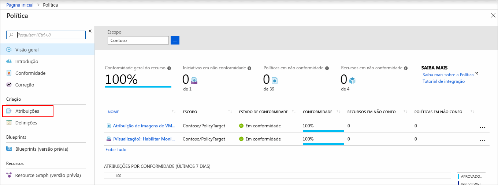
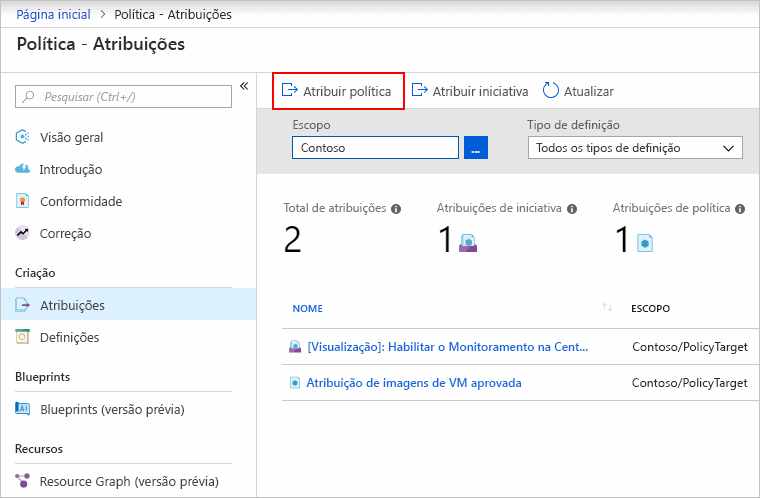
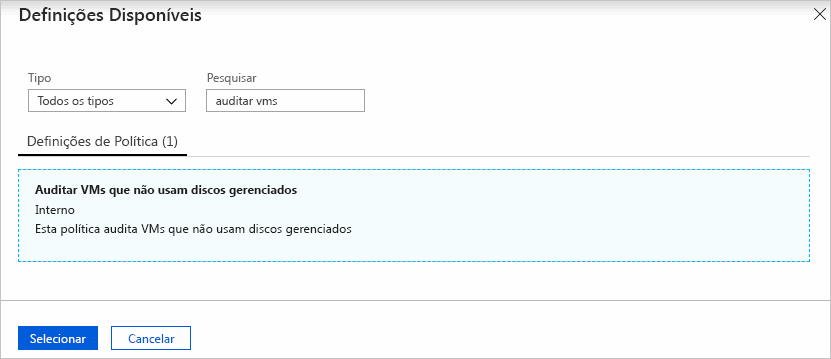
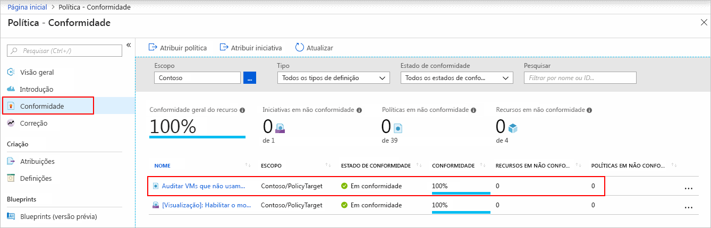

# Criar uma atribuição de política para identificar recursos sem conformidade

A primeira etapa para compreender a conformidade no Azure é identificar o status de seus recursos.
Este guia de início rápido orienta você no processo de criação de uma atribuição de política para identificar máquinas virtuais que não estão usando discos gerenciados.

No final deste processo, você identificará com êxito quais máquinas virtuais não estão usando discos gerenciados. Eles *não estão em conformidade* com a atribuição da política.

Se você não tiver uma assinatura do Azure, crie uma conta [gratuita](https://azure.microsoft.com/free/) antes de começar.

## Criar uma atribuição de política

Neste guia de início rápido, crie uma atribuição de política e atribua a definição de política *Auditar VMs que não usam discos gerenciados*.

1. Inicie o serviço de Azure Policy no portal do Azure clicando em**Todos os serviços**, em seguida pesquisando e selecionando **Política**.

   

1. Selecione **Atribuições** no lado esquerdo da página de Política do Azure. Uma atribuição é uma política que foi atribuída para entrar em vigor em um escopo específico.

   

1. Selecione **Atribuir Política** na parte superior da página **Política - Atribuições**.

   

1. Na página **Atribuir Política**, selecione o **Escopo** clicando no botão de reticências e selecionando uma assinatura ou então um grupo de gerenciamento. Opcionalmente, selecione um grupo de recursos. Um escopo determina em quais recursos ou agrupamento de recursos a atribuição de política é imposta.  Em seguida, clique em **Selecionar** na parte inferior da página **Escopo**.

   Este exemplo usa a assinatura da **Contoso**. Sua assinatura será diferente.

1. Recursos que podem ser excluídos com base no **Escopo**.  **Exclusões** começam um nível abaixo do **Escopo**. **Exclusões** são opcionais, então deixe-as em branco por enquanto.

1. Selecione a reticências **Definição de política** para abrir a lista de definições. O Azure Policy vem com definições de políticas internas que você pode usar. Há muitas disponíveis, por exemplo:

   - Impor marca e seu valor
   - Aplicar marca e seu valor
   - Requer o SQL Server versão 12.0

   Para uma lista parcial de políticas internas disponíveis, confira [Exemplos de política](./samples/index.md).

1. Pesquise a lista de definições de política para encontrar a definição *Auditar VMs que não usam discos gerenciados*. Clique na política e clique em **Selecionar**.

   

1. O **Nome da atribuição** é automaticamente preenchido com o nome da política selecionada, mas você pode alterá-lo. Neste exemplo, deixe *Auditar VMs que não usam discos gerenciados*. Você também pode adicionar uma **Descrição**opcional. A descrição fornece detalhes sobre essa atribuição de política. **Atribuído por** preencherá automaticamente com base em quem está conectado. Esse campo é opcional, portanto, valores personalizados podem ser inseridos.

1. Deixe a opção **Criar uma identidade gerenciada** desmarcada. Esta caixa _precisa_ ser marcada quando a política ou iniciativa inclui uma política com o efeito [deployIfNotExists](./concepts/effects.md#deployifnotexists). Já que esse não é o caso da política usada para este início rápido, deixe essa opção em branco. Para obter mais informações, confira [identidades gerenciadas](../../active-directory/managed-identities-azure-resources/overview.md) e [como funciona a segurança de correção](./how-to/remediate-resources.md#how-remediation-security-works).

1. Clique em **Atribuir**.

Agora, você está pronto para identificar recursos sem conformidade para compreender o estado de conformidade de seu ambiente.

## Identificar recursos sem conformidade

Selecione **Conformidade** no lado esquerdo da página. Em seguida, localize as **VMs de auditoria que não usam a atribuição de política de discos gerenciados** que você criou.

Se houver recursos sem conformidade com essa nova atribuição, eles aparecerão em **Recursos sem conformidade**.

Quando uma condição é avaliada em relação a seus recursos existentes e resulta ser verdadeira, então esses recursos são marcados como em não conformidade com a política. A tabela a seguir mostra como os diferentes efeitos da política funcionam com a avaliação da condição para o estado de conformidade resultante: Embora você não veja a lógica de avaliação no portal do Azure, os resultados do estado de conformidade são mostrados. O resultado do estado de conformidade pode ser ou compatível ou incompatível.

| **Estado do recurso** | **Efeito** | **Avaliação da política** | **Estado de conformidade** |
| --- | --- | --- | --- |
| Exists | Negar, Auditoria, Acrescentar\*, DeployIfNotExist\*, AuditIfNotExist\* | True | Sem conformidade |
| Exists | Negar, Auditoria, Acrescentar\*, DeployIfNotExist\*, AuditIfNotExist\* | Falso | Em conformidade |
| Novo | Auditoria, AuditIfNotExist\* | True | Sem conformidade |
| Novo | Auditoria, AuditIfNotExist\* | Falso | Em conformidade |

\* Os efeitos de Acrescentar, DeployIfNotExist e AuditIfNotExist exigem que a instrução IF seja TRUE. Os efeitos também exigem que a condição de existência seja FALSE para não estar em conformidade. Quando TRUE, a condição IF dispara a avaliação da condição de existência para os recursos relacionados.

## Limpar recursos

Para remover a atribuição criada, siga estas etapas:

1. Selecione **Conformidade** (ou **Atribuições**) no lado esquerdo da página e localize as **VMs de auditoria que não usam a atribuição  de política de discos gerenciados** que você criou.

1. Clique com o botão direito na atribuição de política de **VMs de auditoria que não usam discos gerenciados** e selecione **Excluir atribuição**

   

## Próximas etapas

Neste guia de início rápido, você atribuiu uma definição de política para um escopo e avaliou seu relatório de conformidade. A definição de política valida que todos os recursos no escopo estão em conformidade e identifica quais não estão.

Para saber mais sobre a atribuição de políticas para validar que novos recursos estejam em conformidade, continue com o tutorial para:

> [!div class="nextstepaction"]
> [Criando e gerenciando políticas](./tutorials/create-and-manage.md)