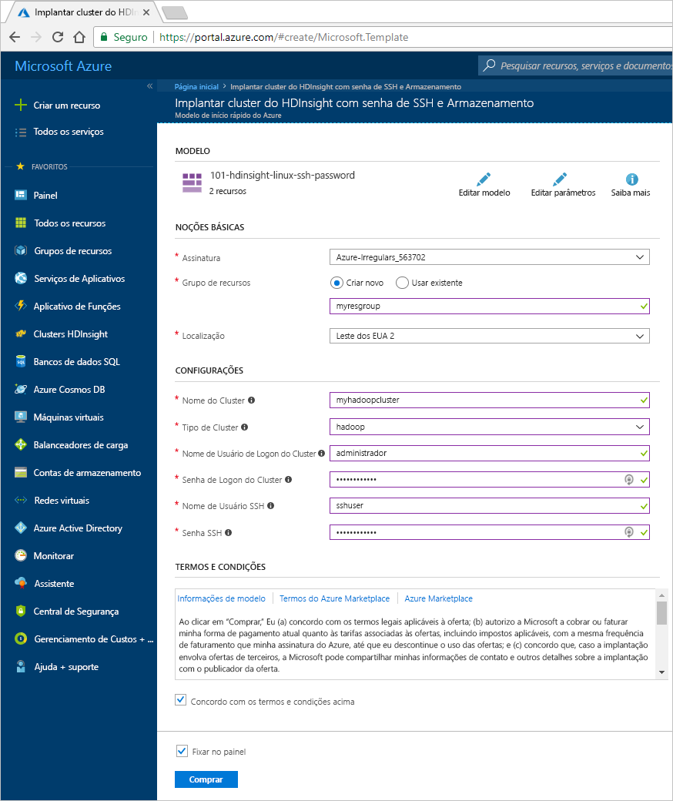
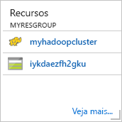

# Início Rápido: Introdução ao Hadoop e ao Hive no Azure HDInsight usando um modelo do Resource Manager

Neste artigo, você aprenderá a criar clusters [Hadoop](http://hadoop.apache.org/) no HDInsight usando um modelo do Resource Manager e, depois, executar trabalhos do Hive no HDInsight. A maioria dos trabalhos de Hadoop consiste em trabalhos em lotes. Criar um cluster, executar alguns trabalhos e excluir o cluster. Neste artigo, você deve executar as três tarefas.

Neste início rápido, você usará um modelo do Resource Manager para criar um cluster Hadoop do HDInsight. Você também pode criar um cluster usando o [Portal do Azure](apache-hadoop-linux-create-cluster-get-started-portal.md).

Atualmente, o HDInsight vem com [sete tipos diferentes de cluster](./apache-hadoop-introduction.md#cluster-types-in-hdinsight). Cada tipo de cluster dá suporte a um conjunto diferente de componentes. Todos os tipos de cluster dão suporte ao Hive. Para obter uma lista de componentes com suporte no HDInsight, confira [Novidades nas versões de cluster Hadoop fornecidas pelo HDInsight?](../hdinsight-component-versioning.md)  

Se você não tiver uma assinatura do Azure, [crie uma conta gratuita](https://azure.microsoft.com/free/) antes de começar.

## Criar um cluster Hadoop

Nesta seção, você criará um cluster Hadoop no HDInsight usando um modelo do Azure Resource Manager. Não é necessário ter experiência com o modelo do Resource Manager para acompanhar este artigo. 

1. Clique no botão **Implantar no Azure** abaixo para entrar no Azure e abra o modelo do Resource Manager no portal do Azure. 
   
    

2. Insira ou selecione os valores, conforme sugerido na captura de tela a seguir:

    > [!NOTE]
    > Os valores fornecidos devem ser exclusivos e seguir as diretrizes de nomenclatura. O modelo não executa verificações de validação. Se os valores que você fornecer já estiverem em uso ou não seguirem as diretrizes, você receberá um erro após o envio do modelo.       
    > 
    >
    
    

    Digite ou selecione os valores a seguir:
    
    |Propriedade  |DESCRIÇÃO  |
    |---------|---------|
    |**Assinatura**     |  Selecione sua assinatura do Azure. |
    |**Grupo de recursos**     | Crie um grupo de recursos ou selecione um grupo de recursos existente.  Um grupo de recursos é um contêiner de componentes do Azure.  Nesse caso, o grupo de recursos contém o cluster HDInsight e a conta de Armazenamento do Azure dependente. |
    |**Local**     | Selecione um local do Azure no qual você deseja criar o cluster.  Escolha um local mais próximo a você para obter melhor desempenho. |
    |**Tipo de cluster**     | Selecione **hadoop**. |
    |**Nome do cluster**     | Insira um nome para o cluster Hadoop. Como todos os clusters no HDInsight compartilham o mesmo namespace DNS esse nome precisa ser exclusivo. O nome pode ter até 59 caracteres incluindo letras, números e hifens. O primeiro e último caracteres do nome não podem ser hifens. |
    |**Nome e senha de logon do cluster**     | O nome padrão de logon é **admin**. A senha deve ter no mínimo 10 caracteres e deve conter pelo menos um dígito, uma letra maiúscula, uma minúscula e um caractere não alfanumérico (exceto os caracteres ' " ` \). **Não forneça** senhas comuns, como "Pass@word1".|
    |**Nome de usuário e senha SSH**     | O nome de usuário padrão é **sshuser**.  Você pode renomear o nome de usuário SSH.  A senha de usuário SSH tem os mesmos requisitos que a senha de logon do cluster.|
       
    Algumas propriedades foram inseridas no código do modelo.  Você pode configurar esses valores do modelo. Para obter mais explicação sobre essas propriedades, confira [Criar clusters Hadoop no HDInsight](../hdinsight-hadoop-provision-linux-clusters.md).

3. Selecione **Concordo com os termos e condições declarados acima** e **Fixar no painel**, depois selecione **Comprar**. Você verá um novo bloco chamado **Enviando a implantação** no painel do portal. Demora cerca de 20 minutos para criar um cluster.

    

4. Depois que o cluster for criado, a legenda do bloco será alterada para o nome do grupo de recursos especificado. O bloco também lista o cluster HDInsight criado dentro do grupo de recursos. 
   
    
    
5. O bloco também lista o armazenamento padrão associado ao cluster. Cada cluster tem uma dependência na [conta de Armazenamento do Azure](../hdinsight-hadoop-use-blob-storage.md) ou [conta do Azure Data Lake](../hdinsight-hadoop-use-data-lake-store.md). Ela é conhecida como a conta de armazenamento padrão. O cluster HDInsight e sua conta de armazenamento padrão devem estar colocalizados na mesma região do Azure. A exclusão dos clusters não exclui a conta de armazenamento.
    

> [!NOTE]
> Para obter outros métodos de criação de cluster e Noções básicas sobre as propriedades usadas neste tutorial, confira [Criar clusters do HDInsight](../hdinsight-hadoop-provision-linux-clusters.md).       
> 
>

## Execute consultas Hive

[Apache Hive](hdinsight-use-hive.md) é o componente mais popular usado no HDInsight. Há várias maneiras de executar trabalhos do Hive no HDInsight. Neste tutorial, você usará o modo de exibição do Ambari Hive no portal. Para obter outros métodos para enviar trabalhos do Hive, confira [Usar o Hive no HDInsight](hdinsight-use-hive.md).

1. Para abrir o Ambari, na captura de tela anterior, selecione **Painel do Cluster**.  Você também pode navegar até **https://&lt;NomeDoCluster>.azurehdinsight.net**, em que &lt;NomeDoCluster> é o cluster que você criou na seção anterior.

    

2. Insira o nome de usuário e a senha do Hadoop que você especificou durante a criação do cluster. O nome de usuário padrão é **admin**.

3. Abra a **Exibição do Hive** , conforme mostrado na seguinte captura de tela:
   
    

4. Na guia **CONSULTA**, cole as seguintes instruções HiveQL na planilha:
   
        SHOW TABLES;

    
   
   > [!NOTE]
   > O ponto-e-vírgula é obrigatório para o Hive.       
   > 
   > 

5. Selecione **Executar**. Uma guia **RESULTADOS** aparece abaixo da guia **CONSULTA** e exibe informações sobre o trabalho. 
   
    Após a conclusão da consulta, a guia **CONSULTA** exibirá os resultados da operação. Você deverá ver uma tabela chamada **hivesampletable**. Essa tabela do Hive de exemplo é fornecida com todos os clusters HDInsight.
   
    

6. Repita as etapas 4 e 5 para executar a seguinte consulta:
   
        SELECT * FROM hivesampletable;
   
7. Você também pode salvar os resultados da consulta. Selecione o botão de menu à direita e especifique se deseja baixar os resultados como um arquivo CSV ou armazená-los na conta de armazenamento associada ao cluster.

    

Depois de concluir um trabalho do Hive, você pode [exportar os resultados para o banco de dados SQL Azure ou do SQL Server](apache-hadoop-use-sqoop-mac-linux.md). Também pode [visualizar os resultados usando o Excel](apache-hadoop-connect-excel-power-query.md). Para obter mais informações sobre como usar o Hive no HDInsight, confira [Usar o Hive e o HiveQL com o Hadoop no HDInsight para analisar um arquivo log4j do Apache de exemplo](hdinsight-use-hive.md).

## Solucionar problemas

Se você tiver problemas com a criação de clusters HDInsight, confira os [requisitos de controle de acesso](../hdinsight-administer-use-portal-linux.md#create-clusters).

## Limpar recursos
Após a conclusão do artigo, convém excluir o cluster. Com o HDInsight, seus dados são armazenados no Armazenamento do Azure, assim você poderá excluir, com segurança, um cluster quando ele não estiver em uso. Você também é cobrado por um cluster HDInsight, mesmo quando ele não está em uso. Como os encargos para o cluster são muitas vezes maiores do que os encargos para armazenamento, faz sentido, do ponto de vista econômico, excluir os clusters quando não estiverem em uso. 

> [!NOTE]
> Se você for prosseguir *imediatamente* no próximo tutorial para saber como executar operações de ETL usando Hadoop no HDInsight, convém manter o cluster em execução. Isso porque, no tutorial, você precisa criar um cluster Hadoop novamente. No entanto, se você não for conferir o próximo tutorial imediatamente, exclua o cluster agora.
> 
> 

**Para excluir o cluster e/ou a conta de armazenamento padrão**

1. Volte para a guia do navegador onde você tem o portal do Azure. Você deve estar na página de visão geral do cluster. Se você quiser apenas excluir o cluster, mas manter a conta de armazenamento padrão, selecione **Excluir**.

    

2. Se você quiser excluir o cluster, bem como a conta de armazenamento padrão, selecione o nome do grupo de recursos (realçado na captura de tela anterior) para abrir a página do grupo de recursos.

3. Selecione **Excluir grupo de recursos** para excluir o grupo de recursos, que contém o cluster e a conta de armazenamento padrão. Observe que a exclusão do grupo de recursos exclui a conta de armazenamento. Para manter a conta de armazenamento, exclua apenas o cluster.

## Próximas etapas
Neste artigo, você aprendeu a criar um cluster HDInsight baseado em Linux usando um modelo do Resource Manager e a executar consultas básicas do Hive. No próximo artigo, saiba como executar uma operação de ETL (extração, transformação e carregamento) usando o Hadoop no HDInsight.

> [!div class="nextstepaction"]
>[Extrair, transformar e carregar dados usando o Apache Hive no HDInsight](../hdinsight-analyze-flight-delay-data-linux.md)

Se você estiver pronto para começar a trabalhar com seus próprios dados e precisa saber mais sobre como o HDInsight armazena dados ou obtém dados no HDInsight, consulte os seguintes artigos:

* Para saber mais sobre como o HDInsight usa o Armazenamento do Azure, veja [Usar Armazenamento do Azure com o HDInsight](../hdinsight-hadoop-use-blob-storage.md).
* Para obter informações sobre como carregar arquivos no HDInsight, consulte [Carregar dados no HDInsight](../hdinsight-upload-data.md).

Para saber mais sobre como analisar dados com o HDInsight, consulte os seguintes artigos:

* Para saber mais sobre como usar o Hive com HDInsight, inclusive como executar consultas de Hive do Visual Studio, consulte [Usar o Hive com HDInsight](hdinsight-use-hive.md).
* Para saber mais sobre o Pig, uma linguagem usada para transformar dados, consulte [Usar o Pig com o HDInsight](hdinsight-use-pig.md).
* Para saber mais sobre o MapReduce, uma maneira de gravar programas que processam dados no Hadoop, consulte [Usar o MapReduce com HDInsight](hdinsight-use-mapreduce.md).
* Para saber mais sobre como usar as Ferramentas do HDInsight para o Visual Studio para analisar dados no HDInsight, consulte [Introdução às ferramentas do Hadoop do Visual Studio para o HDInsight](apache-hadoop-visual-studio-tools-get-started.md).

Se você quiser saber mais sobre como criar ou gerenciar um cluster HDInsight, consulte os seguintes artigos:

* Para saber mais sobre como gerenciar o cluster HDInsight baseado em Linux, consulte [Gerenciar clusters HDInsight usando o Ambari](../hdinsight-hadoop-manage-ambari.md).
* Para saber mais sobre as opções que você pode selecionar ao criar um cluster HDInsight, confira [Como criar o HDInsight no Linux usando opções personalizadas](../hdinsight-hadoop-provision-linux-clusters.md).

[1]: ../HDInsight/apache-hadoop-visual-studio-tools-get-started.md

[hdinsight-provision]: hdinsight-provision-linux-clusters.md
[hdinsight-upload-data]: hdinsight-upload-data.md
[hdinsight-use-hive]: hdinsight-use-hive.md
[hdinsight-use-pig]: hdinsight-use-pig.md

