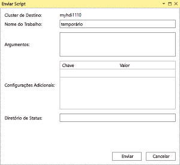
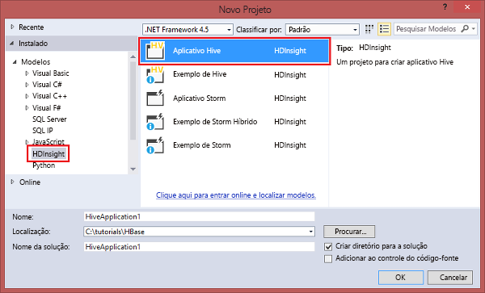

# Conectar-se ao Azure HDInsight e executar consultas Hive usando Ferramentas do Data Lake para Visual Studio

Saiba como usar as Ferramentas do Data Lake para Visual Studio para se conectar a clusters Hadoop no [Azure HDInsight](apache-hadoop-introduction.md) e enviar consultas Hive. Para obter mais informações sobre como usar o HDInsight, consulte [Introdução ao HDInsight](apache-hadoop-introduction.md) e [Começar a usar o HDInsight](apache-hadoop-linux-tutorial-get-started.md). Para obter mais informações sobre como se conectar ao cluster Storm, consulte [Desenvolver topologias C# para Apache Storm no HDInsight usando o Visual Studio](../storm/apache-storm-develop-csharp-visual-studio-topology.md).

As Ferramentas do Data Lake para Visual Studio podem ser usadas para acessar Data Lake Analytics e HDInsight.  Para obter informações sobre as Ferramentas do Data Lake, confira [Tutorial: desenvolver scripts U-SQL usando as Ferramentas do Data Lake para Visual Studio](../../data-lake-analytics/data-lake-analytics-data-lake-tools-get-started.md).

**Pré-requisitos**

Para concluir este tutorial e usar as ferramentas do Data Lake no Visual Studio, você precisará do seguinte:

* Um cluster Azure HDInsight: para criar um, confira [Começar a usar o HDInsight baseado em Linux](apache-hadoop-linux-tutorial-get-started.md)
* Uma estação de trabalho com o seguinte software:
  
  * Windows 10, Windows 8.1, Windows 8, ou Windows 7.
  * Visual Studio 2013/2015/2017.
    
    > [!NOTE]
    > Atualmente, as ferramentas do Data Lake para Visual Studio são fornecidas apenas na versão em inglês.
    > 
    > 

## Instalar Ferramentas do Data Lake para Visual Studio

As Ferramentas do Data Lake estão instaladas por padrão no Visual Studio 2017. Em versões antigas, você pode instalá-las usando o [Web Platform Installer](https://www.microsoft.com/web/downloads/). Você deve escolher aquela que corresponde à sua versão do Visual Studio. Se não tiver instalado o Visual Studio, você poderá instalar a mais recente Visual Studio Community e o SDK do Azure usando o [Web Platform Installer](https://www.microsoft.com/web/downloads/):

![Web Platforms installer de Ferramentas do Data Lake para Visual Studio.] (./media/apache-hadoop-visual-studio-tools-get-started/hdinsight.visual.studio.tools.wpi.png "Use o Web Platform Installer para instalar as Ferramentas do Data Lake para Visual Studio")

## Conectar-se a assinaturas do Azure
As ferramentas do Data Lake para Visual Studio permitem que você se conecte a clusters HDInsight, execute algumas operações básicas de gerenciamento e execute consultas Hive.

> [!NOTE]
> Para obter informações sobre como se conectar a um cluster Hadoop genérico, confira [escrever e enviar consultas Hive usando o Visual Studio](http://blogs.msdn.com/b/xiaoyong/archive/2015/05/04/how-to-write-and-submit-hive-queries-using-visual-studio.aspx).
> 
> 

**Para conectar-se à sua assinatura do Azure**

1. Abra o Visual Studio.
2. No menu **Exibir**, clique em **Gerenciador de Servidores** para abrir a janela Gerenciador de Servidores.
3. Expanda **Azure** e expanda **HDInsight**.
   
   > [!NOTE]
   > Observe se a janela **lista de tarefas do HDInsight** está aberta. Se não estiver, clique em **Outras Janelas** no menu **Exibição** e clique na **Janela de Lista de Tarefas do HDInsight** para abri-la.  
   > 
   > 
4. Insira as credenciais de assinatura do Azure e clique em **Entrar**. Isso só será necessário se você nunca se conectou à assinatura do Azure pelo Visual Studio nesta estação de trabalho.
5. No Gerenciador de Servidores, você verá uma lista de clusters existentes do HDInsight. Se não tiver nenhum cluster, você poderá criar um usando o portal do Azure, o Azure PowerShell ou o SDK do HDInsight. Para saber mais, veja [Criar clusters HDInsight](../hdinsight-hadoop-provision-linux-clusters.md).
   
   
6. Expanda um cluster do HDInsight. Você verá **Bancos de Dados do Hive**, uma conta de armazenamento padrão, contas de armazenamento vinculadas e o **Log de Serviço do Hadoop**. Você pode expandir mais as entidades.

Depois de se conectar à assinatura do Azure, você poderá fazer o seguinte:

**Conectar-se ao portal do Azure pelo Visual Studio**

* No Gerenciador de Servidores, expanda **Azure** > **HDInsight**, clique com o botão direito do mouse em um cluster do HDInsight e clique em **Gerenciar Cluster no Portal do Azure**.

**Para fazer perguntas e comentários sobre o Visual Studio**

* No menu **Ferramentas**, clique em **HDInsight** e clique em **Fórum do MSDN** para fazer perguntas ou clique em **Fazer Comentários**.

## Navegue nos recursos vinculados
No Gerenciador de Servidores, pode-se visualizar a conta de armazenamento padrão e quaisquer contas de armazenamento vinculadas. Se você expandir a conta de armazenamento padrão, visualizará os contêineres na conta de armazenamento. Tanto a conta de armazenamento padrão como o contêiner padrão estão marcados. Também é possível clicar com botão direito do mouse em qualquer um dos contêineres para ver o conteúdo.

Depois de abrir um contêiner, você poderá usar os botões abaixo para carregar, excluir e baixar blobs:

## Executar um trabalho do Hive
O [Apache Hive](http://hive.apache.org) é uma infraestrutura de data warehouse de dados criado com base no Hadoop para fornecer resumo de dados, consultas e análises. As ferramentas do Data Lake para o Visual Studio dão suporte às consultas Hive em execução do Visual Studio. Para obter mais informações sobre o Hive, consulte [Usar o Hive com o HDInsight](hdinsight-use-hive.md).

Leva tempo testar o script do Hive em um cluster HDInsight. Pode levar vários minutos ou mais. As Ferramentas do Data Lake para Visual Studio podem validar o script do Hive localmente sem se conectar a um cluster ativo.

As Ferramentas do Data Lake para Visual Studio também permitem que os usuários vejam o que há dentro do trabalho do Hive coletando e identificando os logs do YARN de determinados trabalhos do Hive.

### Exibir a tabela **hivesampletable**
Todos os clusters HDInsight são fornecidos com uma tabela Hive de exemplo chamada *hivesampletable*. Usaremos esta tabela para mostrar como listar tabelas Hive, exibir os esquemas de tabela e listar as linhas da tabela Hive.

**Listar tabelas Hive e exibir o esquema da tabela Hive**

1. Em **Gerenciador de Servidores**, expanda **Azure** > **HDInsight** > o cluster de sua escolha > **Bancos de dados do Hive** > **Padrão** > **hivesampletable** para ver o esquema da tabela.
2. Clique com o botão direito do mouse em **hivesampletable** e clique em **Exibir as 100 primeiras linhas** para listá-las. É o equivalente a executar a seguinte consulta Hive usando o driver ODBC do Hive:
   
     SELECT * FROM hivesampletable LIMIT 100
   
   É possível personalizar a contagem de linhas.
   
   

### Criar tabelas Hive
É possível usar a GUI para criar uma tabela Hive ou usar consultas Hive. Para obter informações sobre como usar consultas de Hive, consulte [Executar consultas Hive](#run.queries).

**Para criar uma tabela Hive**

1. No **Gerenciador de Servidores**, expanda **Azure** > **Clusters HDInsight**, um cluster do HDInsight > **Bancos de dados Hive**, clique com o botão direito do mouse em **Padrão** e clique em **Criar Tabela**.
2. Configure a tabela.
3. Clique em **Criar Tabela** para enviar o trabalho para a criação de uma nova tabela Hive.
   
    

### Validar e executar consultas do Hive
Há duas maneiras de criar e executar consultas Hive:

* Criar consultas locais
* Criar um aplicativo Hive

**Para criar, validar e executar consultas locais**

1. No **Gerenciador de Servidores**, expanda **Azure** e expanda **Clusters HDInsight**.
2. Clique com o botão direito do mouse no cluster em que você deseja executar a consulta e, em seguida, clique em **Escrever uma consulta Hive**.
3. Digite as consultas Hive. Observe que o editor Hive dá suporte a IntelliSense. Agora as Ferramentas do Data Lake para Visual Studio dão suporte à obtenção de metadados remotos quando você edita o script do Hive. Por exemplo, quando você digitar "SELECT * FROM", o IntelliSense listará todos os nomes de tabela sugeridos. Quando um nome de tabela for especificado, os nomes de coluna serão listados pelo IntelliSense. As ferramentas dão suporte a quase todas as instruções DML Hive, subconsultas e UDFs internos.
   
    
   
    
   
   > [!NOTE]
   > Apenas os metadados dos clusters selecionados na barra de ferramentas de HDInsight serão sugeridos.
   > 
   > 
4. (Opcional): clique em **Validar Script** para verificar os erros de sintaxe do script.
   
    
5. Clique em **Enviar** ou **Enviar (Avançado)**. Com a opção de envio avançado, você configurará **Nome do Trabalho**, **Argumentos**, **Configurações Adicionais** e **Diretório de Status** do script:
   
    
   
    Depois de enviar o trabalho, é possível ver uma janela **Resumo de Trabalhos do Hive** .
   
    
6. Use o botão **Atualizar** para atualizar o status até que o status do trabalho seja alterado para **Concluído**.
7. Clique nos links na parte inferior para ver **Consulta de Trabalho**, **Saída de Trabalho**, **Log do Trabalho** ou **Log do Yarn**.

**Para criar e executar uma solução de Hive**

1. No menu **ARQUIVO**, clique em **Novo** e em **Projeto**.
2. Selecione **HDInsight** no painel esquerdo, selecione **Aplicativo Hive** no painel do meio, insira as propriedades e clique em **OK**.
   
    
3. No **Gerenciador de Soluções**, clique duas vezes em **Script.hql** para abri-lo.
4. Para validar o script do Hive, você pode clicar no botão **Validar Script** ou clicar com o botão direito do mouse no editor do Hive e clicar em **Validar Script** no menu de contexto.

### Exibir trabalhos Hive
Você pode exibir consultas de trabalho, saída do trabalho, logs de trabalho e logs do Yarn para trabalhos do Hive. Para obter mais informações, consulte a captura de tela anterior.

A versão mais recente das ferramentas permite que você veja o que está dentro de trabalhos do Hive coletando e identificando logs do YARN. Um log do YARN pode ajudar você investigar problemas de desempenho. Para obter mais informações sobre como o HDInsight coleta logs do YARN, veja [Acessar Logs de Aplicativo do HDInsight Programaticamente](../hdinsight-hadoop-access-yarn-app-logs.md).

**Para exibir os trabalhos Hive**

1. No **Gerenciador de Servidores**, expanda**Azure** e expanda **HDInsight**.
2. Clique com o botão direito do mouse em um cluster HDInsight e em **Exibir Trabalhos**. Você verá uma lista dos trabalhos do Hive executados no cluster.
3. Clique em um trabalho na lista de trabalhos para selecioná-lo e use a janela **Resumo do Trabalho do Hive** para abrir **Consulta do Trabalho**, **Saída do Trabalho**, **Log do Trabalho** ou **Log do Yarn**.
   
    

### Execução do Hive de caminho mais rápido via HiveServer2
> [!NOTE]
> Este tutorial funciona com o cluster HDInsight versão 3.2 e mais recentes.
> 
> 

As ferramentas do Data Lake usadas para enviar trabalhos Hive via [WebHCat](https://cwiki.apache.org/confluence/display/Hive/WebHCat) (também conhecido como Templeton). Demorou muito tempo para retornar informações de erro e detalhes do trabalho.
Para resolver esse problema de desempenho, as Ferramentas do Data Lake executam trabalhos do Hive diretamente no cluster por meio do HiveServer2 para que ele ignore RDP/SSH.
Além de melhorar o desempenho, os usuários também podem exibir o Hive em gráficos Tez e os detalhes da Tarefa.

Para o cluster HDInsight versão 3.2 ou posterior, você pode ver um botão **Executar via HiveServer2**:

E você poderá ver os logs transmitidos em tempo real e ver os gráficos de trabalho se a consulta do Hive for executada no Tez.

**Diferença entre executar consultas por meio do HiveServer2 e enviar consultas por meio do WebHCat**

Embora a execução de consultas por meio do HiveServer2 traga muitos benefícios de desempenho, ela tem várias limitações. Algumas das limitações não são adequadas para uso em produção. A tabela a seguir mostra as diferenças:

|  | Execução por meio do HiveServer2 | Envio  por meio do WebHCat |
| --- | --- | --- |
| Executar consultas |Elimina a sobrecarga no WebHCat (que inicia um Trabalho MapReduce chamado "TempletonControllerJob"). |Desde que uma consulta seja executada por meio do WebHCat, o WebHCat iniciará um trabalho MapReduce que introduz latência adicional. |
| Transmitir os logs |Quase em tempo real. |Os logs de execução de trabalho só estarão disponíveis quando o trabalho for concluído. |
| Exibir histórico de trabalho |Se uma consulta for executada por meio do HiveServer2, seu histórico de trabalho dela (log de trabalho, saída do trabalho) não será preservado. O aplicativo pode ser exibido na interface do usuário YARN com informações limitadas. |Se uma consulta for executada por meio do WebHCat, o histórico de trabalho dela (log de trabalho, saída de trabalho) será preservado e poderá ser exibido usando o Visual Studio/SDK do HDInsight/PowerShell. |
| Fechar janela |A execução por meio do HiveServer2 é uma maneira "síncrona" e, assim, você deverá manter as janelas abertas. Se as janelas estiverem fechadas, a execução da consulta será cancelada. |O envio por meio do WebHCat é uma maneira "assíncrona" e, portanto, você poderá enviar a consulta por meio do WebHCat e fechar o Visual Studio. Você pode voltar e ver os resultados a qualquer momento. |

### Gráfico de desempenho do trabalho do Tez Hive
As Ferramentas do Data Lake dão suporte à exibição de gráficos de desempenho para os trabalhos Hive executados pelo mecanismo de execução Tez. Para saber mais sobre como habilitar o Tez, consulte [Usar o Hive no HDInsight](hdinsight-use-hive.md). Depois de enviar um trabalho do Hive no Visual Studio, o Visual Studio mostrará o gráfico quando o trabalho for concluído.  Talvez seja necessário clicar no botão **Atualizar** para obter o status mais recente do trabalho.

> [!NOTE]
> Esse recurso só está disponível para o cluster HDInsight em versões posteriores a 3.2.4.593 e funciona somente para trabalhos concluídos (Se você enviar seu trabalho por meio do WebHCat. Esse gráfico mostra quando você executa a consulta por meio de HiveServer2). Isso funciona para clusters baseados em Windows e Linux.
> 
> 

Para ajudar você a entender melhor a consulta do Hive, as ferramentas adicionan a Exibição de Operador do Hive nesta versão. Basta clicar duas vezes nos vértices do gráfico do trabalho para ver todos os operadores dentro do vértice. Você também pode passar o mouse sobre um operador específico para exibir mais detalhes desse operador.

### Exibição de execução de tarefa para o Hive em trabalhos do Tez
A exibição de execução da Tarefa para o Hive em trabalhos do Tez pode ser usada para obter informações estruturadas e visualizadas para trabalhos do Hive e para obter mais detalhes sobre o trabalho. Quando houver problemas de desempenho, você poderá usar o modo de exibição para obter mais detalhes. Por exemplo, como é o funcionamento de cada tarefa e as informações detalhadas sobre cada tarefa (leitura/gravação de dados, hora de agendamento/inicial/final etc.), de forma que você possa ajustar configurações de trabalho ou a arquitetura do sistema com base nas informações visualizadas.

## Executar scripts do Pig
As Ferramentas do Data Lake para Visual Studio dão suporte à criação e ao envio de scripts Pig para clusters do HDInsight. Os usuários podem criar um projeto Pig por meio de um modelo e então enviar o script para clusters do HDInsight.

## Comentários e problemas conhecidos
* Atualmente, os resultados do HiveServer2 são exibidos na forma de texto simples, o que não é ideal. Estamos trabalhando para corrigir isso.
* Se os resultados forem iniciados com valores NULL, atualmente os resultados não serão mostrados. Podemos corrigir esse problema. Se você está com bloqueio em relação a isso, fique à vontade para enviar um email ou entrar em contato com a equipe de suporte.
* O script HQL criado pelo Visual Studio é codificado dependendo da configuração de região local do usuário. Ele poderá não ser executado corretamente se o usuário carregar o script no cluster como binário.

## Próximas etapas
Neste artigo, você aprendeu como se conectar a clusters HDInsight no Visual Studio usando o pacote de Ferramentas do Data Lake (HDInsight) e como executar consultas Hive. Para obter mais informações, consulte:

* [Usar o Hive do Hadoop no HDInsight](hdinsight-use-hive.md)
* [Introdução ao uso do Hadoop no HDInsight](apache-hadoop-linux-tutorial-get-started.md)
* [Enviar trabalhos Hadoop no HDInsight](submit-apache-hadoop-jobs-programmatically.md)
* [Analisar dados do Twitter com Hadoop no HDInsight](../hdinsight-analyze-twitter-data.md)

