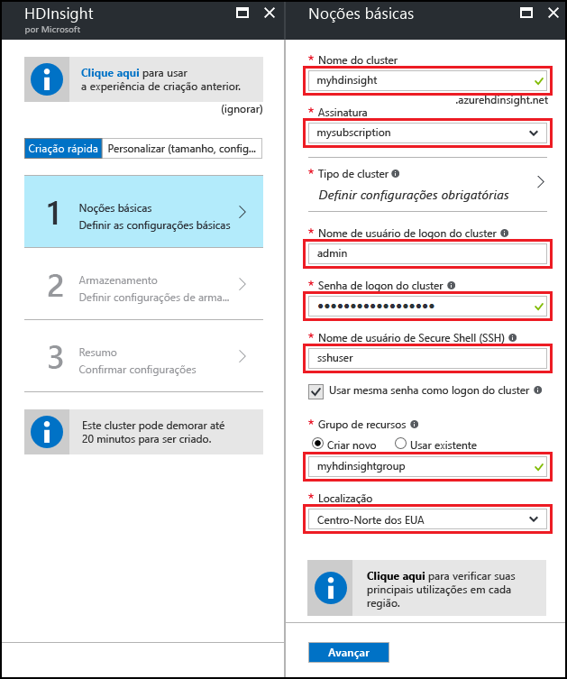
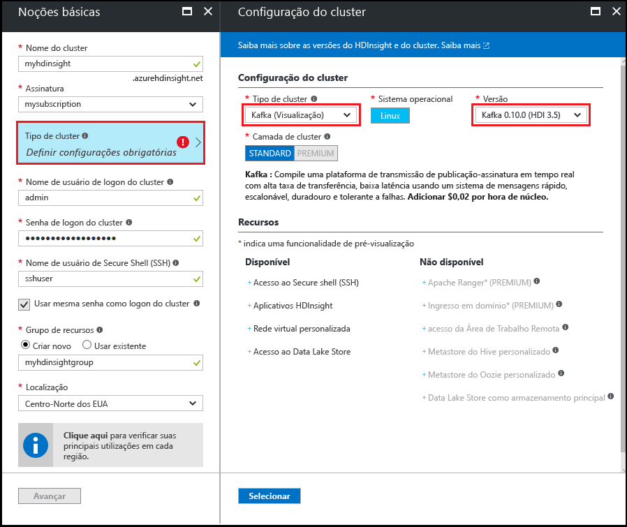
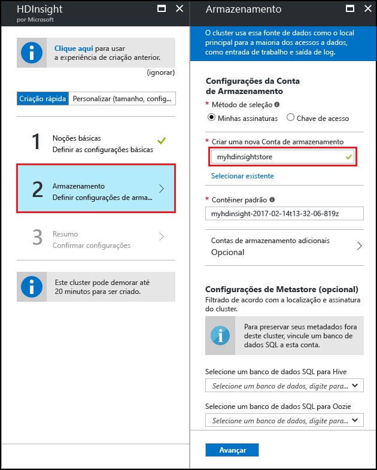
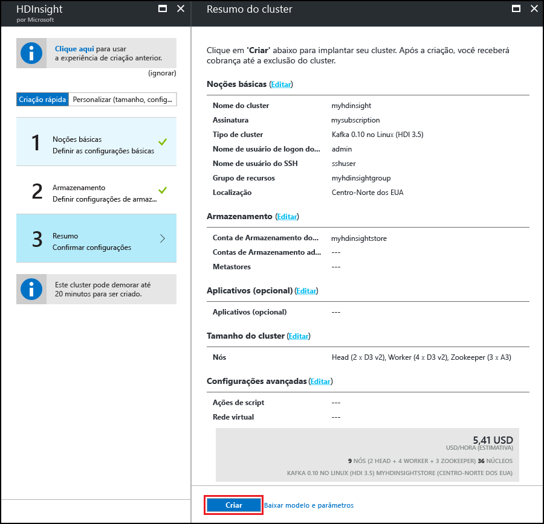

# <a name="start-with-apache-kafka-preview-on-hdinsight"></a>Introdução ao Apache Kafka (versão prévia) no HDInsight

Saiba como criar e usar um cluster do [Apache Kafka](https://kafka.apache.org) no Azure HDInsight. O Kafka é uma plataforma de streaming distribuída de software livre que está disponível com o HDInsight. Ela é geralmente usada como um agente de mensagens, pois fornece funcionalidade semelhante a uma fila de mensagens para publicação e assinatura.

> [!NOTE]
> Atualmente, há duas versões do Kafka disponíveis com o HDInsight: 0.9.0 (HDInsight 3.4) e 0.10.0 (HDInsight 3.5 e 3.6). As etapas neste documento pressupõem que você está usando o Kafka no HDInsight 3.6.

[!INCLUDE [delete-cluster-warning](../../includes/hdinsight-delete-cluster-warning.md)]

## <a name="create-a-kafka-cluster"></a>Criar um cluster Kafka

Use as seguintes etapas para criar um cluster Kafka no HDInsight:

1. No [portal do Azure](https://portal.azure.com), selecione **+ NOVO**, **Inteligência + Análises** e **HDInsight**.
   
    

2. Em **Noções Básicas**, insira as seguintes informações:

    * **Nome do cluster**: o nome do cluster HDInsight.
    * **Assinatura**: selecione a assinatura a ser utilizada.
    * **Nome de usuário de logon do cluster** e **Senha de logon do cluster**: logon ao acessar o cluster por HTTPS. Você pode usar essas credenciais para acessar serviços como a interface do usuário da Web do Ambari ou a API REST.
    * **Nome de usuário do SSH (Secure Shell)**: o logon usado ao acessar o cluster via SSH. Por padrão, a senha é a mesma do logon do cluster.
    * **Grupo de Recursos**: o grupo de recursos para criar o cluster.
    * **Local**: a região do Azure para criar o cluster.
   
 

3. Selecione **Tipo de cluster** e defina os seguintes valores em **Configuração do cluster**:
   
    * **Tipo de Cluster**: Kafka

    * **Versão**: Kafka 0.10.0 (HDI 3.6)

    * **Camada de Cluster**: Padrão
     
 Por fim, use o botão **Selecionar** para salvar as configurações.
     
 

4. Depois de selecionar o tipo de cluster, use o botão __Selecionar__ para definir o tipo de cluster. Em seguida, use o botão __Avançar__ para concluir a configuração básica.

5. Em **Armazenamento**, selecione ou crie uma Conta de armazenamento. Para as etapas neste documento, deixe os outros campos com os valores padrão. Use o botão __Avançar__ para salvar a configuração de armazenamento.

    

6. Em __Aplicativos (opcionais)__, selecione __Avançar__ para continuar. Nenhum aplicativo é necessário neste exemplo.

7. Em __Tamanho do cluster__, selecione __Avançar__ para continuar.

    > [!WARNING]
    > Para garantir a disponibilidade do Kafka no HDInsight, o cluster deve conter pelo menos três nós de trabalho.

    

    > [!NOTE]
    > A entrada dos **discos por nó de trabalho** controla a escalabilidade do Kafka no HDInsight. Para saber mais, veja [Configurar o armazenamento e a escalabilidade do Kafka no HDInsight](hdinsight-apache-kafka-scalability.md).

8. Em __Configurações avançadas__, selecione __Avançar__ para continuar.

9. Em **Resumo**, examine a configuração do cluster. Use os links __Editar__ para alterar as configurações que estão incorretas. Por fim, use o botão __Criar__ para criar o cluster.
   
    
   
    > [!NOTE]
    > Pode levar até 20 minutos para criar o cluster.

## <a name="connect-to-the-cluster"></a>Conectar-se ao cluster

> [!IMPORTANT]
> Ao executar as etapas a seguir, você deve usar um cliente SSH. Para saber mais, consulte o documento [Usar SSH com HDInsight](hdinsight-hadoop-linux-use-ssh-unix.md).

No cliente, use o SSH para se conectar ao cluster:

```ssh SSHUSER@CLUSTERNAME-ssh.azurehdinsight.net```

Substitua **SSHUSER** pelo nome de usuário SSH fornecido durante a criação do cluster. Substitua **CLUSTERNAME** pelo nome do cluster.

Quando solicitado, digite a senha usada para a conta SSH.

Para obter informações, consulte [Usar SSH com HDInsight](hdinsight-hadoop-linux-use-ssh-unix.md).

## <a id="getkafkainfo"></a>Obter as informações de host do Zookeeper e Broker

Ao trabalhar com Kafka, você deve saber os dois valores de host; os hosts *Zookeeper* e os hosts *Broker*. Esses hosts são usados com a API Kafka e muitos dos utilitários fornecidos com o Kafka.

Use as etapas a seguir para criar variáveis de ambiente que contêm as informações de host. As variáveis de ambiente são usadas nas etapas deste documento.

1. Em uma conexão SSH ao cluster, use o comando a seguir para instalar o utilitário `jq`. Esse utilitário é usado para analisar documentos JSON e é útil para recuperar as informações do host de agente:
   
    ```bash
    sudo apt -y install jq
    ```

2. Para definir as variáveis de ambiente com as informações recuperadas do Ambari, use os seguintes comandos:

    ```bash
    CLUSTERNAME='your cluster name'
    PASSWORD='your cluster password'
    export KAFKAZKHOSTS=`curl -sS -u admin:$PASSWORD -G https://$CLUSTERNAME.azurehdinsight.net/api/v1/clusters/$CLUSTERNAME/services/ZOOKEEPER/components/ZOOKEEPER_SERVER | jq -r '["\(.host_components[].HostRoles.host_name):2181"] | join(",")' | cut -d',' -f1,2`

    export KAFKABROKERS=`curl -sS -u admin:$PASSWORD -G https://$CLUSTERNAME.azurehdinsight.net/api/v1/clusters/$CLUSTERNAME/services/KAFKA/components/KAFKA_BROKER | jq -r '["\(.host_components[].HostRoles.host_name):9092"] | join(",")' | cut -d',' -f1,2`

    echo '$KAFKAZKHOSTS='$KAFKAZKHOSTS
    echo '$KAFKABROKERS='$KAFKABROKERS
    ```

    > [!IMPORTANT]
    > Defina `CLUSTERNAME=` para o nome do cluster do Kafka. Substitua `PASSWORD=` pela senha de logon (admin) que você usou ao criar o cluster.

    O seguinte texto é um exemplo do conteúdo de `$KAFKAZKHOSTS`:
   
    `zk0-kafka.eahjefxxp1netdbyklgqj5y1ud.ex.internal.cloudapp.net:2181,zk2-kafka.eahjefxxp1netdbyklgqj5y1ud.ex.internal.cloudapp.net:2181`
   
    O seguinte texto é um exemplo do conteúdo de `$KAFKABROKERS`:
   
    `wn1-kafka.eahjefxxp1netdbyklgqj5y1ud.cx.internal.cloudapp.net:9092,wn0-kafka.eahjefxxp1netdbyklgqj5y1ud.cx.internal.cloudapp.net:9092`

    > [!NOTE]
    > O comando `cut` é usado para cortar a lista de hosts em duas entradas de host. Você não precisa fornecer a lista completa de hosts ao criar um consumidor ou produtor do Kafka.
   
    > [!WARNING]
    > Não tome como certo que as informações retornadas nessa sessão sempre são precisas. Se você dimensionar o cluster, novos agentes serão adicionados ou removidos. Se ocorrer uma falha e um nó for substituído, o nome do host para o nó poderá ser alterado.
    >
    > Você deve recuperar as informações de hosts Zookeeper e de agente logo antes de usá-los para garantir que tenha informações válidas.

## <a name="create-a-topic"></a>Criar um tópico

O Kafka armazena fluxos de dados em categorias chamadas *tópicos*. Em uma conexão SSH a um nó principal de cluster, use um script fornecido com o Kafka para criar um tópico:

```bash
/usr/hdp/current/kafka-broker/bin/kafka-topics.sh --create --replication-factor 3 --partitions 8 --topic test --zookeeper $KAFKAZKHOSTS
```

Esse comando conecta ao Zookeeper usando as informações de host armazenadas em `$KAFKAZKHOSTS` e cria um tópico do Kafka chamado **teste**. Você pode verificar se o tópico foi criado usando o seguinte script para listar tópicos:

```bash
/usr/hdp/current/kafka-broker/bin/kafka-topics.sh --list --zookeeper $KAFKAZKHOSTS
```

A saída desse comando lista os tópicos do Kafka, que contém o tópico **teste**.

## <a name="produce-and-consume-records"></a>Produzir e consumir registros

O Kafka armazena *registros* nos tópicos. Os registros são produzidos por *produtores* e consumidos por *consumidores*. Os produtores recuperam registros de *agentes* do Kafka. Cada nó de trabalho no cluster HDInsight é um agente do Kafka.

Use as seguintes etapas para armazenar registros no tópico teste criado anteriormente e lê-los usando um consumidor:

1. Na sessão SSH, use um script fornecido com o Kafka para gravar registros no tópico:
   
    ```bash
    /usr/hdp/current/kafka-broker/bin/kafka-console-producer.sh --broker-list $KAFKABROKERS --topic test
    ```
   
    Você não é levado ao prompt após esse comando. Em vez disso, digite algumas mensagens de texto e use **Ctrl + C** para deixar de enviar ao tópico. Cada linha é enviada como um registro separado.

2. Use um script fornecido com o Kafka para ler registros do tópico:
   
    ```bash
    /usr/hdp/current/kafka-broker/bin/kafka-console-consumer.sh --bootstrap-server $KAFKABROKERS --topic test --from-beginning
    ```
   
    Esse comando recupera os registros do tópico e os exibe. O uso de `--from-beginning` instrui o consumidor a começar do início do fluxo, para que todos os registros sejam recuperados.

3. Use __Ctrl + C__ para interromper o consumidor.

## <a name="producer-and-consumer-api"></a>API de produtor e consumidor

Você pode também produzir e consumir registros de forma programática usando as [APIs Kafka](http://kafka.apache.org/documentation#api). Para criar um produtor e consumidor do Java, use as seguintes etapas do ambiente de desenvolvimento.

> [!IMPORTANT]
> Você deve ter os seguintes componentes instalados no ambiente de desenvolvimento:
>
> * [Java JDK 8](http://www.oracle.com/technetwork/java/javase/downloads/index.html) ou equivalente, como OpenJDK.
>
> * [Apache Maven](http://maven.apache.org/)
>
> * Um cliente SSH e o comando `scp`. Para saber mais, consulte o documento [Usar SSH com HDInsight](hdinsight-hadoop-linux-use-ssh-unix.md).

1. Baixe os exemplos de [https://github.com/Azure-Samples/hdinsight-kafka-java-get-started](https://github.com/Azure-Samples/hdinsight-kafka-java-get-started). Para o exemplo de produtor/consumidor, use o projeto no diretório `Producer-Consumer`. Esse exemplo contém as seguintes classes:
   
    * **Executar** - inicia o cliente ou o produtor.

    * **Produtor** - armazena 1.000.000 registros para o tópico.

    * **Consumidor** - lê registros do tópico.

2. Para criar um pacote jar, altere os diretórios para o local do diretório `Producer-Consumer` e use o seguinte comando:

    ```
    mvn clean package
    ```

    Esse comando cria um diretório chamado `target`, que contém um arquivo chamado `kafka-producer-consumer-1.0-SNAPSHOT.jar`.

3. Use os seguintes comandos para copiar o arquivo `kafka-producer-consumer-1.0-SNAPSHOT.jar` para o cluster HDInsight:
   
    ```bash
    scp ./target/kafka-producer-consumer-1.0-SNAPSHOT.jar SSHUSER@CLUSTERNAME-ssh.azurehdinsight.net:kafka-producer-consumer.jar
    ```
   
    Substitua **SSHUSER** pelo usuário do SSH do cluster e substitua **CLUSTERNAME** pelo nome do cluster. Quando solicitado, insira a senha do usuário do SSH.

4. Após o comando `scp` terminar de copiar o arquivo, conecte-se ao cluster usando SSH. Use o seguinte comando para gravar os registros para o tópico de teste:

    ```bash
    java -jar kafka-producer-consumer.jar producer $KAFKABROKERS
    ```

5. Quando o processo for concluído, use o seguinte comando para ler do tópico:
   
    ```bash
    java -jar kafka-producer-consumer.jar consumer $KAFKABROKERS
    ```
   
    São exibidos os registros lidos, juntamente com uma contagem de registros. É possível ver pouco mais de 1.000.000 registros, pois você envia vários registros ao tópico usando um script em uma etapa anterior.

6. Use __Ctrl + C__ para sair do consumidor.

### <a name="multiple-consumers"></a>Vários consumidores

Os consumidores do Kafka usam um grupo de consumidores ao ler os registros. Usar o mesmo grupo com vários consumidores resulta em leituras de balanceamento de carga de um tópico. Cada consumidor no grupo recebe uma parte dos registros. Para ver esse processo em ação, use as seguintes etapas:

1. Abra uma nova sessão do SSH para o cluster, para que você tenha duas. Em cada sessão, use o seguinte para iniciar um consumidor com a mesma ID do grupo de consumidores:
   
    ```bash
    java -jar kafka-producer-consumer.jar consumer $KAFKABROKERS mygroup
    ```

    Esse comando inicia um consumidor usando a ID do grupo `mygroup`.

    > [!NOTE]
    > Use os comandos da seção [Obter as informações de host do Zookeeper e do Agente](#getkafkainfo) para definir `$KAFKABROKERS` para essa sessão de SSH.

2. Observe como cada sessão conta os registros que recebe do tópico. O total de ambas as sessões deve ser o mesmo que você recebeu anteriormente de um consumidor.

O consumo por clientes no mesmo grupo é manipulado por meio das partições do tópico. O tópico `test` criado anteriormente tem oito partições. Se você abrir oito sessões do SSH e iniciar um consumidor em todas elas, cada consumidor lerá os registros de uma única partição do tópico.

> [!IMPORTANT]
> Não pode haver mais instâncias de consumidores do que partições em um grupo de consumidores. Neste exemplo, um grupo de consumidores pode conter até oito consumidores, já que esse é o número de partições no tópico. Ou você pode ter vários grupos de consumidores, cada um com no máximo oito consumidores.

Os registros armazenados no Kafka são armazenados na ordem em que são recebidos em uma partição. Para garantir a entrega ordenada em registros *em uma partição*, crie um grupo de consumidores em que o número de instâncias de consumidor corresponda ao número de partições. Para garantir a entrega ordenada em registros *no tópico*, crie um grupo de consumidores com apenas uma instância de consumidor.

## <a name="streaming-api"></a>API de streaming

A API de streaming foi adicionada ao Kafka na versão 0.10.0. Versões anteriores usam o Apache Spark ou o Storm para processamento de fluxo.

1. Se ainda não tiver feito isso, baixe os exemplos de [https://github.com/Azure-Samples/hdinsight-kafka-java-get-started](https://github.com/Azure-Samples/hdinsight-kafka-java-get-started) para seu ambiente de desenvolvimento. Para o exemplo de streaming, use o projeto no diretório `streaming`.
   
    Esse projeto contém apenas uma classe, `Stream`, que lê registros do tópico `test` criado anteriormente. Ele conta as palavras lidas e emite cada palavra e contagem para um tópico chamado `wordcounts`. O tópico `wordcounts` é criado em uma etapa posterior desta seção.

2. Na linha de comando no ambiente de desenvolvimento, altere os diretórios para o local do diretório `Streaming` e use o seguinte comando para criar um pacote jar:

    ```bash
    mvn clean package
    ```

    Esse comando cria um diretório chamado `target`, que contém um arquivo chamado `kafka-streaming-1.0-SNAPSHOT.jar`.

3. Use os seguintes comandos para copiar o arquivo `kafka-streaming-1.0-SNAPSHOT.jar` para o cluster HDInsight:
   
    ```bash
    scp ./target/kafka-streaming-1.0-SNAPSHOT.jar SSHUSER@CLUSTERNAME-ssh.azurehdinsight.net:kafka-streaming.jar
    ```
   
    Substitua **SSHUSER** pelo usuário do SSH do cluster e substitua **CLUSTERNAME** pelo nome do cluster. Quando solicitado, insira a senha do usuário do SSH.

4. Quando o comando `scp` terminar de copiar o arquivo, conecte-se ao cluster usando SSH e use o seguinte comando para criar o tópico `wordcounts`:

    ```bash
    /usr/hdp/current/kafka-broker/bin/kafka-topics.sh --create --replication-factor 3 --partitions 8 --topic wordcounts --zookeeper $KAFKAZKHOSTS
    ```

5. Em seguida, inicie o processo de streaming usando o seguinte comando:
   
    ```bash
    java -jar kafka-streaming.jar $KAFKABROKERS $KAFKAZKHOSTS 2>/dev/null &
    ```
   
    Esse comando inicia o processo de streaming em segundo plano.

6. Use o comando a seguir para enviar mensagens ao tópico `test`. Estas mensagens são processadas pelo exemplo de streaming:
   
    ```bash
    java -jar kafka-producer-consumer.jar producer $KAFKABROKERS &>/dev/null &
    ```

7. Use o seguinte comando para exibir a saída é gravada para o `wordcounts` tópico pelo processo de streaming:
   
    ```bash
    /usr/hdp/current/kafka-broker/bin/kafka-console-consumer.sh --bootstrap-server $KAFKABROKERS --topic wordcounts --from-beginning --formatter kafka.tools.DefaultMessageFormatter --property print.key=true --property key.deserializer=org.apache.kafka.common.serialization.StringDeserializer --property value.deserializer=org.apache.kafka.common.serialization.LongDeserializer
    ```
   
    > [!NOTE]
    > Para exibir os dados, você deve instruir o consumidor a imprimir a chave e o desserializador a ser usado para a chave e o valor. O nome da chave é a palavra e o valor da chave contém a contagem.
   
    A saída é semelhante ao texto a seguir:
   
        dwarfs  13635
        ago     13664
        snow    13636
        dwarfs  13636
        ago     13665
        a       13803
        ago     13666
        a       13804
        ago     13667
        ago     13668
        jumped  13640
        jumped  13641
        a       13805
        snow    13637
   
    > [!NOTE]
    > A contagem é incrementada sempre que uma palavra é encontrada.

7. Use __Ctrl + C__ para sair do consumidor e use o comando `fg` para colocar a tarefa de streaming em segundo plano novamente em primeiro plano. Use __Ctrl + C__ para sair dela também.

## <a name="delete-the-cluster"></a>Excluir o cluster

[!INCLUDE [delete-cluster-warning](../../includes/hdinsight-delete-cluster-warning.md)]

## <a name="troubleshoot"></a>Solucionar problemas

Se você tiver problemas com a criação de clusters HDInsight, confira os [requisitos de controle de acesso](hdinsight-administer-use-portal-linux.md#create-clusters).

## <a name="next-steps"></a>Próximas etapas

Neste documento, você aprendeu os fundamentos do trabalho com o Apache Kafka no HDInsight. Confira o seguinte para obter mais informações sobre como trabalhar com o Kafka:

* [Garantir a alta disponibilidade de seus dados com o Kafka no HDInsight](hdinsight-apache-kafka-high-availability.md)
* [Aumentar a escalabilidade, configurando discos gerenciados com o Kafka no HDInsight](hdinsight-apache-kafka-scalability.md)
* [Documentação do Apache Kafka](http://kafka.apache.org/documentation.html) em kafka.apache.org.
* [Usar MirrorMaker para criar uma réplica de Kafka no HDInsight](hdinsight-apache-kafka-mirroring.md)
* [Usar Apache Storm com Kafka no HDInsight](hdinsight-apache-storm-with-kafka.md)
* [Usar o Apache Spark com o Kafka no HDInsight](hdinsight-apache-spark-with-kafka.md)
* [Conectar-se ao Kafka no HDInsight (preview) por meio de uma Rede Virtual do Azure](hdinsight-apache-kafka-connect-vpn-gateway.md)

