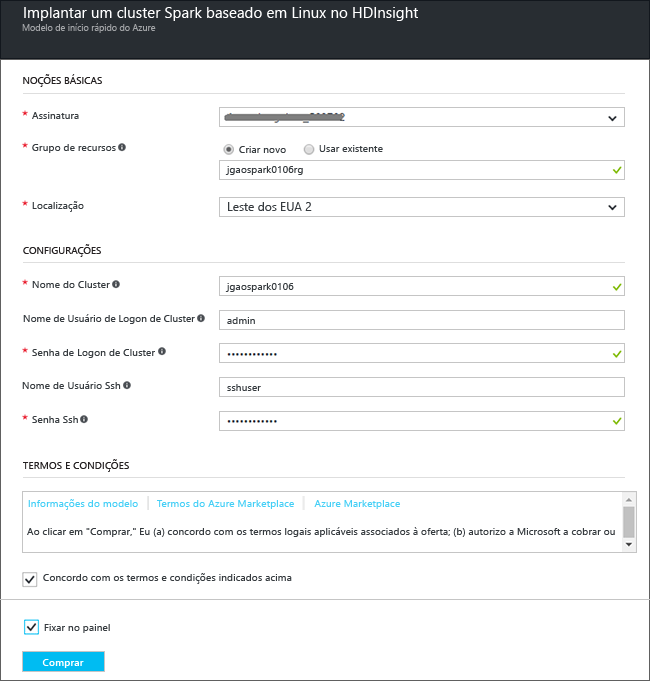
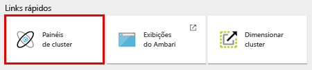

# Introdução: criar o cluster Apache Spark no Azure HDInsight e executar consultas interativas usando o Spark SQL

Saiba como criar um cluster [Apache Spark](hdinsight-apache-spark-overview.md) no HDInsight e, em seguida, usar o notebook do [Jupyter](https://jupyter.org) para executar consultas interativas no cluster Spark.

   

[!INCLUDE [delete-cluster-warning](../../includes/hdinsight-delete-cluster-warning.md)]

## Pré-requisitos
* **Uma assinatura do Azure**. Antes de começar este tutorial, você deverá ter uma assinatura do Azure. Consulte [Criar sua conta gratuita do Azure hoje](https://azure.microsoft.com/free).

* **Um cliente Secure Shell (SSH)**: Linux, Unix, e sistemas OS X fornecem um cliente SSH por meio do comando `ssh`. Para clientes Windows, confira [Usar o SSH com Hadoop no HDInsight do Windows com PuTTY](hdinsight-hadoop-linux-use-ssh-windows.md); para Linux, Unix ou OS X, confira [Usar o SSH com Hadoop no HDInsight do Linux, Unix ou OS X](hdinsight-hadoop-linux-use-ssh-unix.md)

> [!NOTE]
> Este artigo usa um modelo do Azure Resource Manager para criar um cluster Spark que usa [Blobs do Armazenamento do Azure como o armazenamento de cluster](hdinsight-hadoop-use-blob-storage.md). Você também pode criar um cluster Spark que usa o [Repositório Azure Data Lake](../data-lake-store/data-lake-store-overview.md) como um armazenamento adicional, além de Blobs do Armazenamento do Azure como o armazenamento padrão. Para obter instruções, confira [Criar um cluster HDInsight com o Repositório Data Lake](../data-lake-store/data-lake-store-hdinsight-hadoop-use-portal.md).
>
>

### Requisitos de controle de acesso
[!INCLUDE [access-control](../../includes/hdinsight-access-control-requirements.md)]

## Criar um cluster Spark
Nesta seção, você criará um cluster Spark no HDInsight usando um [modelo do Azure Resource Manager](https://azure.microsoft.com/resources/templates/101-hdinsight-spark-linux/). Para obter informações sobre as versões do HDInsight e seus SLAs, consulte [Controle de versão de componentes do HDInsight](hdinsight-component-versioning.md). Para obter outros métodos de criação de cluster, confira [Criar clusters do HDInsight](hdinsight-hadoop-provision-linux-clusters.md).

1. Clique na imagem a seguir para abrir o modelo no portal do Azure.         

    

2. Insira os valores a seguir:

    

   * **Assinatura**: selecione sua assinatura do Azure para esse cluster.
   * No **Grupo de recursos**: crie um novo grupo de recursos ou selecione um existente. O grupo de recursos é usado para gerenciar recursos do Azure em seus projetos.
   * **Local**: selecione um local para o grupo de recursos.  Este local também é usado para o armazenamento de clusters padrão e do cluster HDInsight.
   * **ClusterName**: insira um nome para o cluster Hadoop que você criará.
   * **Nome e senha de logon do cluster**: o nome de logon padrão é admin.
   * **Nome de usuário e senha de SSH**.

   Anote esses valores.  Você precisará deles mais tarde no tutorial.

3. Selecione **Concordo com os termos e condições declarados acima**, selecione **Fixar no painel**e, em seguida, clique em **Comprar**. Você poderá ver um novo bloco intitulado Como enviar a implantação para a implantação do modelo. A criação do cluster demora cerca de 20 minutos.

## Executar consultas do Spark SQL usando um bloco de anotações do Jupyter
Nesta seção, você usa um bloco de anotações do Jupyter para executar consultas do Spark SQL em relação ao cluster Spark. Os clusters HDInsight Spark fornecem dois kernels que você pode usar com o bloco de anotações do Jupyter. Estes são:

* **PySpark** (para aplicativos escritos em Python)
* **Spark** (para aplicativos escritos em Scala)

Neste artigo, você usará o kernel do PySpark. Para obter mais informações sobre os dois kernels, consulte [clusters kernels de blocos de anotações do Jupyter de uso com o Apache Spark no HDInsight](hdinsight-apache-spark-jupyter-notebook-kernels.md). Alguns dos principais benefícios de usar o kernel PySpark são:

* Os contextos de Spark e Hive são definidos automaticamente.
* Use diferentes mágicas de célula, como `%%sql`, para executar diretamente consultas SQL ou do Hive, sem nenhum trecho de código anterior.
* A saída das consultas SQL ou do Hive é visualizada automaticamente.

### Criar um bloco de anotações do Jupyter com o kernel PySpark

1. Abra o [Portal do Azure](https://portal.azure.com/).
2. No menu à esquerda, clique em **Grupos de recursos**.
3. Clique no grupo de recursos que você criou na seção anterior. Você poderá usar a função Pesquisar se houver muitos grupos de recursos. Você pode ver dois recursos no grupo, o cluster HDInsight e a conta de armazenamento padrão.
4. Clique no cluster para abri-lo.

2. Em **Links rápidos**, clique em **Painéis de cluster**e, em seguida, clique em **Anotações do Jupyter**. Se você receber uma solicitação, insira as credenciais de administrador para o cluster.

   

   > [!NOTE]
   > Você também pode acessar o Bloco de Notas Jupyter de seu cluster abrindo a seguinte URL no navegador. Substitua **CLUSTERNAME** pelo nome do cluster:
   >
   > `https://CLUSTERNAME.azurehdinsight.net/jupyter`
   >
   >
3. Crie um novo bloco de anotações. Clique em **Novo** e em **PySpark**.

   

   Um novo bloco de anotações é criado e aberto com o nome Untitled(Untitled.pynb).

4. Clique no nome do bloco de anotações na parte superior e, se desejar, digite um nome amigável.

    
5. Cole o código a seguir em uma célula vazia e pressione **SHIFT + ENTER** para executar o código. O código importa os tipos obrigatórios necessários para este cenário:

        from pyspark.sql.types import *

    Por ter criado um notebook usando o kernel PySpark, não será necessário criar nenhum contexto explicitamente. Os contextos do Spark e do Hive serão criados automaticamente para você ao executar a primeira célula do código.

    

    Toda vez que você executar um trabalho no Jupyter, o título da janela do navegador da Web mostrará um status **(Ocupado)** com o título do bloco de anotações. Você também verá um círculo sólido ao lado do texto **PySpark** no canto superior direito. Depois que o trabalho for concluído, isso será alterado para um círculo vazio.

6. Execute o seguinte código para registrar alguns dados de exemplo em uma tabela temporária chamada **hvac**.

        # Load the data
        hvacText = sc.textFile("wasbs:///HdiSamples/HdiSamples/SensorSampleData/hvac/HVAC.csv")
        
        # Create the schema
        hvacSchema = StructType([StructField("date", StringType(), False),StructField("time", StringType(), False),StructField("targettemp", IntegerType(), False),StructField("actualtemp", IntegerType(), False),StructField("buildingID", StringType(), False)])
        
        # Parse the data in hvacText
        hvac = hvacText.map(lambda s: s.split(",")).filter(lambda s: s[0] != "Date").map(lambda s:(str(s[0]), str(s[1]), int(s[2]), int(s[3]), str(s[6]) ))
        
        # Create a data frame
        hvacdf = sqlContext.createDataFrame(hvac,hvacSchema)
        
        # Register the data fram as a table to run queries against
        hvacdf.registerTempTable("hvac")

    Os clusters Spark no HDInsight são fornecidos com um arquivo de dados de exemplo, **hvac.csv**, em **\HdiSamples\HdiSamples\SensorSampleData\hvac**.

7. Execute o seguinte código para consultar os dados:

        %%sql
        SELECT buildingID, (targettemp - actualtemp) AS temp_diff, date FROM hvac WHERE date = \"6/1/13\"

   Como está usando um kernel PySpark, agora você pode executar diretamente uma consulta SQL na tabela temporária **hvac** que acabou de criar usando a mágica de `%%sql`. Para obter mais informações sobre a mágica de `%%sql` , bem como outras mágicas disponíveis com o kernel PySpark, confira [Kernels disponíveis em notebooks Jupyter com clusters HDInsight Spark](hdinsight-apache-spark-jupyter-notebook-kernels.md#choose-between-the-kernels).

   A saída tabular a seguir é exibida por padrão.

     

    Você também pode ver os resultados em outras visualizações. Por exemplo, um gráfico de área para a mesma saída seria semelhante ao seguinte.

    

9. Depois de concluir a execução do aplicativo, você pode encerrar o bloco de anotações para liberar os recursos. Para isso, no menu **Arquivo** do bloco de anotações, clique em **Fechar e Interromper**. Isso desligará e fechará o bloco de anotações.

## Excluir o cluster
[!INCLUDE [delete-cluster-warning](../../includes/hdinsight-delete-cluster-warning.md)]

## Confira também
* [Visão geral: Apache Spark no Azure HDInsight](hdinsight-apache-spark-overview.md)

### Cenários
* [Spark com BI: executar análise de dados interativa usando o Spark no HDInsight com ferramentas de BI](hdinsight-apache-spark-use-bi-tools.md)
* [Spark com Aprendizado de Máquina: usar o Spark no HDInsight para analisar a temperatura de prédios usando dados do sistema HVAC](hdinsight-apache-spark-ipython-notebook-machine-learning.md)
* [Spark com Aprendizado de Máquina: usar o Spark no HDInsight para prever resultados da inspeção de alimentos](hdinsight-apache-spark-machine-learning-mllib-ipython.md)
* [Streaming Spark: usar o Spark no HDInsight para a criação de aplicativos de streaming em tempo real](hdinsight-apache-spark-eventhub-streaming.md)
* [Análise de log do site usando o Spark no HDInsight](hdinsight-apache-spark-custom-library-website-log-analysis.md)
* [Análise da telemetria de dados do Application Insight usando o Spark no HDInsight](hdinsight-spark-analyze-application-insight-logs.md)

### Criar e executar aplicativos
* [Criar um aplicativo autônomo usando Scala](hdinsight-apache-spark-create-standalone-application.md)
* [Executar trabalhos remotamente em um cluster do Spark usando Livy](hdinsight-apache-spark-livy-rest-interface.md)

### Ferramentas e extensões
* [Use o Plug-in de Ferramentas do HDInsight para IntelliJ IDEA para criar e enviar aplicativos Spark Scala](hdinsight-apache-spark-intellij-tool-plugin.md)
* [Usar o plug-in de Ferramentas do HDInsight para depurar aplicativos Spark remotamente](hdinsight-apache-spark-intellij-tool-plugin-debug-jobs-remotely.md)
* [Usar blocos de anotações do Zeppelin com um cluster Spark no HDInsight](hdinsight-apache-spark-use-zeppelin-notebook.md)
* [Kernels disponíveis para o bloco de anotações Jupyter no cluster do Spark para HDInsight](hdinsight-apache-spark-jupyter-notebook-kernels.md)
* [Usar pacotes externos com blocos de notas Jupyter](hdinsight-apache-spark-jupyter-notebook-use-external-packages.md)
* [Instalar o Jupyter em seu computador e conectar-se a um cluster Spark do HDInsight](hdinsight-apache-spark-jupyter-notebook-install-locally.md)

### Gerenciar recursos
* [Gerenciar os recursos de cluster do Apache Spark no Azure HDInsight](hdinsight-apache-spark-resource-manager.md)
* [Rastrear e depurar trabalhos em execução em um cluster do Apache Spark no HDInsight](hdinsight-apache-spark-job-debugging.md)

[hdinsight-versions]: hdinsight-component-versioning.md
[hdinsight-upload-data]: hdinsight-upload-data.md
[hdinsight-storage]: hdinsight-hadoop-use-blob-storage.md

[azure-purchase-options]: http://azure.microsoft.com/pricing/purchase-options/
[azure-member-offers]: http://azure.microsoft.com/pricing/member-offers/
[azure-free-trial]: http://azure.microsoft.com/pricing/free-trial/
[azure-management-portal]: https://manage.windowsazure.com/
[azure-create-storageaccount]: storage-create-storage-account.md

<!--HONumber=Feb17_HO1-->

