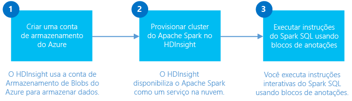

<properties
	pageTitle="Criar um cluster Spark no HDInsight Linux e usar o Spark SLQ no Jupyter para análise interativa | Microsoft Azure"
	description="Instruções passo a passo sobre como criar rapidamente um cluster Apache Spark no HDInsight e depois usar o Spark SQL nos blocos de anotações do Jupyter para executar consultas interativas."
	services="hdinsight"
	documentationCenter=""
	authors="nitinme"
	manager="jhubbard"
	editor="cgronlun"
	tags="azure-portal"/>

<tags
	ms.service="hdinsight"
	ms.workload="big-data"
	ms.tgt_pltfrm="na"
	ms.devlang="na"
	ms.topic="get-started-article"
	ms.date="07/25/2016"
	ms.author="nitinme"/>

# Introdução: criar cluster Apache Spark no HDInsight Linux e executar consultas interativas usando o Spark SQL

Saiba como criar um cluster Apache Spark no HDInsight e usar o bloco de anotações do [Jupyter](https://jupyter.org) para executar consultas interativas do Spark SQL no cluster Spark.

   

[AZURE.INCLUDE [delete-cluster-warning](../../includes/hdinsight-delete-cluster-warning.md)]

**Pré-requisitos:**

- **Uma assinatura do Azure**. Antes de começar este tutorial, você deverá ter uma assinatura do Azure. Consulte [Obter avaliação gratuita do Azure](https://azure.microsoft.com/documentation/videos/get-azure-free-trial-for-testing-hadoop-in-hdinsight/).

- **Um cliente Secure Shell (SSH)**: Linux, Unix, e sistemas OS X fornecem um cliente SSH por meio do comando `ssh`. Para sistemas Windows, é recomendável [PuTTY](http://www.chiark.greenend.org.uk/~sgtatham/putty/download.html).
    
- **Chaves Secure Shell (SSH) (opcional)**: você pode proteger a conta SSH usada para se conectar ao cluster usando uma senha ou uma chave pública. A senha é o caminho mais rápido, e você deve usar essa opção se quiser criar rapidamente um cluster e executar alguns trabalhos de teste. Usar uma chave é o método seguro, no entanto, exige configuração adicional. Convém usar essa abordagem ao criar um cluster de produção. Neste artigo, nós usamos a abordagem da senha. Para obter instruções sobre como gerar chaves SSH com HDInsight, consulte os seguintes artigos:

	-  Em um computador Linux: [Usar SSH com o HDInsight baseado em Linux (Hadoop) por meio de Linux, Unix ou OS X](hdinsight-hadoop-linux-use-ssh-unix.md).
    
	-  Em um computador Windows: [Usar SSH com o HDInsight baseado em Linux (Hadoop) no Windows](hdinsight-hadoop-linux-use-ssh-windows.md).

>[AZURE.NOTE] Este artigo usa um modelo ARM para criar um cluster Spark que usa [Blobs do Armazenamento do Azure como o armazenamento de cluster](hdinsight-hadoop-use-blob-storage.md). Você também pode criar um cluster Spark que usa o [Repositório Azure Data Lake](../data-lake-store/data-lake-store-overview.md) como um armazenamento adicional, além de Blobs do Armazenamento do Azure como o armazenamento padrão. Para obter instruções, confira [Criar um cluster HDInsight com o Repositório Data Lake](../data-lake-store/data-lake-store-hdinsight-hadoop-use-portal.md).

## Criar um cluster Spark

Nesta seção, você cria um cluster HDInsight versão 3.4 (Spark versão 1.6.1) usando um modelo de ARM do Azure. Para obter informações sobre as versões do HDInsight e seus SLAs, consulte [Controle de versão de componentes do HDInsight](hdinsight-component-versioning.md). Para obter outros métodos de criação de cluster, confira [Criar clusters do HDInsight](hdinsight-hadoop-provision-linux-clusters.md).

1. Clique na imagem a seguir para abrir um modelo ARM no Portal do Azure.

    
    
    O modelo ARM está localizado em um contêiner de blob público, *https://hditutorialdata.blob.core.windows.net/armtemplates/create-linux-based-spark-cluster-in-hdinsight.json*.
   
2. Na folha Parâmetros, insira o seguinte:

    - **ClusterName**: insira um nome para o cluster Hadoop que você criará.
    - **Nome e senha de logon do cluster**: o nome de logon padrão é admin.
    - **Nome de usuário e senha de SSH**.
    
    Anote esses valores. Você precisará deles mais tarde no tutorial.

    > [AZURE.NOTE] O SSH é usado para acessar remotamente o cluster HDInsight usando uma linha de comando. O nome de usuário e a senha usados aqui serão usados para se conectar ao cluster por meio do SSH. Além disso, o nome de usuário SSH deve ser exclusivo, pois ele cria uma conta de usuário em todos os nós de cluster HDInsight. Veja a seguir alguns dos nomes de conta reservados para uso pelos serviços no cluster e que não podem ser usados como o nome de usuário SSH:
    >
    > root, hdiuser, storm, hbase, ubuntu, zookeeper, hdfs, yarn, mapred, hbase, hive, oozie, falcon, sqoop, admin, tez, hcat, hdinsight-zookeeper.

	> Para obter mais informações sobre como usar SSH com o HDInsight, consulte um dos seguintes artigos:

	> * [Usar SSH com Hadoop baseado em Linux no HDInsight no Linux, Unix ou OS X](hdinsight-hadoop-linux-use-ssh-unix.md)
	> * [Usar SSH com Hadoop baseado em Linux no HDInsight no Windows](hdinsight-hadoop-linux-use-ssh-windows.md)

    
3\. Clique em **OK** para salvar os parâmetros.

4\. Na folha **Implantação personalizada**, clique na caixa suspensa **Grupo de recursos** e em **Novo** para criar um novo grupo de recursos. O grupo de recursos é um contêiner que agrupa o cluster, a conta de armazenamento dependente e outros recursos vinculados.

5\. Clique em **Termos legais** e em **Criar**.

6\. Clique em **Criar**. Você verá um novo bloco intitulado Como enviar a implantação para a implantação do modelo. É preciso sobre cerca de 20 minutos para criar o cluster e o banco de dados SQL.

## Executar consultas do Spark SQL usando um bloco de anotações do Jupyter

Nesta seção, você usa um bloco de anotações do Jupyter para executar consultas do Spark SQL em relação ao cluster Spark. Os clusters HDInsight Spark fornecem dois kernels que você pode usar com o bloco de anotações do Jupyter. Estes são:

* **PySpark** (para aplicativos escritos em Python)
* **Spark** (para aplicativos escritos em Scala)

Neste artigo, você usará o kernel PySpark. No artigo [Kernels disponíveis em blocos de anotações do Jupyter com clusters HDInsight Spark](hdinsight-apache-spark-jupyter-notebook-kernels.md#why-should-i-use-the-new-kernels), você pode ler mais detalhes sobre os benefícios de usar o kernel PySpark. No entanto, alguns dos principais benefícios de usar o kernel PySpark são:

* Não é necessário definir os contextos de Spark e Hive. Elas são definidas automaticamente para você.
* Você pode usar diferentes mágicas de célula, como `%%sql`, para executar diretamente consultas SQL ou do Hive, sem nenhum trecho de código anterior.
* A saída das consultas SQL ou do Hive é visualizada automaticamente.

### Criar um bloco de anotações do Jupyter com o kernel PySpark 

1. No [Portal do Azure](https://portal.azure.com/), no quadro inicial, clique no bloco do cluster Spark (se você o tiver fixado no quadro inicial). Você também pode navegar até o cluster em **Procurar Tudo** > **Clusters HDInsight**.

2. Na folha do cluster Spark, clique em **Links Rápidos** e, na folha **Painel do Cluster**, clique em **Notebook do Jupyter**. Se você receber uma solicitação, insira as credenciais de administrador para o cluster.

	> [AZURE.NOTE] Você também pode acessar o Bloco de Notas Jupyter de seu cluster abrindo a seguinte URL no navegador. Substitua __CLUSTERNAME__ pelo nome do cluster:
	>
	> `https://CLUSTERNAME.azurehdinsight.net/jupyter`

2. Crie um novo bloco de anotações. Clique em **Novo** e em **PySpark**.

	

3. Um novo bloco de anotações é criado e aberto com o nome Untitled.pynb. Clique no nome do bloco de anotações na parte superior e digite um nome amigável.

	

4. Por ter criado um notebook usando o kernel PySpark, não será necessário criar nenhum contexto explicitamente. Os contextos do Spark e do Hive serão criados automaticamente para você ao executar a primeira célula do código. Você pode começar importando os tipos obrigatórios para este cenário. Para fazer isso, cole o trecho de código a seguir em uma célula vazia e pressione **SHIFT + ENTER**.

		from pyspark.sql.types import *
		
	Toda vez que você executar um trabalho no Jupyter, o título da janela do navegador da Web mostrará um status **(Ocupado)** com o título do bloco de anotações. Você também verá um círculo sólido ao lado do texto **PySpark** no canto superior direito. Depois que o trabalho for concluído, isso será alterado para um círculo vazio.

	 

4. Carregar dados de exemplo em uma tabela temporária. Quando você cria um cluster Spark no HDInsight, o arquivo de dados de exemplo, **hvac.csv**, é copiado para a conta de armazenamento associada em **\\HdiSamples\\HdiSamples\\SensorSampleData\\hvac**.

	Em uma célula vazia, cole o exemplo de código a seguir e pressione **SHIFT+ENTER**. Esse exemplo de código registra os dados em uma tabela temporária chamada **hvac**.

		# Load the data
		hvacText = sc.textFile("wasbs:///HdiSamples/HdiSamples/SensorSampleData/hvac/HVAC.csv")
		
		# Create the schema
		hvacSchema = StructType([StructField("date", StringType(), False),StructField("time", StringType(), False),StructField("targettemp", IntegerType(), False),StructField("actualtemp", IntegerType(), False),StructField("buildingID", StringType(), False)])
		
		# Parse the data in hvacText
		hvac = hvacText.map(lambda s: s.split(",")).filter(lambda s: s[0] != "Date").map(lambda s:(str(s[0]), str(s[1]), int(s[2]), int(s[3]), str(s[6]) ))
		
		# Create a data frame
		hvacdf = sqlContext.createDataFrame(hvac,hvacSchema)
		
		# Register the data fram as a table to run queries against
		hvacdf.registerTempTable("hvac")

5. Como está usando um kernel PySpark, agora você pode executar diretamente uma consulta SQL na tabela temporária **hvac** que acabou de criar usando a mágica de `%%sql`. Para obter mais informações sobre a mágica do `%%sql`, bem como outras mágicas disponíveis com o kernel PySpark, confira [Kernels disponíveis para notebooks Jupyter com clusters do Spark no HDInsight](hdinsight-apache-spark-jupyter-notebook-kernels.md#why-should-i-use-the-new-kernels).
		
		%%sql
		SELECT buildingID, (targettemp - actualtemp) AS temp_diff, date FROM hvac WHERE date = "6/1/13"

5. Depois que o trabalho for concluído com êxito, a saída tabular a seguir será exibida por padrão.

 	

	Você também pode ver os resultados em outras visualizações. Por exemplo, um gráfico de área para a mesma saída seria semelhante ao seguinte.

	

6. Depois de concluir a execução do aplicativo, você deve encerrar o notebook para liberar os recursos. Para isso, no menu **Arquivo** do bloco de anotações, clique em **Fechar e Interromper**. Isso desligará e fechará o bloco de anotações.

##Excluir o cluster

[AZURE.INCLUDE [delete-cluster-warning](../../includes/hdinsight-delete-cluster-warning.md)]

## Confira também

* [Visão geral: Apache Spark no Azure HDInsight](hdinsight-apache-spark-overview.md)

### Cenários

* [Spark com BI: executar análise de dados interativa usando o Spark no HDInsight com ferramentas de BI](hdinsight-apache-spark-use-bi-tools.md)

* [Spark com Aprendizado de Máquina: usar o Spark no HDInsight para analisar a temperatura de prédios usando dados do sistema HVAC](hdinsight-apache-spark-ipython-notebook-machine-learning.md)

* [Spark com Aprendizado de Máquina: usar o Spark no HDInsight para prever resultados da inspeção de alimentos](hdinsight-apache-spark-machine-learning-mllib-ipython.md)

* [Streaming Spark: usar o Spark no HDInsight para a criação de aplicativos de streaming em tempo real](hdinsight-apache-spark-eventhub-streaming.md)

* [Análise de log do site usando o Spark no HDInsight](hdinsight-apache-spark-custom-library-website-log-analysis.md)

* [Análise da telemetria de dados do Application Insight usando o Spark no HDInsight](hdinsight-spark-analyze-application-insight-logs.md)

### Criar e executar aplicativos

* [Criar um aplicativo autônomo usando Scala](hdinsight-apache-spark-create-standalone-application.md)

* [Executar trabalhos remotamente em um cluster do Spark usando Livy](hdinsight-apache-spark-livy-rest-interface.md)

### Ferramentas e extensões

* [Usar o plug-in de Ferramentas do HDInsight para IntelliJ IDEA para criar e enviar aplicativos Spark Scala](hdinsight-apache-spark-intellij-tool-plugin.md)

* [Usar o plug-in de Ferramentas do HDInsight para depurar aplicativos Spark remotamente](hdinsight-apache-spark-intellij-tool-plugin-debug-jobs-remotely.md)

* [Usar blocos de anotações do Zeppelin com um cluster Spark no HDInsight](hdinsight-apache-spark-use-zeppelin-notebook.md)

* [Kernels disponíveis para o bloco de anotações Jupyter no cluster do Spark para HDInsight](hdinsight-apache-spark-jupyter-notebook-kernels.md)

* [Usar pacotes externos com blocos de notas Jupyter](hdinsight-apache-spark-jupyter-notebook-use-external-packages.md)

* [Instalar o Jupyter em seu computador e conectar-se a um cluster Spark do HDInsight](hdinsight-apache-spark-jupyter-notebook-install-locally.md)

### Gerenciar recursos

* [Gerenciar os recursos de cluster do Apache Spark no Azure HDInsight](hdinsight-apache-spark-resource-manager.md)

* [Rastrear e depurar trabalhos em execução em um cluster do Apache Spark no HDInsight](hdinsight-apache-spark-job-debugging.md)

[hdinsight-versions]: hdinsight-component-versioning.md
[hdinsight-upload-data]: hdinsight-upload-data.md
[hdinsight-storage]: hdinsight-hadoop-use-blob-storage.md

[azure-purchase-options]: http://azure.microsoft.com/pricing/purchase-options/
[azure-member-offers]: http://azure.microsoft.com/pricing/member-offers/
[azure-free-trial]: http://azure.microsoft.com/pricing/free-trial/
[azure-management-portal]: https://manage.windowsazure.com/
[azure-create-storageaccount]: storage-create-storage-account.md

<!---HONumber=AcomDC_0914_2016-->