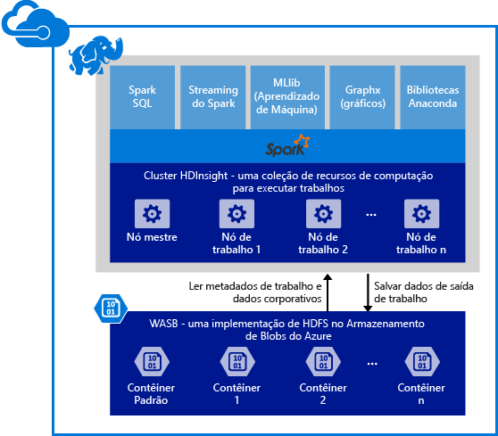

# Visão geral: Apache Spark no HDInsight

O <a href="http://spark.apache.org/" target="_blank">Apache Spark</a> é uma estrutura de processamento paralelo de código-fonte aberto que dá suporte ao processamento de memória para melhorar o desempenho dos aplicativos analíticos de big data. O mecanismo de processamento do Spark foi desenvolvido para velocidade, facilidade de uso e análise sofisticada. Recursos de computação na memória do Spark fazem dele uma boa escolha para algoritmos iterativos em cálculos de aprendizado e gráfico de máquina. O Spark também é compatível com o Armazenamento do Azure (WASB) para possibilitar o fácil processamento dos dados existentes armazenados no Azure por meio do Spark.

Quando você cria um cluster do Spark no HDInsight, cria recursos de computação do Azure com o Spark instalado e configurado. Demora apenas cerca de dez minutos para criar um cluster do Spark no HDInsight. Os dados a serem processados são colocados no Armazenamento do Azure. Veja [Usar o Armazenamento ddo Azure com HDInsight][hdinsight-storage].

**Deseja começar com o Apache Spark no Azure HDInsight?** Confira [Início rápido: criar um cluster do Spark no HDInsight e executar aplicativos de exemplo usando Jupyter](hdinsight-apache-spark-jupyter-spark-sql.md).

> [!NOTE]
> Para obter uma lista de problemas conhecidos e limitações com a versão atual, confira [Problemas conhecidos do Apache Spark no Azure HDInsight](hdinsight-apache-spark-known-issues.md).
> 
> 

## Por que usar o Spark no Azure HDInsight?
O Azure HDInsight oferece um serviço Spark totalmente gerenciado. Os benefícios de usar o Spark no HDInsight são:

| Recurso | Descrição |
| --- | --- |
| Facilidade na criação de clusters |Você pode criar um novo cluster do Spark no HDInsight em minutos usando o Portal de Gerenciamento do Azure, o Azure PowerShell ou o SDK .NET do HDInsight. Confira [Introdução ao cluster do Spark no HDInsight](hdinsight-apache-spark-jupyter-spark-sql.md) |
| Fácil de uso |Os clusters do Spark no HDInsight incluem blocos de anotações do Zeppelin e Jupyter pré-configurados. Você pode usá-los para processar e visualizar dados interativamente. A URL para o notebook Jupyter é https://NOMEDOCLUSTER.azurehdinsight.net/jupyter. Substitua **NOMEDOCLUSTER** pelo nome do seu cluster Spark HDInsight. |
| APIs REST |O Spark no HDInsight inclui [Livy](https://github.com/cloudera/hue/tree/master/apps/spark/java#welcome-to-livy-the-rest-spark-server), um Spark Job Server baseado em API REST para enviar e monitorar trabalhos em execução remotamente. |
| Suporte ao Repositório Azure Data Lake |O Spark no HDInsight pode ser configurado para usar o Azure Data Lake Store como um armazenamento adicional, bem como armazenamento primário (somente com clusters HDInsight 3.5). Para saber mais sobre o Repositório Data Lake, veja [Visão geral do Repositório Azure Data Lake](../data-lake-store/data-lake-store-overview.md). |
| Integração com serviços do Azure |O Spark no HDInsight é fornecido com um conector para hubs de eventos do Azure. Os clientes podem criar aplicativos de fluxo contínuo usando os Hubs de Eventos, além do [Kafka](http://kafka.apache.org/), que já está disponível como parte do Spark. |
| Suporte para Servidor R |Você pode configurar um Servidor R no cluster HDInsight Spark para executar cálculos R distribuídos com as velocidades prometidas com um cluster Spark. Para saber mais, veja [Introdução ao uso do Servidor R no HDInsight](hdinsight-hadoop-r-server-get-started.md). |
| Integração com IntelliJ IDEA |Você pode usar o Plug-in HDInsight para IntelliJ para criar e enviar solicitações a um cluster HDInsight Spark. Para saber mais, veja [Usar o plug-in de Ferramentas do HDInsight para IntelliJ IDEA para criar aplicativos Spark para um cluster HDInsight Spark Linux](hdinsight-apache-spark-intellij-tool-plugin.md). |
| Consultas simultâneas |O Spark no HDInsight dá suporte a consultas simultâneas. Isso possibilita que várias consultas de um usuário ou várias consultas de vários usuários e aplicativos compartilhem os mesmos recursos de cluster. |
| Armazenamento em cache no SSDs |Você pode escolher os dados em cache na memória ou em SSDs anexados a nós do cluster. O armazenamento em cache na memória oferece o melhor desempenho de consulta, mas pode ser caro; o armazenamento em cache em SSDs é uma ótima opção para melhorar o desempenho de consulta sem necessidade de criar um cluster do tamanho necessário para colocar todo o conjunto de dados na memória. |
| Integração com ferramentas de BI |O Spark para HDInsight fornece conectores para ferramentas de BI como o [Power BI](http://www.powerbi.com/) e o [Tableau](http://www.tableau.com/products/desktop), para análise de dados. |
| Bibliotecas Anaconda pré-carregadas |Os clusters do Spark no HDInsight são fornecidos com bibliotecas Anaconda pré-instaladas. [Anaconda](http://docs.continuum.io/anaconda/) fornece quase 200 bibliotecas de aprendizado de máquina, análise de dados, visualização, etc. |
| Escalabilidade |Embora você possa especificar o número de nós no cluster durante a criação, convém aumentar ou reduzir o cluster de acordo com a carga de trabalho. Todos os clusters do HDInsight permitem alterar o número de nós no cluster. Além disso, os clusters do Spark podem ser descartados sem perda de dados, pois todos os dados ficam no Armazenamento do Azure. |
| Suporte contínuo |O Spark no HDInsight é fornecido com suporte 24/7 de nível empresarial e um SLA de 99,9% de tempo de atividade. |

## Quais são os casos de uso do Spark no HDInsight?
O Apache Spark no HDInsight permite os seguintes cenários principais.

### Análise de dados interativa e BI
[Examinar um tutorial](hdinsight-apache-spark-use-bi-tools.md)

O Apache Spark no HDInsight armazena dados em blobs do Azure. Especialistas de negócios e os principais responsáveis por tomar decisões podem analisar e criar relatórios com esses dados e usar o Microsoft Power BI para criar relatórios interativos por meio dos dados analisados. Os analistas podem começar com dados não estruturados/semiestruturados no armazenamento do Azure, definir um esquema para os dados usando blocos de anotações e, em seguida, criar modelos de dados usando o Microsoft Power BI. O Spark no HDInsight também dá suporte a várias ferramentas de BI de terceiros, como Tableau, Qlikview e SAP Lumira, tornando-o uma plataforma ideal para analistas de dados, especialistas de negócios e os principais responsáveis por tomar decisões.

### Aprendizado de máquina iterativo
[Examine um tutorial: prever temperaturas de prédios usando dados do sistema HVAC](hdinsight-apache-spark-ipython-notebook-machine-learning.md)

[Examine um tutorial: prever resultados da inspeção de alimentos](hdinsight-apache-spark-machine-learning-mllib-ipython.md)

O Apache Spark vem com [MLlib](http://spark.apache.org/mllib/), uma biblioteca de aprendizado de máquina criada com base no Spark. Além disso, o Spark no HDInsight também inclui o Anaconda, uma distribuição do Python com uma variedade de pacotes para aprendizado de máquina. Junte isso a um suporte interno para blocos de anotações do Jupyter e terá um ambiente de alto nível para criar aplicativos de aprendizado de máquina.  

### Análise de dados de streaming e em tempo real
[Examinar um tutorial](hdinsight-apache-spark-eventhub-streaming.md)

A análise de dados em tempo real é usada para cenários que vão de reduzir o tempo para obter insight de dados processando os dados conforme eles chegam até criar uma verdadeira solução de fluxo. O Spark no HDInsight oferece suporte avançado para criar soluções de análise em tempo real. Embora o Spark já tenha conectores para receber dados de várias fontes, como soquetes TCP, Flume, Twitter, ZeroMQ ou Kafka, o Spark no HDInsight adiciona suporte de primeira classe para a inserção de dados de hubs de evento do Azure. Os Hubs de Eventos são o serviço de enfileiramento de mensagens mais usado no Azure. Ter um excelente suporte pronto para uso para hubs de eventos torna o Spark no HDInsight a plataforma ideal para a criação de pipeline de análise em tempo real.

## Quais componentes estão incluídos como parte de um cluster do Spark?
O Spark no HDInsight inclui os seguintes componentes que estão disponíveis nos clusters por padrão.

* [Núcleo do Spark](https://spark.apache.org/docs/1.5.1/). Inclui Spark Core, Spark SQL, APIs de streaming do Spark, GraphX e MLlib.
* [Anaconda](http://docs.continuum.io/anaconda/)
* [Livy](https://github.com/cloudera/hue/tree/master/apps/spark/java#welcome-to-livy-the-rest-spark-server)
* [Bloco de anotações do Jupyter](https://jupyter.org)

O Spark no HDInsight também fornece um [driver ODBC](http://go.microsoft.com/fwlink/?LinkId=616229) para conectividade com clusters do Spark no HDInsight usando ferramentas de BI, como Microsoft Power BI e Tableau.

## Por onde começo?
Inicie com a criação de um cluster do Spark no HDInsight no Linux. Confira [Início rápido: provisionar um cluster do Spark no HDInsight e executar aplicativos de exemplo usando Jupyter](hdinsight-apache-spark-jupyter-spark-sql.md). 

## Próximas etapas
### Cenários
* [Spark com BI: executar análise de dados interativa usando o Spark no HDInsight com ferramentas de BI](hdinsight-apache-spark-use-bi-tools.md)
* [Spark com Aprendizado de Máquina: usar o Spark no HDInsight para analisar a temperatura de prédios usando dados do sistema HVAC](hdinsight-apache-spark-ipython-notebook-machine-learning.md)
* [Spark com Aprendizado de Máquina: usar o Spark no HDInsight para prever resultados da inspeção de alimentos](hdinsight-apache-spark-machine-learning-mllib-ipython.md)
* [Streaming Spark: usar o Spark no HDInsight para a criação de aplicativos de streaming em tempo real](hdinsight-apache-spark-eventhub-streaming.md)
* [Análise de log do site usando o Spark no HDInsight](hdinsight-apache-spark-custom-library-website-log-analysis.md)

### Criar e executar aplicativos
* [Criar um aplicativo autônomo usando Scala](hdinsight-apache-spark-create-standalone-application.md)
* [Executar trabalhos remotamente em um cluster do Spark usando Livy](hdinsight-apache-spark-livy-rest-interface.md)

### Ferramentas e extensões
* [Usar o plug-in de Ferramentas do HDInsight para IntelliJ IDEA para criar e enviar aplicativos Spark Scala](hdinsight-apache-spark-intellij-tool-plugin.md)
* [Usar o plug-in de Ferramentas do HDInsight para depurar aplicativos Spark remotamente](hdinsight-apache-spark-intellij-tool-plugin-debug-jobs-remotely.md)
* [Usar blocos de anotações do Zeppelin com um cluster Spark no HDInsight](hdinsight-apache-spark-use-zeppelin-notebook.md)
* [Kernels disponíveis para o bloco de anotações Jupyter no cluster do Spark para HDInsight](hdinsight-apache-spark-jupyter-notebook-kernels.md)
* [Usar pacotes externos com blocos de notas Jupyter](hdinsight-apache-spark-jupyter-notebook-use-external-packages.md)
* [Instalar o Jupyter em seu computador e conectar-se a um cluster Spark do HDInsight](hdinsight-apache-spark-jupyter-notebook-install-locally.md)

### Gerenciar recursos
* [Gerenciar os recursos de cluster do Apache Spark no Azure HDInsight](hdinsight-apache-spark-resource-manager.md)
* [Rastrear e depurar trabalhos em execução em um cluster do Apache Spark no HDInsight](hdinsight-apache-spark-job-debugging.md)

[hdinsight-storage]: hdinsight-hadoop-use-blob-storage.md

