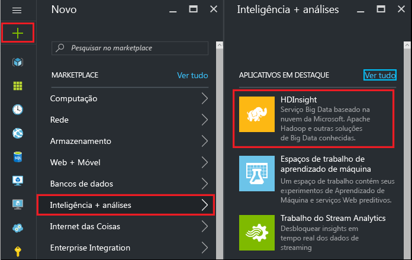
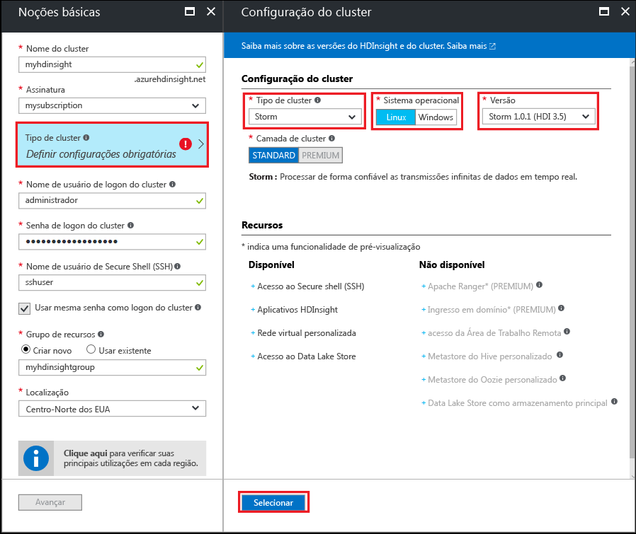

#Introdução com exemplos do Storm Starter para análise de Big Data no HDInsight baseado em Linux

O Apache Storm é um sistema de computação escalável, tolerante a falhas, distribuído e em tempo real para o processamento de fluxos de dados. Com o Storm no Azure HDInsight, você pode criar um cluster Storm baseado em nuvem que execute análise de big data em tempo real.

> [!IMPORTANT]
> O Linux é o único sistema operacional usado no HDInsight versão 3.4 ou superior. Para obter mais informações, confira [baixa do HDInsight no Windows](hdinsight-component-versioning.md#hdi-version-33-nearing-retirement-date).

## Pré-requisitos

[!INCLUDE [delete-cluster-warning](../../includes/hdinsight-delete-cluster-warning.md)]

* **Uma assinatura do Azure**. Consulte [Obter avaliação gratuita do Azure](https://azure.microsoft.com/documentation/videos/get-azure-free-trial-for-testing-hadoop-in-hdinsight/).

* **Familiaridade com o SSH e o SCP**. Para saber mais, confira [Usar SSH com HDInsight](hdinsight-hadoop-linux-use-ssh-unix.md).

## Criar um cluster Storm

Use as seguintes etapas para criar um cluster Storm no HDInsight:

1. No [portal do Azure](https://portal.azure.com), selecione **+ NOVO**, **Inteligência + Análises** e **HDInsight**.

    

2. Na folha **Básico** , insira as seguintes informações:

    * **Nome do cluster**: o nome do cluster HDInsight.
    * **Assinatura**: selecione a assinatura a ser utilizada.
    * **Nome de usuário de logon do cluster** e **Senha de logon do cluster**: logon ao acessar o cluster por HTTPS. Você pode usar essas credenciais para acessar serviços como a interface do usuário da Web do Ambari ou a API REST.
    * **Nome de usuário do SSH (Secure Shell)**: o logon usado ao acessar o cluster via SSH. Por padrão, a senha é a mesma do logon do cluster.
    * **Grupo de Recursos**: o grupo de recursos para criar o cluster.
    * **Local**: a região do Azure para criar o cluster.

    

3. Selecione **Tipo de cluster** e defina os seguintes valores na folha **Configuração de Cluster**:

    * **Tipo de Cluster**: Storm

    * **Sistema Operacional**: Linux

    * **Versão**: Storm 1.0.1 (HDI 3.5)

    * **Camada de Cluster**: Padrão

    Por fim, use o botão **Selecionar** para salvar as configurações.

    

4. Depois de selecionar o tipo de cluster, use o botão __Selecionar__ para definir o tipo de cluster. Em seguida, use o botão __Avançar__ para concluir a configuração básica.

5. Na folha **Armazenamento**, selecione ou crie uma Conta de armazenamento. Para as etapas neste documento, deixe os outros campos nessa folha com os valores padrão. Use o botão __Avançar__ para salvar a configuração de armazenamento.

    

6. Na folha **Resumo**, examine a configuração do cluster. Use os links __Editar__ para alterar as configurações que estão incorretas. Por fim, use o botão __Criar__ para criar o cluster.

    

    > [!NOTE]
    > Pode levar até 20 minutos para criar o cluster.

## Executar uma amostra do Starter Storm no HDInsight

1. Conecte-se ao cluster HDInsight usando SSH:

        ssh USERNAME@CLUSTERNAME-ssh.azurehdinsight.net

    Caso você tenha usado uma senha para proteger sua conta de usuário do SSH, ela será solicitada. Se você tiver usado uma chave pública, talvez precise usar o parâmetro `-i` para especificar a chave privada correspondente. Por exemplo: `ssh -i ~/.ssh/id_rsa USERNAME@CLUSTERNAME-ssh.azurehdinsight.net`.

    Para obter informações, consulte [Usar SSH com HDInsight](hdinsight-hadoop-linux-use-ssh-unix.md).

2. Use o comando a seguir para iniciar uma topologia de exemplo:

        storm jar /usr/hdp/current/storm-client/contrib/storm-starter/storm-starter-topologies-*.jar org.apache.storm.starter.WordCountTopology wordcount

    > [!NOTE]
    > Em versões anteriores do HDInsight, o nome de classe da topologia é `storm.starter.WordCountTopology` em vez de `org.apache.storm.starter.WordCountTopology`.

    Esse comando inicia a topologia WordCount de exemplo no cluster, com um nome amigável de 'wordcount'. Ela gera sentenças aleatoriamente e conta a ocorrência de cada palavra nas sentenças.

    > [!NOTE]
    > Ao enviar suas próprias topologias para o cluster, primeiro você deverá copiar o arquivo jar com o cluster antes de usar o comando `storm`. Use o comando `scp` para copiar o arquivo. Por exemplo, `scp FILENAME.jar USERNAME@CLUSTERNAME-ssh.azurehdinsight.net:FILENAME.jar`
    >
    > O exemplo de WordCount e outros exemplos de storm starter já estão incluídos no cluster em `/usr/hdp/current/storm-client/contrib/storm-starter/`.

Se você estiver interessado em ver o código-fonte para os exemplos do storm starter, você pode encontrar o código em [https://github.com/apache/storm/tree/1.0.x-branch/examples/storm-starter](https://github.com/apache/storm/tree/1.0.x-branch/examples/storm-starter). Esse link é para o Storm 1.0. x, que é fornecido com o HDInsight 3.5. Para outras versões do Storm, use o botão __Ramificação__ na parte superior da página para selecionar uma versão diferente do Storm.

## Monitorar a topologia

A IU do Storm fornece uma interface Web para trabalhar com as topologias em funcionamento, e é incluída no seu cluster HDInsight.

Use as etapas a seguir para monitorar a topologia usando a interface do usuário do Storm:

1. Para exibir a interface do usuário do Storm, abra um navegador da Web e acesse https://CLUSTERNAME.azurehdinsight.net/stormui. Substitua **CLUSTERNAME** pelo nome do cluster.

    > [!NOTE]
    > Se solicitado a forneça um nome de usuário e senha, insira o administrador de cluster (admin) e a senha que você usou ao criar o cluster.

2. Em **Resumo da topologia**, selecione a entrada **wordcount** na coluna **Nome**. São exibidas informações sobre a topologia.

    

    Esta página fornece as seguintes informações:

    * **Estatísticas de topologia** -informações básicas sobre o desempenho de topologia, organizadas em janelas de tempo.

        > [!NOTE]
        > A seleção de uma janela de tempo específica altera a janela de tempo das informações exibidas em outras seções da página.

    * **Spouts** -informações básicas sobre spouts, incluindo o último erro retornado por cada spout.

    * **Bolts** -informações básicas sobre bolts.

    * **Configuração de topologia** -informações detalhadas sobre a configuração de topologia.

    Esta página também fornece ações que podem ser executadas na topologia:

    * **Ativar** - retoma o processamento de uma topologia desativada.

    * **Desativar** - pausa uma topologia em execução.

    * **Reequilibrar** - ajusta o paralelismo da topologia. Você deve reequilibrar topologias em execução depois de alterar o número de nós no cluster. A redistribuição ajusta o paralelismo para compensar o aumento/diminuição do número de nós no cluster. Para saber mais, consulte [Noções básicas sobre o paralelismo de uma topologia do Storm](http://storm.apache.org/documentation/Understanding-the-parallelism-of-a-Storm-topology.html).

    * **Eliminar** - encerra uma topologia do Storm após o tempo limite especificado.

3. Nessa página, selecione uma entrada da seção **Spouts** ou **Bolts**. São exibidas informações sobre o componente selecionado.

    

    Esta página exibe as seguintes informações:

    * **Estatísticas de spout/bolt** -informações básicas sobre o desempenho de componente, organizadas em janelas de tempo.

        > [!NOTE]
        > A seleção de uma janela de tempo específica altera a janela de tempo das informações exibidas em outras seções da página.

    * **Estatísticas de entrada** (somente bolt) - informações sobre componentes que geram dados consumidos pelo bolt.

    * **Estatísticas de saída** -informações sobre dados emitidos por este bolt.

    * **Executores** -informações sobre instâncias deste componente.

    * **Erros** -erros produzidos por este componente.

4. Ao exibir os detalhes de um spout ou bolt, selecione uma entrada da coluna **Porta** na seção **Executores** para exibir detalhes de uma instância específica do componente.

        2015-01-27 14:18:02 b.s.d.task [INFO] Emitting: split default ["with"]
        2015-01-27 14:18:02 b.s.d.task [INFO] Emitting: split default ["nature"]
        2015-01-27 14:18:02 b.s.d.executor [INFO] Processing received message source: split:21, stream: default, id: {}, [snow]
        2015-01-27 14:18:02 b.s.d.task [INFO] Emitting: count default [snow, 747293]
        2015-01-27 14:18:02 b.s.d.executor [INFO] Processing received message source: split:21, stream: default, id: {}, [white]
        2015-01-27 14:18:02 b.s.d.task [INFO] Emitting: count default [white, 747293]
        2015-01-27 14:18:02 b.s.d.executor [INFO] Processing received message source: split:21, stream: default, id: {}, [seven]
        2015-01-27 14:18:02 b.s.d.task [INFO] Emitting: count default [seven, 1493957]

    Neste exemplo, a palavra **sete** ocorreu 1493957 vezes. Essa contagem é a quantidade de vezes que a palavra foi encontrada desde que a topologia foi iniciada.

## Parar a topologia

Volte para a página **Resumo da topologia** para a topologia de contagem de palavras e, em seguida, selecione o botão **Eliminar** da seção **Ações de topologia**. Quando solicitado, insira 10 para os segundos a aguardar antes da interrupção da topologia. Após o período de tempo limite, a topologia não será mais exibida quando você visitar a seção **Interface do usuário do Storm** do painel.

## Excluir o cluster

[!INCLUDE [delete-cluster-warning](../../includes/hdinsight-delete-cluster-warning.md)]

Se você tiver um problema com a criação de clusters HDInsight, consulte [requisitos de controle de acesso](hdinsight-administer-use-portal-linux.md#create-clusters).

## Próximas etapas

Nesse tutorial do Apache Storm você aprendeu os fundamentos do trabalho com o Storm no HDInsight. A seguir, aprenda a [Desenvolver topologias baseadas em Java usando o Maven](hdinsight-storm-develop-java-topology.md).

Se você já está familiarizado com o desenvolvimento de topologias baseadas em Java e deseja implantar uma topologia existente no HDInsight, consulte [Implantar e gerenciar topologias Apache Storm no HDInsight](hdinsight-storm-deploy-monitor-topology-linux.md).

Se você for um desenvolvedor .NET, poderá criar topologias em C# ou híbridas C#/Java usando o Visual Studio. Para obter mais informações, consulte [Desenvolver topologias C# para o Apache Storm no HDInsight usando ferramentas do Hadoop para Visual Studio](hdinsight-storm-develop-csharp-visual-studio-topology.md).

Por exemplo, topologias que podem ser usadas com o Storm no HDInsight. Confira os exemplos abaixo:

* [Topologias de exemplo para Storm no HDInsight](hdinsight-storm-example-topology.md)

[apachestorm]: https://storm.incubator.apache.org
[stormdocs]: http://storm.incubator.apache.org/documentation/Documentation.html
[stormstarter]: https://github.com/apache/storm/tree/master/examples/storm-starter
[stormjavadocs]: https://storm.incubator.apache.org/apidocs/
[azureportal]: https://manage.windowsazure.com/
[hdinsight-provision]: hdinsight-hadoop-provision-linux-clusters.md
[preview-portal]: https://portal.azure.com/

