<properties
	pageTitle="Tutorial do Apache Storm: Introdução ao Storm | Microsoft Azure"
	description="Introdução à análise de big data usando o Apache Storm e os exemplos do Storm Starter no HDInsight. Saiba como usar o Storm para processar dados em tempo real."
	keywords="apache storm, tutorial do apache storm, análise de big data, storm starter"
	services="hdinsight"
	documentationCenter=""
	authors="Blackmist"
	manager="paulettm"
	editor="cgronlun"
	tags="azure-portal"/>

<tags
   ms.service="hdinsight"
   ms.devlang="java"
   ms.topic="article"
   ms.tgt_pltfrm="na"
   ms.workload="big-data"
   ms.date="03/07/2016"
   ms.author="larryfr"/>

# Tutorial do Apache Storm: Introdução a exemplos do Storm Starter para análise de big data no HDInsight

O Apache Storm é um sistema de computação escalável, tolerante a falhas, distribuído e em tempo real para o processamento de fluxos de dados. Com o Storm no Microsoft Azure HDInsight, você pode criar um cluster Storm baseado em nuvem que execute análise de big data em tempo real.

> [AZURE.NOTE] As etapas deste artigo criam um cluster HDInsight baseado no Windows. Para as etapas criarem um Storm baseado em Linux no cluster HDInsight, confira [Tutorial do Apache Storm: Introdução ao exemplo do Storm Starter usando a análise de dados no HDInsight](hdinsight-apache-storm-tutorial-get-started-linux.md)

## Antes de começar

[AZURE.INCLUDE [delete-cluster-warning](../../includes/hdinsight-delete-cluster-warning.md)]

Você deve ter o seguinte para concluir com êxito este tutorial do Apache Storm:

- **Uma assinatura do Azure**. Consulte [Obter avaliação gratuita do Azure](https://azure.microsoft.com/documentation/videos/get-azure-free-trial-for-testing-hadoop-in-hdinsight/).

## Criar um cluster Storm

O Storm no HDInsight usa o armazenamento de Blobs do Azure para armazenar arquivos de log e topologias enviadas para o cluster. Use as seguintes etapas para criar uma conta de armazenamento do Azure a ser usada com o cluster:

1. Entre no [Portal do Azure][preview-portal].

2. Selecione **NOVO**, selecione __Análises de Dados__ e, em seguida, selecione __HDInsight__

	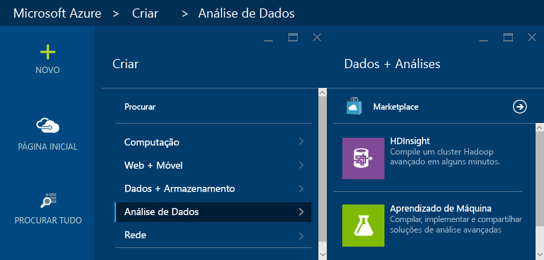

3. Insira um __Nome de Cluster__ e, em seguida, selecione __Storm__ para o __Tipo de cluster__. Uma marca de seleção verde será exibida ao lado do __Nome do Cluster__, se ele estiver disponível.

	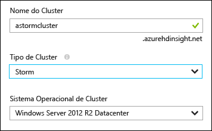

4. Se você tiver mais de uma assinatura, selecione a entrada __Assinatura__ para selecionar a assinatura do Azure que será usada para o cluster.

5. Para o __Grupo de Recursos__, você pode selecionar a entrada para ver uma lista de grupos de recursos existentes e, em seguida, selecionar um para criação do cluster. Ou então, você pode selecionar __Criar Novo__ e digitar o nome do novo grupo de recursos. Uma marca de seleção verde é exibida para indicar se o novo nome de grupo está disponível.

	> [AZURE.NOTE] Por padrão, essa entrada será um de seus grupos de recursos existentes, se houver algum disponível.

6. Selecione __Credenciais__ e, em seguida, digite um __Nome de Usuário para Logon no Cluster__ e __Senha para Logon no Cluster__. Por fim, use __Selecionar__ para definir as credenciais. A área de trabalho remota não será usada neste documento, então, você pode deixá-la desabilitada.

	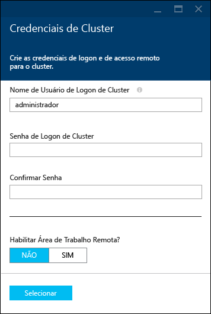

6. Para a __Fonte de Dados__, você pode selecionar a entrada para escolher uma fonte de dados existente ou criar uma nova.

	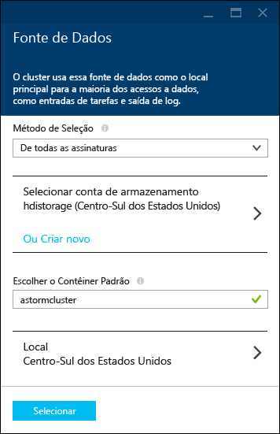

	No momento, você pode selecionar uma conta de armazenamento do Azure como fonte de dados para um cluster HDInsight. Use o item a seguir para entender as entradas na folha __Fonte de Dados__.

	- __Método de Seleção__: defina-o como __De todas as assinaturas__ para habilitar a procura de contas de armazenamento em suas assinaturas. Defina-o como __Chave de Acesso__ se você desejar inserir o __Nome de Armazenamento__ e a __Chave de Acesso__ de uma conta de armazenamento existente.

	- __Criar Novo__: use essa opção para criar uma nova conta de armazenamento. Use o campo exibido para inserir o nome da conta de armazenamento. Uma marca de seleção verde é exibida se o nome estiver disponível.

	- __Escolher Contêiner Padrão__: use essa opção para inserir o nome do contêiner padrão a ser usado para o cluster. Embora você possa inserir qualquer nome aqui, é recomendável usar o mesmo nome utilizado para o cluster, para que você possa reconhecer facilmente que o contêiner é usado para esse cluster específico.

	- __Local__: a região geográfica em que a conta de armazenamento estará ou na qual será criada.

		> [AZURE.IMPORTANT] Selecionar o local para a fonte de dados padrão também define o local do cluster HDInsight. O cluster e a fonte de dados padrão devem estar localizados na mesma região.

	- __Selecionar__: use essa opção para salvar a configuração da fonte de dados.

7. Selecione __Camadas de Preços de Nó__ para exibir informações sobre os nós que serão criados para esse cluster. Por padrão, o número de nós de trabalho é definido como __4__. Defina essa opção como __1__, pois isso será suficiente para este tutorial e reduzirá o custo do cluster. O custo estimado do cluster é mostrado na parte inferior dessa folha.

	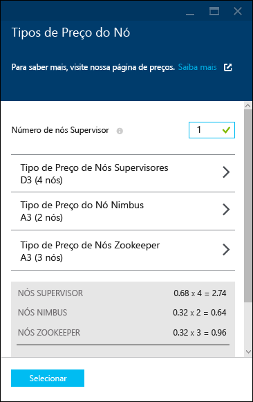

	Use __Selecionar__ para salvar as informações das __Camadas de Preços do Nó__.

8. Selecione __Configuração opcional__. Esta folha permite que você selecione a versão do cluster, defina outras configurações opcionais, como adicionar uma __Rede Virtual__ ou configurar um __Metastore externo__ para manter dados do Hive e Oozie.

	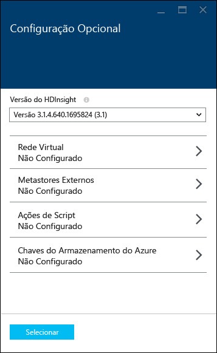

9. Verifique se a opção __Fixar no Quadro Inicial__ está marcada e selecione __Criar__. Isso cria o cluster e adiciona um bloco para esse cluster no Quadro Inicial do seu portal do Azure. O ícone indica que o cluster está provisionando e será alterado para exibir o ícone de HDInsight após a conclusão do provisionamento.

	| Durante o provisionamento | Provisionamento concluído |
	| ------------------ | --------------------- |
	|  | 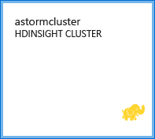 |

	> [AZURE.NOTE] Levará algum tempo para que o cluster seja criado, geralmente, cerca de 15 minutos. Use o bloco no Quadro Inicial ou a entrada __Notificações__ à esquerda da página para verificar o processo de provisionamento.

## Executar uma amostra do Starter Storm no HDInsight

Este tutorial Apache Storm apresenta análise de big data usando as amostras do Starter Storm no GitHub.

Cada Storm no cluster HDInsight é fornecido com o Painel Storm, que pode ser usado para carregar e executar topologias Storm no cluster. Cada cluster também vem com topologias de amostra que podem ser executadas diretamente no Painel Storm.

### Conectar-se ao painel

O painel está localizado em **https://&lt;clustername>.azurehdinsight.net//**, onde **clustername** é o nome do cluster. Você também encontrará um link para o painel selecionando o cluster no Quadro inicial e selecionando o link __Painel__ na parte superior da folha.

> [AZURE.NOTE] Ao conectar-se ao painel, é solicitado que você insira um nome de usuário e uma senha. Esse é o nome do administrador (**admin**) e a senha usada durante a criação do cluster.

Depois que o Painel Storm for carregado, você verá o formulário **Enviar Topologia**.

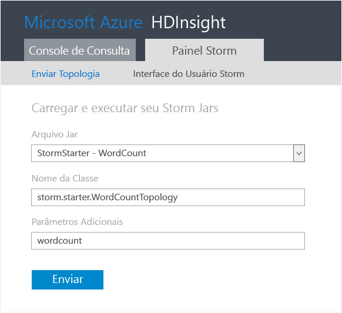

O formulário **Enviar Topologia** pode ser usado para carregar e executar arquivos. jar com topologias Storm. Ele também inclui várias amostras básicas fornecidas com o cluster.

### Executar a amostra de contagem de palavras do projeto Starter Storm no GitHub

As amostras fornecidas com o cluster incluem diversas variações de uma topologia de contagem de palavras. Esses exemplos incluem um **spout** que emite frases aleatoriamente e **bolts** que dividem cada frase em palavras individuais e contam quantas vezes cada palavra ocorreu. Esses exemplos são obtidos das [amostras do Storm Starter](https://github.com/apache/storm/tree/master/examples/storm-starter), que fazem parte do Apache Storm.

Execute as seguintes etapas para executar uma amostra do Storm Starter:

1. Selecione **StormStarter - WordCount** na lista suspensa **Arquivo Jar**. Isso preenche os campos **Nome de Classe** e **Parâmetros Adicionais** com os parâmetros dessa amostra.

	

	* **Nome da Classe**: a classe no arquivo .jar que envia a topologia.
	* **Parâmetros Adicionais**: quaisquer parâmetros necessários para a topologia. Neste exemplo, o campo é usado para fornecer um nome amigável para a topologia enviada.

2. Clique em **Enviar**. Após alguns instantes, o campo **Resultado** exibe o comando usado para enviar o trabalho, bem como os resultados do comando. O campo **Erro** exibe todos os erros ocorridos no envio da topologia.

	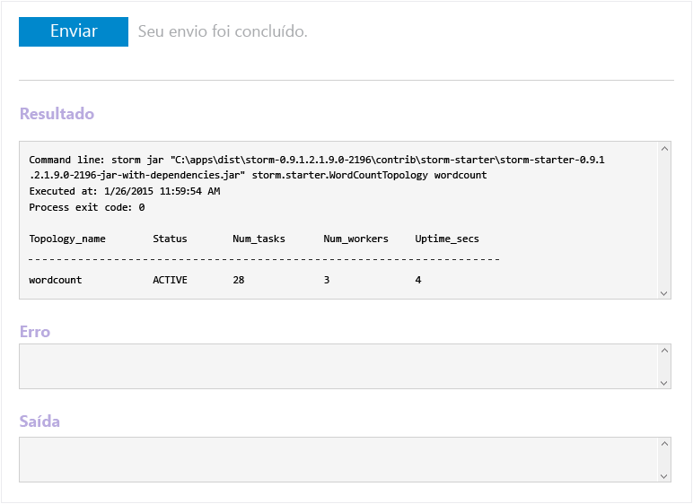

	> [AZURE.NOTE] Os resultados não indicam que a topologia foi concluída - **uma topologia Storm, uma vez iniciada, será executada até que você a interrompa.** A topologia de contagem de palavras gera frases aleatórias e mantém uma contagem de quantas vezes ela encontra cada palavra até ser interrompida.

### Monitorar a topologia

A interface do usuário do Storm pode ser usada para monitorar a topologia.

1. Selecione **Interface do Usuário do Storm** na parte superior do Painel Storm. Isso exibe informações de resumo para o cluster e todas as topologias em execução.

	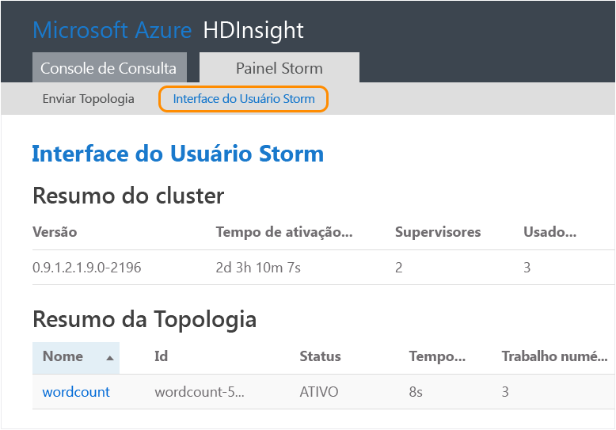

	Na página acima, você pode ver o tempo que a topologia está ativa, além do número de trabalhadores, executores e tarefas em uso.

	> [AZURE.NOTE] A coluna **Nome** contém o nome amigável fornecido anteriormente por meio do campo **Parâmetros Adicionais**.

4. Em **Resumo da topologia**, selecione a entrada **wordcount** na coluna **Nome**. Isso exibe mais informações sobre a topologia.

	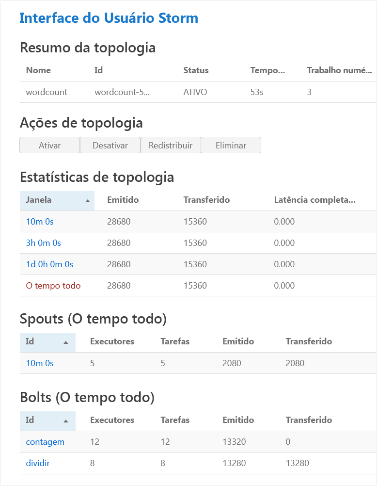

	Esta página fornece as seguintes informações:

	* **Estatísticas de topologia** -informações básicas sobre o desempenho de topologia, organizadas em janelas de tempo.

		> [AZURE.NOTE] A seleção de uma janela de tempo específica altera a janela de tempo das informações exibidas em outras seções da página.

	* **Spouts** -informações básicas sobre spouts, incluindo o último erro retornado por cada spout.

	* **Bolts** -informações básicas sobre bolts.

	* **Configuração de topologia** -informações detalhadas sobre a configuração de topologia.

	Esta página também fornece ações que podem ser executadas na topologia:

	* **Ativar** - retoma o processamento de uma topologia desativada.

	* **Desativar** - pausa uma topologia em execução.

	* **Reequilibrar** - ajusta o paralelismo da topologia. Você deve reequilibrar topologias em execução depois de alterar o número de nós no cluster. Isso permite que a topologia ajuste o paralelismo para compensar o aumento/diminuição do número de nós no cluster. Para saber mais, consulte [Noções básicas sobre o paralelismo de uma topologia do Storm](http://storm.apache.org/documentation/Understanding-the-parallelism-of-a-Storm-topology.html).

	* **Eliminar** - encerra uma topologia do Storm após o tempo limite especificado.

5. Nessa página, selecione uma entrada da seção **Spouts** ou **Bolts**. Isso exibe informações sobre o componente selecionado.

	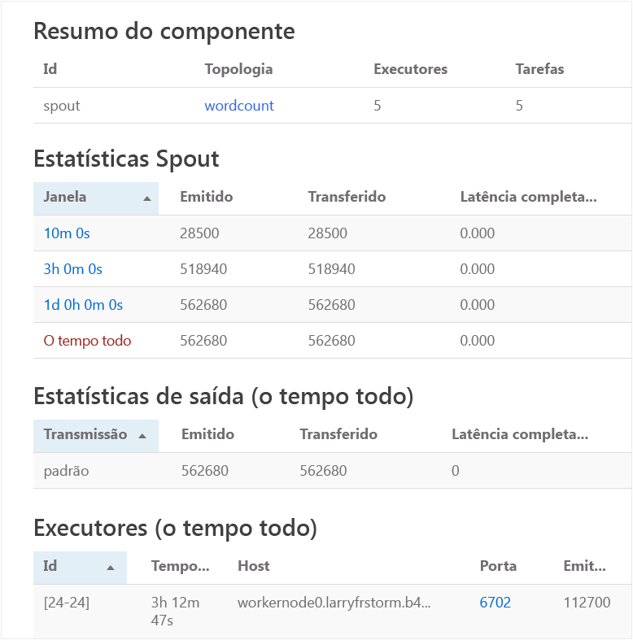

	Esta página exibe as seguintes informações:

	* **Estatísticas de spout/bolt** -informações básicas sobre o desempenho de componente, organizadas em janelas de tempo.

		> [AZURE.NOTE] A seleção de uma janela de tempo específica altera a janela de tempo das informações exibidas em outras seções da página.

	* **Estatísticas de entrada** (somente bolt) - informações sobre componentes que geram dados consumidos pelo bolt.

	* **Estatísticas de saída** -informações sobre dados emitidos por este bolt.

	* **Executores** -informações sobre instâncias deste componente.

	* **Erros** -erros produzidos por este componente.

5. Ao exibir os detalhes de um spout ou bolt, selecione uma entrada da coluna **Porta** na seção **Executores** para exibir detalhes de uma instância específica do componente.

		2015-01-27 14:18:02 b.s.d.task [INFO] Emitting: split default ["with"]
		2015-01-27 14:18:02 b.s.d.task [INFO] Emitting: split default ["nature"]
		2015-01-27 14:18:02 b.s.d.executor [INFO] Processing received message source: split:21, stream: default, id: {}, [snow]
		2015-01-27 14:18:02 b.s.d.task [INFO] Emitting: count default [snow, 747293]
		2015-01-27 14:18:02 b.s.d.executor [INFO] Processing received message source: split:21, stream: default, id: {}, [white]
		2015-01-27 14:18:02 b.s.d.task [INFO] Emitting: count default [white, 747293]
		2015-01-27 14:18:02 b.s.d.executor [INFO] Processing received message source: split:21, stream: default, id: {}, [seven]
		2015-01-27 14:18:02 b.s.d.task [INFO] Emitting: count default [seven, 1493957]

	Por meio desses dados, você pode ver que a palavra **seven** ocorreu 1,493,957 vezes. Essa é a quantidade de vezes em que ela foi encontrada desde que a topologia foi iniciada.

### Parar a topologia

Volte para a página **Resumo da topologia** para a topologia de contagem de palavras e, em seguida, selecione **Eliminar** da seção **Ações de topologia**. Quando solicitado, insira 10 para os segundos a aguardar antes da interrupção da topologia. Após o período de tempo limite, a topologia não será mais exibida quando você visitar a seção **Interface do usuário do Storm** do painel.

##Excluir o cluster

[AZURE.INCLUDE [delete-cluster-warning](../../includes/hdinsight-delete-cluster-warning.md)]

## Resumo

Neste tutorial sobre o Storm Apache, você usou o Storm Starter para aprender a criar um Storm no cluster HDInsight e a usar o Painel Storm para implantar, monitorar e gerenciar topologias Storm.

## Próximas etapas

* **Ferramentas do HDInsight para Visual Studio** - as Ferramentas do HDInsight permitem que você use o Visual Studio para enviar, monitorar e gerenciar topologias Storm semelhantes ao Painel Storm mencionado anteriormente. As Ferramentas do HDInsight também oferecem a capacidade de criar topologias Storm C# e incluem topologias de amostra que você pode implantar e executar no cluster.

	Para saber mais, confira [Introdução ao uso das Ferramentas do HDInsight para Visual Studio](hdinsight-hadoop-visual-studio-tools-get-started.md).

* **Arquivos de exemplo** - o cluster Storm do HDInsight oferece vários exemplos no diretório **%STORM\_HOME%\\contrib**. Cada exemplo deve conter o seguinte:

	* O código-fonte - por exemplo, storm-starter-0.9.1.2.1.5.0-2057-sources.jar

	* Os documentos Java - por exemplo, storm-starter-0.9.1.2.1.5.0-2057-javadoc.jar

	* O exemplo - por exemplo, storm-starter-0.9.1.2.1.5.0-2057-jar-with-dependencies.jar

	Use o comando 'jar' para extrair o código-fonte ou os documentos Java. Por exemplo, 'jar -xvf storm-starter-0.9.1.2.1.5.0.2057-javadoc.jar'.

	> [AZURE.NOTE] Os documentos Java consistem em páginas da Web. Após a extração, use um navegador para exibir o arquivo **index.html**.

	Para acessar essas amostras, você deve habilitar a Área de Trabalho Remota para o Storm no cluster HDInsight e, em seguida, copiar os arquivos de **%STORM\_HOME%\\contrib**.

* O documento a seguir contém uma lista de outros exemplos que podem ser usados com o Storm no HDInsight:

	* [Topologias de exemplo para Storm no HDInsight](hdinsight-storm-example-topology.md)

[apachestorm]: https://storm.incubator.apache.org
[stormdocs]: http://storm.incubator.apache.org/documentation/Documentation.html
[stormstarter]: https://github.com/apache/storm/tree/master/examples/storm-starter
[stormjavadocs]: https://storm.incubator.apache.org/apidocs/
[azureportal]: https://manage.windowsazure.com/
[hdinsight-provision]: hdinsight-provision-clusters.md
[preview-portal]: https://portal.azure.com/

<!---HONumber=AcomDC_0309_2016-->