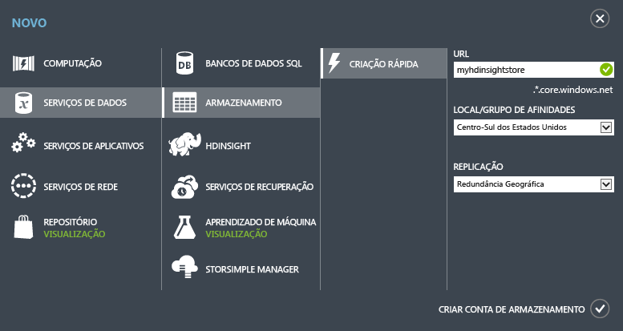

<properties
	pageTitle="Tutorial do Apache Storm: Introdução ao Storm | Microsoft Azure"
	description="Introdução à análise de big data usando o Apache Storm e os exemplos do Storm Starter no HDInsight. Saiba como usar o Storm para processar dados em tempo real."
	keywords="apache storm,apache storm tutorial,big data analytics,storm starter"
	services="hdinsight"
	documentationCenter=""
	authors="Blackmist"
	manager="paulettm"
	editor="cgronlun"/>

<tags
   ms.service="hdinsight"
   ms.devlang="java"
   ms.topic="get-started-article"
   ms.tgt_pltfrm="na"
   ms.workload="big-data"
   ms.date="07/06/2015"
   ms.author="larryfr"/>

# Tutorial do Apache Storm: Introdução a exemplos do Storm Starter para análise de big data no HDInsight

O Apache Storm é um sistema de computação escalável, tolerante a falhas, distribuído e em tempo real para o processamento de fluxos de dados. Com o Storm no Azure HDInsight, você pode criar um cluster Storm baseado em nuvem que execute análise de big data em tempo real.

## Antes de começar

Você deve ter o seguinte para concluir com êxito este tutorial do Apache Storm:

- **Uma assinatura do Azure**. Consulte [Obter avaliação gratuita do Azure](http://azure.microsoft.com/documentation/videos/get-azure-free-trial-for-testing-hadoop-in-hdinsight/).

## Criar uma conta de Armazenamento do Azure

O Storm no HDInsight usa o armazenamento de Blobs do Azure para armazenar arquivos de log e topologias enviadas para o cluster. Use as seguintes etapas para criar uma conta de armazenamento do Azure a ser usada com o cluster:

1. Entre no [Portal do Azure](http://manage.windowsazure.com/).

2. Clique em **NOVO** no canto inferior esquerdo, aponte para **SERVIÇOS DE DADOS**, aponte para **ARMAZENAMENTO** e, em seguida, clique em **CRIAÇÃO RÁPIDA**.

	

3. Insira informações em **URL**, **LOCAL** e **REPLICAÇÃO** e, em seguida, clique em **CRIAR CONTA DE ARMAZENAMENTO**. Não selecione um grupo de afinidade ao criar um armazenamento para o HDInsight. Você verá a nova conta de Armazenamento na lista de armazenamento.

	>[AZURE.NOTE]A opção de criação rápida para provisionar um cluster HDInsight, como a que usamos neste tutorial, não solicita um local durante o provisionamento do cluster. Em vez disso, por padrão, ele colocaliza o cluster no mesmo data center que a conta de Armazenamento. Portanto, crie sua conta de Armazenamento nos locais com suporte para o cluster, que são: **Ásia Oriental**, **Sudeste da Ásia**, **Norte da Europa**, **Europa Ocidental**, **Leste dos EUA**, **Oeste dos EUA**, **Centro Norte dos EUA**, **Centro Sul dos EUA**.

4. Aguarde até que o **STATUS** da nova conta do Armazenamento mude para **Online**.

Para obter mais informações sobre como criar contas de Armazenamento, [Como criar uma conta de armazenamento](../storage/storage-create-storage-account.md).

##Provisionar um cluster Storm no portal do Azure

Ao provisionar um cluster HDInsight, você provisiona recursos de computação do Azure com aplicativos do Apache Storm e relacionados. Também é possível criar clusters Hadoop para outras versões usando o portal do Azure, cmdlets do Azure PowerShell para HDInsight ou o SDK .NET do HDInsight. Para obter instruções, consulte [Provisionar clusters HDInsight usando opções personalizadas][hdinsight-provision]. Para obter informações sobre as diferentes versões do HDInsight e seus contratos de nível de serviço (SLAs), consulte a página [Controle de versão de componente do HDInsight](hdinsight-component-versioning.md).

[AZURE.INCLUDE [provisioningnote](../../includes/hdinsight-provisioning.md)]

1. Entre no [Portal do Azure][azureportal].

2. Clique em **HDInsight** à esquerda e depois em **+NOVO** no canto inferior esquerdo da página.

3. Clique no ícone do HDInsight na segunda coluna e selecione **STORM**.

	

4. Insira um nome de cluster exclusivo e uma senha exclusiva para a conta de administrador. Para **CONTA DE ARMAZENAMENTO**, selecione a conta de Armazenamento criada anteriormente.

	Para **TAMANHO DO CLUSTER**, selecione um tamanho do **nó de dados 1** a ser usado para esse cluster. Isso serve para minimizar o custo associado ao cluster. Para uso em produção, você criaria um cluster maior.

	> [AZURE.NOTE]A conta de administrador para o cluster é chamada de **admin**. A senha inserida é a senha dessa conta. Você precisará dessas informações para executar ações com o cluster, como o envio ou o gerenciamento de topologias Storm.

5. Por fim, escolha a marca de seleção ao lado de **CRIAR CLUSTER HDINSIGHT** para criar o cluster.

> [AZURE.NOTE]O provisionamento do cluster demora um pouco, geralmente menos de 15 minutos, para criar o cluster, configurar o software e instalar as topologias e os dados de exemplo.

##Executar uma amostra do Starter Storm no HDInsight

Este tutorial Apache Storm apresenta análise de big data usando as amostras do Starter Storm no GitHub.

Cada Storm no cluster HDInsight é fornecido com o Painel Storm, que pode ser usado para carregar e executar topologias Storm no cluster. Cada cluster também vem com topologias de amostra que podem ser executadas diretamente no Painel Storm.

###Conectar-se ao painel

O painel está localizado em **https://&lt;clustername>.azurehdinsight.net//**, onde **clustername** é o nome do cluster. Você também encontrará um link para o painel na parte inferior da página do portal do Azure para seu cluster.

> [AZURE.NOTE]Ao conectar-se ao painel, você deverá inserir um nome de usuário e uma senha. Esse é o nome do administrador (* * admin * *) e a senha usada durante a criação do cluster.

Depois que o Painel Storm for carregado, você verá o formulário **Enviar Topologia**.

O formulário **Enviar Topologia** pode ser usado para carregar e executar arquivos. jar com topologias Storm. Ele também inclui várias amostras básicas fornecidas com o cluster.

###Executar a amostra de contagem de palavras do projeto Starter Storm no GitHub

As amostras fornecidas com o cluster incluem diversas variações de uma topologia de contagem de palavras. Esses exemplos incluem um **spout** que emite frases aleatoriamente e **bolts** que dividem cada frase em palavras individuais e contam quantas vezes cada palavra ocorreu. Esses exemplos são obtidos das [amostras do Storm Starter](https://github.com/apache/storm/tree/master/examples/storm-starter), que fazem parte do Apache Storm.

Execute as seguintes etapas para executar uma amostra do Storm Starter:

1. Selecione **StormStarter - WordCount** na lista suspensa **Arquivo Jar**. Isso deve preencher os campos **Nome da Classe** e **Parâmetros Adicionais** com os parâmetros da amostra.

	

	* **Nome da Classe**: a classe no arquivo .jar que envia a topologia.
	* **Parâmetros Adicionais**: quaisquer parâmetros necessários para a topologia. Neste exemplo, o campo é usado para fornecer um nome amigável para a topologia enviada.

2. Clique no botão **Enviar**. Após alguns instantes, o campo **Resultado** exibirá o comando usado para enviar o trabalho, bem como os resultados do comando. O campo **Erro** exibe todos os erros ocorridos no envio da topologia.

	

	> [AZURE.NOTE]Os resultados não indicam que a topologia foi concluída - **uma topologia Storm, uma vez iniciada, será executada até que você a interrompa.** A topologia de contagem de palavras gerará frases aleatórias e manterá uma contagem de quantas vezes ela encontra cada palavra até ser interrompida.

###Monitorar a topologia

A interface do usuário do Storm pode ser usada para monitorar a topologia.

1. Selecione **Interface do Usuário do Storm** na parte superior do Painel Storm. Isso exibirá informações de resumo para o cluster e todas as topologias em execução.

	

	Na página acima, você pode ver o tempo que a topologia está ativa, além do número de trabalhadores, executores e tarefas em uso.

	> [AZURE.NOTE]A coluna **Nome** contém o nome amigável fornecido anteriormente por meio do campo **Parâmetros Adicionais**.

4. Em **Resumo da topologia**, selecione a entrada **wordcount** na coluna **Nome**. Isso exibirá mais informações sobre a topologia.

	

	Esta página fornece as seguintes informações:

	* **Estatísticas de topologia** -informações básicas sobre o desempenho de topologia, organizadas em janelas de tempo.

		> [AZURE.NOTE]A seleção de uma janela de tempo específica altera a janela de tempo das informações exibidas em outras seções da página.

	* **Spouts** -informações básicas sobre spouts, incluindo o último erro retornado por cada spout.

	* **Bolts** -informações básicas sobre bolts.

	* **Configuração de topologia** -informações detalhadas sobre a configuração de topologia.

	Esta página também fornece ações que podem ser executadas na topologia:

	* **Ativar** - retoma o processamento de uma topologia desativada.

	* **Desativar** - pausa uma topologia em execução.

	* **Reequilibrar** - ajusta o paralelismo da topologia. Você deve reequilibrar topologias em execução depois de alterar o número de nós no cluster. Isso permite que a topologia ajuste o paralelismo para compensar o aumento/diminuição do número de nós no cluster. Para obter mais informações, consulte [Noções básicas sobre o paralelismo de uma topologia Storm](http://storm.apache.org/documentation/Understanding-the-parallelism-of-a-Storm-topology.html).

	* **Eliminar** - encerra uma topologia do Storm após o tempo limite especificado.

5. Nessa página, selecione uma entrada da seção **Spouts** ou **Bolts**. Isso exibirá informações sobre o componente selecionado.

	

	Esta página exibe as seguintes informações:

	* **Estatísticas de spout/bolt** -informações básicas sobre o desempenho de componente, organizadas em janelas de tempo.

		> [AZURE.NOTE]A seleção de uma janela de tempo específica altera a janela de tempo das informações exibidas em outras seções da página.

	* **Estatísticas de entrada** (somente bolt) - informações sobre componentes que geram dados consumidos pelo bolt.

	* **Estatísticas de saída** -informações sobre dados emitidos por este bolt.

	* **Executores** -informações sobre instâncias deste componente.

	* **Erros** -erros produzidos por este componente.

5. Ao exibir os detalhes de um spout ou bolt, selecione uma entrada da coluna **Porta** na seção **Executores** para exibir detalhes de uma instância específica do componente.

		2015-01-27 14:18:02 b.s.d.task [INFO] Emitting: split default ["with"]
		2015-01-27 14:18:02 b.s.d.task [INFO] Emitting: split default ["nature"]
		2015-01-27 14:18:02 b.s.d.executor [INFO] Processing received message source: split:21, stream: default, id: {}, [snow]
		2015-01-27 14:18:02 b.s.d.task [INFO] Emitting: count default [snow, 747293]
		2015-01-27 14:18:02 b.s.d.executor [INFO] Processing received message source: split:21, stream: default, id: {}, [white]
		2015-01-27 14:18:02 b.s.d.task [INFO] Emitting: count default [white, 747293]
		2015-01-27 14:18:02 b.s.d.executor [INFO] Processing received message source: split:21, stream: default, id: {}, [seven]
		2015-01-27 14:18:02 b.s.d.task [INFO] Emitting: count default [seven, 1493957]

	A partir desses dados, você pode ver que a palavra **seven** ocorreu 1493957 vezes. Essa é a quantidade de vezes em que ela foi encontrada desde que a topologia foi iniciada.

###Parar a topologia

Volte para a página **Resumo da topologia** para a topologia de contagem de palavras e, em seguida, selecione o botão **Eliminar** da seção **Ações de topologia**. Quando solicitado, insira 10 para os segundos a aguardar antes da interrupção da topologia. Após o período de tempo limite, a topologia não será mais exibida quando você visitar a seção **Interface do usuário do Storm** do painel.

##Resumo

Neste tutorial sobre o Storm Apache, você usou o Storm Starter para aprender a criar um Storm no cluster HDInsight e a usar o Painel Storm para implantar, monitorar e gerenciar topologias Storm.

##Próximas etapas

* **Ferramentas do HDInsight para Visual Studio** - as Ferramentas do HDInsight permitem que você use o Visual Studio para enviar, monitorar e gerenciar topologias Storm semelhantes ao Painel Storm mencionado anteriormente. As Ferramentas do HDInsight também oferecem a capacidade de criar topologias Storm C# e incluem topologias de amostra que você pode implantar e executar no cluster.

	Para obter mais informações, consulte [Introdução ao uso das Ferramentas do HDInsight para Visual Studio](hdinsight-hadoop-visual-studio-tools-get-started.md).

* **Arquivos de exemplo** - o cluster Storm do HDInsight oferece vários exemplos no diretório **%STORM_HOME%\\contrib**. Cada exemplo deve conter o seguinte:

	* O código-fonte - por exemplo, storm-starter-0.9.1.2.1.5.0-2057-sources.jar

	* Os documentos Java - por exemplo, storm-starter-0.9.1.2.1.5.0-2057-javadoc.jar

	* O exemplo - por exemplo, storm-starter-0.9.1.2.1.5.0-2057-jar-with-dependencies.jar

	Use o comando 'jar' para extrair o código-fonte ou os documentos Java. Por exemplo, 'jar -xvf storm-starter-0.9.1.2.1.5.0.2057-javadoc.jar'.

	> [AZURE.NOTE]Os documentos Java consistem em páginas da Web. Após a extração, use um navegador para exibir o arquivo **index.html**.

	Para acessar essas amostras, você deve habilitar a Área de Trabalho Remota para o Storm no cluster HDInsight e, em seguida, copiar os arquivos de **%STORM_HOME%\\contrib**.

* O documento a seguir contém uma lista de outros exemplos que podem ser usados com o Storm no HDInsight:

	* [Topologias de exemplo para Storm no HDInsight](hdinsight-storm-example-topology.md)

[apachestorm]: https://storm.incubator.apache.org
[stormdocs]: http://storm.incubator.apache.org/documentation/Documentation.html
[stormstarter]: https://github.com/apache/storm/tree/master/examples/storm-starter
[stormjavadocs]: https://storm.incubator.apache.org/apidocs/
[azureportal]: https://manage.windowsazure.com/
[hdinsight-provision]: hdinsight-provision-clusters.md

<!---HONumber=July15_HO4-->