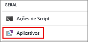
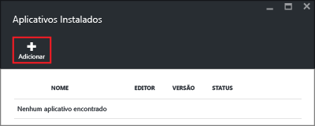
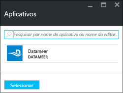

# Instale aplicativos de terceiros do Hadoop no Azure HDInsight

Neste artigo, você aprenderá a instalar um aplicativo de terceiros do Hadoop já publicado no Azure HDInsight. Para obter instruções sobre como instalar seu próprio aplicativo, confira [Instalar aplicativos personalizados do HDInsight](hdinsight-apps-install-custom-applications.md).

Um aplicativo do HDInsight é um aplicativo que os usuários podem instalar em um cluster HDInsight baseado em Linux. Esses aplicativos podem ser desenvolvidos pela Microsoft, por ISVs (fornecedores independentes de software) ou por conta própria.  

No momento, há quatro aplicativos publicados:

* **DDS DATAIKU no HDInsight**: Dataiku DSS (Studio de ciência de dados) é um software que permite que profissionais de dados (os cientistas de dados, analistas de negócios, os desenvolvedores...) para criar um protótipo, criar em implantar serviços altamente específicos que transform dados brutos em previsões de impacto de negócios.
* **Datameer**: o [Datameer](http://www.datameer.com/documentation/display/DAS50/Home?ls=Partners&lsd=Microsoft&c=Partners&cd=Microsoft) oferece aos analistas uma forma interativa de descobrir, analisar e visualizar os resultados em Big Data. Inclua facilmente outras fontes de dados para descobrir novas relações e obter com rapidez as respostas de que precisa.
* O **Coletor de Dados de Streamsets para HDnsight** fornece um IDE (ambiente de desenvolvimento integrado) completo que permite projetar, testar, implantar e gerenciar pipelines de ingestão de qualquer ponto a qualquer ponto, que combinam dados de lote e malha e incluem uma variedade de transformações no fluxo – tudo sem ter que escrever código personalizado. 
* **Cask CDAP para o HDInsight** fornece a primeira plataforma de integração unificada para Big Data, o que reduz o tempo de inatividade na produção para aplicativos de dados e data lakes em 80%. Este aplicativo só dá suporte a clusters HBase 3.4 padrão.
* **Inteligência Artificial H2O para o HDInsight (Beta)** A água gaseificada H2O oferece suporte aos seguintes algoritmos distribuídos: GLM, Naïve Bayes, Distributed Random Forest, Gradient Boosting Machine, Deep Neural Networks, Deep learning, K-means, PCA, Generalized Low Rank Models, Anomaly Detection e Autoencoders.
* **Kyligence Analytics Platform** O KAP (Kyligence Analytics Platform) é um data warehouse pronto para empresas com tecnologia Apache Kylin e Apache Hadoop; ele capacita a latência de consulta de fração de segundos em conjuntos de dados de escala, além de simplificar a análise de dados para analistas e usuários corporativos. 
* **SnapLogic Hadooplex** O SnapLogic Hadooplex em execução no HDInsight permite que os clientes obtenham percepções corporativas mais rapidamente, fornecendo preparação e ingestão de dados por autoatendimento de praticamente qualquer fonte para a plataforma de nuvem do Microsoft Azure.
* **Spark Job Server for KNIME Spark Executor** O Spark Job Server for KNIME Spark Executor é usado para conectar a Plataforma de Análise KNIME aos clusters HDInsight.

As instruções fornecidas neste artigo usam o portal do Azure. Você também pode exportar o modelo do Azure Resource Manager do portal ou obter uma cópia do modelo do Resource Manager de fornecedores e usar o Azure PowerShell e a CLI do Azure para implantar o modelo.  Confira [Criar clusters Hadoop baseados em Linux no HDInsight usando modelos do Gerenciador de Recursos](hdinsight-hadoop-create-linux-clusters-arm-templates.md).

## Pré-requisitos
Se você quiser instalar aplicativos do HDInsight em um cluster HDInsight existente, precisará ter um cluster HDInsight. Para criar um, confira [Criar clusters](hdinsight-hadoop-linux-tutorial-get-started.md#create-cluster). Você também pode instalar aplicativos do HDInsight quando cria um cluster HDInsight.

## Instalar aplicativos em clusters existentes
O procedimento a seguir mostra como instalar aplicativos do HDInsight em um cluster HDInsight existente.

**Para instalar um aplicativo do HDInsight**

1. Entre no [Portal do Azure](https://portal.azure.com).
2. Clique em **Clusters HDInsight** no menu esquerdo.  Se você não conseguir ver a opção, clique em **Mais Serviços** e clique em **Clusters HDInsight**.
3. Clique em um cluster HDInsight.  Se não tiver um, você deverá criá-lo primeiro.  Confira [Criar clusters](hdinsight-hadoop-linux-tutorial-get-started.md#create-cluster).
4. Clique em **Aplicativos** sob a categoria **Configurações**. Você pode ver uma lista de aplicativos instalados. Se você não encontrar aplicativos, isso significará que não há nenhum aplicativo para esta versão do cluster HDInsight.
   
    
5. Clique em **Adicionar** no menu da folha. 
   
    
   
    Você poderá ver uma lista de aplicativos existentes do HDInsight.
   
    
6. Clique em um dos aplicativos, aceite os termos legais e clique em **Selecionar**.

Você pode ver o status de instalação nas notificações do portal (clique no ícone de sino na parte superior do portal). Depois que o aplicativo for instalado, ele será exibido na folha Aplicativos Instalados.

## Instalar aplicativos durante a criação do cluster
Você tem a opção de instalar aplicativos do HDInsight ao criar um cluster. Durante o processo, os aplicativos do HDInsight são instalados depois que o cluster é criado e está no estado de execução. O procedimento a seguir mostra como instalar aplicativos do HDInsight quando você cria um cluster.

**Para instalar um aplicativo do HDInsight**

1. Entre no [Portal do Azure](https://portal.azure.com).
2. Clique em **NOVO**, em **Análises de Dados** e em **HDInsight**.
3. Insira o **Nome do Cluster**: esse nome deve ser globalmente exclusivo.
4. Clique em **Assinatura** para escolher a assinatura do Azure usada para o cluster.
5. Clique em **Selecionar Tipo de cluster**, e, em seguida, selecione:
   
   * **Tipo de Cluster**: se não souber o que escolher, selecione **Hadoop**. É o tipo de cluster mais popular.
   * **Sistema Operacional**: selecione **Linux**.
   * **Versão**: use a versão padrão se não souber o que escolher. Para obter mais informações, consulte [Versões de cluster do HDInsight](hdinsight-component-versioning.md).
   * **Camada de Cluster**: o Azure HDInsight fornece as ofertas de nuvem de Big Data em duas categorias: camada Standard e camada Premium. Para obter mais informações, consulte [Camadas de cluster](hdinsight-hadoop-provision-linux-clusters.md#cluster-tiers).
6. Clique em **Aplicativos**, clique em um dos aplicativos publicados e em **Selecionar**.
7. Clique em **Credenciais** e, em seguida, digite uma senha para o usuário admin. Você também precisa inserir um **Nome de Usuário de SSH** e uma **SENHA** ou uma **CHAVE PÚBLICA**, que é usada para autenticar o usuário SSH. Usar uma chave pública é a abordagem recomendada. Clique em **Selecionar** na parte inferior para salvar a configuração de credenciais.
8. Clique em **Fonte de Dados**, selecione uma das contas de armazenamento existentes ou crie uma nova conta de armazenamento a ser usada como a conta de armazenamento padrão para o cluster.
9. Clique em **Grupo de Recursos** para selecionar um grupo de recursos existente ou crie um novo clicando em **Novo**
10. Na folha **Novo Cluster HDInsight**, certifique-se de que a opção **Fixar no Quadro Inicial** está marcada e clique em **Criar**. 

## Listar os aplicativos do HDInsight instalados e as propriedades
O portal mostra uma lista dos aplicativos do HDInsight instalados para um cluster e as propriedades de cada aplicativo instalado.

**Para listar o aplicativo do HDInsight e exibir as propriedades**

1. Entre no [Portal do Azure](https://portal.azure.com).
2. Clique em **Clusters HDInsight** no menu esquerdo.  Se você não conseguir ver a opção, clique em **Procurar** e clique em **Clusters HDInsight**.
3. Clique em um cluster HDInsight.
4. Na folha **Configurações**, clique em **Aplicativos** na categoria **Geral**. A folha Aplicativos Instalados lista todos os aplicativos instalados. 
   
    
5. Clique em um dos aplicativos instalados para mostrar a propriedade. A folha de propriedades lista:
   
   * Nome do aplicativo: nome do aplicativo.
   * Status: status do aplicativo. 
   * Página da Web: a URL do aplicativo Web que você implantou no nó de borda. A credencial é igual às credenciais de usuário HTTP que você configurou para o cluster.
   * Ponto de extremidade HTTP: a credencial é igual às credenciais de usuário HTTP que você configurou para o cluster. 
   * Ponto de extremidade SSH: você pode usar o SSH para se conectar ao nó de borda. As credenciais SSH são iguais às credenciais de usuário SSH que você configurou para o cluster. Para obter informações, consulte [Usar SSH com HDInsight](hdinsight-hadoop-linux-use-ssh-unix.md).
6. Para excluir um aplicativo, clique nele com o botão direito do mouse e clique em **Excluir** no menu de contexto.

## Conectar-se ao nó de borda
Você pode se conectar ao nó de borda usando HTTP e SSH. As informações de ponto de extremidade podem ser encontradas no [portal](#list-installed-hdinsight-apps-and-properties). Para saber mais, confira [Usar SSH com HDInsight](hdinsight-hadoop-linux-use-ssh-unix.md).

As credenciais de ponto de extremidade HTTP são as credenciais de usuário HTTP que você configurou para o cluster HDInsight. As credenciais de ponto de extremidade do SSH são as credenciais SSH que você configurou para o cluster HDInsight.

## Solucionar problemas
Confira [Solucionar problemas de instalação](hdinsight-apps-install-custom-applications.md#troubleshoot-the-installation).

## Próximas etapas
* [Instalar aplicativos personalizados do HDInsight](hdinsight-apps-install-custom-applications.md): saiba como implantar um aplicativo do HDInsight não publicado no HDInsight.
* [Publicar aplicativos do HDInsight](hdinsight-apps-publish-applications.md): saiba como publicar seus aplicativos personalizados do HDInsight no Azure Marketplace.
* [MSDN: instalar um aplicativo do HDInsight](https://msdn.microsoft.com/library/mt706515.aspx): saiba como definir aplicativos do HDInsight.
* [Personalizar clusters HDInsight baseados em Linux usando a Ação de Script](hdinsight-hadoop-customize-cluster-linux.md): saiba como usar a Ação de Script para instalar aplicativos adicionais.
* [Personalizar clusters Hadoop baseados em Linux no HDInsight usando modelos do Resource Manager](hdinsight-hadoop-create-linux-clusters-arm-templates.md): saiba como chamar modelos do Resource Manager para criar clusters HDInsight.
* [Usar nós de borda vazios no HDInsight](hdinsight-apps-use-edge-node.md): saiba como usar um nó de borda vazio para acessar o cluster HDInsight, testar e hospedar aplicativos HDInsight.

