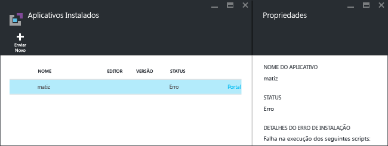
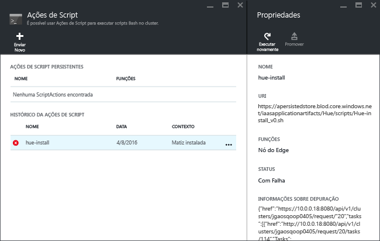

# Instale aplicativos personalizados do Hadoop no Azure HDInsight

Neste artigo, você aprenderá a instalar um aplicativo do Hadoop no Azure HDInsight, que não foi publicado no portal do Azure. O aplicativo que você irá instalar neste artigo é o [Hue](http://gethue.com/).

Um aplicativo do HDInsight é um aplicativo que os usuários podem instalar em um cluster HDInsight baseado em Linux.  Esses aplicativos podem ser desenvolvidos pela Microsoft, por ISVs (fornecedores independentes de software) ou por conta própria.  

Outros artigos relacionados:

* [Instalar aplicativos do HDInsight](hdinsight-apps-install-applications.md): saiba como instalar um aplicativo do HDInsight em seus clusters.
* [Publicar aplicativos do HDInsight](hdinsight-apps-publish-applications.md): saiba como publicar seus aplicativos personalizados do HDInsight no Azure Marketplace.
* [MSDN: instalar um aplicativo do HDInsight](https://msdn.microsoft.com/library/mt706515.aspx): saiba como definir aplicativos do HDInsight.

## Pré-requisitos
Se você quiser instalar aplicativos do HDInsight em um cluster HDInsight existente, precisará ter um cluster HDInsight. Para criar um, confira [Criar clusters](hdinsight-hadoop-linux-tutorial-get-started.md#create-cluster). Você também pode instalar aplicativos do HDInsight quando cria um cluster HDInsight.

## Instalar aplicativos do HDInsight
Os aplicativos do HDInsight podem ser instalados em um cluster HDInsight existente ou durante a criação de um cluster. Para definir modelos do Azure Resource Manager, confira [MSDN: instalar um aplicativo do HDInsight](https://msdn.microsoft.com/library/mt706515.aspx).

Arquivos necessários para implantar esse aplicativo (Hue):

* [azuredeploy.json](https://github.com/hdinsight/Iaas-Applications/blob/master/Hue/azuredeploy.json): modelo do Resource Manager para a instalação do aplicativo do HDInsight. Confira [MSDN: instalar um aplicativo do HDInsight](https://msdn.microsoft.com/library/mt706515.aspx) para desenvolver seu próprio modelo do Resource Manager.
* [hue-install_v0.sh](https://github.com/hdinsight/Iaas-Applications/blob/master/Hue/scripts/Hue-install_v0.sh): ação de script a ser chamada pelo modelo do Resource Manager para configurar o nó de borda.
* [hue-binaries.tgz](https://hdiconfigactions.blob.core.windows.net/linuxhueconfigactionv01/hue-binaries-14-04.tgz): o arquivo binário do Hue chamado de hui-install_v0.sh.
* [hue-binaries-14-04.tgz](https://hdiconfigactions.blob.core.windows.net/linuxhueconfigactionv01/hue-binaries-14-04.tgz): o arquivo binário do Hue sendo chamado de hui-install_v0.sh.
* [webwasb-tomcat.tar.gz](https://hdiconfigactions.blob.core.windows.net/linuxhueconfigactionv01/webwasb-tomcat.tar.gz): um aplicativo Web de exemplo (Tomcat) sendo chamado de hui-install_v0.sh.

**Para instalar o Hue em um cluster HDInsight existente**

1. Clique na imagem a seguir para entrar no Azure e abra o modelo do Resource Manager no Portal do Azure.

    

    Esse botão abre um modelo do Resource Manager no portal do Azure.  O modelo do Resource Manager está localizado em [https://github.com/hdinsight/Iaas-Applications/tree/master/Hue](https://github.com/hdinsight/Iaas-Applications/tree/master/Hue).  Para aprender a escrever esse modelo do Resource Manager, confira [MSDN: instalar um aplicativo do HDInsight](https://msdn.microsoft.com/library/mt706515.aspx).
2. Na folha **Parâmetros** , insira o seguinte:

   * **ClusterName**: insira o nome do cluster onde você deseja instalar o aplicativo. Esse cluster deve ser um cluster existente.
3. Clique em **OK** para salvar os parâmetros.
4. Na folha **Implantação personalizada**, insira **Grupo de recursos**.  O grupo de recursos é um contêiner que agrupa o cluster, a conta de armazenamento dependente e outros recursos. É necessário usar o mesmo grupo de recursos do cluster.
5. Clique em **Termos legais** e em **Criar**.
6. Verifique se a caixa de seleção **Fixar no painel** está marcada e clique em **Criar**. Você pode ver o status da instalação no bloco ao painel do portal e na notificação no portal (clique no ícone de sino na parte superior do portal).  Demora cerca de 10 minutos para instalar o aplicativo.

**Para instalar o Hue durante a criação de um cluster**

1. Clique na imagem a seguir para entrar no Azure e abra o modelo do Resource Manager no Portal do Azure.

    

    Esse botão abre um modelo do Resource Manager no portal do Azure.  O modelo do Resource Manager está localizado em [https://hditutorialdata.blob.core.windows.net/hdinsightapps/create-linux-based-hadoop-cluster-in-hdinsight.json](https://hditutorialdata.blob.core.windows.net/hdinsightapps/create-linux-based-hadoop-cluster-in-hdinsight.json).  Para aprender a escrever esse modelo do Resource Manager, confira [MSDN: instalar um aplicativo do HDInsight](https://msdn.microsoft.com/library/mt706515.aspx).
2. Siga as instruções para criar o cluster e instalar o Hue. Para saber mais sobre a criação de clusters HDInsight, confira [Criar clusters Hadoop baseados em Linux no HDInsight](hdinsight-hadoop-provision-linux-clusters.md).

Além do portal do Azure, você também pode usar o [Azure PowerShell](hdinsight-hadoop-create-linux-clusters-arm-templates.md#deploy-with-powershell) e a [CLI do Azure](hdinsight-hadoop-create-linux-clusters-arm-templates.md#deploy-with-cli) para chamar modelos do Resource Manager.

## validar a instalação
Você pode verificar o status do aplicativo no portal do Azure para validar a instalação do aplicativo. Além disso, você também poderá validar todos os pontos de extremidade HTTP, se estiverem conforme o esperado, e a página da Web, se houver:

**Para abrir o portal do Hue**

1. Entre no [Portal do Azure](https://portal.azure.com).
2. Clique em **Clusters HDInsight** no menu esquerdo.  Se você não conseguir ver a opção, clique em **Procurar** e clique em **Clusters HDInsight**.
3. Clique no cluster em que você instalou o aplicativo.
4. Na folha **Configurações**, clique em **Aplicativos** na categoria **Geral**. Você deverá ver **hue** listado na folha **Aplicativos Instalados**.
5. Clique em **hue** na lista para listar as propriedades.  
6. Clique no link da página da Web para validar o site. Abra o ponto de extremidade HTTP em um navegador para validar a interface do usuário Web do Hue e abra o ponto de extremidade SSH usando SSH. Para saber mais, confira [Usar SSH com HDInsight](hdinsight-hadoop-linux-use-ssh-unix.md).

## Solucionar problemas de instalação
Você pode verificar o status de instalação do aplicativo da notificação do portal (clique no ícone de sino na parte superior do portal).

Se houver falha na instalação de um aplicativo, você poderá ver as mensagens de erro e depurar informações em três locais:

* Aplicativos do HDInsight: informações de erro geral.

    Abra o cluster no portal e clique em Aplicativos da folha Configurações:

    
* Ação de script HDInsight: se a mensagem de erro dos aplicativos do HDInsight indicar uma falha na ação de script, mais detalhes sobre a falha do script serão apresentados no painel de ações de script.

    Clique em Ação de Script na folha Configurações. O histórico de ação de script mostra as mensagens de erro

    
* Interface do usuário do Ambari Web: se o script de instalação foi a causa da falha, use a interface do usuário do Ambari Web para verificar os logs completos sobre os scripts de instalação.

    Para saber mais, confira [Solução de problemas](hdinsight-hadoop-customize-cluster-linux.md#troubleshooting).

## Remover aplicativos do HDInsight
Há várias maneiras de excluir aplicativos do HDInsight.

### Usar o portal
**Para remover um aplicativo usando o portal**

1. Entre no [Portal do Azure](https://portal.azure.com).
2. Clique em **Clusters HDInsight** no menu esquerdo.  Se você não conseguir ver a opção, clique em **Procurar** e clique em **Clusters HDInsight**.
3. Clique no cluster em que você instalou o aplicativo.
4. Na folha **Configurações**, clique em **Aplicativos** na categoria **Geral**. Você deverá ver uma lista de aplicativos instalados. Neste tutorial, **hue** está listado na folha **Aplicativos Instalados**.
5. Clique no aplicativo que deseja remover e clique em **Excluir**.
6. Clique em **Sim** para confirmar.

No portal, você também pode excluir o cluster ou excluir o grupo de recursos que contém o aplicativo.

### Usar PowerShell do Azure
Usando o Azure PowerShell, você pode excluir o cluster ou excluir o grupo de recursos. Veja [Excluir clusters usando o Azure PowerShell](hdinsight-administer-use-powershell.md#delete-clusters).

### Usar a CLI do Azure
Usando a CLI do Azure, você pode excluir o cluster ou excluir o grupo de recursos. Veja [Excluir clusters usando a CLI do Azure](hdinsight-administer-use-command-line.md#delete-clusters).

## Próximas etapas
* [MSDN: instalar um aplicativo do HDInsight](https://msdn.microsoft.com/library/mt706515.aspx): saiba como desenvolver modelos do Resource Manager para implantar aplicativos do HDInsight.
* [Instalar aplicativos do HDInsight](hdinsight-apps-install-applications.md): saiba como instalar um aplicativo do HDInsight em seus clusters.
* [Publicar aplicativos do HDInsight](hdinsight-apps-publish-applications.md): saiba como publicar seus aplicativos personalizados do HDInsight no Azure Marketplace.
* [Personalizar clusters HDInsight baseados em Linux usando a Ação de Script](hdinsight-hadoop-customize-cluster-linux.md): saiba como usar a Ação de Script para instalar aplicativos adicionais.
* [Personalizar clusters Hadoop baseados em Linux no HDInsight usando modelos do Resource Manager](hdinsight-hadoop-create-linux-clusters-arm-templates.md): saiba como chamar modelos do Resource Manager para criar clusters HDInsight.
* [Usar nós de borda vazios no HDInsight](hdinsight-apps-use-edge-node.md): saiba como usar um nó de borda vazio para acessar o cluster HDInsight, testar e hospedar aplicativos HDInsight.

