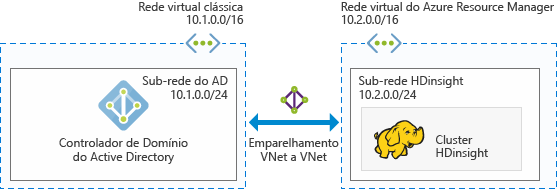
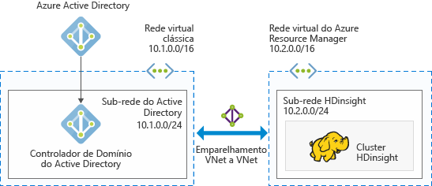
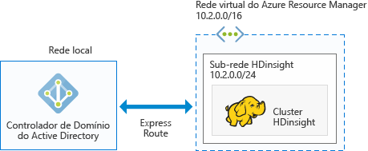

# Planejar clusters Hadoop do Azure associados ao domínio no HDInsight

O Hadoop tradicional é um cluster de usuário único. Ele é adequado para a maioria das empresas que têm equipes de aplicativos menores que criam grandes cargas de trabalho de dados. À medida que o Hadoop ganha popularidade, muitas empresas estão mudando para um modelo em que clusters são gerenciados por equipes de TI, e várias equipes de aplicativo compartilham clusters. Assim, as funcionalidades que envolvem clusters multiusuários estão entre as funcionalidades mais solicitadas no Azure HDInsight.

Em vez de criar sua própria autorização e autenticação multiusuário, o HDInsight recorre ao provedor de identidade mais popular: o Azure AD (Azure Active Directory). A funcionalidade de segurança eficiente no Azure AD pode ser usada para gerenciar a autorização multiusuário no HDInsight. Integrando HDInsight com o Azure AD, você pode se comunicar com os clusters, usando suas credenciais do Azure AD. O HDInsight mapeia o usuário do Azure AD para um usuário do Hadoop local, para que todos os serviços em execução no HDInsight (Ambari, servidor Hive, Ranger, servidor Spark Thrift e outros) funcionem sem problemas para o usuário autenticado.

## Integrar o HDInsight com o Azure AD

Integrando o HDInsight com o Azure AD, os nós do cluster HDInsight são ingressado no domínio para o domínio do Azure AD. O HDInsight cria objetos de serviço para os serviços do Hadoop em execução no cluster e os coloca em uma UO (unidade organizacional) especificada no Azure AD. O HDInsight também cria mapeamentos de DNS reversos no domínio do Azure AD para os endereços IP de nós que ingressaram no domínio.

Você pode obter essa configuração, usando várias arquiteturas. É possível escolher uma das arquiteturas a seguir.

**HDInsight integrado ao Azure AD em execução no Azure IaaS**

Essa é a arquitetura mais simples para a integração do HDInsight com o Azure AD. O controlador de domínio do Azure AD é executado em uma, ou várias, VMs (máquinas virtuais) no Azure. Essas VMs são normalmente em uma rede virtual. Configure outra rede virtual para o cluster HDInsight. Para que o HDInsight tenha uma linha de visão para o Azure AD, você precisa emparelhar essas redes virtuais usando o [emparelhamento de VNet para VNet](../virtual-network/virtual-networks-create-vnetpeering-arm-portal.md).

> [!NOTE]
> Nessa arquitetura, você não pode usar o Azure Data Lake Store com o cluster HDInsight.

Pré-requisitos do Azure AD:

* Deve-se criar uma [unidade organizacional](../active-directory-domain-services/active-directory-ds-admin-guide-create-ou.md), na qual você coloca as VMs do cluster do HDInsight e as entidades de serviço usadas pelo cluster.
* [Protocolos de acesso de diretório leve](../active-directory-domain-services/active-directory-ds-admin-guide-configure-secure-ldap.md) (LDAPs) devem ser configurados para se comunicar com o Azure AD. O certificado usado para configurar o LDAPS deve ser um certificado real (não um certificado autoassinado).
* As zonas DNS reversas devem ser criadas no domínio para o intervalo de endereços IP da sub-rede HDInsight (por exemplo 10.2.0.0/24 na figura anterior).
* Uma conta de serviço ou uma conta de usuário é necessária. Use essa conta para criar o cluster HDInsight. Essa conta deve ter as seguintes permissões:

    - Permissões para criar objetos de entidade de serviço e objetos de computador na unidade organizacional
    - Permissões para criar regras de proxy DNS reversas
    - Permissões para ingressar computadores no domínio do Active Directory

**HDInsight integrado ao Azure AD somente de nuvem**

Para o Azure AD somente na nuvem, configure um controlador de domínio para que o HDInsight possa ser integrado ao Azure AD. Isso é feito usando o [Azure Active Directory Domain Services](../active-directory-domain-services/active-directory-ds-overview.md) (Azure AD DS). O Azure AD DS cria computadores de controlador de domínio na nuvem e fornece endereços IP para eles. Ele cria dois controladores de domínio para alta disponibilidade.

Atualmente, o Azure AD DS só existe em redes virtuais clássicas. Isso só é acessível por meio do portal clássico do Azure. A rede virtual HDInsight existe no portal do Azure e precisa ser emparelhada com a rede virtual clássica usando o emparelhamento de VNet para VNet.

> [!NOTE]
> Emparelhamento entre uma rede virtual clássica e uma rede virtual do Azure Resource Manager requer que ambas as redes virtuais estão na mesma região e a mesma assinatura do Azure.

Pré-requisitos do Azure AD:

* Deve-se criar uma [unidade organizacional](../active-directory-domain-services/active-directory-ds-admin-guide-create-ou.md), na qual você deseja colocar as VMs do cluster do HDInsight e as entidades de serviço usadas pelo cluster.
* O [LDAPS](../active-directory-domain-services/active-directory-ds-admin-guide-configure-secure-ldap.md) deve ser configurado quando você configura o AD DS. O certificado usado para configurar o LDAPS deve ser um certificado real (não um certificado autoassinado).
* As zonas DNS reversas devem ser criadas no domínio para o intervalo de endereços IP da sub-rede HDInsight (por exemplo 10.2.0.0/24 na figura anterior).
* Os [hashes de senha](../active-directory-domain-services/active-directory-ds-getting-started-password-sync.md) devem ser sincronizados do Azure AD para o Azure AD DS.
* Uma conta de serviço ou uma conta de usuário é necessária. Use essa conta para criar o cluster HDInsight. Essa conta deve ter as seguintes permissões:

    - Permissões para criar objetos de entidade de serviço e objetos de computador na unidade organizacional
    - Permissões para criar regras de proxy DNS reversas
    - Permissões para ingressar computadores no domínio do Azure AD

**HDInsight integrado com um Active Directory local via VPN**

Essa arquitetura é semelhante ao HDInsight integrado ao Azure AD em execução no Azure IaaS. A única diferença é que o Azure AD é local, e a linha de visão para o HDInsight ao Azure AD é por meio de uma [conexão VPN do Azure para uma rede local](../expressroute/expressroute-introduction.md).

> [!NOTE]
> Nessa arquitetura, você não pode usar o Azure Data Lake Store com o cluster HDInsight.

Pré-requisitos do Azure AD:

* Deve-se criar uma [unidade organizacional](../active-directory-domain-services/active-directory-ds-admin-guide-create-ou.md), na qual você coloca as VMs do cluster do HDInsight e as entidades de serviço usadas pelo cluster.
* [LDAPS](../active-directory-domain-services/active-directory-ds-admin-guide-configure-secure-ldap.md) deve ser configurado para se comunicar com o Azure AD. O certificado usado para configurar o LDAPS deve ser um certificado real (não um certificado autoassinado).
* As zonas DNS reversas devem ser criadas no domínio para o intervalo de endereços IP da sub-rede HDInsight (por exemplo 10.2.0.0/24 na figura anterior).
* Uma conta de serviço ou uma conta de usuário é necessária. Use essa conta para criar o cluster HDInsight. Essa conta deve ter as seguintes permissões:

    - Permissões para criar objetos de entidade de serviço e objetos de computador na unidade organizacional
    - Permissões para criar regras de proxy DNS reversas
    - Permissões para ingressar computadores no domínio do Azure AD

**HDInsight integrado com um Active Directory local sincronizado ao Azure AD**

Essa arquitetura é semelhante ao HDInsight integrado ao Azure AD somente na nuvem. A única diferença é que o Active Directory local é sincronizado com o Azure AD. Configure um controlador de domínio na nuvem para que o HDInsight possa ser integrado ao Azure AD. Isso é feito usando o [Azure Active Directory Domain Services](../active-directory-domain-services/active-directory-ds-overview.md). O AD DS cria computadores de controlador de domínio na nuvem e fornece endereços IP para eles. Ele cria dois controladores de domínio para alta disponibilidade.

Atualmente, o Azure AD DS só existe em redes virtuais clássicas. Isso só é acessível por meio do portal clássico do Azure. A rede virtual HDInsight existe no portal do Azure e precisa ser emparelhada com a rede virtual clássica usando o emparelhamento de VNet para VNet.

> [!NOTE]
> Emparelhamento entre uma rede virtual clássica e uma rede virtual do Azure Resource Manager requer que ambas as redes virtuais na mesma região e serão a mesma assinatura do Azure.

Pré-requisitos do Azure AD:

* Deve-se criar uma [unidade organizacional](../active-directory-domain-services/active-directory-ds-admin-guide-create-ou.md), na qual você deseja colocar as VMs do cluster do HDInsight e as entidades de serviço usadas pelo cluster.
* O [LDAPS](../active-directory-domain-services/active-directory-ds-admin-guide-configure-secure-ldap.md) deve ser configurado quando você configura o AD DS. O certificado usado para configurar o LDAPS deve ser um certificado real (não um certificado autoassinado).
* As zonas DNS reversas devem ser criadas no domínio para o intervalo de endereços IP da sub-rede HDInsight (por exemplo 10.2.0.0/24 na figura anterior).
* Os [hashes de senha](../active-directory-domain-services/active-directory-ds-getting-started-password-sync.md) devem ser sincronizados do Azure AD para o Azure AD DS.
* Uma conta de serviço ou uma conta de usuário é necessária. Use essa conta para criar o cluster HDInsight. Essa conta deve ter as seguintes permissões:

    - Permissões para criar objetos de entidade de serviço e objetos de computador na unidade organizacional
    - Permissões para criar regras de proxy DNS reversas
    - Permissões para ingressar computadores no domínio do Active Directory

**HDInsight integrado a um Azure AD não padrão (recomendado somente para teste e desenvolvimento)**

Essa arquitetura é semelhante ao HDInsight integrado ao Azure AD somente na nuvem. Para a maioria das empresas, o acesso de administrador para o Azure AD é restrito a determinados indivíduos. Portanto, quando você quiser fazer uma verificação de conceito ou experimentar a criação de um cluster de domínio, poderá ser benéfico criar uma instância do Azure AD na assinatura em vez de esperar que um administrador configure pré-requisitos no Azure AD. Como se trata de uma instância do Azure AD que você criou, você tem permissões completas para o Azure AD para configurar o Azure AD DS.

O Azure AD DS cria computadores de controlador de domínio na nuvem e fornece endereços IP para eles. Ele cria dois controladores de domínio para alta disponibilidade.

Azure AD DS existe somente em redes virtuais clássicas, você precisa acessar o portal clássico do Azure, e você deve criar uma rede virtual clássica para configurar o Azure AD DS. A rede virtual HDInsight existe no portal do Azure e precisa ser emparelhada com a rede virtual clássica usando o emparelhamento de VNet para VNet.

> [!NOTE]
> Emparelhamento entre o clássico e redes virtuais do Azure Resource Manager requer que ambas as redes virtuais na mesma região e serão a mesma assinatura do Azure.

Pré-requisitos do Azure AD:

* Deve-se criar uma [unidade organizacional](../active-directory-domain-services/active-directory-ds-admin-guide-create-ou.md), na qual você coloca as VMs do cluster do HDInsight e as entidades de serviço usadas pelo cluster.
* O [LDAPS](../active-directory-domain-services/active-directory-ds-admin-guide-configure-secure-ldap.md) deve ser configurado quando você configura o AD DS. Você pode criar um [certificado autoassinado](../active-directory-domain-services/active-directory-ds-admin-guide-configure-secure-ldap.md) para configurar LDAPS. No entanto, para usar um certificado autoassinado, você deve solicitar uma exceção de <a href="mailto:hdipreview@microsoft.com">hdipreview@microsoft.com</a>.
* As zonas DNS reversas devem ser criadas no domínio para o intervalo de endereços IP da sub-rede HDInsight (por exemplo 10.2.0.0/24 na figura anterior).
* Os [hashes de senha](../active-directory-domain-services/active-directory-ds-getting-started-password-sync.md) devem ser sincronizados do Azure AD para o Azure AD DS.
* Uma conta de serviço ou uma conta de usuário é necessária. Use essa conta para criar o cluster HDInsight. Essa conta deve ter as seguintes permissões:

    - Permissões para criar objetos de entidade de serviço e objetos de computador na unidade organizacional
    - Permissões para criar regras de proxy DNS reversas
    - Permissões para ingressar computadores no domínio do Azure Active Directory

## Próximas etapas
* Para configurar um cluster HDInsight ingressado em um domínio, confira [Configurar clusters HDInsight ingressados em domínio](hdinsight-domain-joined-configure.md).
* Para gerenciar clusters HDInsight ingressados em um domínio, confira [Gerenciar clusters HDInsight ingressados em domínio](hdinsight-domain-joined-manage.md).
* Para configurar políticas do Hive e executar consultas do Hive, confira [Configurar políticas do Hive para clusters HDInsight ingressados no domínio](hdinsight-domain-joined-run-hive.md).
* Para executar consultas do Hive usando SSH em clusters do HDInsight ingressados no domínio, confira [Usar SSH com Hadoop baseado em Linux no HDInsight do Linux, Unix ou OS X](hdinsight-hadoop-linux-use-ssh-unix.md).

