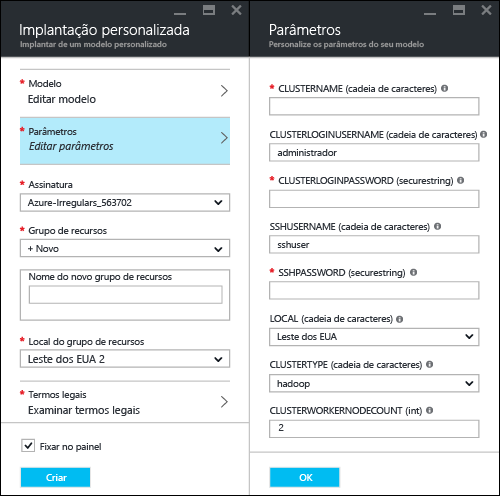
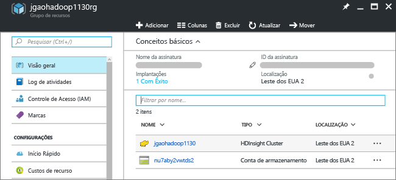
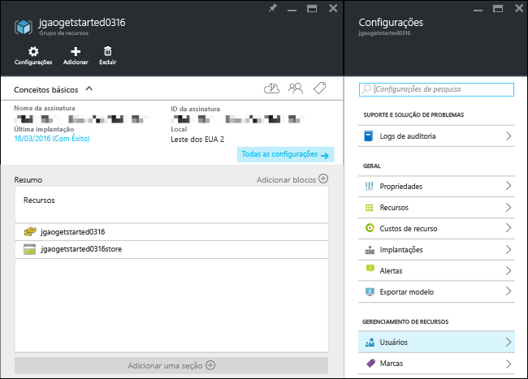

# Tutorial do Hadoop: Introdução ao uso do Hadoop no HDInsight

Aprenda a criar clusters [Hadoop](http://hadoop.apache.org/) no HDInsight e a executar trabalhos do Hive no HDInsight. [Apache Hive](https://hive.apache.org/) é o componente mais popular no ecossistema do Hadoop. Atualmente, o HDInsight vem com [sete tipos diferentes de cluster](hdinsight-hadoop-introduction.md#overview). Cada tipo de cluster dá suporte a um conjunto diferente de componentes. Todos os tipos de cluster dão suporte ao Hive. Para obter uma lista de componentes com suporte no HDInsight, confira [Novidades nas versões de cluster Hadoop fornecidas pelo HDInsight?](hdinsight-component-versioning.md)  

[!INCLUDE [delete-cluster-warning](../../includes/hdinsight-delete-cluster-warning.md)]

## Pré-requisitos
Antes de começar este tutorial, você deverá ter o seguinte:

* **Assinatura do Azure**: para criar uma conta de avaliação gratuita de um mês, acesse [azure.microsoft.com/free](https://azure.microsoft.com/free).

## Criar cluster

A maioria dos trabalhos de Hadoop consiste em trabalhos em lotes. Criar um cluster, executar alguns trabalhos e excluir o cluster. Nesta seção, você criará um cluster Hadoop no HDInsight usando um [modelo do Azure Resource Manager](../azure-resource-manager/resource-group-template-deploy.md). Não é necessário ter experiência com o modelo do Resource Manager para seguir este tutorial. Para obter outros métodos de criação de cluster e Noções básicas sobre as propriedades usadas neste tutorial, confira [Criar clusters do HDInsight](hdinsight-hadoop-provision-linux-clusters.md). Use o seletor na parte superior da página para escolher opções de criação de cluster.

O modelo do Resource Manager usado neste tutorial está localizado no [GitHub](https://azure.microsoft.com/resources/templates/101-hdinsight-linux-ssh-password/). 

1. Clique na imagem a seguir para entrar no Azure e abra o modelo do Resource Manager no Portal do Azure. 
   
    
2. Digite ou selecione os valores a seguir:
   
    .
   
    * **Assinatura**: selecione sua assinatura do Azure.
    * **Grupo de recursos**: Crie um novo grupo de recursos ou escolha um grupo de recursos existente.  Um grupo de recursos é um contêiner de componentes do Azure.  Nesse caso, o grupo de recursos contém o cluster HDInsight e a conta de Armazenamento do Azure dependente. 
    * **Local**: selecione um local do Azure em que você deseja criar o cluster.  Escolha um local mais próximo a você para obter melhor desempenho. 
    * **Tipo de cluster**: selecione **hadoop** para este tutorial.
    * **Nome do Cluster**: insira um nome para o cluster Hadoop.
    * **Nome e senha de logon do cluster**: o nome de logon padrão é **admin**.
    * **Nome de usuário e senha SSH**: o nome de usuário padrão é **sshuser**.  Você pode renomeá-lo. 
     
    Algumas propriedades foram inseridas no código do modelo.  Você pode configurar esses valores do modelo.

    * **Local**: O local do cluster e da conta de armazenamento dependente usam o mesmo local que o grupo de recursos.
    * **Versão do cluster**: 3.5
    * **Tipo de SO**: Linux
    * **Número de nós de trabalho**: 2

     Cada cluster tem uma dependência na [conta de Armazenamento do Azure](hdinsight-hadoop-use-blob-storage.md) ou [conta do Azure Data Lake](hdinsight-hadoop-use-data-lake-store.md). Ela é conhecida como a conta de armazenamento padrão. O cluster HDInsight e sua conta de armazenamento padrão devem estar colocalizados na mesma região do Azure. A exclusão dos clusters não exclui a conta de armazenamento. 
     
     Para obter mais explicação sobre essas propriedades, confira [Criar clusters Hadoop no HDInsight](hdinsight-hadoop-provision-linux-clusters.md).

3. Selecione **Concordo com os termos e condições declarados acima** e **Fixar no painel**, depois clique em **Comprar**. Você verá um novo bloco intitulado **Implantando a implantação de modelo** no painel do portal. A criação de um cluster demora cerca de 20 minutos. Depois que o cluster for criado, a legenda do bloco será alterada para o nome do grupo de recursos especificado. E o portal abre automaticamente o grupo de recursos em uma nova folha. Você pode ver ambos o cluster e o armazenamento padrão listados.
   
    .

4. Clique no nome do cluster para abrir o cluster em uma nova folha.

   

## Execute consultas Hive
[Apache Hive](hdinsight-use-hive.md) é o componente mais popular usado no HDInsight. Há várias maneiras de executar trabalhos do Hive no HDInsight. Neste tutorial, você usará o modo de exibição do Ambari Hive no portal. Para obter outros métodos para enviar trabalhos do Hive, confira [Usar o Hive no HDInsight](hdinsight-use-hive.md).

1. Da captura de tela anterior, clique em **Painel do Cluster** e depois em **Painel do Cluster HDInsight**.  Você também pode navegar até **https://&lt;NomeDoCluster>.azurehdinsight.net**, em que &lt;NomeDoCluster> é o cluster que você criou na seção anterior para abrir o Ambari.
2. Insira o nome de usuário e a senha do Hadoop que você especificou na seção anterior. O nome de usuário padrão é **admin**.
3. Abra a **Exibição do Hive** , conforme mostrado na seguinte captura de tela:
   
    .
4. Na seção **Editor de Consultas** da página, cole as seguintes instruções HiveQL na planilha:
   
        SHOW TABLES;
   
   > [!NOTE]
   > O ponto-e-vírgula é obrigatório para o Hive.       
   > 
   > 
5. Clique em **Executar**. Uma seção **Resultados do Processo de Consulta** deve aparecer abaixo do Editor de Consultas e exibir informações sobre o trabalho. 
   
    Depois que a consulta for concluída, a seção **Resultados do Processo de Consulta** exibirá os resultados da operação. Você deverá ver uma tabela chamada **hivesampletable**. Essa tabela do Hive de exemplo é fornecida com todos os clusters HDInsight.
   
    .
6. Repita as etapas 4 e 5 para executar a seguinte consulta:
   
        SELECT * FROM hivesampletable;
   
   > [!TIP]
   > Observe a lista suspensa **Salvar resultados** no canto superior esquerdo da seção **Resultados do Processo de Consulta**. Você pode usá-la para baixar os resultados ou salvá-los no armazenamento do HDInsight como um arquivo CSV.
   > 
   > 
7. Clique em **Histórico** para obter uma lista dos trabalhos.

Depois de concluir um trabalho do Hive, você pode [exportar os resultados para o banco de dados SQL Azure ou do SQL Server](hdinsight-use-sqoop-mac-linux.md). Também pode [visualizar os resultados usando o Excel](hdinsight-connect-excel-power-query.md). Para obter mais informações sobre como usar o Hive no HDInsight, confira [Usar o Hive e o HiveQL com o Hadoop no HDInsight para analisar um arquivo log4j do Apache de exemplo](hdinsight-use-hive.md).

## Limpar o tutorial
Após concluir o tutorial, convém excluir o cluster. Com o HDInsight, seus dados são armazenados no Armazenamento do Azure, assim você poderá excluir, com segurança, um cluster quando ele não estiver em uso. Você também é cobrado por um cluster HDInsight, mesmo quando ele não está em uso. Como os encargos para o cluster são muitas vezes maiores do que os encargos para armazenamento, faz sentido, do ponto de vista econômico, excluir os clusters quando não estiverem em uso. 

> [!NOTE]
> Usando o [Azure Data Factory](hdinsight-hadoop-create-linux-clusters-adf.md), você pode criar clusters HDInsight sob demanda e definir uma configuração TimeToLive para excluir os clusters automaticamente. 
> 
> 

**Para excluir o cluster e/ou a conta de armazenamento padrão**

1. Entre no [Portal do Azure](https://portal.azure.com).
2. No painel do portal, clique no bloco com o nome do grupo de recursos usado ao criar o cluster.
3. Clique em **Excluir** na folha de recursos para excluir o grupo de recursos que contém o cluster e a conta de armazenamento padrão ou clique no nome do cluster no bloco **Recursos** e clique em **Excluir** na folha do cluster. Observe que a exclusão do grupo de recursos exclui a conta de armazenamento. Para manter a conta de armazenamento, exclua apenas o cluster.

## Solucionar problemas

Se você tiver problemas com a criação de clusters HDInsight, confira os [requisitos de controle de acesso](hdinsight-administer-use-portal-linux.md#create-clusters).

## Próximas etapas
Neste tutorial, você aprendeu como criar um cluster HDInsight baseado em Linux usando um modelo do Resource Manager e como executar consultas básicas do Hive.

Para saber mais sobre como analisar dados com o HDInsight, consulte os seguintes artigos:

* Para saber mais sobre como usar o Hive com HDInsight, inclusive como executar consultas de Hive do Visual Studio, consulte [usar o Hive com HDInsight][hdinsight-use-hive].
* Para saber mais sobre o Pig, uma linguagem usada para transformar dados, consulte [Usar o Pig com o HDInsight][hdinsight-use-pig].
* Para saber mais sobre o MapReduce, uma maneira de gravar programas que processam dados no Hadoop, consulte [Usar o MapReduce com HDInsight][hdinsight-use-mapreduce].
* Para saber mais sobre como usar as Ferramentas do HDInsight para o Visual Studio para analisar dados no HDInsight, consulte [Introdução às ferramentas do Hadoop do Visual Studio para o HDInsight](hdinsight-hadoop-visual-studio-tools-get-started.md).

Se você estiver pronto para começar a trabalhar com seus próprios dados e precisa saber mais sobre como o HDInsight armazena dados ou obtém dados no HDInsight, consulte:

* Para saber mais sobre como o HDInsight usa o Armazenamento do Azure, veja [Usar Armazenamento do Azure com o HDInsight](hdinsight-hadoop-use-blob-storage.md).
* Para obter informações sobre como carregar arquivos no HDInsight, consulte [Carregar dados no HDInsight][hdinsight-upload-data].

Se você quiser saber mais sobre como criar ou gerenciar um cluster HDInsight, consulte:

* Para saber mais sobre como gerenciar o cluster HDInsight baseado em Linux, consulte [Gerenciar clusters HDInsight usando o Ambari](hdinsight-hadoop-manage-ambari.md).
* Para saber mais sobre as opções que você pode selecionar ao criar um cluster HDInsight, confira [Como criar o HDInsight no Linux usando opções personalizadas](hdinsight-hadoop-provision-linux-clusters.md).
* Se você estiver familiarizado com o Linux e o Hadoop, mas quiser obter informações específicas sobre o Hadoop no HDInsight, consulte [Trabalhando com o HDInsight no Linux](hdinsight-hadoop-linux-information.md). Este artigo oferece informações como:
  
  * URLs para serviços hospedados no cluster, como Ambari e WebHCat
  * O local dos arquivos do Hadoop e exemplos no sistema de arquivos local
  * O uso do Azure Storage (WASB) em vez de HDFS como armazenamento de dados padrão

[1]: ../HDInsight/hdinsight-hadoop-visual-studio-tools-get-started.md

[hdinsight-provision]: hdinsight-provision-linux-clusters.md
[hdinsight-upload-data]: hdinsight-upload-data.md
[hdinsight-use-mapreduce]: hdinsight-use-mapreduce.md
[hdinsight-use-hive]: hdinsight-use-hive.md
[hdinsight-use-pig]: hdinsight-use-pig.md

