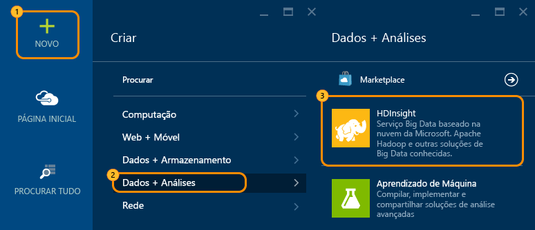
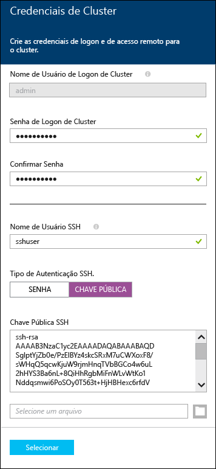
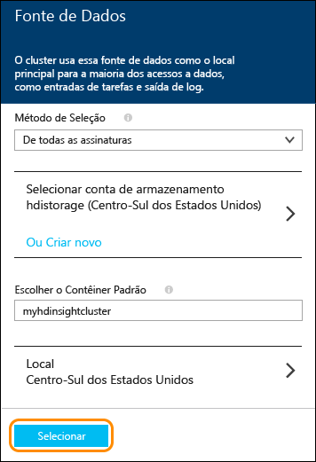
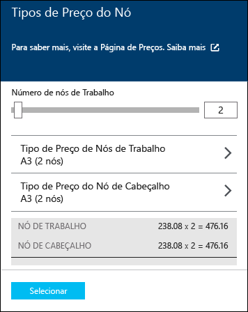
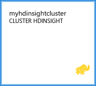

<properties
   	pageTitle="Tutorial do Linux: Introdução ao Hadoop e ao Hive | Microsoft Azure"
   	description="Siga este tutorial do Linux para começar a usar o Hadoop no HDInsight. Saiba como configurar clusters do Linux e consultar dados com o Hive."
   	services="hdinsight"
   	documentationCenter=""
   	authors="nitinme"
   	manager="paulettm"
   	editor="cgronlun"
	tags="azure-portal"/>

<tags
   	ms.service="hdinsight"
   	ms.devlang="na"
   	ms.topic="hero-article"
   	ms.tgt_pltfrm="na"
   	ms.workload="big-data"
   	ms.date="11/29/2015"
   	ms.author="nitinme"/>

# Tutorial de hadoop: introdução usando o Hadoop com o Hive em HDInsight no Linux

> [AZURE.SELECTOR]
- [Windows](hdinsight-hadoop-tutorial-get-started-windows.md)
- [Linux](hdinsight-hadoop-linux-tutorial-get-started.md)

Este documento apresenta rapidamente o Azure HDInsight no Linux, mostrando a você como criar um cluster Hadoop baseado em Linux, conectar-se ao cluster usando um Secure Shell (SSH) e depois executar uma consulta de Hive em relação aos dados de exemplo que acompanham o cluster.

> [AZURE.NOTE]Se for iniciante em Hadoop e Big Data, você pode ler mais sobre os termos [Apache Hadoop](http://go.microsoft.com/fwlink/?LinkId=510084), [MapReduce](http://go.microsoft.com/fwlink/?LinkId=510086),[HDFS (Sistema de Arquivos Distribuído do Hadoop)](http://go.microsoft.com/fwlink/?LinkId=510087) e [Hive](http://go.microsoft.com/fwlink/?LinkId=510085). Para entender como o HDInsight habilita o Hadoop no Azure, consulte [Introdução ao Hadoop no HDInsight](hdinsight-hadoop-introduction.md).

## Pré-requisitos

Antes de começar este tutorial do Linux para Hadoop, você deve ter o seguinte:

- **Uma assinatura do Azure**: consulte [Obter avaliação gratuita do Azure](http://azure.microsoft.com/documentation/videos/get-azure-free-trial-for-testing-hadoop-in-hdinsight/).

- **A cliente Secure Shell (SSH)**: Linux, Unix, e sistemas OS X forneceram um cliente SSH através do `ssh` comando. Para os sistemas do Windows, recomendamos o [PuTTY](http://www.chiark.greenend.org.uk/~sgtatham/putty/download.html).

    > [AZURE.NOTE]As etapas neste documento utilizam o SSH para se conectar ao cluster HDInsight, uma vez que o SSH está disponível para todos os sistemas operacionais de cliente. Para outros métodos de conexão ao cluster HDInsight, como usar as ferramentas do HDInsight para o Visual Studio ou APIs REST, consulte os links Hive, Pig e MapReduce na seção [Próximas etapas](#nextsteps) deste documento.
    
- **Chaves Secure Shell (SSH)** (opcional): você pode proteger a conta SSH usada para conectar ao cluster usando uma senha ou uma chave pública. A senha é o caminho mais rápido, e você deve usar essa opção se quiser provisionar rapidamente um cluster e executar alguns trabalhos de teste. Usar uma chave é o método seguro, no entanto, exige configuração adicional. Convém usar essa abordagem ao provisionar um cluster de produção. Neste artigo, nós usamos a abordagem da senha. Para obter instruções sobre como gerar chaves SSH com HDInsight, consulte os seguintes artigos:

	-  Em um computador Linux: [Usar SSH com o HDInsight baseado em Linux (Hadoop) por meio de Linux, Unix ou OS X](hdinsight-hadoop-linux-use-ssh-unix.md).
    
	-  Em um computador Windows: [Usar SSH com o HDInsight baseado em Linux (Hadoop) no Windows](hdinsight-hadoop-linux-use-ssh-windows.md).

## Provisionar um cluster HDInsight no Linux

Ao provisionar um cluster, você cria recursos de computação do Azure que contêm serviços de Hadoop e recursos. Nesta seção, você provisiona um cluster HDInsight versão 3.2, que se contém o Hadoop versão 2.2. Para obter informações sobre as versões do HDInsight e seus SLAs, consulte [Controle de versão de componentes do HDInsight](hdinsight-component-versioning.md). Para obter informações detalhadas sobre como criar um cluster HDInsight, consulte [Provisionar clusters HDInsight usando opções personalizadas][hdinsight-provision].

>[AZURE.NOTE]Você também pode criar clusters Hadoop que executam o sistema operacional Windows Server. Para obter instruções, consulte [Introdução ao HDInsight no Windows](hdinsight-hadoop-tutorial-get-started-windows.md).

Use as seguintes etapas para criar um novo cluster:

1. Entre no [Portal do Azure](https://ms.portal.azure.com/).
2. Clique em **NOVO**, clique em **Análises de dados**, e, em seguida, clique em **HDInsight**.

    

3. Insira um **Nome de Cluster**, selecione **Hadoop** para o **Tipo de Cluster** e, na lista suspensa **Sistema Operacional do Cluster**, selecione **Ubuntu**. Uma marca de seleção verde aparecerá ao lado do nome do cluster, se disponível.

	

4. Se você tiver mais de uma assinatura, clique na entrada **Assinatura** para selecionar a assinatura do Azure que será usada para o cluster.

5. Clique em **Grupo de recursos** para ver uma lista de grupos de recursos existente e, em seguida, selecione um em que será criado o cluster. Ou, você pode clicar em **Criar novo** e, em seguida, digitar o nome do novo grupo de recursos. Uma marca de seleção verde será exibida para indicar se o novo nome de grupo estiver disponível.

	> [AZURE.NOTE]A entrada padrão será um dos seus grupos de recursos existentes, se houver algum disponível.

6. Clique em **Credenciais** e insira uma senha para o usuário administrador. Você também deve inserir um **Nome de usuário SSH**. Para **Tipo de Autenticação SSH**, clique em **SENHA** e especifique uma senha para o usuário SSH. Clique em **Selecionar** na parte inferior para salvar a configuração de credenciais.

	

    > [AZURE.NOTE]O SSH é usado para acessar remotamente o cluster HDInsight usando uma linha de comando. O nome de usuário e a senha usados aqui serão usados para se conectar ao cluster por meio do SSH.

	Para obter mais informações sobre como usar SSH com o HDInsight, consulte um dos seguintes documentos:

	* [Usar SSH com Hadoop baseado em Linux no HDInsight no Linux, Unix ou OS X](hdinsight-hadoop-linux-use-ssh-unix.md)
	* [Usar SSH com Hadoop baseado em Linux no HDInsight no Windows](hdinsight-hadoop-linux-use-ssh-windows.md)

7. Clique em **Fonte de dados** para escolher uma fonte de dados existente para o cluster ou criar um novo. Ao provisionar um cluster Hadoop no HDInsight, você especifica uma conta de armazenamento do Azure. Um contêiner de armazenamento de blob específico dessa conta é designado como sistema de arquivos padrão, como no sistema de arquivos distribuído Hadoop (HDFS). Por padrão, o cluster HDInsight é provisionado no mesmo datacenter da conta de armazenamento que você especificou. Para obter mais informações, consulte [Usar o Armazenamento de Blob do Azure com o HDInsight](hdinsight-use-blob-storage.md).

	

	No momento, você pode selecionar uma Conta de Armazenamento do Azure como fonte de dados para um cluster HDInsight. Use o item a seguir para entender as entradas na folha **Fonte de Dados**.

	- **Método de seleção**: defina essa opção para **De todas as assinaturas** para habilitar a procura de contas de armazenamento de todas as suas assinaturas. Defina essa opção para **Tecla de Acesso** se você desejar inserir o **Nome de Armazenamento** e a **Tecla de Acesso** de uma conta de armazenamento existente.

	- **Selecione conta de armazenamento / Criar Nova**: clique em **Selecionar conta de armazenamento** para procurar e selecionar uma conta de armazenamento existente que você deseja associar ao cluster. Ou clique em **Criar Nova** para criar uma nova conta de armazenamento. Use o campo exibido para inserir o nome da conta de armazenamento. Uma marca de seleção verde será exibida se o nome estiver disponível.

	- **Escolher Contêiner Padrão**: use essa opção para inserir o nome do contêiner padrão a ser usado para o cluster. Embora você possa inserir qualquer nome aqui, é recomendável usar o mesmo nome que o cluster para que você possa reconhecer facilmente que o contêiner é usado para este cluster específico.

	- **Local**: a região geográfica na qual a conta de armazenamento está ou será criada.

		> [AZURE.IMPORTANT]Selecionar o local para a fonte de dados padrão também definirá o local do cluster do HDInsight. A fonte de dados padrão e o cluster devem estar localizados na mesma região.

	Clique em **Selecionar** para salvar a configuração de fonte de dados.

8. Clique em **Camadas de Preços do Nó** para exibir informações sobre os nós que serão criados para esse cluster. Defina o número de nós de trabalho que você precisa para o cluster. O custo estimado do cluster será mostrado na folha.

	
    
    > [AZURE.IMPORTANT]Se você planeja ter mais de 32 nós de trabalho, seja na criação do cluster ou em seu dimensionamento após a criação, deverá selecionar um tamanho de nó de cabeçalho com pelo menos 8 núcleos e 14 GB de RAM.
    >
    > Para saber mais sobre tamanhos de nós e custos associados, confira [Preços do HDInsight](https://azure.microsoft.com/pricing/details/hdinsight/).

	Clique em **Selecionar** para salvar a configuração de preços do nó.

9. Na folha **Novo Cluster HDInsight**, certifique-se de que **Fixar no Quadro Inicial** está selecionado e, em seguida, clique em **Criar**. Isso criará o cluster e adicionará um bloco para o mesmo para o quadro inicial do seu Portal do Azure. O ícone indica que o cluster está provisionando e será alterado para exibir o ícone de HDInsight após a conclusão da configuração.

Durante o provisionamento|Provisionamento concluído
------------------|---------------------
	|

> [AZURE.NOTE]Levará algum tempo para que o cluster seja criado, geralmente, cerca de 15 minutos. Use o bloco no Quadro Inicial ou a entrada **Notificações** à esquerda da página para verificar o processo de provisionamento.

Quando o provisionamento for concluído, clique no bloco para o cluster a partir do quadro inicial para iniciar a folha de cluster.

##  Para conectar-se ao cluster

Você pode se conectar a um cluster HDInsight no Linux de um computador Linux ou de um computador baseado em Windows, usando SSH.

###Para conectar-se de um computador Linux

1. Abra um terminal e digite o seguinte comando:

		ssh <username>@<clustername>-ssh.azurehdinsight.net

	Substitua &lt;nomedeusuário> pelo nome de usuário SSH que você usou ao criar o cluster. Substitua &lt;nomedocluster> pelo nome do cluster

2. Quando solicitado, digite a senha que você forneceu durante o provisionamento do cluster. Depois que você for conectado com êxito, o prompt será alterado para o seguinte:

		hdiuser@hn0-clustername:~$

    > [AZURE.NOTE]A parte `@hn0-clustername` da solicitação pode ser diferente em seu cluster.

###Para conectar-se de um computador baseado em Windows

1. Baixe o [PuTTY](http://www.chiark.greenend.org.uk/~sgtatham/putty/download.html) para clientes baseados no Windows.

2. Abra o PuTTY. Em **Categoria**, clique em **Sessão**. Na tela **Opções básicas para sua sessão PuTTY**, insira o endereço SSH do seu servidor HDInsight no campo **Nome de Host (ou Endereço IP)**. O endereço do SSH é o nome do cluster, seguido de **-ssh.azurehdinsight.net**. Por exemplo, **myhdinsightcluster-ssh.azurehdinsight.net**.

	

3. Para salvar as informações de conexão para uso futuro, insira um nome para essa conexão em **Sessões Salvas** e clique em **Salvar**. A conexão será adicionada à lista de sessões salvas.

4. Clique em **Abrir** para se conectar ao cluster. Quando o nome de usuário for solicitado, insira o nome de usuário SSH que você usou ao criar o cluster. Como senha, insira a senha que você especificou durante a criação do cluster. Depois que você for conectado com êxito, o prompt será alterado para o seguinte:

		hdiuser@hn0-clustername:~$

##Executar uma consulta do Hive

Quando estiver conectado ao cluster via SSH, use os comandos a seguir para executar uma consulta Hive:

1. Inicie a CLI (interface de linha de comando) do Hive usando o seguinte comando no prompt:

		hive

2. Usando a CLI, insira as instruções a seguir para criar uma nova tabela, chamada **log4jLogs**, usando os dados de exemplo já disponíveis no cluster:

		DROP TABLE log4jLogs;
		CREATE EXTERNAL TABLE log4jLogs(t1 string, t2 string, t3 string, t4 string, t5 string, t6 string, t7 string)
		ROW FORMAT DELIMITED FIELDS TERMINATED BY ' '
		STORED AS TEXTFILE LOCATION 'wasb:///example/data/';
		SELECT t4 AS sev, COUNT(*) AS cnt FROM log4jLogs WHERE t4 = '[ERROR]' GROUP BY t4;

	Essas instruções executam as seguintes ações:

	- **DROP TABLE** - exclui a tabela e o arquivo de dados caso a tabela já exista.
	- **CREATE EXTERNAL TABLE**: cria uma nova tabela "externa" no Hive. As tabelas externas armazenam apenas a definição da tabela no Hive; os dados são deixados no local original.
	- **ROW FORMAT** - informa ao Hive como os dados são formatados. Nesse caso, os campos em cada log são separados por um espaço.
	- **STORED AS TEXTFILE LOCATION** - informa ao Hive onde os dados são armazenados (o diretório de exemplos/dados) e que estão armazenados como texto.
	- **SELECT** - Seleciona uma contagem de todas as linhas em que a coluna t4 contém o valor [ERROR].

	>[AZURE.NOTE]Use tabelas externas se os dados subjacentes tiverem que ser atualizados por uma origem externa, como um processo automatizado de carregamento de dados, ou por outra operação MapReduce, mas você quiser que as consultas Hive sempre usem os dados mais recentes. Remover uma tabela externa *não* exclui os dados, somente a definição de tabela.

	Isso retorna a seguinte saída:

		Query ID = username_20150116000202_cceb9c6b-4356-4931-b9a7-2c373ebba493
		Total jobs = 1
		Launching Job 1 out of 1
		Number of reduce tasks not specified. Estimated from input data size: 1
		In order to change the average load for a reducer (in bytes):
		  set hive.exec.reducers.bytes.per.reducer=<number>
		In order to limit the maximum number of reducers:
		  set hive.exec.reducers.max=<number>
		In order to set a constant number of reducers:
		  set mapreduce.job.reduces=<number>
		Starting Job = job_1421200049012_0006, Tracking URL = <URL>:8088/proxy/application_1421200049012_0006/
		Kill Command = /usr/hdp/2.2.1.0-2165/hadoop/bin/hadoop job  -kill job_1421200049012_0006
		Hadoop job information for Stage-1: number of mappers: 1; number of reducers: 1
		2015-01-16 00:02:40,823 Stage-1 map = 0%,  reduce = 0%
		2015-01-16 00:02:55,488 Stage-1 map = 100%,  reduce = 0%, Cumulative CPU 3.32 sec
		2015-01-16 00:03:05,298 Stage-1 map = 100%,  reduce = 100%, Cumulative CPU 5.62 sec
		MapReduce Total cumulative CPU time: 5 seconds 620 msec
		Ended Job = job_1421200049012_0006
		MapReduce Jobs Launched:
		Stage-Stage-1: Map: 1  Reduce: 1   Cumulative CPU: 5.62 sec   HDFS Read: 0 HDFS Write: 0 SUCCESS
		Total MapReduce CPU Time Spent: 5 seconds 620 msec
		OK
		[ERROR]    3
		Time taken: 60.991 seconds, Fetched: 1 row(s)

	A saída contém **ERROR 3**, pois há três linhas que contêm esse valor.

3. Use as instruções a seguir para criar uma nova tabela "interna" chamada **errorLogs**:

		CREATE TABLE IF NOT EXISTS errorLogs (t1 string, t2 string, t3 string, t4 string, t5 string, t6 string, t7 string) STORED AS ORC;
		INSERT OVERWRITE TABLE errorLogs SELECT t1, t2, t3, t4, t5, t6, t7 FROM log4jLogs WHERE t4 = '[ERROR]';

	Essas instruções executam as seguintes ações:

	- **CREATE TABLE IF NOT EXISTS** - cria uma tabela, se ela ainda não existir. Como a palavra-chave **EXTERNAL** não é usada, esta é uma tabela interna, que é armazenada no data warehouse do Hive e totalmente gerenciada pelo Hive. Ao contrário das tabelas externas, remover uma tabela interna excluirá também os dados subjacentes.
	- **STORES AS ORC**: armazena os dados no formato ORC (Optimized Row Columnar). Esse é um formato altamente otimizado e eficiente para o armazenamento de dados do Hive.
	- **INSERT OVERWRITE ... SELECT** - Seleciona linhas da tabela **log4jLogs** que contêm [ERROR] e insere os dados na tabela **errorLogs**.

4. Para verificar se apenas as linhas que contêm ERROR na coluna t4 foram armazenadas na tabela **errorLogs**, use a seguinte instrução para retornar todas as linhas de **errorLogs**.

		SELECT * from errorLogs;

	A saída a seguir deve ser exibida no console:

		2012-02-03	18:35:34	SampleClass0	[ERROR]	 incorrect		id
		2012-02-03	18:55:54	SampleClass1	[ERROR]	 incorrect		id
		2012-02-03	19:25:27	SampleClass4	[ERROR]	 incorrect		id
		Time taken: 0.987 seconds, Fetched: 3 row(s)

	Os dados retornados devem corresponder aos logs [ERROR].

## Próximas etapas

Neste documento, você aprendeu como criar um cluster HDInsight baseado em Linux usando o Portal do Azure, conectar-se ao cluster usando o SSH e como executar consultas básicas do Hive.

Para saber mais sobre como trabalhar com o HDInsight, consulte:

- Para saber mais sobre como usar o Hive com o HDInsight, inclusive como executar consultas de Hive do Visual Studio, consulte [Usar o Hive com o HDInsight][hdinsight-use-hive].

- Para saber mais sobre o Pig, uma linguagem usada para transformar dados, consulte [Usar o Pig com o HDInsight][hdinsight-use-pig].

- Para saber mais sobre o MapReduce, uma maneira de gravar programas que processam dados no Hadoop, consulte [Usar o MapReduce com HDInsight][hdinsight-use-mapreduce].

- Para obter informações sobre como usar as ferramentas do HDInsight para o Visual Studio para analisar dados no HDInsight, consulte [Introdução às ferramentas do Hadoop do Visual Studio para o HDInsight](hdinsight-hadoop-visual-studio-tools-get-started.md).

Se você estiver pronto para começar a trabalhar com seus próprios dados e precisa saber mais sobre como o HDInsight armazena dados ou obtém dados no HDInsight, consulte:

- Para saber mais sobre como o HDInsight usa o armazenamento de blob do Azure, consulte [Usar armazenamento de Blob do Azure com o HDInsight](hdinsight-use-blob-storage.md).

- Para saber mais sobre como carregar arquivos no HDInsight, consulte [Carregar dados no HDInsight][hdinsight-upload-data].

Se você quiser saber mais sobre como criar ou gerenciar um cluster HDInsight, consulte:

- Para saber mais sobre como gerenciar o cluster HDInsight baseado em Linux, consulte [Gerenciar clusters HDInsight usando Ambari](hdinsight-hadoop-manage-ambari.md).

- Para saber mais sobre as opções que você poderá selecionar ao criar um cluster HDInsight, consulte [Provisionar o HDInsight no Linux usando opções personalizadas](hdinsight-hadoop-provision-linux-clusters.md).

- Se você estiver familiarizado com o Linux e o Hadoop mas quer obter informações específicas sobre o Hadoop no HDInsight, consulte [Trabalhando com o HDInsight no Linux](hdinsight-hadoop-linux-information.md). Haverá informações como:

	* URLs para serviços hospedados no cluster, como Ambari e WebHCat
	* O local dos arquivos do Hadoop e exemplos no sistema de arquivos local
	* O uso do Azure Storage (WASB) em vez de HDFS como armazenamento de dados padrão

[1]: ../HDInsight/hdinsight-hadoop-visual-studio-tools-get-started.md

[hdinsight-provision]: hdinsight-provision-clusters.md
[hdinsight-admin-powershell]: hdinsight-administer-use-powershell.md
[hdinsight-upload-data]: hdinsight-upload-data.md
[hdinsight-use-mapreduce]: hdinsight-use-mapreduce.md
[hdinsight-use-hive]: hdinsight-use-hive.md
[hdinsight-use-pig]: hdinsight-use-pig.md

[powershell-download]: http://go.microsoft.com/fwlink/p/?linkid=320376&clcid=0x409
[powershell-install-configure]: ../install-configure-powershell.md
[powershell-open]: ../install-configure-powershell.md#Install

[img-hdi-dashboard]: ./media/hdinsight-hadoop-tutorial-get-started-windows/HDI.dashboard.png
[img-hdi-dashboard-query-select]: ./media/hdinsight-hadoop-tutorial-get-started-windows/HDI.dashboard.query.select.png
[img-hdi-dashboard-query-select-result]: ./media/hdinsight-hadoop-tutorial-get-started-windows/HDI.dashboard.query.select.result.png
[img-hdi-dashboard-query-select-result-output]: ./media/hdinsight-hadoop-tutorial-get-started-windows/HDI.dashboard.query.select.result.output.png
[img-hdi-dashboard-query-browse-output]: ./media/hdinsight-hadoop-tutorial-get-started-windows/HDI.dashboard.query.browse.output.png
[image-hdi-clusterstatus]: ./media/hdinsight-hadoop-tutorial-get-started-windows/HDI.ClusterStatus.png
[image-hdi-gettingstarted-powerquery-importdata]: ./media/hdinsight-hadoop-tutorial-get-started-windows/HDI.GettingStarted.PowerQuery.ImportData.png
[image-hdi-gettingstarted-powerquery-importdata2]: ./media/hdinsight-hadoop-tutorial-get-started-windows/HDI.GettingStarted.PowerQuery.ImportData2.png

<!---HONumber=AcomDC_1203_2015-->