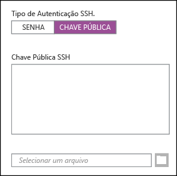
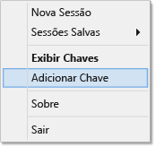

<properties
   pageTitle="Use chaves SSH com o Hadoop em clusters baseados em Linux do Windows | Microsoft Azure"
   description="Saiba como criar e usar chaves SSH para autenticar em clusters HDInsight baseados em Linux. Conecte clusters clientes baseados no Windows usando o cliente SSH PuTTY."
   services="hdinsight"
   documentationCenter=""
   authors="Blackmist"
   manager="paulettm"
   editor="cgronlun"
	tags="azure-portal"/>

<tags
   ms.service="hdinsight"
   ms.devlang="na"
   ms.topic="article"
   ms.tgt_pltfrm="na"
   ms.workload="big-data"
   ms.date="09/15/2015"
   ms.author="larryfr"/>

#Usar SSH com Hadoop baseado em Linux no HDInsight do Windows

> [AZURE.SELECTOR]
- [Windows](hdinsight-hadoop-linux-use-ssh-windows.md)
- [Linux, Unix, OS X](hdinsight-hadoop-linux-use-ssh-unix.md)

O [Secure Shell (SSH)](https://en.wikipedia.org/wiki/Secure_Shell) permite executar remotamente operações em seus clusters HDInsight baseados em Linux usando uma interface de linha de comando. Este documento fornece informações sobre como se conectar ao HDInsight por meio de clientes baseados em Windows usando o cliente SSH PuTTY.

> [AZURE.NOTE]As etapas neste artigo presumem que você esteja usando um cliente baseado em Windows. Se você estiver usando um cliente Linux, Unix ou OS X, consulte [Usar SSH com Hadoop baseado em Linux no HDInsight por meio de Linux, Unix ou OS X](hdinsight-hadoop-linux-use-ssh-unix.md).

##Pré-requisitos

* **PuTTY** e **PuTTYGen** para clientes baseados em Windows. Esses utilitários estão disponíveis em [http://www.chiark.greenend.org.uk/~sgtatham/putty/download.html](http://www.chiark.greenend.org.uk/~sgtatham/putty/download.html).

* Um navegador da Web moderno, com suporte a HTML5.

OU

* [CLI do Azure para Mac, Linux e Windows](../xplat-cli-install.md).

##O que é o SSH?

SSH é um utilitário para efetuar login e executar remotamente comandos em um servidor remoto. Com o HDInsight baseado em Linux, o SSH estabelece uma conexão criptografada para o nó de cabeçalho do cluster e fornece uma linha de comando que você usa para digitar comandos. Os comandos são executados diretamente no servidor.

###Nome de usuário do SSH

Um nome de usuário SSH é o nome usado para autenticação no cluster HDInsight. Quando você especifica um nome de usuário SSH durante a criação do cluster, esse usuário é criado em todos os nós no cluster. Depois que o cluster for criado, você poderá usar esse nome de usuário para se conectar aos nós de cabeçalho do cluster HDInsight. Nos nós de cabeçalho, você poderá se conectar aos nós de trabalho individuais.

> [AZURE.NOTE]O nome de usuário SSH deve ser exclusivo. Como um nome de usuário SSH cria uma conta de usuário no cluster HDInsight, ele não pode entrar em conflito com os usuários existentes criados pelo HDInsight. Estes são os nomes reservados para uso por serviços em execução no cluster HDInsight e que não podem ser usados como o nome de usuário SSH:
>
> root, hdiuser, storm, hbase, ubuntu, zookeeper, hdfs, yarn, mapred, hbase, hive, oozie, falcon, sqoop, admin, tez, hcat, hdinsight-zookeeper.

###Senha ou chave pública SSH

Um usuário SSH pode usar uma senha ou uma chave pública para autenticação. Uma senha é apenas uma cadeia de caracteres de texto composta por você, enquanto uma chave pública faz parte de um par de chaves criptográficas gerado para identificar você exclusivamente.

Uma chave é mais segura do que uma senha, mas requer etapas adicionais para gerar a chave e você deve manter os arquivos com a chave em um local seguro. Se alguém obtiver acesso aos arquivos de chave, obterá acesso à sua conta. Ou, se você perder os arquivos de chave, não será capaz de fazer logon em sua conta.

Um par de chaves consiste em uma chave pública (que é enviada para o servidor do HDInsight) e em uma chave privada (que é mantida no computador cliente). Quando você se conectar ao servidor do HDInsight usando o SSH, o cliente SSH usará a chave privada em seu computador para autenticar com o servidor.

##Criar uma chave SSH

Use as informações a seguir se você planeja usar chaves SSH com o cluster. Se você planeja usar uma senha, poderá ignorar esta seção.

1. Abra o PuTTYGen.

2. Para **Tipo de chave a gerar**, selecione **SSH-2 RSA** e clique em **Gerar**.

	

3. Mova o mouse na área abaixo da barra de progresso, até que a barra seja preenchida. Mover o mouse gera dados aleatórios são usados para gerar a chave.

	

	Depois que a chave foi gerada, a chave pública será exibida.

4. Para maior segurança, você pode inserir uma senha no campo **Senha** campo e digitar o mesmo valor no campo **Confirmar senha**.

	

	> [AZURE.NOTE]É altamente recomendável que você use uma senha segura para a chave. No entanto, se você esquecer a senha, não é possível recuperá-la.

5. Clique em **Salvar chave privada** para salvar a chave em um arquivo **.ppk**. Essa chave será usada para autenticar seu cluster HDInsight baseado em Linux.

	> [AZURE.NOTE]Você deve armazenar essa chave em um local seguro, porque ela pode ser usada para acessar seu cluster HDInsight baseado em Linux.

6. Clique em **Salvar chave pública** para salvar a chave em um arquivo **.txt**. Isso permite que você reutilize a chave pública no futuro quando criar outros clusters HDInsight baseados em Linux.

	> [AZURE.NOTE]A chave pública também é exibida na parte superior do PuTTYGen. Você pode clicar com o botão direito do mouse nesse campo, copiar o valor e colá-lo em um formulário ao criar um cluster usando o portal de visualização do Azure.

##Criar um cluster HDInsight baseado em Linux

Ao criar um cluster HDInsight baseado em Linux, você deve fornecer a chave pública criada anteriormente. Em clientes baseados em Windows, há duas maneiras de criar um cluster HDInsight baseado em Linux:

* **Portal de visualização do azure**: usa um portal baseado na Web para criar o cluster.

* **CLI do Azure para Mac, Linux e Windows**: usa comandos de linha de comando para criar o cluster.

Cada um desses métodos exigirá a chave pública. Para obter informações completas sobre como criar um cluster HDInsight baseado em Linux, consulte [Provisionar clusters HDInsight baseados em Linux](hdinsight-hadoop-provision-linux-clusters.md).

###Portal de Visualização do Azure

Ao usar o [Portal de visualização do Azure][preview-portal] para criar um cluster HDInsight baseado em Linux, você deve inserir um **Nome de usuário SSH** e optar por inserir uma **SENHA** ou **CHAVE PÚBLICA SSH**.

Se selecionar **CHAVE PÚBLICA SSH**, você poderá colar a chave pública (exibida no campo __Chave pública para colagem no arquivo de OpenSSH authorized\_keys__ no PuttyGen,) no campo __Chave Pública SSH__ ou selecionar a opção __Selecionar um arquivo__ para procurar e selecionar o arquivo que contém a chave pública.

Isso cria um logon para o usuário especificado e permite a autenticação de senha ou autenticação de chave SSH.

###Interface de linha de comando do Azure para Mac, Linux e Windows

Você pode usar a [CLI do Azure para Mac, Linux e Windows](../xplat-cli-install.md) para criar um novo cluster usando o comando `azure hdinsight cluster create`.

Para obter mais informações sobre como usar esse comando, consulte [Provisionar clusters Hadoop em Linux no HDInsight usando opções personalizadas](hdinsight-hadoop-provision-linux-clusters.md).

##Conectar-se a um cluster HDInsight baseado em Linux

1. Abra o PuTTY.

	

2. Se você forneceu uma chave SSH quando criou sua conta de usuário, execute a etapa a seguir para selecionar a chave privada a ser usada para autenticar para o cluster:

	Em **Categoria**, expanda **Conexão**, expanda **SSH** e selecione **Autenticação**. Por fim, clique em **Procurar** e selecione o arquivo .ppk que contém a chave privada.

	

3. Em **Categoria**, selecione **Sessão**. Na tela **Opções básicas para sua sessão PuTTY**, insira o endereço SSH do seu servidor HDInsight no campo **Nome de host (ou endereço IP)**. O endereço SSH é o nome do cluster, seguido de **-ssh.azurehdinsight.net**. Por exemplo, **mycluster-ssh.azurehdinsight.net**.

	

4. Para salvar as informações de conexão para uso futuro, insira um nome para essa conexão em **Sessões Salvas** e clique em **Salvar**. A conexão será adicionada à lista de sessões salvas.

5. Clique em **Abrir** para se conectar ao cluster.

	> [AZURE.NOTE]Se esta for a primeira vez que você se conectou ao cluster, você receberá um alerta de segurança. Isso é normal. Selecione **Sim** para armazenar em cache a chave RSA2 do servidor para continuar.

6. Quando solicitado, insira o usuário que você inseriu ao criar o cluster. Se você tiver fornecido um senha para o usuário, você deverá inseri-la também.

> [AZURE.NOTE]As etapas acima pressupõem que você esteja usando a porta 22, que se conectará ao headnode0 no cluster HDInsight. Ao usar a porta 23, você se conectará ao headnode1. Para obter mais informações sobre nós de cabeçalho, consulte [Disponibilidade e confiabilidade de clusters Hadoop no HDInsight](hdinsight-high-availability-linux.md).

###Conectar a nós de trabalho

Os nós de trabalho não são diretamente acessíveis de fora do datacenter do Azure, mas podem ser acessados do nó de cabeçalho do cluster via SSH.

Se você forneceu uma chave SSH quando criou sua conta de usuário, execute as seguintes etapas para usar a chave privada ao autenticar no cluster, se quiser conectar-se aos nós de trabalho.

1. Instale o Pageant de [http://www.chiark.greenend.org.uk/~sgtatham/putty/download.html](http://www.chiark.greenend.org.uk/~sgtatham/putty/download.html). Esse utilitário é usado para armazenar em cache as chaves SSH para PuTTY.

2. Execute o Pageant. Ele será minimizado em um ícone na bandeja de status. Clique com o botão direito do mouse no ícone e selecione **Adicionar Chave**.

    

3. Quando a caixa de diálogo Procurar aparecer, selecione o arquivo .ppk que contém a chave e clique em **Abrir**. Isso adiciona a chave ao Pageant, que a fornecerá para PuTTY ao conectar-se ao cluster.

    > [AZURE.IMPORTANT]Se você usou uma chave SSH para proteger sua conta, execute as etapas anteriores para poder se conectar a nós de trabalho.

4. Abra o PuTTY.

5. Se você usar uma chave SSH para autenticar, na seção **Categoria**, expanda **Conexão**, expanda **SSH** e selecione **Autenticação**.

    Na seção **Parâmetros de autenticação**, habilite **Permitir encaminhamento do agente**. Isso permite que o PuTTY transmita automaticamente a autenticação de certificado através da conexão com o nó de cabeçalho do cluster ao conectar-se a nós de trabalho.

    

6. Conecte-se ao cluster conforme documentado anteriormente. Se você usar uma chave SSH para autenticação, você não precisará selecionar a chave; a chave SSH adicionada ao Pageant será usada para autenticação no cluster.

7. Estabelecida a conexão, use o seguinte para recuperar uma lista de nós no cluster. Substitua *ADMINPASSWORD* pela senha de sua conta de administrador do cluster. Substitua *CLUSTERNAME* pelo nome do cluster.

        curl --user admin:ADMINPASSWORD https://CLUSTERNAME.azurehdinsight.net/api/v1/hosts

    Isso retornará informações em formato JSON sobre os nós no cluster, incluindo `host_name`, que contém o FQDN (nome de domínio totalmente qualificado) de cada nó. Veja a seguir um exemplo de uma entrada `host_name` retornada pelo comando **curl**:

        "host_name" : "workernode0.workernode-0-e2f35e63355b4f15a31c460b6d4e1230.j1.internal.cloudapp.net"

8. Quando você tiver uma lista de nós de trabalho aos quais deseja se conectar, use o seguinte comando na sessão PuTTY para abrir uma conexão com um nó de trabalho:

        ssh USERNAME@FQDN

    Substitua *USERNAME* pelo nome de usuário SSH e *FQDN* pelo FQDN do nó de trabalho. Por exemplo, `workernode0.workernode-0-e2f35e63355b4f15a31c460b6d4e1230.j1.internal.cloudapp.net`.

    > [AZURE.NOTE]Se você usar uma senha para autenticação da sessão SSH, será solicitado que você digite a senha novamente. Se você usar uma chave SSH, a conexão deverá terminar sem prompts.

9. Estabelecida a sessão, o prompt de sua sessão PuTTY mudará `username@headnode` para `username@workernode` para indicar que você está conectado ao nó de trabalho. Todo comando executado neste momento será executado no nó de trabalho.

10. Quando terminar de executar ações no nó de trabalho, use o comando `exit` para fechar a sessão para o nó de trabalho. Você voltará para o prompt `username@headnode`.

##Adicionar mais contas

Se precisar adicionar mais contas ao seu cluster, execute as seguintes etapas:

1. Gere uma nova chave pública e chave privada para a nova conta de usuário conforme descrito anteriormente.

2. Em uma sessão SSH para o cluster, adicione o novo usuário com o seguinte comando:

		sudo adduser --disabled-password <username>

	Isso criará uma nova conta de usuário, mas desativará a autenticação de senha.

3. Crie o diretório e os arquivos que armazenarão a chave, usando os seguintes comandos:

        sudo mkdir -p /home/<username>/.ssh
        sudo touch /home/<username>/.ssh/authorized_keys
        sudo nano /home/<username>/.ssh/authorized_keys

4. Quando o editor nano for aberto, copie e cole nos conteúdo da chave pública para a nova conta de usuário. Por fim, use **Ctrl-X** para salvar o arquivo e sair do editor.

	

5. Use o comando a seguir para alterar a propriedade da pasta .ssh e o conteúdo da nova conta de usuário:

		sudo chown -hR <username>:<username> /home/<username>/.ssh

6. Agora você deve ser capaz de autenticar para o servidor com a nova conta de usuário e chave privada.

##Túnel SSH

O SSH pode ser usado para criar um túnel de solicitações locais, como solicitações Web, para o cluster HDInsight. A solicitação será encaminhada para o recurso solicitado como se tivesse sido originada no nó principal do cluster HDInsight.

> [AZURE.IMPORTANT]Um túnel SSH é um requisito para acessar a interface do usuário da Web para alguns serviços do Hadoop. Por exemplo, a interface do usuário de Histórico de trabalho ou a interface do usuário do Gerenciador de Recursos só podem ser acessadas usando um túnel SSH.

Para obter mais informações sobre como criar e usar um túnel SSH, consulte [Usar um túnel SSH para acessar a interface do usuário da Web Ambari, ResourceManager, JobHistory, NameNode, Oozie e outras interfaces do usuário da Web](hdinsight-linux-ambari-ssh-tunnel.md).

##Próximas etapas

Agora que você entende como autenticar usando uma chave SSH, aprenda a usar MapReduce com Hadoop no HDInsight.

* [Usar o Hive com o HDInsight](hdinsight-use-hive.md)

* [Usar o Pig com o HDInsight](hdinsight-use-pig.md)

* [Usar trabalhos do MapReduce com o HDInsight](hdinsight-use-mapreduce.md)

[preview-portal]: https://portal.azure.com/

<!---HONumber=Oct15_HO3-->